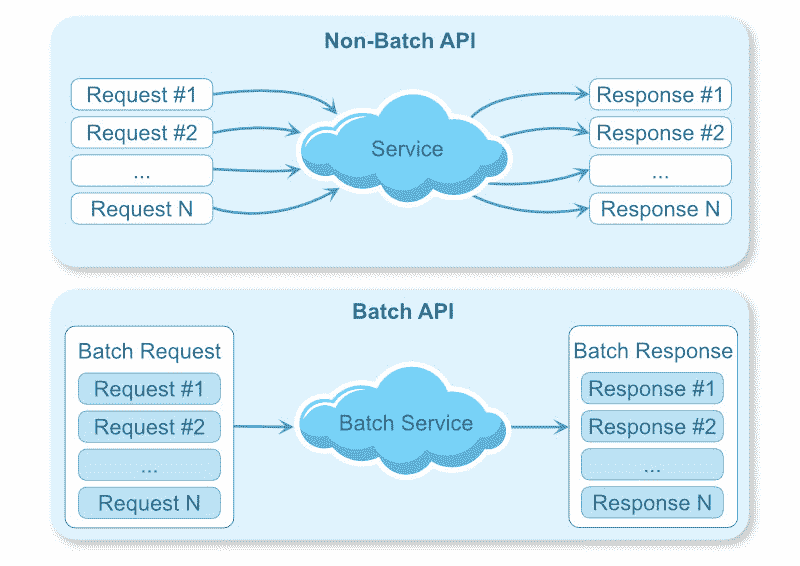
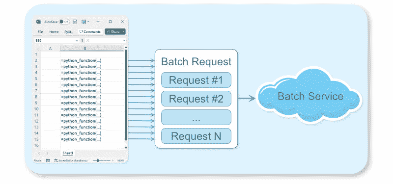

# 为远程服务使用 Asyncio 和批处理 API

> 原文：<https://www.blog.pythonlibrary.org/2022/09/20/using-asyncio-and-batch-apis/>

## 批处理 API 简介

在现代 Python 应用程序中，使用 REST 或其他基于 web 的技术访问远程 API 是很常见的。批处理 API 能够通过一次调用处理多个请求。您可以使用批处理 API 来减少对远程服务的网络调用次数。当您必须对一个远程服务进行大量调用，而这些调用可以被批量处理成一个请求时，这是非常理想的。

假设您有一个 REST API，它返回股票的当前价格。使用一个简单的 API 获取一个股票标识符并返回当前价格，如果您需要获得一千只股票的价格，您将需要进行一千次 API 调用。提供相同功能的批处理 API 将在请求中获取一组股票标识符，并返回所有请求的标识符的当前价格。使用 batch API，您将能够在一个请求中获取您需要的所有价格。这减少了网络开销，从而减少了应用程序的延迟。它还可能减少远程服务器上的负载。

[](https://www.blog.pythonlibrary.org/wp-content/uploads/2022/09/batch-api.jpg)

在本文中，您将学习如何使用批处理模式和 [Python 的 asyncio 包](https://docs.python.org/3/library/asyncio.html)将许多单独的函数调用批处理成更少数量的请求。

### 动机:Excel 中的异步 Python 函数

这篇文章来自于一个使用 [Python Excel 插件 PyXLL](https://www.pyxll.com) 的用户，他问了一个关于如何使用批处理 API 来简化 Excel 电子表格的问题。

PyXLL 将 Python 嵌入到 Excel 中，它使[能够在 Excel 电子表格](https://www.pyxll.com/docs/userguide/udfs/introduction.html)中直接调用 Python 函数。每次单元使用 Python 函数进行计算时，它都会调用该 Python 函数。在本例中，这个函数是一个异步函数，它向 REST 服务器发出请求。

一个有数千个单元格向 REST API 发出单独请求的工作表花费的时间太长。解决方案是使用批处理模式！

[](https://www.blog.pythonlibrary.org/wp-content/uploads/2022/09/excel-python-batch-api.jpg)

## 背景:异步和并发

当向远程服务器发出多个请求时，您通常不希望发送一个请求并在发送下一个请求之前等待响应。通常并行(同时)发送多个请求并等待所有响应要快得多。您可以在 Python 中使用多线程或异步编程来实现这一点。本节概述了[多线程](https://docs.python.org/3/library/threading.html)和[异步编程](https://docs.python.org/3/library/asyncio.html)。你也会看到为什么你会选择一个而不是另一个。

### 多线程操作

多线程是一种并发执行多个任务的方法。在线程模型中，您启动多个线程，每个线程同时执行其代码。如果您的问题是 CPU 受限的，使用多线程将它分解成并行运行的任务会有所帮助。当一个程序的主要性能瓶颈是 CPU 处理时间时，就说这个程序是 CPU 受限的。

对于 Python 的线程化来说，有一些微妙之处你不会在本文中深入探讨，但是理论上，这就是它的基本工作原理！

计算机的操作系统管理所有的线程，并确保每个线程都得到一份 CPU 时间。这增加了复杂性，因为每次上下文切换花费的时间可以用来做其他事情。这种复杂性随着线程数量的增加而增加。当瓶颈在等待 IO(例如，网络请求)时，为每个请求运行多个线程并等待网络响应是不理想的。它也不能扩展到成千上万的请求。这就是异步编程的用武之地。

### 用 asyncio 进行异步编程

Python 中的异步编程是一种不同的并发模型，它不使用多线程。相反，所有事情都在一个线程上运行，Python 管理活动任务之间的切换。它非常适合使用大量网络请求或其他 IO 绑定任务(如磁盘或数据库访问)的程序。

事件循环管理一组正在运行的任务。当一个任务等待网络请求完成时，它就“等待”了。当任务等待事件时，循环可以安排其他任务运行。这允许另一个任务发送另一个网络请求，然后等待，允许另一个任务运行等等。当网络请求就绪时，事件循环可以恢复任务。这使得我们可以同时处理多个请求，而不需要为每个请求增加一个线程的开销。

Python 关键字“ [async](https://docs.python.org/3/reference/compound_stmts.html#async-def) ”将一个函数指定为要在事件循环上运行的异步函数。关键字“ [await](https://docs.python.org/3/reference/expressions.html#await) 让位于事件循环，并等待另一个异步函数或任务完成。Python 包“ [asyncio](https://docs.python.org/3/library/asyncio.html?highlight=asyncio) ”提供了管理异步任务所需的原语。

## 批处理 API 的优势

上面您已经了解到您可以同时发出多个请求。这比在发送下一个请求之前等待每个请求返回要快得多。如果可以同时发送所有需要的请求，为什么还需要批处理 API 呢？

发送多个请求比发送单个请求需要更多的网络流量。如果您可以使用单个请求来请求您需要的所有数据，从数据传输的角度来看，这样会更有效。

它还可以有其他好处。例如，如果远程服务器可以通过一次获取所有内容来减少它需要做的工作量，那么它为一个批处理请求提供服务所需的时间实际上会少于为同等的单个请求提供服务所需的总时间。

## Python 中的批处理模式

现在您已经了解了什么是批处理 API，并且您可以使用 Python 中的异步编程并发地发出多个请求，那么什么是批处理模式，为什么您需要它？

简而言之，批处理模式将多个请求收集到一个请求中，并一次性分派这个请求。在本文的其余部分，您将看到如何使用它将使用大量单个请求的实现转变为一个批量请求的实现，从而减少对远程服务器的调用。

### 示例:获取街道地址的位置

您将使用获取街道地址的位置作为示例。为此，你可以使用来自 https://www.geoapify.com/的 REST API。有一个免费层可以注册测试，它支持批量获取多个位置。要使用下面的代码，您需要注册并获得一个 API 密钥。

这是第一次尝试用一些代码来获取一些街道地址的位置:

```py
# Import the modules you're going to use.
# You may need to 'pip install aiohttp'
from urllib.parse import urlencode
import asyncio
import aiohttp
import json

# Test data
STREET_ADDRESSES = [
    "1600 Pennsylvania Avenue, Washington DC, USA",
    "11 Wall Street New York, NY",
    "350 Fifth Avenue New York, NY 10118",
    "221B Baker St, London, England",
    "Tour Eiffel Champ de Mars, Paris",
    "4059 Mt Lee Dr.Hollywood, CA 90068",
    "Buckingham Palace, London, England",
    "Statue of Liberty, Liberty Island New York, NY 10004",
    "Manger Square, Bethlehem, West Bank",
    "2 Macquarie Street, Sydney"
]

# Constants for accessing the Geoapify API
GEOCODING_API = "https://api.geoapify.com/v1/geocode/search"
YOUR_API_KEY = "xxxx-xxxx-xxxx-xxxx"

async def get_location(address):
    """Return (latitude, longitude) from an address."""
    # Construct the URL to do the lookup for a single address
    query_string = urlencode({
        "apiKey": YOUR_API_KEY,
        "text": address,
        "limit": 1,
        "format": "json"
    })
    url = f"{GEOCODING_API}?{query_string}"

    # Make the request to the API
    async with aiohttp.ClientSession() as session:
        async with session.get(url) as response:
            data = await response.read()

            # Read the json string and return the latitude and longitude
            # from the first result (there will only be one)
            results = json.loads(data.decode())["results"]
            return results[0]["lat"], results[0]["lon"]

async def main():
    # Print the city for each IP address
    tasks = []
    for address in STREET_ADDRESSES:
        location = await get_location(address)
        print(f"{address} -> {location}")

# Because it's an async function you need to run it using the asyncio event loop
loop = asyncio.new_event_loop()
loop.run_until_complete(main())
```

您可能已经注意到，上面的代码仍然在为每个地址顺序调用 API。尽管使用了 async，但是 for 循环目前正在等待每个请求完成，然后再移动到下一个地址。要解决这个问题，您可以使用 asyncio 函数“gather”。通过将任务收集在一起，并在最后等待它们，你不需要单独等待它们。

更新后的主函数现在看起来像这样:

```py
async def main():
   # Get the location for each address
   tasks = []
   for address in STREET_ADDRESSES:
       tasks.append(get_location(address))

   # Wait for all tasks to complete
   locations = await asyncio.gather(*tasks)

   # Print them all once all requests have completed
   for address, location in zip(STREET_ADDRESSES, locations):
       print(f"{address} -> {location}")
```

您仍在向服务器发送多个请求。接下来，您将看到批处理模式如何将这些请求批处理在一起，以减少请求的数量，而无需修改您的主函数。

### 示例:使用批处理 API 提取多个位置

使用批处理 API，您可以一次提交多个请求。如果处理请求的服务器能够比处理单个请求更有效地处理一个批处理请求，那么在处理多个查询时，使用批处理请求会快得多。

您将使用上面使用的地理编码 API 的批处理版本。有点复杂。你不需要提交一个地址作为 URL 的一部分，而是需要提交一个 POST 请求。由于处理一个批处理可能需要一段时间，而不是立即返回结果，服务器将首先用一个请求 id 进行响应，然后您可以查询该请求 id 来检查结果是否准备好。这是实现批处理 API 时常用的模式。

下面的函数向 API 查询地址列表的位置。它使用对批处理 API 的单个请求来实现这一点。

```py
# Constants for accessing the Geoapify batch API
GEOCODING_BATCH_API = "https://api.geoapify.com/v1/batch/geocode/search"
YOUR_API_KEY = "xxxx-xxxx-xxxx-xxxx"

async def get_locations(addresses):
    """Return a dictionary of address -> (lat, lon)."""
    # Construct the URL to do the batch request
    query_string = urlencode({"apiKey": YOUR_API_KEY})
    url = f"{GEOCODING_BATCH_API}?{query_string}"

    # Build the JSON payload for the batch POST request
    data = json.dumps(addresses)

    # And use Content-Type: application/json in the headers
    headers = {
        "Content-Type": "application/json",
        "Accept": "application/json"
    }

    # Make the POST request to the API
    async with aiohttp.ClientSession() as session:
        async with session.post(url, data=data, headers=headers) as response:
            response_json = await response.read()
            response_data = json.loads(response_json)

    # The API can return a dict with a pending status if it needs more
    # time to complete. Poll the API until the result is ready.
    while isinstance(response_data, dict) \
    and response_data.get("status") == "pending":
        # Wait a bit before calling the API
        await asyncio.sleep(0.1)

        # Query the result to see if it's ready yet
        request_id = response_data.get("id")
        async with aiohttp.ClientSession() as session:
            async with session.get(url + f"&id={request_id}") as response:
                response_json = await response.read()
                response_data = json.loads(response_json)

    # Gather the results into a dictionary of address -> (lat, lon)
    locations = {}
    for result in response_data:
        address = result["query"]["text"]
        coords = result["lat"], result["lon"]
        locations[address] = coords

    return locations
```

### 放在一起:批处理模式

现在您有了一个函数，可以调用批处理 API 来批量查找地址列表的位置。您的下一个任务是重构“get_location ”,以便它可以利用批处理 API，而不必更改您的“main”函数。

为什么不改变“主”功能？在这个简单的示例中，将 main 函数改为调用 get_locations 是微不足道的。在现实世界的项目中，这种重构通常不那么简单。其他时候，甚至不希望更改函数的输入，您通常希望向函数的最终用户隐瞒实现细节。

回到激发这篇文章的最初问题，关于使用 Excel 插件 PyXLL 从 Excel 调用 Python 函数。在这种情况下，最终用户是一个可能对 Python 一无所知的 Excel 用户。拥有一个接受一个输入并返回一个输出的函数符合他们作为 Excel 用户的期望。让他们接触批次的概念会使事情变得不必要的混乱。这也意味着他们将不得不构建他们的电子表格，以有效的方式调用它。在这种情况下，在后台处理请求的批处理，同时保持终端用户看到的界面绝对是一个优势。

#### 它是如何工作的

在伪代码中，我们要写的内容是这样的:

```py
async def get_location(address)
    1\. Put the address on a queue of requests.
    2\. Start a background task that:
        i. Waits a short time for other requests to be enqueued.
        ii. Processes all queued requests as a batch.
        iii. Notifies the waiting 'get_location' functions.
    3\. Wait for the result and return it.
```

#### 批处理请求

您可以使用 asyncio 在 Python 中实现这一点。您的“get_location()”函数可以启动一个后台任务来处理任何排队的请求。它将等待，直到后台任务处理完包含您请求的批处理，然后返回它。后台任务应该只启动一次，所以您需要在启动它之前检查它是否已经在运行。如果“get_location”被多次调用，因为它是一个异步函数，它可以在其他函数等待的时候运行。每个后续调用都会向当前队列添加一个请求。

要将结果从后台任务返回到等待的 get_location 函数，您将使用 asyncio 原语" [Future](https://docs.python.org/3/library/asyncio-future.html) "。未来是一个可感知的物体，当它被等待时，它会一直阻塞，直到一个结果被设定。

您的“get_location()”函数被重写为批处理请求，使用一个 future 返回结果，如下所示:

```py
# State for batching requests
ADDRESSES_BATCH = []
BATCH_LOOP_RUNNING = False

async def get_location(address):
    """Return (latitude, longitude) from an address."""
    global BATCH_LOOP_RUNNING

    # Create a Future that will be set with the location once the
    # request has completed.
    loop = asyncio.get_event_loop()
    future = loop.create_future()

    # Add the ip address and future to the batch
    ADDRESSES_BATCH.append((address, future))

    # Start 'process_batches' running on the asyncio event loop if it's
    # not already running.
    # We've not written 'process_batches_loop' yet!
    if not BATCH_LOOP_RUNNING:
        BATCH_LOOP_RUNNING = True
        asyncio.create_task(process_batches_loop())

    # Wait for the batch your address is in to return
    await future

    # And return the result
    return future.result()
```

上面的代码创建了一个 asyncio。Future 对象，并将该对象和地址添加到将作为批处理的列表中。如果处理批处理的循环没有运行，它将使用“ [asyncio.create_task](https://docs.python.org/3/library/asyncio-task.html?highlight=create_task#asyncio.create_task) ”启动它。函数“asyncio.create_task”在 asyncio 事件循环上调度您的“processes_batched_loop ”,以便在其他正在运行的任务等待时调用。您还没有定义函数“process_batches_loop ”,但是接下来您将会这样做。您等待未来，允许在 asyncio 事件循环上运行的其他任务运行，一旦设置了结果，您就返回它。

#### 处理批次

“process_batches_loop”函数等待一小段时间，以允许其他函数向“ADDRESSES_BATCH”列表添加请求。然后，它将所有排队的请求作为一个调用提交给 REST API。一旦结果从 REST API 返回，它就解包结果并将结果设置在期货上，允许每个等待“get_location”的函数完成。

```py
async def process_batches_loop():
    global ADDRESSES_BATCH, BATCH_LOOP_RUNNING

    # Loop while BATCH_LOOP_RUNNING is True
    while BATCH_LOOP_RUNNING:
        # Wait for more to be added to the batch
        await asyncio.sleep(0.1)

        # If nothing has been added to the batch then continue
        # to the start of the loop as there's nothing to do.
        if not ADDRESSES_BATCH:
            continue

        # Get the current items from the batch and reset the batch
        batch = ADDRESSES_BATCH
        ADDRESSES_BATCH = []

        # Get the locations of the current batch
        addresses = [address for (address, future) in batch]
        locations = await get_locations(addresses)

        # Set the results on the futures from this batch.
        # This allows each awaiting 'get_location' function to continue.
        for address, future in batch:
            coords = locations.get(address)
            future.set_result(coords)
```

你现在已经达到了最初的目标。您有一个函数“get_location ”,它看起来像您的原始函数。它接受一个地址并返回一个位置。在后台，它将这些单独的请求批处理在一起，并将它们提交给批处理 API。与只处理单个请求的 API 相比，批处理 API 可以提供更好的性能，现在您的函数可以利用这一点，而无需对函数的调用方式进行任何更改。

等待将请求添加到批处理中所花费的时间应该进行调整，以便与函数的使用方式相匹配。如果函数可能几乎同时被多次调用，例如，在 Excel 中同时计算多个单元格，那么可以使用短暂的延迟。在其他情况下，例如，如果调用是由一些可能需要几秒钟的用户输入引起的，则需要更长的延迟。记录每个项目添加到批中的时间以及处理每个批的时间将有助于我们了解等待的最佳时间。

### 改进的余地

这里给出的代码有很大的改进空间。我希望这能给你一些想法，让你在自己的项目中使用它！代码是以一种相对简单的方式编写的，试图使其背后的意图变得清晰，但是在您将它用于现实世界的应用程序之前，您需要考虑一些事情。

1.  错误检查。这大概是最需要补充的。如果循环处理批处理失败会发生什么？您的代码应该处理任何可能发生的错误，或者至少记录它们，以便您可以跟踪发生了什么。
2.  不必要的循环。即使无事可做，处理所写批处理的循环也会继续循环。您可以修改它来等待一个“ [asyncio。Event](https://docs.python.org/3/library/asyncio-sync.html#asyncio.Event) "对象，直到您至少排队了一个项目。或者，当没有更多的项目要处理时，您可以退出循环，并在需要时重新启动它。
3.  程序结束时停止循环。只要 BATCH_LOOP_RUNNING 为 True，循环就会继续循环。当程序结束时，你应该考虑如何优雅地结束循环。这可以简单地将 BATCH_LOOP_RUNNING 设置为 False，然后等待任务完成。函数“asyncio.create_task”返回一个任务对象，您可以将它存储为一个全局变量。

## 包扎

在本文中，您了解了什么是批处理 API，以及为什么使用批处理 API 会有好处。您研究了 Python 中的并发性，比较了多线程和异步编程。最后，您演示了如何使用批处理模式将处理单个请求的函数转换成使用批处理 API 的函数。

本文中使用的完整代码可从这里获得[https://gist . github . com/tonyroberts/a 539885 e 12892 DC 43935860 f 75 cdfe 7 e](https://gist.github.com/tonyroberts/a539885e12892dc43935860f75cdfe7e)。

REST APIs 是批处理 API 的一个例子。您可以将同样的技术应用于数据库查询，或者任何其他类型的函数，在这些函数中，批量排队数据更有效。

当您希望为函数的最终用户保持简单时，在后台批处理请求并对面向用户的函数或 API 隐藏细节非常有用。它也可以是一种将批处理 API 改造成难以重构的现有代码库的方法。

本文所基于的用例的动机是[从 Excel](https://www.pyxll.com/docs/userguide/udfs/introduction.html) 调用一个 Python 函数，而没有向 Excel 用户公开管理批处理调用的细节。用户调用一个简单的函数来执行单独的请求。如果他们构建一个跨不同单元格发出多个请求的表，那么这个解决方案会在后台自动将所有内容批处理在一起。Excel 加载项 PyXLL 支持将 Python 集成到 Excel 中，使得将 Python 函数作为 Excel 工作表函数调用成为可能。

有关 PyXLL 插件的更多信息，请访问[https://www.pyxll.com](https://www.pyxll.com)。