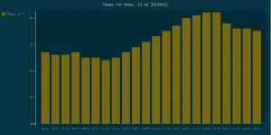
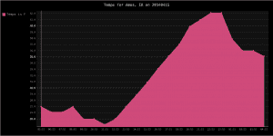

# 在烧瓶中使用 pyGal 图

> 原文：<https://www.blog.pythonlibrary.org/2015/04/16/using-pygal-graphs-in-flask/>

我最近接了一个项目，需要用我从数据库中查询的数据在网页上绘制一些数据。由于我热爱 Python，所以我决定用它来完成这个任务。我和 [Flask](http://flask.pocoo.org/) 一起提供网页服务，和 [pygal](http://pygal.org/) 一起创建图表。在本教程中，我将向您展示如何做到这一点，但没有数据库逻辑。相反，我们将从地下气象站获取气象数据，并绘制成图表。我们开始吧！

* * *

### 入门指南

按照本教程，您需要安装 Flask 和 pygal。方法如下:

```py

pip install Flask, pygal

```

如果您不想将 Flask 及其所有依赖项安装到您的系统 Python 上，您应该创建一个 virtualenv，激活它并在那里安装这些包。

* * *

### 在 Flask 中创建简单的图形

[](https://www.blog.pythonlibrary.org/wp-content/uploads/2015/04/bar_chart.png)

用 pygal 创建图表轻而易举。但在此之前，我们需要一些数据！我决定从气象地下网站获取一些数据。你需要和他们签约来获得一个 API 密匙，这样你也可以查询。一旦有了这些，您就可以使用下面的代码了:

```py

import pygal
import json
from urllib2 import urlopen  # python 2 syntax
# from urllib.request import urlopen # python 3 syntax

from flask import Flask
from pygal.style import DarkSolarizedStyle

app = Flask(__name__)

#----------------------------------------------------------------------
@app.route('/')
def get_weather_data(date='20140415', state='IA', city='Ames'):
    """
    Date must be in YYYYMMDD
    """
    api_key = 'API_KEY'
    url = 'http://api.wunderground.com/api/{key}/history_{date}/q/{state}/{city}.json'
    new_url = url.format(key=api_key,
                         date=date,
                         state=state,
                         city=city)
    result = urlopen(new_url)
    js_string = result.read()
    parsed = json.loads(js_string)
    history = parsed['history']['observations']

    imp_temps = [float(i['tempi']) for i in history]
    times = ['%s:%s' % (i['utcdate']['hour'], i['utcdate']['min']) for i in history]

    # create a bar chart
    title = 'Temps for %s, %s on %s' % (city, state, date)
    bar_chart = pygal.Bar(width=1200, height=600,
                          explicit_size=True, title=title, style=DarkSolarizedStyle)
    #bar_chart = pygal.StackedLine(width=1200, height=600,
    #                      explicit_size=True, title=title, fill=True)

    bar_chart.x_labels = times
    bar_chart.add('Temps in F', imp_temps)

    html = """

                  %s

                 %s

        """ % (title, bar_chart.render())
    return html

#----------------------------------------------------------------------
if __name__ == '__main__':    
    app.run()

```

让我们把它分解一下。我们要看的主要部分是 **get_weather_data** 函数。它有一个装饰器 **@app.route('/')** 告诉 Flask 如果我们去网站的主页就调用这个函数。在这种情况下，主页应该是 **http://localhost:5000/** 。接下来，我们有我们的 Weather Underground API 键和我们想要使用的 URL。在这种情况下，我正在抓取历史数据。您可以使用稍微不同的 URL 来查询当前天气。之后，我们打开我们的 URL，读取它并解析它返回的 JSON。最后，我们取出英制格式的温度以及记录的一天中的小时数。

现在我们有了数据，我们可以创建图表了！我们将从创建一个条形图开始。这里我设置了条形图的大小，否则它会变得很大。然后我们设置它的 X 标签并将数据添加到图表中。最后，我们创建 HTML 来显示并调用 Pygal 的 **render** 方法，该方法返回 XML 格式的 SVG。您也可以调用其他将返回其他类型的呈现方法。

如果您想尝试 Pygal 提供的许多其他图表中的一个，请注释掉实例化条形图的调用行，并取消注释 StackedLine 图的行。然后重新运行脚本。您最终应该会得到一个类似这样的图表:

[](https://www.blog.pythonlibrary.org/wp-content/uploads/2015/04/line_chart.png)

* * *

### 使用模板显示图表

大多数情况下，当您使用 Flask 时，您会希望使用模板。Flask 使用 [Jinja](http://jinja.pocoo.org/docs/dev/) 创建的模板。您需要在保存上面的 Python 代码的同一个目录中创建一个**模板**文件夹。在其中，您需要放入以下 HTML 代码:

```py

        {{ title }}

```