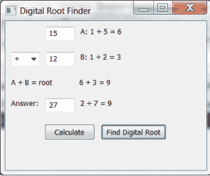

# 用 Python 讲授求数字根

> 原文：<https://www.blog.pythonlibrary.org/2013/07/16/using-python-to-teach-about-finding-the-digital-root/>

我妻子教三年级的数学，她最近了解了获得数字的数字根的过程。数字根是一个单个数字，它是通过对各个数字求和得到的。因此，对于 15，你将 1+5 相加得到 6。因此 6 是 15 的数字根。与我妻子一起工作的培训师解释说，你可以使用数字根来检查你的答案，这将给孩子们另一种方法来确定他们的答案是否正确。这里有一个例子:

```py

 15   1 + 5 = 6
+12   1 + 2 = 3
      6 + 3 = 9
----
 27   2 + 7 = 9

```

这里我们有两个操作数:15 和 12。如果你把这些加在一起，你得到 27。要用数字根来检查你的答案，你要把两个操作数中的数字相加，如上所述。所以 15 变成了 1+5 或 6，12 变成了 1+2 或 3。然后你把这两个根加在一起得到 9。然后你通过把它的数字相加来检查你的答案，在这种情况下是 2+7 等于 9。减法、乘法和除法的规则略有不同。我们将学习加法、减法和乘法。我们跳过除法，因为我还没有找到一个很好的解释它是如何工作的，我不想仅仅使用我无法解释的公式。

此时，您可能想知道 Python 从何而来。我们将使用 wxPython 创建一个简单的 GUI，让我们看看这是如何工作的。开始编码吧！

### 创建用于查找数字根的 GUI

[](https://www.blog.pythonlibrary.org/wp-content/uploads/2013/07/digiroot.png)

创建 GUI 一开始有点棘手，但随着您了解数字根是如何工作的，很快就变得容易了。您唯一需要遵循的包是 wxPython，您可以在这里获得[。一旦你安装好了，你就可以开始了。现在让我们看一下代码:](http://wxpython.org/)

```py

import wx

########################################################################
class DigiPanel(wx.Panel):
    """"""

    #----------------------------------------------------------------------
    def __init__(self, parent):
        """Constructor"""
        wx.Panel.__init__(self, parent)

        size = (50, -1)
        firstNumLbl = wx.StaticText(self, size=size)
        self.firstNum = wx.TextCtrl(self, size=size)
        self.digitalRootOne = wx.StaticText(self)

        operators = ["+", "-", "x"]
        self.operatorsCbo = wx.ComboBox(self, value="+", choices=operators,
                                        size=size)
        self.secondNum = wx.TextCtrl(self, size=size)
        self.digitalRootTwo = wx.StaticText(self)

        self.digiRootLbl = wx.StaticText(self, size=(108, -1))
        self.digitalRootAnswer = wx.StaticText(self)

        totalLbl = wx.StaticText(self, size=size, label="Answer:")
        self.total = wx.TextCtrl(self, size=size, style=wx.TE_READONLY)
        self.totalRoot = wx.StaticText(self)

        calcBtn = wx.Button(self, label="Calculate")
        calcBtn.Bind(wx.EVT_BUTTON, self.onCalculate)
        digiRootBtn = wx.Button(self, label="Find Digital Root")
        digiRootBtn.Bind(wx.EVT_BUTTON, self.onDigitalRoot)

        # layout the widgets
        mainSizer= wx.BoxSizer(wx.VERTICAL)
        firstSizer = wx.BoxSizer(wx.HORIZONTAL)
        secondSizer = wx.BoxSizer(wx.HORIZONTAL)
        totalSizer = wx.BoxSizer(wx.HORIZONTAL)
        digiAnswerSizer = wx.BoxSizer(wx.HORIZONTAL)
        btnSizer = wx.BoxSizer(wx.HORIZONTAL)

        firstSizer.Add(firstNumLbl, 0, wx.ALL, 5)
        firstSizer.Add(self.firstNum, 0, wx.ALL, 5)
        firstSizer.Add(self.digitalRootOne, 0, wx.ALL, 5)
        mainSizer.Add(firstSizer, 0, wx.ALL, 5)

        secondSizer.Add(self.operatorsCbo, 0, wx.ALL, 5)
        secondSizer.Add(self.secondNum, 0, wx.ALL, 5)
        secondSizer.Add(self.digitalRootTwo, 0, wx.ALL, 5)
        mainSizer.Add(secondSizer, 0, wx.ALL, 5)

        digiAnswerSizer.Add(self.digiRootLbl, 0, wx.ALL, 5)
        digiAnswerSizer.Add(self.digitalRootAnswer, 0, wx.ALL, 5)
        mainSizer.Add(digiAnswerSizer, 0, wx.ALL, 5)

        totalSizer.Add(totalLbl, 0 ,wx.ALL, 5)
        totalSizer.Add(self.total, 0, wx.ALL, 5)
        totalSizer.Add(self.totalRoot, 0, wx.ALL, 5)
        mainSizer.Add(totalSizer, 0, wx.ALL, 5)

        btnSizer.Add(calcBtn, 0, wx.ALL|wx.CENTER, 5)
        btnSizer.Add(digiRootBtn, 0, wx.ALL|wx.CENTER, 5)
        mainSizer.Add(btnSizer, 0, wx.ALL|wx.CENTER, 5)

        self.SetSizer(mainSizer)

    #----------------------------------------------------------------------
    def getAddString(self, number):
        """
        Calculate the digital string
        """
        if "-" in str(number):
            answer = number
            strNumbers = [str(number)]
        else:
            strNumbers = [i for i in str(number)]
            answer = sum(map(int, strNumbers))
        newAnswer = None
        root = " + ".join(strNumbers) + " = " + str(answer)

        while answer >= 10:
            strNumbers = [i for i in str(answer)]
            answer = sum(map(int, strNumbers))
            newRoot = " + ".join(strNumbers) + " = " + str(answer)
            root += " => " + newRoot

        return root, answer

    #----------------------------------------------------------------------
    def getMultiString(self, number, number2):
        """
        Get the string associated with multiplication
        """
        answer = number * number2
        root = "%s x %s = %s" % (number, number2, answer)
        newAnswer = 1

        if answer >= 10:
            root += " => " + self.getAddString(answer)[0]
        return root

    #----------------------------------------------------------------------
    def getSubtractionString(self, number, number2, total=None):
        """
        Get subtraction string
        """
        if not total:
            answer = number - number2
            root = "%s - %s = %s" % (number, number2, answer)
        else:
            root = "%s" % total
            answer = total

        if answer < 0:
            # then we need to add 9
            newAns = answer + 9
            root += " => %s + 9 = %s" % (answer, newAns)
        return root

    #----------------------------------------------------------------------
    def onCalculate(self, event):
        """
        Calculate the total
        """
        firstNum = int( self.firstNum.GetValue() )
        secondNum = int( self.secondNum.GetValue() )
        operator = self.operatorsCbo.GetValue()

        if operator == "+":
            total = firstNum + secondNum
        elif operator == "x":
            total = firstNum * secondNum
        elif operator == "-":
            total = firstNum - secondNum

        self.total.SetValue(str(total))

    #----------------------------------------------------------------------
    def onDigitalRoot(self, event):
        """
        Show digital root
        """
        firstNum = int( self.firstNum.GetValue() )
        secondNum = int( self.secondNum.GetValue() )
        total = int(self.total.GetValue())
        operator = self.operatorsCbo.GetValue()

        firstRoot, firstAnswer = self.getAddString(firstNum)
        secondRoot, secondAnswer = self.getAddString(secondNum)

        if operator == "+":
            totalRoot, _ = self.getAddString(total)
            rootTotal = sum([firstAnswer, secondAnswer])
            ans = "%s + %s = %s" % (firstAnswer, secondAnswer, rootTotal)
            if rootTotal >= 10:
                root, _ = self.getAddString(rootTotal)
                ansRoot += " => " + root
            else:
                ansRoot = ans

            self.digiRootLbl.SetLabel("A + B = root")
        elif operator == "x":
            ansRoot = self.getMultiString(firstAnswer, secondAnswer)
            totalRoot, _ = self.getAddString(total)
            self.digiRootLbl.SetLabel("A x B = root")
        elif operator == "-":
            ansRoot = self.getSubtractionString(firstAnswer, secondAnswer)
            totalRoot = self.getSubtractionString("", "", total)
            self.digiRootLbl.SetLabel("A - B = root")

        self.digitalRootOne.SetLabel("A: " + firstRoot)
        self.digitalRootTwo.SetLabel("B: " + secondRoot)
        self.digitalRootAnswer.SetLabel(ansRoot)
        self.totalRoot.SetLabel(totalRoot)

########################################################################
class DigiFrame(wx.Frame):
    """"""

    #----------------------------------------------------------------------
    def __init__(self):
        """Constructor"""
        title = "Digital Root Finder"
        size = (800, 600)
        wx.Frame.__init__(self, None, title=title, size=size)
        panel = DigiPanel(self)
        self.Show()

#----------------------------------------------------------------------
def main():
    """
    Run the program
    """
    app = wx.App(False)
    frame = DigiFrame()
    app.MainLoop()

if __name__ == "__main__":
    main()

```

在这里，我们按行创建了一组小部件。你可以用 wx。GridBagSizer 或类似的东西，而不是嵌套的 box sizer，但是我更喜欢使用 box sizer 的灵活性，即使它变得有点复杂。总之，我们布局了四行窗口小部件和一行较小的按钮。一些静态文本小部件充当间隔符来帮助对齐项目。我们有两个按钮:一个用于计算答案，一个用于寻找数字根。calculate 按钮检查组合框，找出应该执行的操作，然后采取相应的行动。另一个按钮的事件处理程序 **onDigitalRoot** 要复杂得多。

我们再次检查选择了哪个运算符(+、-或 x)，然后我们算出数字根。对于加法，我们实际上最终调用了 **getAddString** 来检查数字是否为负。如果是，我们不加数字。是的，如果我们得到一个大于-9 的值，这可能是一个问题，但是如果发生这种情况，那么我们就做错了别的事情。无论如何，如果它高于 9，那么我们需要总结小部件，这就是下面几行为我们做的:

```py

strNumbers = [i for i in str(number)]
answer = sum(map(int, strNumbers))

```

然后我们使用一个 while 循环来不断累加答案的数字，以防我们得到一个非常大的操作数。因为这主要是针对小学生的，这有点过分了，但是我知道有人会问为什么我们不检查。减法非常相似。最大的区别是，如果数字根答案小于零，你就要加九。这是补数(即使其完整所需的数量)。我真的没有找到一个更深入的答案来解释你为什么这么做。不管怎样，要得到减法数字根，你需要得到操作数的根，然后将它们相减。

举个例子:假设你有 15 - 12 = 3。15 变成 1+5 或 6，12 变成 1+2 或 3。所以现在你取 6-3 = 3，和 15-12 一样。

乘法也很简单。我们快速做个例子:12 x 10 = 120。12 变成 1+2 或 3，10 变成 1+0 或 1。因为这是乘法，所以你用 3x1 得到 3。答案是 120，但它的数字根是 1+2+0 或 3。

### 包扎

现在你知道如何在四则运算中找到数字根。您还了解了如何创建一个简单的 GUI 来显示它是如何完成的。数学和巨蟒摇滚！

### 附加阅读

*   [数字根 PDF](http://www.teachingideas.co.uk/maths/files/digitalroots.pdf) 来自教学思路
*   维基百科关于[数字根的文章](http://en.wikipedia.org/wiki/Digital_root)
*   维基百科关于[的文章补充了](http://en.wikipedia.org/wiki/Complement)
*   [数字根解释](http://www.thonky.com/nine-hours-nine-persons-nine-doors/digital-root/)

### 下载源代码

*   [digiroot.zip](https://www.blog.pythonlibrary.org/wp-content/uploads/2013/07/digiroot.zip)