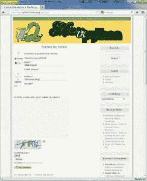

# 使用 Python、Firefox 和 Selenium 实现网站自动化

> 原文：<https://www.blog.pythonlibrary.org/2012/05/06/website-automation-with-python-firefox-and-selenium/>

一个合适的替代标题是:如何用 Python 控制网页或测试你的网站。最近，我被分配了以下任务:

1)登录网站
2)点击工具栏并加载特定的搜索表单
3)在表单的一个字段中输入一些数据并搜索
4)如果找到，点击另一个按钮
5)重复

当然，我应该用 Python，我最喜欢的编程语言来做这些。我的第一个想法是使用 [Mechanize](http://wwwsearch.sourceforge.net/mechanize/) 包，但是虽然我可以使用它登录网站，但是我无法让它加载表单。为什么？不幸的是，前面提到的工具栏是用 javascript 制作的，它似乎也能生成表单。不管出于什么原因，Python 端口不支持加载 javascript 元素，尽管我确实发现它所基于的项目有一个 javascript 插件，所以它最终可能会有希望。因此，我去寻找另一种解决方案，并回忆说硒可能符合要求。最后，效果相当不错。因为这是一个内部项目，所以我不能向你展示我到底做了什么，我们将自动运行 Gmail。让我们开始吧！

### 你需要什么

*   Selenium IDE Firefox [插件](http://seleniumhq.org/download/)(实际上是一组插件)
*   Selenium 的 Python 绑定可以在 [PyPI](http://pypi.python.org/pypi/selenium) 上找到，或者你可以轻松安装

### 自动化网站

我尝试了一下，试图想出一个登录 Gmail 或 Yahoo 的好例子，但是每个都有问题。每次登录时，Gmail 的框架都有唯一的名称，所以当我运行代码时，我找不到框架。雅虎不知何故屏蔽了来自 selenium 的一封新邮件的正文部分，所以我无法记录我在那里输入的内容。你可能已经发现，我希望向你展示如何自动发送一堆电子邮件，只是为了好玩。哦好吧。

取而代之的是，我决定做一点元，只写我自己博客的联系方式。对于这个例子来说，它已经足够好了，但是由于验证码的原因，您实际上不能提交表单。然而，这应该给你一个大致的概念。你可以这样做:

**第一步:**打开 Firefox 的一个新实例，然后启动你的 Selenium IDE 插件(工具菜单，Selenium IDE)
**第二步:**去你选择的网站，做你想自动化的事情。在这种情况下，我点击了我的联系链接，然后填写了表格。(见下面截图)
**步骤三**在 Selenium IDE 窗口，转到**文件，将测试用例导出为**，选择 **Python 2 (WebDriver)** 。还有一个 Python 2(远程控制)也可以导出，但如果没有一些额外的软件，您将无法运行该脚本。
**第四步:**运行 web 驱动脚本，看看是否有效。我通常也导出遥控器，因为它帮助我找出一些 web 驱动脚本没有的字段或 CSS 名称。例如，在我最初的项目中，直到我查看了远程代码，我才意识到我需要切换帧。

[](https://www.blog.pythonlibrary.org/wp-content/uploads/2012/05/blog_selenium.png)

现在让我们看看 Selenium IDE 基于我的愚蠢的博客示例创建的代码:

```py

from selenium import webdriver
from selenium.webdriver.common.by import By
from selenium.webdriver.support.ui import Select
from selenium.common.exceptions import NoSuchElementException
import unittest, time, re

class BlogDriver(unittest.TestCase):
    def setUp(self):
        self.driver = webdriver.Firefox()
        self.driver.implicitly_wait(30)
        self.base_url = "https://www.blog.pythonlibrary.org/"
        self.verificationErrors = []

    def test_blog_driver(self):
        driver = self.driver
        driver.get(self.base_url + "/")
        driver.find_element_by_link_text("Contact the Author").click()
        driver.find_element_by_id("si_contact_name1").clear()
        driver.find_element_by_id("si_contact_name1").send_keys("Mike Driscoll")
        driver.find_element_by_id("si_contact_subject1").clear()
        driver.find_element_by_id("si_contact_subject1").send_keys("I love your blog!")
        driver.find_element_by_id("si_contact_message1").clear()
        driver.find_element_by_id("si_contact_message1").send_keys("Python rules and your website rocks!")
        driver.find_element_by_id("si_contact_captcha_code1").clear()
        driver.find_element_by_id("si_contact_captcha_code1").send_keys("22HU")
        driver.find_element_by_id("fsc-submit-1").click()

    def is_element_present(self, how, what):
        try: self.driver.find_element(by=how, value=what)
        except NoSuchElementException, e: return False
        return True

    def tearDown(self):
        self.driver.quit()
        self.assertEqual([], self.verificationErrors)

if __name__ == "__main__":
    unittest.main()

```

如您所见，Selenium IDE 创建了一个简单的单元测试脚本。如果你运行它，一个新的 Firefox 实例将被加载，它将填充所有的内容并尝试提交它。当然，你会从网站上收到一个错误，因为我记录的验证码很可能与你看到的不同。该脚本运行速度非常快，使用 Selenium 了解其他人的 web 元素命名约定也很有趣。在我为我们的内部项目创建的脚本中，我删除了所有的单元测试内容，并创建了我自己的类，该类循环遍历一大堆输入进行查找，以便我们可以收集数据。

Selenium 没有做的一件事实际上是自动化 Firefox 本身。你不能让 Selenium 点击 Firefox 的任何菜单或书签。然而，如果你所需要做的只是自动化一个网站，那么这很好！另一方面，如果你真的需要能够点击火狐的菜单等等，那么你可能想看看 [SendKeys 包](http://www.rutherfurd.net/python/sendkeys/)。不过它只适用于 Windows。Selenium 脚本应该可以在 Windows、Linux 或 Mac 上运行。

希望这篇文章能帮助你开始测试你的网站，或者让你开始你自己的自动化项目。