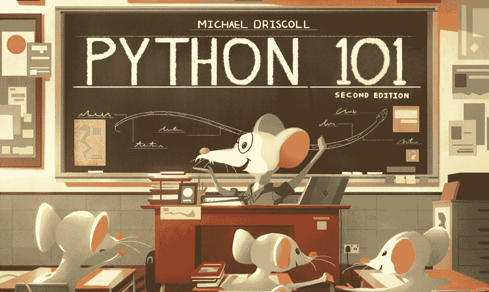

# Python 101 第二版的新特性

> 原文：<https://www.blog.pythonlibrary.org/2020/03/24/whats-new-in-python-101-2nd-edition/>

原版 **Python 101** 是我写过的第一本书。在决定写第二版时，我需要决定我应该保留什么，应该从书中删除什么。我最终做的是从头开始重写这本书。

在原著中，Python 101 基于 Python 3.5，包含以下几个部分:

*   第一部分-学习基础知识
*   第二部分-向图书馆学习
*   第三部分-中间零碎东西
*   第四部分-提示、技巧和教程
*   第五部分-包装和分销

对于第二版，我将删除第二部分，因为大部分信息可以在后面的章节中涵盖。现在 Python 3.8 已经发布了，我可以介绍以下内容

*   f 弦
*   赋值表达式
*   默认情况下字典是有序的
*   类型提示
*   源代码控制
*   复习大部分章节的问题
*   还有更多！

并提及其他一些简洁的东西，比如子解释器、futures 模块和审计挂钩，尽管这些不会详细讨论。我还计划将教程部分变成一个更具概念验证性的部分，在这里你可以获得并使用一些有用的脚本。这在某种程度上已经存在，但我认为这些脚本会比原来的更好。

分发部分也将有所改进，以涵盖将代码分发到 Python 打包索引的最新约定。原书的封面已经过时。

另外，虽然第一本书提到了许多创建可执行文件的不同选项，但这本书的新版本将只关注一两个，但它将展示如何为 Windows 和 Mac 创建二进制文件。我正在研究如何支持 Linux，但这可能包括也可能不包括。

我将在 Leanpub 上的免费样本中提供相当多的章节，这样人们可以在购买前查看。

我希望你能看看这本书。欢迎在评论中提问或者给我发邮件。

**Python 101 第二版将于 2020 年 9 月发布**