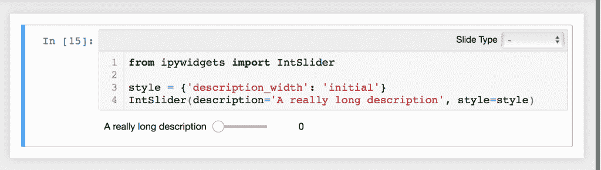

# 使用 jupiter 笔记本小部件

> 原文：<https://www.blog.pythonlibrary.org/2018/10/24/working-with-jupyter-notebook-widgets/>

什么是 Jupyter widgets？小部件是一个“多事件的 python 对象”，在 Jupyter Notebook 的情况下，它驻留在浏览器中，是一个用户界面元素，如滑块或文本框。Jupyter 支持相当广泛的小部件，包括:

*   数字的
*   布尔代数学体系的
*   选择
*   线
*   图像
*   纽扣
*   输出
*   动画
*   日期选择器
*   颜色选择器
*   控制器(即游戏控制器)
*   布局

我们不会在本文中涵盖所有类型的小部件，但是我们将会看到相当多的小部件在工作。完整的列表可以查看[文档](https://ipywidgets.readthedocs.io/en/stable/examples/Widget%20List.html)。或者你可以在你的笔记本上运行下面的代码:

```py

import ipywidgets as widgets

print(dir(widgets))

```

如果您过去曾经创建过用户界面，那么您可能已经理解了什么是小部件。如果你没有，那么让我们花一点时间来定义它们的用途。

> 小部件用于为您的用户创建交互式图形用户界面。小部件在 Python 和 Javascript 之间同步有状态和无状态信息。

在之前的[文章](https://www.blog.pythonlibrary.org/2018/10/23/creating-jupyter-notebook-widgets-with-interact/)中，我们简要介绍了如何使用**交互**和**交互**功能创建小部件。在本教程中，我们将直接创建小部件，并了解它们是如何工作的。

* * *

### 创建小部件

可以非常容易地创建一个小部件。出于演示目的，让我们创建一个简单的滑块。创建一个新的 Jupyter 笔记本，并将以下代码放入单元格中:

```py

import ipywidgets as widgets

widgets.IntSlider()

```

当您运行该单元时，您应该会看到类似这样的内容:


如您所见，滑块的默认值为零。如果您想将小部件保存到一个变量中，那么您需要告诉 Jupyter 使用 **display** 函数来显示小部件:

```py

import ipywidgets as widgets
from IPython.display import display

btn = widgets.Button(description='Press Me')
display(btn)

```

这里我们添加了显示小部件所需的额外导入，并创建了一个简单的按钮。注意，我们必须指定它的**描述**,这样按钮就会有一个标签。最后，我们调用了 display 函数，并向它传递了 widget 对象。结果看起来像这样:


现在让我们后退一秒钟，再次创建滑块，但这一次我们将使用 **display** 来显示它两次:

```py

import ipywidgets as widgets
from IPython.display import display

btn = widgets.IntSlider()
display(btn)
display(btn)

```

如果您将上面的代码放入笔记本的一个单元格中并运行它，您应该会看到两个滑块:


尝试移动其中一个滑块。你会很快发现，当你移动一个滑块时，另一个滑块也会移动。发生这种情况的原因是我们只创建了一个 slider 对象。实际可见的小部件都指向下面的同一个对象，所以当你移动一个时，你实际上是在移动另一个。你可以认为这两个滑块是同一个对象的两个视图。当然，如果您已经创建了两个 **IntSliders** 并给它们分配了唯一的变量名，那么您可以独立地移动它们。

* * *

### 关闭小部件

您可以通过调用小部件的 **close()** 方法来关闭它。如果您想删除小部件，只需清除单元格。

* * *

### 小部件的属性和键

Jupyter 小部件遵循一组属性规则。如果您想获得小部件属性和方法的完整列表，可以使用 Python 的

```py
dir()
```

函数为您内省小部件:

```py

dir(btn)

```

假设您将上面的代码放在一个新的单元格中，该单元格就在包含您的“IntSlider”小部件代码的单元格下方。如果您运行这个新单元，您将得到如下输出:


尝试将滑块调整到零以上。然后创建一个新的单元格，并输入以下代码:

```py

btn.value

```

当您运行这个程序时，它将打印出滑块的当前值。小工具也有**键**，它们是诸如‘描述’、‘最小’以及‘最大’和‘禁用’之类的东西。要获得小部件键的完整列表，您可以查阅小部件的文档，阅读源代码或运行以下代码:

```py

btn.keys

```

同样值得一提的是，你也可以设置一个新的属性值。因此，如果您想将滑块设置为新值并添加描述，您可以执行以下操作:

```py

btn.value = 50
btn.description = 'Hello slider'

```

如果您运行这段代码，您将看到滑块更新了它的值和描述。

小部件还支持在实例化小部件时设置属性。例如，如果我们愿意，我们可以在创建滑块时设置它的一些属性:

```py

import ipywidgets as widgets
from IPython.display import display

btn = widgets.IntSlider(value=10, description='My Slider',
                        orientation='vertical')
display(btn)

```

当您运行这段代码时，您会看到这个小部件看起来有点不同:


* * *

### 链接两个小部件

一些 Jupyter 小工具可以链接在一起。例如，您可以将 **FloatText** 小部件链接到 **FloatSlider** 小部件。这意味着当一个小部件更新时，另一个也会更新。这就是所谓的“属性同步”。让我们看一个简单的例子:

```py

text = widgets.FloatText()
slider = widgets.FloatSlider()
display(text,slider)

mylink = widgets.jslink((text, 'value'), (slider, 'value'))

```

这里我们创建两个小部件并显示它们。然后我们调用 **widgets.jslink** 并告诉它将文本和滑块的值链接在一起。当您使用 **jslink** 方法时，您正在链接来自**客户端**的小部件。这使得小部件同步更加健壮，因为它们将使用本地机器的硬件。您还可以使用 **jsdlink** ，它将在客户端的两个小部件之间创建一个单向链接。这意味着您可以让两个部件中的一个影响第二个部件，而第二个部件不会影响第一个部件。

试着改变上面的例子，像下面这样使用 **jsdlink** :

```py

text = widgets.FloatText()
slider = widgets.FloatSlider()
display(text,slider)

mylink = widgets.jsdlink((text, 'value'), (slider, 'value'))

```

现在尝试编辑每个小部件的值，看看它们是如何交互的。这很难在书中演示，但基本上当你改变文本部件时，它会改变滑块来匹配。但是，如果您更改滑块的值，文本控件不会改变。

还有另外两种方法可以用来将两个小部件链接在一起:

*   环
*   dlink

这些方法的工作方式分别与 **jslink** 和 **jsdlink** 相同，除了它们会与服务器对话，所以你在使用它们时可能会经历一些延迟。坦率地说，在您的本地机器上，您可能看不出两者有什么不同。

最后，我想指出的是，您也可以通过调用链接的 **unlink** 方法来取消小部件的链接:

```py

mylink.unlink()

```

您可以通过将这段代码添加到创建链接小部件的单元格的末尾来尝试一下。如果您添加它并重新运行该单元，那么您将发现这两个小部件不再链接在一起。

* * *

### 事件

链接小部件与小部件事件密切相关。当您与小部件交互时，会发生一个事件。例如，当你按下一个按钮时，这就是所谓的 **click** 事件。让我们看一个使用按钮小部件的例子。

```py

import ipywidgets as widgets
from IPython.display import display

btn = widgets.Button(description='Test')
display(btn)

def my_event_handler(btn_object):
    print('You pressed the {} button!'.format(btn_object.description))

btn.on_click(my_event_handler)

```

在这里，我们导入了使用小部件所需的各种小部件并显示它们。然后我们创建一个简单的按钮和一个名为 **my_event_handler** 的函数。这是事件处理程序，您可以将小部件的事件绑定到它。要将按钮的 click 事件绑定到这个处理程序，您必须调用 **on_click** 并传递您希望它绑定到的函数。您会注意到，事件处理程序隐式接受一个参数，即按钮对象本身。

这允许您访问按钮的属性，所以在本例中，我让它打印出按钮的标签。下面是我的代码和按钮在按下按钮后运行时的截图:


这还允许您将多个按钮绑定到同一个事件处理程序。你可以这样做:

```py

import ipywidgets as widgets
from IPython.display import display

btn = widgets.Button(description='Test')
other_btn = widgets.Button(description='Other')
display(btn)
display(other_btn)

def my_event_handler(btn_object):
    print('You pressed {}'.format(btn_object.description))

btn.on_click(my_event_handler)
other_btn.on_click(my_event_handler)

```

在这段代码中，我们创建了第二个名为 **other_btn** 的按钮，它带有不同的标签，并与另一个按钮绑定到同一个事件处理程序。现在，您可以试着按几次每个按钮，看看它们的行为如何。下面是一个会话示例:


您可以对其他类型的小部件事件进行这种类型的事件绑定。您需要查看小部件的文档或小部件的源代码，以确定它支持哪些事件。

说到文档，它还提到了 Jupyter 称之为 **Traitlet 事件**的东西。这些是 IPython traitlets，它们基本上提供了一种不同的方法，使用**观察**方法将事件绑定到函数。为了了解如何使用 traitlet，让我们在 Jupyter 笔记本中运行以下代码:

```py

print(btn.observe.__doc__)

```

当我运行这段代码时，我得到了以下输出:

```py

Setup a handler to be called when a trait changes.

        This is used to setup dynamic notifications of trait changes.

        Parameters
        ----------
        handler : callable
            A callable that is called when a trait changes. Its
            signature should be ``handler(change)``, where ``change`` is a
            dictionary. The change dictionary at least holds a 'type' key.
            * ``type``: the type of notification.
            Other keys may be passed depending on the value of 'type'. In the
            case where type is 'change', we also have the following keys:
            * ``owner`` : the HasTraits instance
            * ``old`` : the old value of the modified trait attribute
            * ``new`` : the new value of the modified trait attribute
            * ``name`` : the name of the modified trait attribute.
        names : list, str, All
            If names is All, the handler will apply to all traits.  If a list
            of str, handler will apply to all names in the list.  If a
            str, the handler will apply just to that name.
        type : str, All (default: 'change')
            The type of notification to filter by. If equal to All, then all
            notifications are passed to the observe handler.

```

那么这是如何工作的呢？基本上，您可以用您想要绑定的函数名以及您想要“观察”的特征来调用 observe。您可以传入一个字符串列表，将其设置为“All”或传入一个单数字符串。文档中有一个很好的例子，但是我将把它稍微扩展一下，变成下面这样:

```py

int_range = widgets.IntSlider()
display(int_range)

def on_value_change(change):
    print(change)
    print(change['new'])

int_range.observe(on_value_change, names='value')

```

这与您在文档中发现的不同之处在于，我也打印出了变更对象。这将告诉我们正在处理什么。在这种情况下，更改滑块时的输出如下所示:

```py

{'owner': IntSlider(value=2), 'new': 2, 'old': 0, 'name': 'value', 'type': 'change'}
2

```

这告诉我们， **change** 参数是一个值的字典，键 **new** 会给我们滑块的新值。所以当我们告诉 Jupyter 去**观察**字符串的**值**时，它会发送一个值的字典。有趣的是，除了新值之外，这个字典还包含滑块的旧值。例如，如果您需要在其他小部件中实现撤销/重做之类的功能，了解这一点会很有用。

* * *

### 布局

Jupyter 小部件还有一个**布局**属性，它允许你设置一些 CSS 属性，你可以用它们来控制小部件的布局。这些属性包括大小、显示、盒子模型、定位等等。您可以使用布局功能让您的小部件根据可用空间改变大小。

让我们看一个简单的例子:

```py

from ipywidgets import Button, Layout
from IPython.display import display

layout = Layout(width='50%', height='100px')

btn = Button(description='(50% width, 100px height) button',
             layout=layout)
display(btn)

```

在这里，我们导入按钮和布局。我们设置布局，使小部件占据 50%的可用宽度和 100 像素高。然后，我们将按钮的布局参数设置为我们刚刚创建的布局。结果是这样的:


您可以通过创建一个布局实例来应用布局，就像我们在前面的例子中所做的那样，或者您可以让一个小部件直接使用另一个小部件的布局。为了进行演示，让我们将下面的代码添加到我们在上一个示例中刚刚创建的单元格的底部:

```py

btn2 = Button(description='Another button', layout=btn.layout)
display(btn2)

```

在这里，我们将这个新按钮的布局设置为 **btn.layout** ，这基本上使我们的新按钮使用与原始按钮相同的布局对象。您最终应该会看到这样的按钮:


* * *

### 式样

有趣的是，有些小部件允许你放入太长而无法显示的描述。

```py

from ipywidgets import IntSlider

IntSlider(description='A really long description')

```

当您运行这段代码时，您会发现 Jupyter 删除了一些文本:


您可以通过应用**样式**来解决这个问题。这种情况下使用的样式如下所示:

```py

style = {'description_width': 'initial'}

```

奇怪的是，关于 Jupyter 样式的文档几乎不存在。查看 **widget_int.py** 中的源代码，似乎值 **initial** 指的是初始标签宽度。因此，当您创建一个样式，将 **description_width** 作为关键字，并将其设置为 **initial** 时，您实际上是在告诉 Jupyter 使用小部件标签的字符串长度作为其宽度。要应用该样式，您只需执行以下操作:

```py

from ipywidgets import IntSlider

style = {'description_width': 'initial'}
IntSlider(description='A really long description', style=style)

```

现在，您的小部件将如下所示:



当然，这个解决方案的问题是现在你的滑块看起来太小了。我们可以通过使用一个助手函数来解决这个问题！

* * *

### 排列小部件

有一些助手功能，比如 **HBox** 和 **VBox** ，你可以用它们来组合窗口小部件，并以可视化方式进行布局。HBox 会一次横向添加一个小部件。你可以把它想象成从左到右把单个的棋子排成一条水平线。让我们使用一个 HBox 和一个标签小部件来解决我们的问题:

```py

from ipywidgets import HBox, Label, IntSlider

label = Label('A really long description')
my_slider = IntSlider()

HBox([label, my_slider])

```

在这里，我们导入我们需要的部分，创建几个小部件，然后将它们添加到我们的 HBox 中。结果如下:


如您所料，您可以使用 HBox 和 VBox 布局的组合来制作复杂的小部件布局。例如，您可以向一个 HBox 添加几个小部件，向另一个 HBox 添加几个小部件，然后将两个 HBox 都添加到一个 VBox 来创建一个网格。让我们继续这样做，这样你就可以看到它是如何工作的。

```py

from ipywidgets import Button, HBox, VBox

btn_one = Button(description='One') 
btn_two = Button(description='Two')
btn_three = Button(description='Three')
btn_four = Button(description='Four')

first_line = HBox([btn_one, btn_two])
second_line = HBox([btn_three, btn_four])

VBox([first_line, second_line])

```

这里我们创建了四个按钮和两个盒子。每个 HBoxes 都有两个按钮。最后，我们将 VBox 添加到 VBox，这是我们最终得到的结果:


在文档中，所以我将把它留给你们作为练习阅读。我还想提一下，还有一个用于创建布局的小部件叫做 **GridBox** 。

在我使用跨平台桌面用户界面工具包 wxPython 的经验中，我发现使用 VBox 和 HBox 类型的容器对于创建我的小部件的复杂布局来说已经足够了，而更高级的布局工具往往会使事情变得更困难，除非你已经计划做一个类似网格的界面。非常欢迎您尝试这些其他类型的布局，因为它们肯定有自己的位置。

* * *

### 包扎

在这一章中，我们学习了很多关于如何创建和使用 Jupyter 小部件的知识。我们还学习了如何展示、设计和排列它们。通过查阅该主题的文档或阅读网上的一些教程，您可以了解关于小部件的许多其他内容。例如，Jupyter 支持您创建自己的定制小部件。它还支持异步小部件的使用。我强烈推荐在你的笔记本上使用小工具，给它们一些活力，让它们更有用！