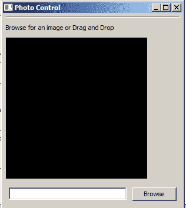

# wxPython:将图像拖放到您的应用程序中

> 原文：<https://www.blog.pythonlibrary.org/2017/10/25/wx_drag_and_drop_images/>

我最近在 [StackOverflow](https://stackoverflow.com/q/46852696/393194) 上遇到一个问题，用户想知道如何在 wxPython 中将图像拖动到他们的图像控件上，并将拖动的图像调整为缩略图。这激起了我的兴趣，我决定弄清楚如何去做。

我知道你可以用 Python 中的 [Pillow 包](https://pillow.readthedocs.io/)创建一个缩略图。因此，如果您想继续学习，您需要安装 Pillow 和 wxPython with pip:

```py

pip install Pillow wxPython

```

现在我们有了我们需要的包的最新版本，我们可以写一些代码了。我们来看看:

*注意:您可能希望使用 wxPython 4 来确保它正常工作*

```py

import os
import wx
import wx.lib.statbmp as SB

from PIL import Image
from wx.lib.pubsub import pub 

PhotoMaxSize = 240

class DropTarget(wx.FileDropTarget):

    def __init__(self, widget):
        wx.FileDropTarget.__init__(self)
        self.widget = widget

    def OnDropFiles(self, x, y, filenames):
        image = Image.open(filenames[0])
        image.thumbnail((PhotoMaxSize, PhotoMaxSize))
        image.save('thumbnail.png')
        pub.sendMessage('dnd', filepath='thumbnail.png')
        return True

class PhotoCtrl(wx.App):
    def __init__(self, redirect=False, filename=None):
        wx.App.__init__(self, redirect, filename)
        self.frame = wx.Frame(None, title='Photo Control')

        self.panel = wx.Panel(self.frame)
        pub.subscribe(self.update_image_on_dnd, 'dnd')

        self.createWidgets()
        self.frame.Show()

    def createWidgets(self):
        instructions = 'Browse for an image or Drag and Drop'
        img = wx.Image(240,240)
        self.imageCtrl = SB.GenStaticBitmap(self.panel, wx.ID_ANY, 
                                            wx.Bitmap(img))
        filedroptarget = DropTarget(self)
        self.imageCtrl.SetDropTarget(filedroptarget)

        instructLbl = wx.StaticText(self.panel, label=instructions)
        self.photoTxt = wx.TextCtrl(self.panel, size=(200,-1))
        browseBtn = wx.Button(self.panel, label='Browse')
        browseBtn.Bind(wx.EVT_BUTTON, self.on_browse)

        self.mainSizer = wx.BoxSizer(wx.VERTICAL)
        self.sizer = wx.BoxSizer(wx.HORIZONTAL)

        self.mainSizer.Add(wx.StaticLine(self.panel, wx.ID_ANY),
                           0, wx.ALL|wx.EXPAND, 5)
        self.mainSizer.Add(instructLbl, 0, wx.ALL, 5)
        self.mainSizer.Add(self.imageCtrl, 0, wx.ALL, 5)
        self.sizer.Add(self.photoTxt, 0, wx.ALL, 5)
        self.sizer.Add(browseBtn, 0, wx.ALL, 5)
        self.mainSizer.Add(self.sizer, 0, wx.ALL, 5)

        self.panel.SetSizer(self.mainSizer)
        self.mainSizer.Fit(self.frame)

        self.panel.Layout()

    def on_browse(self, event):
        """ 
        Browse for file
        """
        wildcard = "JPEG files (*.jpg)|*.jpg"
        dialog = wx.FileDialog(None, "Choose a file",
                               wildcard=wildcard,
                               style=wx.OPEN)
        if dialog.ShowModal() == wx.ID_OK:
            self.photoTxt.SetValue(dialog.GetPath())
        dialog.Destroy() 
        self.on_view()

    def update_image_on_dnd(self, filepath):
        self.on_view(filepath=filepath)

    def on_view(self, filepath=None):
        if not filepath:
            filepath = self.photoTxt.GetValue()

        img = wx.Image(filepath, wx.BITMAP_TYPE_ANY)
        # scale the image, preserving the aspect ratio
        W = img.GetWidth()
        H = img.GetHeight()
        if W > H:
            NewW = PhotoMaxSize
            NewH = PhotoMaxSize * H / W
        else:
            NewH = PhotoMaxSize
            NewW = PhotoMaxSize * W / H
        img = img.Scale(NewW,NewH)

        self.imageCtrl.SetBitmap(wx.Bitmap(img))
        self.panel.Refresh()

if __name__ == '__main__':
    app = PhotoCtrl()
    app.MainLoop()

```

当您运行这段代码时，您应该会看到类似这样的内容:



第一个类子类的 **wx。FileDropTarget** 和缩略图创建魔术。你会注意到我们覆盖了 **OnDropFiles()** 方法，并使用 **PhotoMaxSize** 变量创建了一个缩略图。然后我们使用 pubsub 告诉我们的 wxPython 应用程序进行自我更新。另一个类实际上是 **wx 的子类。App** 并且包含了我们显示图像所需的所有零碎东西。坦白地说，我们不需要继承 wx.App。我们可以很容易地从 wx 继承。这个例子的框架。

无论如何，我们在这段代码中所做的只是创建一个 frame 和一个 panel 对象，用 pubsub 订阅一个特定的订阅，以便它侦听来自 DropTarget 类的消息，然后更新显示。您会注意到，当应用程序对象通过 pubsub 接收消息时，它将调用 **update_image_on_dnd()** 方法，该方法又将调用 **onView()** 方法。这段代码基本上只是按比例缩小传递给它的图像，使它适合我们的 **wx。静态位图**控件。当然，由于我们已经传入了一个应该合适的图像，我们可以给这个方法添加一些逻辑，在某些情况下跳过缩放。但是我把它放在那里是为了当用户使用浏览按钮打开图像时使用。

无论如何，一旦我们按照我们想要的方式缩放了图像，我们就调用 **SetBitmap** 并刷新面板。试一试，看看你能做些什么来改进这个例子！