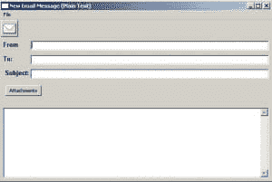

# wxPyMail:创建发送电子邮件的应用程序

> 原文：<https://www.blog.pythonlibrary.org/2008/08/16/wxpymail-creating-an-application-to-send-emails/>

我认为用 wxPython 编写一个示例应用程序来展示如何将所有的部分放在一起并做出有用的东西是一个好主意。在我的日常工作中，我创建了一个发送电子邮件的小程序，因为我们有很多用户错过了 mailto 功能，当我们从 Exchange/Outlook 切换到 Zimbra 时，我们就失去了这个功能。应该注意的是，目前这是一个只支持 Windows 的应用程序，但是让它更加独立于操作系统应该不会太难。

我将这篇文章分成三部分:第一部分是创建界面；第二步是设置数据处理，第三步是创建一个 Windows 可执行文件并将其连接到 mailto 处理程序。当我们完成后，图形用户界面将如下所示:

[](https://www.blog.pythonlibrary.org/wp-content/uploads/2008/08/wxpymail.jpg)

要跟进，您需要以下内容:

*   [Python 2.4+](http://www.python.org)
*   [wxPython 2.8+](http://www.wxpython.org)

## 创建界面

让我们看看下面的代码。如您所见，我将这个应用程序基于 wx。框架对象和 wx 的一个实例。让应用程序运行。

```py

import os
import sys
import urllib
import wx

import mail_ico

class SendMailWx(wx.Frame):
    def __init__(self):
        wx.Frame.__init__(self, None, -1, 'New Email Message (Plain Text)',
                          size=(600,400))
        self.panel = wx.Panel(self, wx.ID_ANY)

        # set your email address here
        self.email = 'myEmail@email.com'

        self.filepaths = []        
        self.currentDir = os.path.abspath(os.path.dirname(sys.argv[0])) 

        self.createMenu()
        self.createToolbar()
        self.createWidgets()
        try:
            print sys.argv
            self.parseURL(sys.argv[1])
        except Exception, e:
            print 'Unable to execute parseURL...'
            print e

        self.layoutWidgets()

        self.attachTxt.Hide()
        self.editAttachBtn.Hide()

    def createMenu(self):
        menubar = wx.MenuBar()

        fileMenu = wx.Menu()
        send_menu_item = fileMenu.Append(wx.NewId(), '&Send', 'Sends the email')
        close_menu_item = fileMenu.Append(wx.NewId(), '&Close', 'Closes the window')
        menubar.Append(fileMenu, '&File')
        self.SetMenuBar(menubar)

        # bind events to the menu items
        self.Bind(wx.EVT_MENU, self.onSend, send_menu_item)
        self.Bind(wx.EVT_MENU, self.onClose, close_menu_item)

    def createToolbar(self):
        toolbar = self.CreateToolBar(wx.TB_3DBUTTONS|wx.TB_TEXT)
        toolbar.SetToolBitmapSize((31,31))
        bmp = mail_ico.getBitmap()
        sendTool = toolbar.AddSimpleTool(-1, bmp, 'Send', 'Sends Email')
        self.Bind(wx.EVT_MENU, self.onSend, sendTool)        
        toolbar.Realize()

    def createWidgets(self):
        p = self.panel

        font = wx.Font(10, wx.SWISS, wx.NORMAL, wx.BOLD)
        self.fromLbl    = wx.StaticText(p, wx.ID_ANY, 'From', size=(60,-1))
        self.fromTxt    = wx.TextCtrl(p, wx.ID_ANY, self.email)
        self.toLbl      = wx.StaticText(p, wx.ID_ANY, 'To:', size=(60,-1))
        self.toTxt      = wx.TextCtrl(p, wx.ID_ANY, '')
        self.subjectLbl = wx.StaticText(p, wx.ID_ANY, ' Subject:', size=(60,-1))
        self.subjectTxt = wx.TextCtrl(p, wx.ID_ANY, '')
        self.attachBtn  = wx.Button(p, wx.ID_ANY, 'Attachments')        
        self.attachTxt  = wx.TextCtrl(p, wx.ID_ANY, '', style=wx.TE_MULTILINE)
        self.attachTxt.Disable()
        self.editAttachBtn = wx.Button(p, wx.ID_ANY, 'Edit Attachments')

        self.messageTxt = wx.TextCtrl(p, wx.ID_ANY, '', style=wx.TE_MULTILINE)

        self.Bind(wx.EVT_BUTTON, self.onAttach, self.attachBtn)
        self.Bind(wx.EVT_BUTTON, self.onAttachEdit, self.editAttachBtn)

        self.fromLbl.SetFont(font)
        self.toLbl.SetFont(font)
        self.subjectLbl.SetFont(font)

    def layoutWidgets(self):
        mainSizer = wx.BoxSizer(wx.VERTICAL)
        fromSizer = wx.BoxSizer(wx.HORIZONTAL)
        toSizer   = wx.BoxSizer(wx.HORIZONTAL)
        subjSizer = wx.BoxSizer(wx.HORIZONTAL)
        attachSizer = wx.BoxSizer(wx.HORIZONTAL)

        fromSizer.Add(self.fromLbl, 0)
        fromSizer.Add(self.fromTxt, 1, wx.EXPAND)
        toSizer.Add(self.toLbl, 0)
        toSizer.Add(self.toTxt, 1, wx.EXPAND)
        subjSizer.Add(self.subjectLbl, 0)
        subjSizer.Add(self.subjectTxt, 1, wx.EXPAND)
        attachSizer.Add(self.attachBtn, 0, wx.ALL, 5)
        attachSizer.Add(self.attachTxt, 1, wx.ALL|wx.EXPAND, 5)
        attachSizer.Add(self.editAttachBtn, 0, wx.ALL, 5)

        mainSizer.Add(fromSizer, 0, wx.ALL|wx.EXPAND, 5)
        mainSizer.Add(toSizer, 0, wx.ALL|wx.EXPAND, 5)
        mainSizer.Add(subjSizer, 0, wx.ALL|wx.EXPAND, 5)
        mainSizer.Add(attachSizer, 0, wx.ALL|wx.EXPAND, 5)
        mainSizer.Add(self.messageTxt, 1, wx.ALL|wx.EXPAND, 5)        
        self.panel.SetSizer(mainSizer)
        self.panel.Layout()

    def parseURL(self, url):
        ''' Parse the URL passed from the mailto link '''
        sections = 1
        mailto_string = url.split(':')[1]               

        if '?' in mailto_string:
            sections = mailto_string.split('?')
        else:
            address = mailto_string

        if len(sections) > 1:
            address = sections[0]
            new_sections = urllib.unquote(sections[1]).split('&')
            for item in new_sections:
                if 'subject' in item.lower():
                    Subject = item.split('=')[1]
                    self.subjectTxt.SetValue(Subject)
                if 'body' in item.lower():
                    Body = item.split('=')[1]
                    self.messageTxt.SetValue(Body)

        self.toTxt.SetValue(address)

    def onAttach(self, event):
        '''
        Displays a File Dialog to allow the user to choose a file
        and then attach it to the email.
        ''' 
        print "in onAttach method..."

    def onAttachEdit(self, event):
        ''' Allow the editing of the attached files list '''
        print "in onAttachEdit method..."

    def onSend(self, event):
        ''' Send the email using the filled out textboxes.
            Warn the user if they forget to fill part
            of it out.
        '''
        print "in onSend event handler..."

    def onClose(self, event):
        self.Close()

#######################
# Start program
if __name__ == '__main__':
    app = wx.PySimpleApp()
    frame = SendMailWx()
    frame.Show()
    app.MainLoop() 

```

我已经在以前的帖子中解释了如何创建工具栏、菜单和大小器，所以我在这里将重点放在新的东西上。我导入了 urllib 模块来帮助解析从网页上的 mailto 链接发送的数据。我目前支持 mailto 协议的 To、Subject 和 Body 字段。各个文本框的设置取决于传递给 parseURL()方法的节的数量。你可以很容易地扩展这是必要的。我还通过使用下面这行代码来获取脚本运行的目录:

```py

self.currentDir = os.path.abspath(os.path.dirname(sys.argv[0]))

```

最后，有三个事件处理程序存根:“onAttach”、“onAttachEdit”和“onSend”。让我们继续把这些充实一下。

## 附加电子邮件

第一种方法是 onAttach()，允许用户将文件附加到电子邮件中。我用 wx。FileDialog 来获取用户的选择。这就是“文件路径”属性的用武之地。我还调用了新方法 getFileSize，它将计算文件的大小。参见下面的代码:

```py

def onAttach(self, event):
    '''
    Displays a File Dialog to allow the user to choose a file
    and then attach it to the email.
    '''        
    attachments = self.attachTxt.GetLabel()
    filepath = ''

    # create a file dialog
    wildcard = "All files (*.*)|*.*"
    dialog = wx.FileDialog(None, 'Choose a file', self.currentDir,
                           '', wildcard, wx.OPEN)
    # if the user presses OK, get the path
    if dialog.ShowModal() == wx.ID_OK:
        self.attachTxt.Show()
        self.editAttachBtn.Show()
        filepath = dialog.GetPath()
        print filepath
        # Change the current directory to reflect the last dir opened
        os.chdir(os.path.dirname(filepath))
        self.currentDir = os.getcwd()   

        # add the user's file to the filepath list
        if filepath != '':
            self.filepaths.append(filepath)

        # get file size
        fSize = self.getFileSize(filepath)

        # modify the attachment's label based on it's current contents
        if attachments == '':
            attachments = '%s (%s)' % (os.path.basename(filepath), fSize)
        else:
            temp = '%s (%s)' % (os.path.basename(filepath), fSize)
            attachments = attachments + '; ' + temp
        self.attachTxt.SetLabel(attachments)
    dialog.Destroy()

def getFileSize(self, f):
    ''' Get the file's approx. size '''
    fSize = os.stat(f).st_size
    if fSize >= 1073741824: # gigabyte
        fSize = int(math.ceil(fSize/1073741824.0))
        size = '%s GB' % fSize
    elif fSize >= 1048576:  # megabyte
        fSize = int(math.ceil(fSize/1048576.0))
        size = '%s MB' % fSize
    elif fSize >= 1024:           # kilobyte
        fSize = int(math.ceil(fSize/1024.0))
        size = '%s KB' % fSize
    else:
        size = '%s bytes' % fSize
    return size

```

您还会注意到，我保存了用户进入的最后一个目录。我仍然遇到不这样做或者不坚持这样做的程序。希望我的实现在大多数情况下都能工作。getFileSize()方法应该计算附加文件的大小。这只显示最接近的尺寸，不显示分数。除此之外，我认为这是不言自明的。

## 编辑您的附件

onAttachEdit()方法非常类似，除了它调用一个自定义对话框来允许用户编辑包含哪些文件，以防他们错误地选择了一个文件。

```py

def onAttachEdit(self, event):
    ''' Allow the editing of the attached files list '''
    print 'in onAttachEdit...'
    attachments = ''

    dialog = EditDialog(self.filepaths)
    dialog.ShowModal()
    self.filepaths = dialog.filepaths
    print 'Edited paths:\n', self.filepaths
    dialog.Destroy()

    if self.filepaths == []:
        # hide the attachment controls
        self.attachTxt.Hide()
        self.editAttachBtn.Hide()
    else:
        for path in self.filepaths:
            # get file size
            fSize = self.getFileSize(path)
            # Edit the attachments listed
            if attachments == '':
                attachments = '%s (%s)' % (os.path.basename(path), fSize)
            else:
                temp = '%s (%s)' % (os.path.basename(path), fSize)
                attachments = attachments + '; ' + temp            

        self.attachTxt.SetLabel(attachments)

        class EditDialog(wx.Dialog):

    def __init__(self, filepaths):
        wx.Dialog.__init__(self, None, -1, 'Edit Attachments', size=(190,150))

        self.filepaths = filepaths

        instructions = 'Check the items below that you no longer wish to attach to the email'
        lbl = wx.StaticText(self, wx.ID_ANY, instructions)
        deleteBtn = wx.Button(self, wx.ID_ANY, 'Delete Items')
        cancelBtn = wx.Button(self, wx.ID_ANY, 'Cancel')

        self.Bind(wx.EVT_BUTTON, self.onDelete, deleteBtn)
        self.Bind(wx.EVT_BUTTON, self.onCancel, cancelBtn)

        mainSizer = wx.BoxSizer(wx.VERTICAL)
        btnSizer = wx.BoxSizer(wx.HORIZONTAL)
        mainSizer.Add(lbl, 0, wx.ALL, 5)       

        self.chkList = wx.CheckListBox(self, wx.ID_ANY, choices=self.filepaths)
        mainSizer.Add(self.chkList, 0, wx.ALL, 5)

        btnSizer.Add(deleteBtn, 0, wx.ALL|wx.CENTER, 5)
        btnSizer.Add(cancelBtn, 0, wx.ALL|wx.CENTER, 5)
        mainSizer.Add(btnSizer, 0, wx.ALL|wx.CENTER, 5)

        self.SetSizer(mainSizer)
        self.Fit()
        self.Layout()

    def onCancel(self, event):
        self.Close()

    def onDelete(self, event):
        print 'in onDelete'
        numberOfPaths = len(self.filepaths)
        for item in range(numberOfPaths):            
            val = self.chkList.IsChecked(item)
            if val == True:
                path = self.chkList.GetString(item)
                print path
                for i in range(len(self.filepaths)-1,-1,-1):
                    if path in self.filepaths[i]:
                        del self.filepaths[i]
        print 'new list => ', self.filepaths
        self.Close()

```

在上面的代码中要注意的主要事情是 EditDialog 是 wx.Dialog 的子类。框架是因为我希望我的对话框是非模态的，我认为使用 wx。对话类对此最有意义。这个类中最有趣的部分可能是我的 onDelete 方法，在这个方法中，我向后遍历路径。我这样做是为了在不影响列表完整性的情况下，以任意顺序删除条目。例如，如果我重复删除了元素 2，我可能会删除一个我不想删除的元素。

## 发送电子邮件

我的最后一个方法是 onSend()方法。我认为它可能是最复杂的，也是最需要重构的。在这个实现中，所有的 SMTP 元素都是硬编码的。让我们来看看它是如何工作的:

```py

def OnSend(self, event):
    ''' Send the email using the filled out textboxes.
        Warn the user if they forget to fill part
        of it out.
    '''

    From = self.fromTxt.GetValue()
    To = self.toTxt.GetValue()
    Subject = self.subjectTxt.GetValue()
    text = self.messageTxt.GetValue()

    colon = To.find(';')
    period = To.find(',')
    if colon != -1:
        temp = To.split(';')
        To = self.sendStrip(temp) #';'.join(temp)
    elif period != -1:
        temp = To.split(',')
        To = self.sendStrip(temp) #';'.join(temp)
    else:
        pass

    if To == '':
        print 'add an address to the "To" field!'
        dlg = wx.MessageDialog(None, 'Please add an address to the "To" field and try again', 'Error', wx.OK|wx.ICON_EXCLAMATION)
        dlg.ShowModal()
        dlg.Destroy()  
    elif Subject == '':
        dlg = wx.MessageDialog(None, 'Please add a "Subject" and try again', 'Error', wx.OK|wx.ICON_EXCLAMATION)
        dlg.ShowModal()
        dlg.Destroy()
    elif From == '':
        lg = wx.MessageDialog(None, 'Please add an address to the "From" field and try again',
                              'Error', wx.OK|wx.ICON_EXCLAMATION)
        dlg.ShowModal()
        dlg.Destroy()  
    else:            
        msg = MIMEMultipart()
        msg['From']    = From
        msg['To']      = To
        msg['Subject'] = Subject
        msg['Date']    = formatdate(localtime=True)
        msg.attach( MIMEText(text) )

        if self.filepaths != []:
            print 'attaching file(s)...'
            for path in self.filepaths:
                part = MIMEBase('application', "octet-stream")
                part.set_payload( open(path,"rb").read() )
                Encoders.encode_base64(part)
                part.add_header('Content-Disposition', 'attachment; filename="%s"' % os.path.basename(path))
                msg.attach(part)

        # edit this to match your mail server (i.e. mail.myserver.com)
        server = smtplib.SMTP('mail.myserver.org')

        # open login dialog
        dlg = LoginDlg(server)
        res = dlg.ShowModal()
        if dlg.loggedIn:
            dlg.Destroy()   # destroy the dialog
            try:
                failed = server.sendmail(From, To, msg.as_string())
                server.quit()                    
                self.Close()    # close the program
            except Exception, e:
                print 'Error - send failed!'
                print e
            else:
                if failed: print 'Failed:', failed 
         else:
            dlg.Destroy()                

```

这其中的大部分你已经见过了，所以我将只讨论电子邮件模块调用。noice 的主要部分是，要创建带有附件的电子邮件，您需要使用 MIMEMultipart czll。我用它来添加“从”、“到”、“主题”和“日期”字段。要附加文件，您需要使用 MIMEBase。最后，要发送电子邮件，您需要设置 SMTP 服务器，这是我使用 smptlib 库和 login 完成的，这就是 LoginDlg 的用途。我将在下一步讨论这个问题，但在此之前，我建议阅读这两个模块各自文档以了解完整的细节，因为它们有很多我在这个示例中没有用到的功能。

## 登录

我注意到我的代码在我的组织之外不起作用，我花了一段时间才找出原因。原来我上班登录的时候也登录了我们的 webmail 系统，不需要用它认证。当我在外面的时候，我会的。因为这实际上是 SMTP 服务器的正常程序，所以我包含了一个相当简单的登录对话框。让我们看一下代码:

```py

class LoginDlg(wx.Dialog):

    def __init__(self, server):
        wx.Dialog.__init__(self, None, -1, 'Login', size=(190,150))
        self.server = server
        self.loggedIn = False

        # widgets
        userLbl = wx.StaticText(self, wx.ID_ANY, 'Username:', size=(50, -1))
        self.userTxt = wx.TextCtrl(self, wx.ID_ANY, '')
        passwordLbl = wx.StaticText(self, wx.ID_ANY, 'Password:', size=(50, -1))
        self.passwordTxt = wx.TextCtrl(self, wx.ID_ANY, '', size=(150, -1),
                                       style=wx.TE_PROCESS_ENTER|wx.TE_PASSWORD)
        loginBtn = wx.Button(self, wx.ID_YES, 'Login')
        cancelBtn = wx.Button(self, wx.ID_ANY, 'Cancel')

        self.Bind(wx.EVT_BUTTON, self.OnLogin, loginBtn)
        self.Bind(wx.EVT_TEXT_ENTER, self.OnTextEnter, self.passwordTxt)
        self.Bind(wx.EVT_BUTTON, self.OnClose, cancelBtn)

        # sizer / layout 
        userSizer     = wx.BoxSizer(wx.HORIZONTAL)
        passwordSizer = wx.BoxSizer(wx.HORIZONTAL)
        btnSizer      = wx.BoxSizer(wx.HORIZONTAL)
        mainSizer     = wx.BoxSizer(wx.VERTICAL)

        userSizer.Add(userLbl, 0, wx.ALL, 5)
        userSizer.Add(self.userTxt, 0, wx.ALL, 5)
        passwordSizer.Add(passwordLbl, 0, wx.LEFT|wx.RIGHT, 5)
        passwordSizer.Add(self.passwordTxt, 0, wx.LEFT, 5)
        btnSizer.Add(loginBtn, 0, wx.ALL, 5)
        btnSizer.Add(cancelBtn, 0, wx.ALL, 5)
        mainSizer.Add(userSizer, 0, wx.ALL, 0)
        mainSizer.Add(passwordSizer, 0, wx.ALL, 0)
        mainSizer.Add(btnSizer, 0, wx.ALL|wx.CENTER, 5)

        self.SetSizer(mainSizer)
        self.Fit()
        self.Layout()

    def OnTextEnter(self, event):
        ''' When enter is pressed, login method is run. '''
        self.OnLogin('event')

    def OnLogin(self, event):
        '''
        When the "Login" button is pressed, the credentials are authenticated.
        If correct, the email will attempt to be sent. If incorrect, the user
        will be notified.
        '''
        try:
            user = self.userTxt.GetValue()
            pw   = self.passwordTxt.GetValue()
            res = self.server.login(user, pw)
            self.loggedIn = True
            self.OnClose('')
        except:
            message = 'Your username or password is incorrect. Please try again.'
            dlg = wx.MessageDialog(None, message, 'Login Error', wx.OK|wx.ICON_EXCLAMATION)
            dlg.ShowModal()
            dlg.Destroy()

    def OnClose(self, event):
        self.Close()

```

在很大程度上，我们以前见过这种情况。需要注意的主要部分是，我向我的密码 TextCtrl: wx 添加了两种样式。TE_PROCESS_ENTER 和 wx。TE _ 密码。第一个将允许你按下*回车*登录，而不是显式地按下*登录*按钮。TE_PASSWORD 样式用黑色圆圈或星号隐藏了键入 TextCtrl 中的文本。

你也应该注意到你的用户名可能包括你的电子邮件的网址。例如，不仅仅是*用户名*，它可能是【username@hotmail.com】的*。幸运的是，如果登录不正确，程序将抛出一个错误并显示一个对话框让用户知道。*

 *## 入侵注册表

在 Windows 上要做的最后一件事是设置它在用户点击 mailto 链接时使用这个脚本。为此，您需要修改 Windows 注册表。在你对注册表做任何事情之前，一定要备份它，因为你总是有可能破坏一些东西，包括操作系统。

首先，进入开始，运行并输入 *regedit* 。现在导航到以下位置:

HKEY _ 类 _ 根\邮件\外壳\打开\命令

只需展开右侧的树即可导航该树。在那里，你需要编辑右边的(默认)键。它的类型应该是 REG_SZ。只需双击即可编辑。这是你想放进去的东西:

cmd/C " SET python home = C:\ path \ to \ python 24 & & C:\ path \ to \ python 24 \ python . exe C:\ path \ to \ wxpymail . py % 1 "

基本上，这告诉 Windows 将 Python 的主目录和 python.exe 的路径设置为环境变量，我认为这只是暂时的。然后，它将我们创建的 wxPyMail.py 脚本传递给指定的 python.exe。“%1”是 mailto 链接传递的参数。一旦你点击了 OK 按钮，它就会被保存并开始工作。

## 包扎

现在您知道了如何用 wxPython 创建一个功能完整的应用程序。在我的下一篇文章中，我将展示如何把它打包成可执行文件，这样你就可以分发它了。

您可以添加的一些可能的改进:

*   存储个人资料信息(即您的姓名、电子邮件、签名等)
*   在 SQLite 中存储电子邮件地址
*   创建用于设置配置文件的向导
*   给电子邮件加密。

**延伸阅读:**

*   [电子邮件模块](http://docs.python.org/lib/module-email.html)
*   [数学模块](http://docs.python.org/lib/module-math.html\)
*   [Smtplib 模块](http://docs.python.org/lib/module-smtplib.html)
*   [Sqlite](http://docs.python.org/lib/module-sqlite3.html)
*   [Urllib 模块](http://docs.python.org/lib/module-urllib.html)

**下载来源:**

*   [wxPyMail Source(。zip)](https://www.blog.pythonlibrary.org/wp-content/uploads/2008/08/wxpymail.zip)*