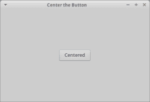

# wxPython 101:如何将小部件居中

> 原文：<https://www.blog.pythonlibrary.org/2015/02/19/wxpython-101-how-to-center-a-widget/>

我看到这种情况时有发生，人们会问如何在窗口中居中小部件。解决方案其实很简单。在大多数情况下，您只需要用一些间隔符将一个水平的 BoxSizer 嵌套在一个垂直的 BoxSizer 中。在本文中，我将向您展示完成这项任务的两种不同方式。

[](https://www.blog.pythonlibrary.org/wp-content/uploads/2015/02/wx_centered.png)

* * *

### 使用人造垫片

当我第一次学习如何做的时候，我被告知我可以使用一个元组作为我的间隔。语法看起来有点奇怪，但是很有效:

```py

import wx

########################################################################
class MainFrame(wx.Frame):
    """"""

    #----------------------------------------------------------------------
    def __init__(self):
        """Constructor"""
        wx.Frame.__init__(self, None, title="Center the Button")
        panel = wx.Panel(self)

        h_sizer = wx.BoxSizer(wx.HORIZONTAL)
        main_sizer = wx.BoxSizer(wx.VERTICAL)

        btn = wx.Button(panel, label="Centered")
        h_sizer.Add(btn, 0, wx.CENTER)

        main_sizer.Add((0,0), 1, wx.EXPAND)
        main_sizer.Add(h_sizer, 0, wx.CENTER)
        main_sizer.Add((0,0), 1, wx.EXPAND)

        panel.SetSizer(main_sizer)

        self.Show()

if __name__ == "__main__":
    app = wx.App(False)
    frame = MainFrame()
    app.MainLoop()

```

在这里，我们将一个水平分级器嵌套在顶级垂直分级器之外。但是我们用两个“间隔符”将水平尺寸标注包围起来，这两个“间隔符”恰好是元组，它们的比例都被设置为 1，并且 **wx。展开**样式标志集。

* * *

### 使用 AddStretchSpacer

wxPython 的 sizer 包含 AddStretchSpacer，这是一个非常方便的方法，基本上做了与上面相同的事情。让我们来看看:

```py

import wx

########################################################################
class MainFrame(wx.Frame):
    """"""

    #----------------------------------------------------------------------
    def __init__(self):
        """Constructor"""
        wx.Frame.__init__(self, None, title="Center the Button")
        panel = wx.Panel(self)

        h_sizer = wx.BoxSizer(wx.HORIZONTAL)
        main_sizer = wx.BoxSizer(wx.VERTICAL)

        btn = wx.Button(panel, label="Centered")
        h_sizer.Add(btn, 0, wx.CENTER)

        main_sizer.AddStretchSpacer(prop=1)
        main_sizer.Add(h_sizer, 0, wx.CENTER)
        main_sizer.AddStretchSpacer(prop=1)

        panel.SetSizer(main_sizer)

        self.Show()

if __name__ == "__main__":
    app = wx.App(False)
    frame = MainFrame()
    app.MainLoop()

```

您会注意到，这里唯一的区别是使用 AddStretchSpacer 方法及其设置为 1 的 **prop** 参数。

* * *

### 无嵌套分度器的居中

我的一个敏锐的读者提到了第三种方法来使小部件居中，这种方法不需要嵌套 sizers。让我们来看看:

```py

import wx

class MainFrame(wx.Frame):
    """"""

    #----------------------------------------------------------------------
    def __init__(self):
        """Constructor"""
        wx.Frame.__init__(self, None, title="Center the Button")
        panel = wx.Panel(self)

        main_sizer = wx.BoxSizer(wx.VERTICAL)

        btn = wx.Button(panel, label="Centered")
        main_sizer.AddStretchSpacer()
        main_sizer.Add(btn, 0, wx.CENTER)
        main_sizer.AddStretchSpacer()

        panel.SetSizer(main_sizer)

        self.Show()

if __name__ == "__main__":
    app = wx.App(False)
    frame = MainFrame()
    app.MainLoop()

```

在这里，我们只是创建一个垂直 sizer，添加一个拉伸间隔，然后告诉按钮居中，然后添加另一个拉伸间隔。代码与前面的例子非常相似，除了我们根本没有使用水平尺寸。特别感谢 Yoriz 在评论中向我提到这一点。