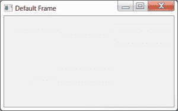
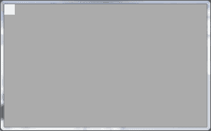
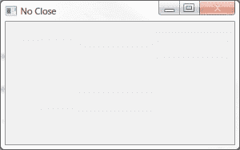
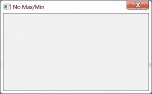
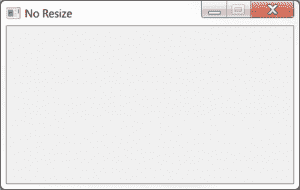
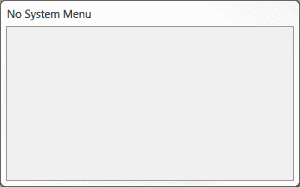
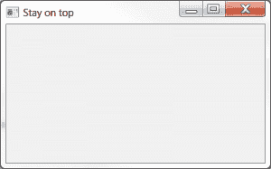

# wxPython 101:使用框架样式

> 原文：<https://www.blog.pythonlibrary.org/2013/11/06/wxpython-101-using-frame-styles/>

几乎所有 wxPython 应用程序中都使用 wxPython 框架小部件。它上面有最小化、最大化和关闭按钮，顶部还有标识应用程序的标题。wx。Frame 允许您以这样的方式修改其样式，即您可以删除或禁用各种按钮和功能。在本文中，我们将研究一些改变 wx 行为的方法。框架小部件。具体来说，我们将涵盖以下内容:

*   创建默认框架的不同方法
*   如何创建没有标题的框架(即没有标题栏)
*   如何创建一个禁用关闭按钮的框架
*   如何创建一个没有最大化或最小化按钮的框架
*   如何创建一个不能调整大小的框架
*   如何在没有系统菜单的情况下创建框架
*   如何让你的框架停留在其他窗口的顶部

### 入门指南

[](https://www.blog.pythonlibrary.org/wp-content/uploads/2013/11/default_frame.png)

看看默认样式是如何工作的，然后修改它，看看会发生什么，这总是一个好主意。那么我们就从框架的默认样式开始: **wx。DEFAULT_FRAME_STYLE** 您可以创建使用 wx 的框架。以 3 种不同的方式。第一个也是最简单的方法就是这样做:

```py

import wx

########################################################################
class DefaultFrame(wx.Frame):
    """
    The default frame
    """

    #----------------------------------------------------------------------
    def __init__(self):
        """Constructor"""
        wx.Frame.__init__(self, None, title="Default Frame")
        panel = wx.Panel(self)
        self.Show()

#----------------------------------------------------------------------
if __name__ == "__main__":
    app = wx.App(False)
    frame = DefaultFrame()
    app.MainLoop()

```

这将创建一个正常的框架，具有任何用户期望的所有正常功能。现在让我们稍微改变一下，把 wx 传递给它。默认帧样式。

```py

import wx 

########################################################################
class DefaultFrame(wx.Frame):
    """
    The default frame
    """

    #----------------------------------------------------------------------
    def __init__(self):
        """Constructor"""
        wx.Frame.__init__(self, None, title="Default Frame", style=wx.DEFAULT_FRAME_STYLE)
        panel = wx.Panel(self)
        self.Show()

#----------------------------------------------------------------------
if __name__ == "__main__":
    app = wx.App(False)
    frame = DefaultFrame()
    app.MainLoop()

```

这段代码做的事情与前面的代码完全一样。如果你做一点研究，你会发现 wx。DEFAULT_FRAME_STYLE 相当于传递以下内容:

```py

wx.MINIMIZE_BOX | wx.MAXIMIZE_BOX | wx.RESIZE_BORDER | wx.SYSTEM_MENU | wx.CAPTION | wx.CLOSE_BOX | wx.CLIP_CHILDREN

```

因此，让我们再修改一次代码，以展示它是如何工作的。

```py

import wx

########################################################################
class DefaultFrame(wx.Frame):
    """
    The default frame
    """

    #----------------------------------------------------------------------
    def __init__(self):
        """Constructor"""
        default = wx.MINIMIZE_BOX | wx.MAXIMIZE_BOX | wx.RESIZE_BORDER | wx.SYSTEM_MENU | wx.CAPTION | wx.CLOSE_BOX | wx.CLIP_CHILDREN
        wx.Frame.__init__(self, None, title="Default Frame", style=default)
        panel = wx.Panel(self)
        self.Show()

#----------------------------------------------------------------------
if __name__ == "__main__":
    app = wx.App(False)
    frame = DefaultFrame()
    app.MainLoop()

```

那很容易。现在我们准备开始实验了！

### 创建不带标题的框架

[](https://www.blog.pythonlibrary.org/wp-content/uploads/2013/11/no_caption_frame.png)

让我们创建一个没有标题的框架。标题是框架顶部的按钮以及应用程序的标题。

```py

import wx

########################################################################
class NoCaptionFrame(wx.Frame):
    """"""

    #----------------------------------------------------------------------
    def __init__(self):
        """Constructor"""
        no_caption = wx.MINIMIZE_BOX | wx.MAXIMIZE_BOX | wx.RESIZE_BORDER | wx.SYSTEM_MENU | wx.CLOSE_BOX | wx.CLIP_CHILDREN
        wx.Frame.__init__(self, None, title="No Caption", style=no_caption)
        panel = wx.Panel(self)
        self.Show()

#----------------------------------------------------------------------
if __name__ == "__main__":
    app = wx.App(False)
    frame = NoCaptionFrame()
    app.MainLoop()

```

运行这段代码时，面板在框架的左上角被压扁。你可以调整框架的大小，面板会“咬合”到位，但是看起来有点奇怪。您可能还会注意到，您无法关闭此应用程序，因为它上面没有关闭按钮。您需要终止 Python 进程来关闭这个应用程序。

### 创建一个禁用关闭按钮的框架

[](https://www.blog.pythonlibrary.org/wp-content/uploads/2013/11/no_close_frame.png)

一些程序员认为他们需要一个没有关闭按钮的框架。你不能真的去掉关闭按钮同时保留其他按钮，但是你可以禁用关闭按钮。方法如下:

```py

import wx

########################################################################
class NoCloseFrame(wx.Frame):
    """
    This frame has no close box and the close menu is disabled
    """

    #----------------------------------------------------------------------
    def __init__(self):
        """Constructor"""
        no_close = wx.MINIMIZE_BOX | wx.MAXIMIZE_BOX | wx.RESIZE_BORDER | wx.SYSTEM_MENU | wx.CAPTION | wx.CLIP_CHILDREN
        wx.Frame.__init__(self, None, title="No Close", style=no_close)
        panel = wx.Panel(self)
        self.Show()

#----------------------------------------------------------------------
if __name__ == "__main__":
    app = wx.App(False)
    frame = NoCloseFrame()
    app.MainLoop()

```

当然，你也不能关闭这个应用程序，所以这是一个相当烦人的应用程序。你可能想要添加一个 wx。可以关闭它的按钮。

### 创建没有最大化/最小化的框架

[](https://www.blog.pythonlibrary.org/wp-content/uploads/2013/11/no_max_min_frame.png)

有时你会想创建一个不能最小化或最大化的应用程序。如果你要走那么远，让我们做一个应用程序，也不显示在任务栏上！

```py

import wx

########################################################################
class NoMaxMinFrame(wx.Frame):
    """
    This frame does not have maximize or minimize buttons
    """

    #----------------------------------------------------------------------
    def __init__(self):
        """Constructor"""
        no_caption = wx.RESIZE_BORDER | wx.SYSTEM_MENU | wx.CAPTION | wx.CLOSE_BOX | wx.CLIP_CHILDREN | wx.FRAME_NO_TASKBAR
        wx.Frame.__init__(self, None, title="No Max/Min", style=no_caption)
        panel = wx.Panel(self)
        self.Show()

#----------------------------------------------------------------------
if __name__ == "__main__":
    app = wx.App(False)
    frame = NoMaxMinFrame()
    app.MainLoop()

```

如你所见，我们刚刚移除了 wx。最小化 _BOX 和 wx。MAXIMIZE_BOX 样式标志并添加了 wx。FRAME_NO_TASKBAR 样式标志。

### 创建不可调整大小的框架

[](https://www.blog.pythonlibrary.org/wp-content/uploads/2013/11/no_resize_frame.png)

有时，您会想要创建一个无法调整大小的框架。你可以使用 SetSizeHints 或者你可以只设置一些框架样式标志。我们将在这里执行后者:

```py

import wx

########################################################################
class NoResizeFrame(wx.Frame):
    """
    This frame cannot be resized. It can only be minimized, maximized
    and closed
    """

    #----------------------------------------------------------------------
    def __init__(self):
        """Constructor"""
        no_resize = wx.DEFAULT_FRAME_STYLE & ~ (wx.RESIZE_BORDER | 
                                                wx.RESIZE_BOX | 
                                                wx.MAXIMIZE_BOX)
        wx.Frame.__init__(self, None, title="No Resize", style=no_resize)
        panel = wx.Panel(self)
        self.Show()

#----------------------------------------------------------------------
if __name__ == "__main__":
    app = wx.App(False)
    frame = NoResizeFrame()
    app.MainLoop()

```

请注意，这里我们使用按位运算符从 wx 中移除 3 个样式标志。默认帧样式。正如你所看到的，这给了我们一个框架，我们不能以任何方式调整大小。

### 创建一个没有系统菜单的框架

[](https://www.blog.pythonlibrary.org/wp-content/uploads/2013/11/no_sys_menu_frame.png)

这是一个相当愚蠢的要求，但我见过有人这样要求。基本上，他们想去掉所有的按钮，但留下标题。下面是如何做到这一点:

```py

import wx

########################################################################
class NoSystemMenuFrame(wx.Frame):
    """
    There is no system menu, which means the title bar is there, but
    no buttons and no menu when clicking the top left hand corner
    of the frame
    """

    #----------------------------------------------------------------------
    def __init__(self):
        """Constructor"""
        no_sys_menu = wx.MINIMIZE_BOX | wx.MAXIMIZE_BOX | wx.RESIZE_BORDER | wx.CAPTION | wx.CLIP_CHILDREN | wx.CLOSE_BOX
        wx.Frame.__init__(self, None, title="No System Menu", style=no_sys_menu)
        panel = wx.Panel(self)
        self.Show()

#----------------------------------------------------------------------
if __name__ == "__main__":
    app = wx.App(False)
    frame = NoSystemMenuFrame()
    app.MainLoop()

```

正如你所看到的，有一个标题，你可以调整框架的大小，但你不能最大化，最小化或关闭应用程序。

**更新:**我收到一份报告，称这款电脑无法在 Windows XP 或 Windows 8.1 上运行。虽然在这一点上我并不特别关心那个操作系统，但是提供的解决方案是传递下面的样式而不是上面的样式:

```py

no_sys_menu=wx.CAPTION

```

### 创建一个停留在顶部的框架

[](https://www.blog.pythonlibrary.org/wp-content/uploads/2013/11/stay_on_top_frame.png)

很多程序员问这个问题。他们希望自己的应用程序位于所有其他应用程序之上。虽然没有完全万无一失的方法来做到这一点，下面的小食谱将在大多数时候工作。

```py

import wx

########################################################################
class StayOnTopFrame(wx.Frame):
    """
    A frame that stays on top of all the others
    """

    #----------------------------------------------------------------------
    def __init__(self):
        """Constructor"""
        on_top = wx.DEFAULT_FRAME_STYLE | wx.STAY_ON_TOP
        wx.Frame.__init__(self, None, title="Stay on top", style=on_top)
        panel = wx.Panel(self)
        self.Show()

#----------------------------------------------------------------------
if __name__ == "__main__":
    app = wx.App(False)
    frame = StayOnTopFrame()
    app.MainLoop()

```

这里我们只是使用默认的样式标志并添加 wx。保持在顶部。

### 包扎

至此，您应该知道如何编辑几乎所有的框架样式。还有一些其他的样式标志是依赖于操作系统的(比如 wx。ICONIZE)或者只是没那么有用。如果你对这些感兴趣，看看下面的链接。否则，向前迈进，明智地使用你的知识。

*注意:这段代码在 Windows 7 上使用 Python 2.6.6 和 wxPython 2.8.12.1 进行了测试*

### 相关链接

*   wxPython [文档](http://wxpython.org/Phoenix/docs/html/Frame.html#frame)关于 wx。基本框架
*   wxWidgets [文档](http://docs.wxwidgets.org/stable/wx_wxframe.html#wxframe)关于 wxFrame