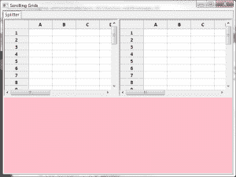

# wxPython 201:同步两个网格之间的滚动

> 原文：<https://www.blog.pythonlibrary.org/2013/12/17/wxpython-201-syncing-scrolling-two-grid/>

这个星期我在 StackOverflow 上看到一个问题，关于将两个网格放入一个 SplitterWindow，它本身在一个笔记本页面上。我个人认为这有点复杂，但我认为这是一个有趣的挑战，我想出了一个解决方案。然后这个家伙想知道如何同步两个网格的滚动。嗯，我找到了一个[答案](http://stackoverflow.com/q/15870426/393194)并修改了我的代码，决定写一篇关于它的文章。下面是最终结果的截图:

[](https://www.blog.pythonlibrary.org/wp-content/uploads/2013/12/wxScrollGrid.png)

是的，出于某种原因，想要这个的人也想要两个网格下面的面板。我觉得它有点丑，特别是用粉红色的背景，但是要各得其所。让我们看一下代码:

```py

import wx
import wx.grid as gridlib

class ScrollSync(object):
    def __init__(self, panel1, panel2):
        self.panel1 = panel1
        self.panel2 = panel2
        self.panel1.grid.Bind(wx.EVT_SCROLLWIN, self.onScrollWin1)
        self.panel2.grid.Bind(wx.EVT_SCROLLWIN, self.onScrollWin2)

    def onScrollWin1(self, event):
        if event.Orientation == wx.SB_HORIZONTAL:
            self.panel2.grid.Scroll(event.Position, -1)
        else:
            self.panel2.grid.Scroll(-1, event.Position)
        event.Skip()

    def onScrollWin2(self, event):
        if event.Orientation == wx.SB_HORIZONTAL:
            self.panel1.grid.Scroll(event.Position, -1)
        else:
            self.panel1.grid.Scroll(-1, event.Position)
        event.Skip()

########################################################################
class RegularPanel(wx.Panel):
    """"""

    #----------------------------------------------------------------------
    def __init__(self, parent):
        """Constructor"""
        wx.Panel.__init__(self, parent)
        self.SetBackgroundColour("pink")

########################################################################
class GridPanel(wx.Panel):
    """"""

    #----------------------------------------------------------------------
    def __init__(self, parent):
        """Constructor"""
        wx.Panel.__init__(self, parent)
        self.grid = gridlib.Grid(self, style=wx.BORDER_SUNKEN)
        self.grid.CreateGrid(25,8)

        sizer = wx.BoxSizer(wx.VERTICAL)
        sizer.Add(self.grid, 1, wx.EXPAND)
        self.SetSizer(sizer)

########################################################################
class MainPanel(wx.Panel):
    """"""

    #----------------------------------------------------------------------
    def __init__(self, parent):
        """Constructor"""
        wx.Panel.__init__(self, parent)

        notebook = wx.Notebook(self)

        page = wx.SplitterWindow(notebook)
        notebook.AddPage(page, "Splitter")
        hSplitter = wx.SplitterWindow(page)

        panelOne = GridPanel(hSplitter)
        panelTwo = GridPanel(hSplitter)
        ScrollSync(panelOne, panelTwo)

        hSplitter.SplitVertically(panelOne, panelTwo)
        hSplitter.SetSashGravity(0.5)

        panelThree = RegularPanel(page)
        page.SplitHorizontally(hSplitter, panelThree)
        page.SetSashGravity(0.5)

        sizer = wx.BoxSizer(wx.VERTICAL)
        sizer.Add(notebook, 1, wx.EXPAND)
        self.SetSizer(sizer)

########################################################################
class MainFrame(wx.Frame):
    """"""

    #----------------------------------------------------------------------
    def __init__(self):
        """Constructor"""
        wx.Frame.__init__(self, None, title="Nested Splitters",
                          size=(800,600))
        panel = MainPanel(self)
        self.Show()

#----------------------------------------------------------------------
if __name__ == "__main__":
    app = wx.App(False)
    frame = MainFrame()
    app.MainLoop()

```

我们最关心的部分是 **ScrollSync** 类。它接受网格所在的两个面板作为参数。然后，我们将网格绑定到 wx。然后在这个事件中，我们改变对面网格的位置。这段代码有几个限制。只有当你用鼠标移动滚动条时，它才起作用。如果您使用鼠标的滚轮、箭头键或上下翻页，则两个网格不再同步。我试图通过 wx 添加鼠标滚轮支持。EVT 鼠标滚轮事件，但它不像 EVT 鼠标滚轮事件那样提供方向或位置。其实它的定位是一个 wx。点，而 EVT _ 斯克罗温返回一个整数。添加这些功能会很有趣，但是它们超出了本文的范围。

这段代码应该可以让你开始同步工作。我还找到了几篇与此主题相关的文章，如果您需要在几个小部件中同步向上滚动，这些文章可能会对您有所帮助:

*   如何让两个 stylesTextCtrl 同步滚动？
*   [同步两个滚动条](http://markmail.org/message/phoebdgolelbz6xe)
*   [多个文本控件的同步滚动](http://wxpython-users.1045709.n5.nabble.com/Synchronized-scrolling-of-multiple-Textctrl-widgets-td2361680.html)