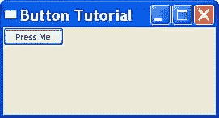
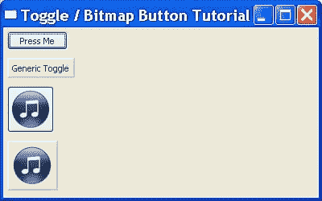
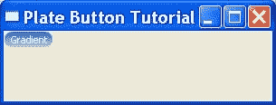

# wxPython:按钮之旅(第 1 部分，共 2 部分)

> 原文：<https://www.blog.pythonlibrary.org/2010/06/09/wxpython-a-tour-of-buttons-part-1-of-2/>

大多数人并没有真正思考他们每天使用的小工具。相反，他们认为这是理所当然的。按钮是我们最常用的部件之一。从键盘上的按键到门锁上的按钮，我们到处都能找到它们。在按钮实际上可以是任何形状或大小的软件中，它们甚至更加普遍。有些纽扣看起来甚至不像纽扣！在本文中，我们将了解 wxPython 为您提供的几个按钮以及如何使用它们。

## 常见的 wx。按钮部件

[](https://www.blog.pythonlibrary.org/wp-content/uploads/2010/06/buttonTutorial.jpg)

大多数 wxPython 程序员可能会使用的第一个按钮是 wx.Button，它包装了三个主要平台上的原生按钮控件，在每个平台上看起来都“正确”。这里有一个非常简单的例子来说明我们如何使用它:

```py

import wx

class MyForm(wx.Frame):

    def __init__(self):
        wx.Frame.__init__(self, None, wx.ID_ANY, "Button Tutorial")
        panel = wx.Panel(self, wx.ID_ANY)

        button = wx.Button(panel, id=wx.ID_ANY, label="Press Me")
        button.Bind(wx.EVT_BUTTON, self.onButton)
        # self.Bind(wx.EVT_BUTTON, self.onButton, button)

    #----------------------------------------------------------------------
    def onButton(self, event):
        """
        This method is fired when its corresponding button is pressed
        """
        print "Button pressed!"

# Run the program
if __name__ == "__main__":
    app = wx.App(False)
    frame = MyForm()
    frame.Show()
    app.MainLoop()

```

上面的代码只是创建了一个简单的带有一个按钮的表单。按钮被绑定到 *onButton* 事件处理程序。请注意，还有一种被注释掉的绑定方式。罗宾·邓恩在[维基](http://wiki.wxpython.org/self.Bind%20vs.%20self.button.Bind)上解释了绑定一个事件的两种方式的区别，所以如果你不明白，去看看吧！如果你不想得到完整的解释，以下是我的观点:

*   自我。Bind 将事件绑定到父级(通常是 wx。框架)通过按钮。这意味着事件在到达父级之前可能必须向上浮动几个事件层。如果在这些处理程序层的任何地方，开发人员都不会调用 event。跳过()，则事件停止。
*   小部件。对于所有意图和目的，将事件绑定到那个小部件。如果你愿意，你可以调用事件。这里跳过()将事件向前向上传递，尽管我想不出什么时候需要用按钮事件来这样做。

## 将多个小部件绑定到同一个处理程序

需要将多个小部件绑定到一个处理程序，然后在处理程序中区分调用小部件，这是相当常见的做法。有几种方法可以获得所需的信息。我们将看看实际获得小部件本身的几种最流行的方法:

```py

import wx

class MyForm(wx.Frame):

    def __init__(self):
        wx.Frame.__init__(self, None, wx.ID_ANY, "Button Tutorial")
        panel = wx.Panel(self, wx.ID_ANY)

        sizer = wx.BoxSizer(wx.VERTICAL)
        buttonOne = wx.Button(panel, id=wx.ID_ANY, label="One", name="one")
        buttonTwo = wx.Button(panel, id=wx.ID_ANY, label="Two", name="two")
        buttonThree = wx.Button(panel, id=wx.ID_ANY, label="Three", name="three")
        buttons = [buttonOne, buttonTwo, buttonThree]

        for button in buttons:
            self.buildButtons(button, sizer)

        panel.SetSizer(sizer)

    #----------------------------------------------------------------------
    def buildButtons(self, btn, sizer):
        """"""
        btn.Bind(wx.EVT_BUTTON, self.onButton)
        sizer.Add(btn, 0, wx.ALL, 5)

    #----------------------------------------------------------------------
    def onButton(self, event):
        """
        This method is fired when its corresponding button is pressed
        """
        button = event.GetEventObject()
        print "The button you pressed was labeled: " + button.GetLabel()
        print "The button's name is " + button.GetName()

        button_id = event.GetId()
        button_by_id = self.FindWindowById(button_id)
        print "The button you pressed was labeled: " + button_by_id.GetLabel()
        print "The button's name is " + button_by_id.GetName()

# Run the program
if __name__ == "__main__":
    app = wx.App(False)
    frame = MyForm()
    frame.Show()
    app.MainLoop()

```

这里我们有三个按钮，每个都绑定到 *onButton* 事件处理程序。有两种方法可以获得按钮对象:

1.  事件。GetEventObject()
2.  自我。FindWindowById(button_id)

第一种方法可以一下子直接获得小部件。第二个要求我们使用*事件获取小部件 ID。GetId* 。无论哪种方式，一旦你有了按钮，你可以调用它的任何方法。在我们的例子中，我们获得了按钮的名称和当前标签。我们还可以通过使用适当的 setter 方法(即 SetLabel)来更改按钮的标签或其他属性。现在让我们把注意力转向其他可用的按钮。

## 切换按钮和位图按钮

[](https://www.blog.pythonlibrary.org/wp-content/uploads/2010/06/togglebitmap.jpg)

切换/位图按钮示例

第二个最流行的按钮可能是切换按钮和位图按钮。使用 wxPython，对于这两种类型的按钮，您有两种选择:使用本机版本(如果可能的话)或使用通用版本之一(即，用纯 Python 而不是 SWIGed 编写的按钮)。让我们看看这四个:

```py

import wx
import wx.lib.buttons as buttons

class MyForm(wx.Frame):

    def __init__(self):
        wx.Frame.__init__(self, None, wx.ID_ANY, "Button Tutorial")
        panel = wx.Panel(self, wx.ID_ANY)

        # create a normal toggle button
        button = wx.ToggleButton(panel, label="Press Me")
        button.Bind(wx.EVT_TOGGLEBUTTON, self.onToggle)

        # create a generic toggle button
        gen_toggle_button = buttons.GenToggleButton(panel, -1, "Generic Toggle")
        gen_toggle_button.Bind(wx.EVT_BUTTON, self.onGenericToggle)

        # create a normal bitmap button
        bmp = wx.Bitmap("agt_mp3.png", wx.BITMAP_TYPE_ANY)
        bmapBtn = wx.BitmapButton(panel, id=wx.ID_ANY, bitmap=bmp,
                                  size=(bmp.GetWidth()+10, bmp.GetHeight()+10))

        # create a generic bitmap button
        genBmapBtn = buttons.GenBitmapButton(panel, bitmap=bmp)

        sizer = wx.BoxSizer(wx.VERTICAL)
        sizer.Add(button, 0, wx.ALL, 5)
        sizer.Add(gen_toggle_button, 0, wx.ALL, 5)
        sizer.Add(bmapBtn, 0, wx.ALL, 5)
        sizer.Add(genBmapBtn, 0, wx.ALL, 5)
        panel.SetSizer(sizer)

    #----------------------------------------------------------------------
    def onGenericToggle(self, eventq):
        """"""
        print "Generic toggle button was pressed!"

    #----------------------------------------------------------------------
    def onToggle(self, event):
        """
        Print a message when toggled
        """
        print "Button toggled!"

# Run the program
if __name__ == "__main__":
    app = wx.App(False)
    frame = MyForm()
    frame.Show()
    app.MainLoop()

```

这段代码与我们已经看到的非常相似。新的信息是如何得到通用按钮。我们需要做一个特殊的导入，就像这样:import wx.lib.buttons。现在我们可以访问一组通用按钮，包括普通按钮、切换按钮、位图、带文本的位图和平面按钮。甚至有几个主题按钮看起来几乎和原生按钮一样！

让我们注意一下上面代码中的一些特性。首先，我们对 wx 进行了奇怪的尺寸调整。BitmapButton 小工具。我们这样做是为了确保位图周围有一些“空白”空间。这使得辨别小部件是一个按钮变得更加容易。通用版本似乎可以自动做到这一点。另一件奇怪的事情是当你切换 wx 时。ToggleButton 按钮并保持鼠标指针在按钮上方，它看起来不切换。如果你将鼠标从按钮上移开，那么它就会离开(我在 Windows XP 上注意到了这一点...在其他平台上可能不是问题)。

据[罗宾·邓恩](http://groups.google.com/group/wxpython-users/browse_frm/thread/89a4624c2bbb29d5/bf067b3d63ffa47f#bf067b3d63ffa47f)(wxPython 的创造者)透露，wxPython 的 2.9 系列将会有更新的 wx。可以显示位图及其文本的按钮控件。这才是值得期待的！

## 板按钮

[](https://www.blog.pythonlibrary.org/wp-content/uploads/2010/06/platebutton.jpg)

PlateButton 是另一个通用小部件。它是由《Editra 的作者 Cody Precord 创建的。在 wxPython 演示中有很多关于他的按钮的例子。我们只看几个例子:

```py

import wx
import wx.lib.platebtn as platebtn

class MyForm(wx.Frame):

    def __init__(self):
        wx.Frame.__init__(self, None, wx.ID_ANY, "Plate Button Tutorial")

        # Add a panel so it looks the correct on all platforms
        panel = wx.Panel(self, wx.ID_ANY)

##        btn = platebtn.PlateButton(panel, label="Test", style=platebtn.PB_STYLE_DEFAULT)
        btn = platebtn.PlateButton(panel, label="Gradient", style=platebtn.PB_STYLE_GRADIENT)

# Run the program
if __name__ == "__main__":
    app = wx.App(False)
    frame = MyForm().Show()
    app.MainLoop()

```

上面的例子显示了如何创建一个简单的 PlateButton。包括两个示例，展示了两种不同的按钮样式。您需要取消对其中一个的注释，并注释掉另一个，看看它们有什么不同。现在让我们看看如何向我们的 PlateButton 添加一个菜单:

```py

import wx
import wx.lib.platebtn as platebtn

class MyForm(wx.Frame):

    def __init__(self):
        wx.Frame.__init__(self, None, wx.ID_ANY, "Plate Button Tutorial")

        # Add a panel so it looks the correct on all platforms
        panel = wx.Panel(self, wx.ID_ANY)

        menu = wx.Menu()
        for url in ['http://wxpython.org', 'http://slashdot.org',
                    'http://editra.org', 'http://xkcd.com']:
            menu.Append(wx.NewId(), url, "Open %s in your browser" % url)

        btn = platebtn.PlateButton(panel, label="Menu", size=None, style=platebtn.PB_STYLE_DEFAULT)
        btn.SetMenu(menu)

        sizer = wx.BoxSizer(wx.VERTICAL)
        sizer.Add(btn, 0, wx.ALL, 5)
        panel.SetSizer(sizer)

# Run the program
if __name__ == "__main__":
    app = wx.PySimpleApp()
    frame = MyForm().Show()
    app.MainLoop()

```

这个示例基本上是从 wxPython 演示中剥离出来的一个示例。这里的想法是创建一个菜单，然后使用 PlateButton 的“SetMenu”方法将其附加到按钮上。

## 包扎

在本文中，我们学习了以下按钮:wx。按钮，wx。ToggleButton。BitmapButton，几个普通按钮和 PlateButton。在下半部分，我们将会看到更多的核心部件按钮和 Andrea Gavana 的按钮！下次见！

*注意:本文中的例子是在 Windows XP、wxPython 2.8.10.1/2 . 8 . 11 . 0 和 Python 2.5 上测试的*