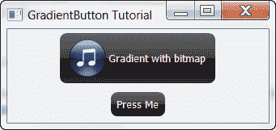

# wxPython:按钮之旅(第 2 部分，共 2 部分)

> 原文：<https://www.blog.pythonlibrary.org/2010/06/10/wxpython-a-tour-of-buttons-part-2-of-2/>

在上一篇文章中，我们介绍了标准 wxPython 包中的各种按钮。现在我们要看更多的东西！如果您还没有弄明白，wxPython 非常重视 Python 的“包含电池”哲学！在这篇文章中，我们将看看以下按钮:

*   wx。单选按钮
*   wx.SpinButton
*   AquaButton (AGW)
*   梯度按钮(AGW)
*   ShapedButton (AGW)

让我们开始吧！

## wx。单选按钮-不要换频道！

[](https://www.blog.pythonlibrary.org/wp-content/uploads/2010/06/radioBtnTut.png)

单选按钮是一个众所周知的小部件，甚至对于年级学生来说也是如此，因为它在许多标准化测试中使用。单选按钮允许开发者强迫用户从选项列表中只选择一个选项。它们比 ComboBox 更直观，尽管它们基本上服务于相同的目的。这里有一个简单的例子:

```py

import wx

class MyForm(wx.Frame):

    def __init__(self):
        wx.Frame.__init__(self, None, wx.ID_ANY, "Radio Button Tutorial")
        panel = wx.Panel(self, wx.ID_ANY)

        radio1 = wx.RadioButton( panel, -1, " Radio1 ", style = wx.RB_GROUP )
        radio2 = wx.RadioButton( panel, -1, " Radio2 " )
        radio3 = wx.RadioButton( panel, -1, " Radio3 " )

        radio1.Bind(wx.EVT_RADIOBUTTON, self.onButton)
        radio2.Bind(wx.EVT_RADIOBUTTON, self.onButton)
        radio3.Bind(wx.EVT_RADIOBUTTON, self.onButton)

        sizer = wx.BoxSizer(wx.VERTICAL)
        sizer.Add(radio1, 0, wx.ALL, 5)
        sizer.Add(radio2, 0, wx.ALL, 5)
        sizer.Add(radio3, 0, wx.ALL, 5)
        panel.SetSizer(sizer)

    #----------------------------------------------------------------------
    def onButton(self, event):
        """
        This method is fired when its corresponding button is pressed
        """
        btn = event.GetEventObject()
        label = btn.GetLabel()
        message = "You just selected %s" % label
        dlg = wx.MessageDialog(None, message, 'Message', 
                               wx.OK|wx.ICON_EXCLAMATION)
        dlg.ShowModal()
        dlg.Destroy()

# Run the program
if __name__ == "__main__":
    app = wx.App(False)
    frame = MyForm()
    frame.Show()
    app.MainLoop()

```

注意，这个按钮和我们在[上一篇文章](https://www.blog.pythonlibrary.org/2010/06/09/wxpython-a-tour-of-buttons-part-1-of-2/)中看到的按钮的主要区别是样式标志:RB_GROUP。这将导致以下所有单选按钮成为一个组的一部分。如果你再次设置那个标志，那么你将从那个点开始创建一个新的组(参见 [Zetcode 教程](http://zetcode.com/wxpython/widgets/))。我们还将每个按钮绑定到一个事件处理程序，该处理程序将向用户显示一个 MessageDialog，告诉他们选择了哪个按钮。做作？你打赌！但是这对于说明性的目的来说是很好的。

## 我们跟着 wx 转一圈吧。旋转按钮

[](https://www.blog.pythonlibrary.org/wp-content/uploads/2010/06/spinButtonTut.png)

SpinButton 实际上就是你在上面的截图中看到的文本控件右边的上下箭头。大多数时候，SpinCtrl 或 FloatSpin 小部件可能更好。但是这里有一个例子:

```py

import wx

class MyForm(wx.Frame):

    def __init__(self):
        wx.Frame.__init__(self, None, wx.ID_ANY, "Spin Button Tutorial")
        panel = wx.Panel(self, wx.ID_ANY)

        self.text = wx.TextCtrl(panel, value="1")
        self.spin = wx.SpinButton(panel, style=wx.SP_VERTICAL)
        self.spin.SetRange(1, 100)
        self.spin.SetValue(1)

        self.Bind(wx.EVT_SPIN, self.OnSpin, self.spin)

        vSizer = wx.BoxSizer(wx.VERTICAL)
        sizer = wx.BoxSizer(wx.HORIZONTAL)
        sizer.Add(self.text, 0, wx.CENTER)
        sizer.Add(self.spin, 0, wx.CENTER)
        vSizer.Add(sizer, 1, wx.CENTER)
        panel.SetSizer(vSizer)

    def OnSpin(self, event):
        self.text.SetValue(str(event.GetPosition()))

# Run the program
if __name__ == "__main__":
    app = wx.App(False)
    frame = MyForm()
    frame.Show()
    app.MainLoop()

```

上面的代码几乎一字不差地取自 wxPython 演示。请注意，您可以设置按钮的方向。在这种情况下，我们将其设置为垂直方向。您也可以将其设置为水平。还有其他样式，但似乎没有太多的文档，所以我无法找出哪些是 SpinButton 的，哪些是 SplitterWindow 的。哦好吧。回到上面的代码。如你所见，我们没有像过去那样绑定到 EVT 按钮，而是绑定到 EVT 自旋。出于某种原因，wxPython 演示使用了 event。获取微调器的位置。你可以调用“self.spin.GetValue”得到同样的东西。

## 使用 AquaButton 刷新

[](https://www.blog.pythonlibrary.org/wp-content/uploads/2010/06/aquaButtonTut.png)

接下来的三个按钮都来自 wxPython 附带的高级通用小部件(AGW)库，由 Andrea Gavana 创建。我们将从他的 AquaButton 开始。AquaButton 是 AGW 库中最简单的小部件之一。让我们来看看我们是如何创建它们的:

```py

# aquaBtnDemo.py

import wx
import wx.lib.agw.aquabutton as AB

########################################################################
class MyForm(wx.Frame):

    #----------------------------------------------------------------------
    def __init__(self):
        wx.Frame.__init__(self, None, wx.ID_ANY, "AquaButton Tutorial")
        panel = wx.Panel(self, wx.ID_ANY)

        bmp = wx.Bitmap("agt_mp3.png", wx.BITMAP_TYPE_ANY)
        button = AB.AquaButton(panel, bitmap=bmp, label="Press Me")
        button.SetForegroundColour("black")
        button.Bind(wx.EVT_BUTTON, self.onButton)

        buttonTwo = AB.AquaButton(panel, label="PulseOnFocus")
        buttonTwo.SetForegroundColour("black")
        buttonTwo.SetPulseOnFocus(True)

        sizer = wx.BoxSizer(wx.VERTICAL)
        sizer.Add(button, 0, wx.CENTER|wx.ALL, 5)
        sizer.Add(buttonTwo, 0, wx.CENTER|wx.ALL, 5)
        panel.SetSizer(sizer)

    #----------------------------------------------------------------------
    def onButton(self, event):
        """
        This method is fired when its corresponding button is pressed
        """
        message = "You pressed the button!"
        dlg = wx.MessageDialog(None, message, 'Message', 
                               wx.OK|wx.ICON_EXCLAMATION)
        dlg.ShowModal()
        dlg.Destroy()

# Run the program
if __name__ == "__main__":
    app = wx.App(False)
    frame = MyForm()
    frame.Show()
    app.MainLoop()

```

AquaButton 支持位图，所以在这个例子中我们显示了两个按钮:一个有位图，一个没有。AquaButton 的另一个简洁的特性是当它获得焦点时能够跳动。您可以打开或关闭此功能。第二个按钮打开了这个特性。设置前景颜色的原因是因为在 Windows 7 上，面板是亮白色的，如果使用默认字体颜色，很难阅读按钮上的文本。您还可以设置 AquaButton 的背景颜色及其悬停颜色。

## 梯度按钮

[](https://www.blog.pythonlibrary.org/wp-content/uploads/2010/06/gradientBtnTut.png)

GradientButton 与 AquaButton 相似，它们都有圆角，并且上面可以有可选的位图。但是 GradientButton 不支持脉冲。然而，顾名思义，GradientButton 允许您设置从顶部到底部的渐变以及按下时顶部/底部的颜色。我们将快速看一下如何实例化一个，因为所有的颜色设置都是不言自明的，在 wxPython 演示中有很好的例子:

```py

# gradientBtnDemo.py

import wx
import wx.lib.agw.gradientbutton as GB

########################################################################
class MyForm(wx.Frame):

    #----------------------------------------------------------------------
    def __init__(self):
        wx.Frame.__init__(self, None, wx.ID_ANY, "GradientButton Tutorial")
        panel = wx.Panel(self, wx.ID_ANY)

        bmp = wx.Bitmap("agt_mp3.png", wx.BITMAP_TYPE_ANY)
        gbBtn = GB.GradientButton(panel, bitmap=bmp, 
                                  label="Gradient with bitmap")
        gbBtnNoBmp = GB.GradientButton(panel, label="Press Me")
        gbBtnNoBmp.Bind(wx.EVT_BUTTON, self.onPressMe)

        sizer = wx.BoxSizer(wx.VERTICAL)
        sizer.Add(gbBtn, 0, wx.CENTER|wx.ALL, 5)
        sizer.Add(gbBtnNoBmp, 0, wx.CENTER|wx.ALL, 5)
        panel.SetSizer(sizer)

    #----------------------------------------------------------------------
    def onPressMe(self, event):
        """"""
        message = "Thank You!"
        dlg = wx.MessageDialog(None, message, 'Message', 
                               wx.OK|wx.ICON_EXCLAMATION)
        dlg.ShowModal()
        dlg.Destroy()

# Run the program
if __name__ == "__main__":
    app = wx.App(False)
    frame = MyForm()
    frame.Show()
    app.MainLoop()

```

如您所见，创建 GradientButton 非常简单明了。随时可以试一试！我会等的...已经完成了？然后，让我们以 ShapedButton 结束吧！

## 使用“塑形”按钮塑形

[](https://www.blog.pythonlibrary.org/wp-content/uploads/2010/06/shapedBtnTut.png)

ShapedButton 可能是我们将在本文中看到的最复杂的按钮。复杂，我的意思是，功能齐全。你可以创建一个正常的按钮，一个位图按钮，一个奇怪的偏移位图+文本按钮，切换按钮，你可以在任何角度旋转文本。如果您查看 wxPython 演示，您还会看到如何将按钮做成椭圆形。ShapedButton 需要安装 [Python 图像库](http://www.pythonware.com/products/pil/)，如果你还没有，现在就去获取吧！当你准备好了，我们将看看用来创建上面截图的代码:

```py

# shapedBtnDemo.py

import wx
from wx.lib.agw.shapedbutton import SButton, SBitmapButton
from wx.lib.agw.shapedbutton import SBitmapToggleButton, SBitmapTextToggleButton

########################################################################
class MyForm(wx.Frame):

    #----------------------------------------------------------------------
    def __init__(self):
        wx.Frame.__init__(self, None, wx.ID_ANY, "ShapedButton Tutorial")
        panel = wx.Panel(self, wx.ID_ANY)

        bmp = wx.Bitmap("agt_mp3.png", wx.BITMAP_TYPE_ANY)
        size = (75,75)

        sBtn = SButton(panel, label="Press Me", size=size)
        sBtn.Bind(wx.EVT_BUTTON, self.onShapedBtn)

        bmpBtn = SBitmapButton(panel, wx.ID_ANY, bitmap=bmp)
        bmpBtn.Bind(wx.EVT_BUTTON, self.onBmpShapedBtn)

        bmpToggleBtn = SBitmapToggleButton(panel, wx.ID_ANY, bitmap=bmp)
        bmpToggleBtn.Bind(wx.EVT_BUTTON, self.onToggle)

        bmpToggleTxtBtn = SBitmapTextToggleButton(panel, wx.ID_ANY,
                                                  bitmap=bmp,
                                                  label="Toggle!",
                                                  size=(100,100))
        rotatedTxtBtn = SButton(panel, label="Rotated!", size=size)
        rotatedTxtBtn.SetAngleOfRotation(90)

        sizer = wx.BoxSizer(wx.HORIZONTAL)
        sizer.Add(sBtn, 0, wx.ALL, wx.CENTER, 5)
        sizer.Add(bmpBtn, 0, wx.ALL, wx.CENTER, 5)
        sizer.Add(bmpToggleBtn, 0, wx.ALL, wx.CENTER, 5)
        sizer.Add(bmpToggleTxtBtn, 0, wx.ALL, wx.CENTER, 5)
        sizer.Add(rotatedTxtBtn, 0, wx.ALL, wx.CENTER, 5)
        panel.SetSizer(sizer)

    #----------------------------------------------------------------------
    def onBmpShapedBtn(self, event):
        """"""
        dlg = wx.ColourDialog(self)
        dlg.GetColourData().SetChooseFull(True)
        if dlg.ShowModal() == wx.ID_OK:
            print "'You selected: %s\n" % str(data.GetColour().Get())
        dlg.Destroy()

    #----------------------------------------------------------------------
    def onToggle(self, event):
        """"""
        if event.GetIsDown():
            wx.CallAfter(self.showDialog, "You Toggled Me!")
        else:
            wx.CallAfter(self.showDialog, "You untoggled me!")
        event.Skip()

    #----------------------------------------------------------------------
    def onShapedBtn(self, event):
        """"""
        self.showDialog("You Pressed the Normal ShapedButton!")

    #----------------------------------------------------------------------
    def showDialog(self, message):
        """
        Displays a custom message
        """
        dlg = wx.MessageDialog(None, message, 'Message', 
                               wx.OK|wx.ICON_EXCLAMATION)
        dlg.ShowModal()
        dlg.Destroy()

# Run the program
if __name__ == "__main__":
    app = wx.App(False)
    frame = MyForm()
    frame.Show()
    app.MainLoop()

```

在上面的代码中，你可以看到如何创建一个普通的 ShapedButton，一对切换按钮和一个旋转了 90 度的文本按钮。若要旋转所述文本，请使用 SetAngleOfRotation 方法并传递角度值。目前有一些与 ShapedButton 的切换版本的鼠标/窗口捕获相关的错误。如果你试图在你的按钮处理程序中显示一个对话框，就像上面的 onToggle 方法，你会得到一个错误，除非你在 wx.CallAfter 中包装这个调用。

## 包扎

如果您已经读到这里，那么您现在对 wxPython 中几乎所有的按钮小部件都有所了解。恭喜你！我希望您发现这很有帮助，并且在将来，您不会认为任何小部件都是理所当然的。

**注意:本文中的代码是在以下平台上测试的:**

*   Windows XP、wxPython 2.8.11.0、Python 2.5
*   Windows 7，wxPython 2.8.10.1，Python 2.6

## 下载源代码

*   [陀螺仪按钮 2.zip](https://www.blog.pythonlibrary.org/wp-content/uploads/2010/06/tourOfButtons2.zip)
*   [陀螺仪按钮 2.tar](https://www.blog.pythonlibrary.org/wp-content/uploads/2010/06/tourOfButtons2.tar)