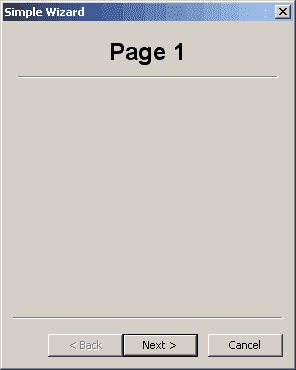
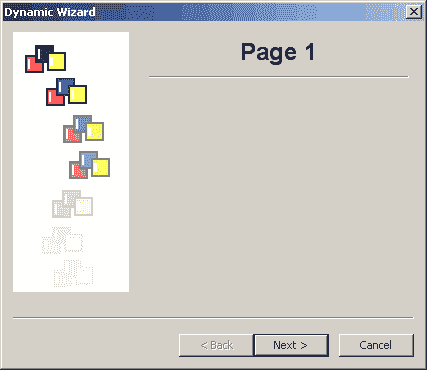

# wxPython:向导教程

> 原文：<https://www.blog.pythonlibrary.org/2011/01/27/wxpython-a-wizard-tutorial/>

在本文中，我们将关注 wxPython 的向导小部件。不，这与邓布利多或甘道夫无关。相反，当您运行安装程序或设置模板时，您将看到该对话框。有时你甚至会看到它们被用来设置邮件合并。我们将在本教程中讨论两个例子:一个相当简单，另一个稍微复杂一些。我们开始吧！

*注意:本文中的代码改编自 wxPython 演示应用程序*

## 一个简单的巫师

[](https://www.blog.pythonlibrary.org/wp-content/uploads/2011/01/simple_wizard.png)

当您需要在 wxPython 中使用向导时，您会希望以一种特殊的方式导入它。除了导入 **wx** ，你还必须这样做:**导入 wx.wizard** 。还要注意，有两种主要类型的向导页面:WizardPageSimple 和 PyWizardPage。前者是最简单的，所以我们将在简单的例子中使用它。代码如下:

```py

import wx
import wx.wizard as wiz

########################################################################
class TitledPage(wiz.WizardPageSimple):
    """"""

    #----------------------------------------------------------------------
    def __init__(self, parent, title):
        """Constructor"""
        wiz.WizardPageSimple.__init__(self, parent)

        sizer = wx.BoxSizer(wx.VERTICAL)
        self.SetSizer(sizer)

        title = wx.StaticText(self, -1, title)
        title.SetFont(wx.Font(18, wx.SWISS, wx.NORMAL, wx.BOLD))
        sizer.Add(title, 0, wx.ALIGN_CENTRE|wx.ALL, 5)
        sizer.Add(wx.StaticLine(self, -1), 0, wx.EXPAND|wx.ALL, 5)

#----------------------------------------------------------------------
def main():
    """"""
    wizard = wx.wizard.Wizard(None, -1, "Simple Wizard")
    page1 = TitledPage(wizard, "Page 1")
    page2 = TitledPage(wizard, "Page 2")
    page3 = TitledPage(wizard, "Page 3")
    page4 = TitledPage(wizard, "Page 4")

    wx.wizard.WizardPageSimple.Chain(page1, page2)
    wx.wizard.WizardPageSimple.Chain(page2, page3)
    wx.wizard.WizardPageSimple.Chain(page3, page4)
    wizard.FitToPage(page1)

    wizard.RunWizard(page1)

    wizard.Destroy()

#----------------------------------------------------------------------
if __name__ == "__main__":
    app = wx.App(False)
    main()
    app.MainLoop()

```

这是相当多的代码。我们把它拆开一部分，看看是否能弄明白。首先，我们导入 wx 和向导，我们将其重命名为“wiz ”,以节省击键次数。接下来，我们创建一个 **TitledPage** 类，它是 **WizardPageSimple** 的子类。这个类将是我们向导中所有页面的基础。它基本上只是定义了一个页面，标题居中，字体为 18 磅，下面有一条线。

在**主**函数中，我们找到真正的肉。这里我们使用以下语法创建向导: **wx.wizard.Wizard(None，-1，“简单向导”)**。这为向导提供了一个无父级、一个 id 和一个标题。然后我们创建四个页面，它们是我们之前提到的**title page**类的实例。最后，我们使用**wx . wizard . wizardpagesimple . chain**将页面链接在一起。这允许我们使用几个自动生成的按钮在页面中向前和向后翻页。最后几行代码将运行向导，当用户完成时，将销毁向导。很简单，对吧？现在让我们来看一个更高级的例子。

## 使用 PyWizardPage

[](https://www.blog.pythonlibrary.org/wp-content/uploads/2011/01/adv_wizard.png)

在本节中，我们将创建一个 **PyWizardPage** 的子类。我们还将有一个 WizardPageSimple 子类，以便我们可以混合和匹配这两者来创建一系列不同的页面。让我们直接跳到代码，这样你就可以自己看了！

```py

import images
import wx
import wx.wizard as wiz

########################################################################
class TitledPage(wiz.WizardPageSimple):
    """"""

    #----------------------------------------------------------------------
    def __init__(self, parent, title):
        """Constructor"""
        wiz.WizardPageSimple.__init__(self, parent)

        sizer = wx.BoxSizer(wx.VERTICAL)
        self.sizer = sizer
        self.SetSizer(sizer)

        title = wx.StaticText(self, -1, title)
        title.SetFont(wx.Font(18, wx.SWISS, wx.NORMAL, wx.BOLD))
        sizer.Add(title, 0, wx.ALIGN_CENTRE|wx.ALL, 5)
        sizer.Add(wx.StaticLine(self, -1), 0, wx.EXPAND|wx.ALL, 5)

########################################################################
class UseAltBitmapPage(wiz.PyWizardPage):

    #----------------------------------------------------------------------
    def __init__(self, parent, title):
        wiz.PyWizardPage.__init__(self, parent)
        self.next = self.prev = None
        self.sizer = wx.BoxSizer(wx.VERTICAL)

        title = wx.StaticText(self, label=title)
        title.SetFont(wx.Font(18, wx.SWISS, wx.NORMAL, wx.BOLD))
        self.sizer.Add(title)

        self.sizer.Add(wx.StaticText(self, -1, "This page uses a different bitmap"),
                       0, wx.ALL, 5)
        self.sizer.Layout()

    #----------------------------------------------------------------------
    def SetNext(self, next):
        self.next = next

    #----------------------------------------------------------------------
    def SetPrev(self, prev):
        self.prev = prev

    #----------------------------------------------------------------------
    def GetNext(self):
        return self.next

    #----------------------------------------------------------------------
    def GetPrev(self):
        return self.prev

    #----------------------------------------------------------------------
    def GetBitmap(self):
        # You usually wouldn't need to override this method
        # since you can set a non-default bitmap in the
        # wxWizardPageSimple constructor, but if you need to
        # dynamically change the bitmap based on the
        # contents of the wizard, or need to also change the
        # next/prev order then it can be done by overriding
        # GetBitmap.
        return images.WizTest2.GetBitmap()

#----------------------------------------------------------------------
def main():
    """"""
    wizard = wiz.Wizard(None, -1, "Dynamic Wizard", 
                        images.WizTest1.GetBitmap())
    page1 = TitledPage(wizard, "Page 1")
    page2 = TitledPage(wizard, "Page 2")
    page3 = TitledPage(wizard, "Page 3")
    page4 = UseAltBitmapPage(wizard, "Page 4")
    page5 = TitledPage(wizard, "Page 5")

    wizard.FitToPage(page1)
    page5.sizer.Add(wx.StaticText(page5, -1, "\nThis is the last page."))

    # Set the initial order of the pages
    page1.SetNext(page2)
    page2.SetPrev(page1)
    page2.SetNext(page3)
    page3.SetPrev(page2)
    page3.SetNext(page4)
    page4.SetPrev(page3)
    page4.SetNext(page5)
    page5.SetPrev(page4)

    wizard.GetPageAreaSizer().Add(page1)
    wizard.RunWizard(page1)
    wizard.Destroy()

#----------------------------------------------------------------------
if __name__ == "__main__":
    app = wx.App(False)
    main()
    app.MainLoop()

```

这段代码的开始方式与前面的代码非常相似。在本例中，我们还导入了一个 **images** 模块，该模块包含几个**pyembeddeimage**对象，我们将使用它们来演示如何向向导页面添加位图。反正第一节课和前面一模一样。接下来我们创建一个 **UseAltBitmapPage** 类，它是 **PyWizardPage** 的子类。我们必须重写一些方法来使它正确工作，但是它们是不言自明的。这个页面将只是用来改变一个页面的位图图像。

在 **main** 函数中，我们创建向导的方式与之前略有不同:

```py

wizard = wiz.Wizard(None, -1, "Dynamic Wizard", images.WizTest1.GetBitmap())

```

正如您所看到的，这个方法允许我们添加一个位图，它将出现在向导页面的左侧。无论如何，在那之后，我们创建了五个页面，其中四个是 **TitledPage** 的实例，一个是 **UseAltBitmapPage** 的实例。我们将向导放在第一页，然后我们看到一些奇怪的东西:

```py

page5.sizer.Add(wx.StaticText(page5, -1, "\nThis is the last page."))

```

那有什么用？嗯，在页面上添加一个小部件是一种愚蠢的方式。为了让用户知道他们已经到达了最后一页，我们添加了一个 **StaticText** 实例，明确地告诉用户他们已经到达了最后一页。接下来的几行使用 **SetNext** 和 **SetPrev** 设置页面的顺序。虽然这些方法可以让您更精细地控制页面的顺序，但它们不如 **WizardPageSimple 方便。链式**方法。最后几行代码与前面的示例相同。

## 额外提示:如何重新标记向导按钮

在创建这篇文章的时候，有人问如何在官方的 [wxPython 邮件列表](http://groups.google.com/group/wxpython-users/browse_thread/thread/f5a96493a8202424?pli=1)上修改向导的按钮标签。为了完整起见，我们将采用 Robin Dunn 的解决方案，并展示如何更改前一个和下一个按钮的标签。

```py

prev_btn = self.FindWindowById(wx.ID_BACKWARD)
prev_btn.SetLabel("Foo")
next_btn = self.FindWindowById(wx.ID_FORWARD) 
next_btn.SetLabel("Bar")

```

## 包扎

现在您知道了如何创建 wxPython 中包含的两种类型的向导。您还学习了一个有趣的技巧来更改向导中按钮的标签。如果你认为我忘记了什么，请告诉我，我会更新帖子或写一篇后续文章。

## 进一步阅读

*   wx.wizard.Wizard [官方文档](http://www.wxpython.org/docs/api/wx.wizard.Wizard-class.html)
*   wx.wizard.WizardPage [文档](http://www.wxpython.org/docs/api/wx.wizard.WizardPage-class.html)
*   安德烈娅·加瓦娜的巫师[文档](http://xoomer.virgilio.it/infinity77/wxPython/wizard/wx.wizard.Wizard.html)

## 源代码

*   [wxWizards.zip](https://www.blog.pythonlibrary.org/wp-content/uploads/2011/01/wxWizards.zip)
*   [wxWizards.tar](https://www.blog.pythonlibrary.org/wp-content/uploads/2011/01/wxWizards.tar)