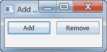
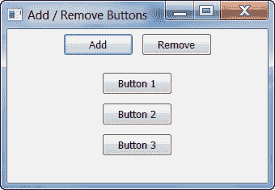

# wxPython:动态添加和移除小部件

> 原文：<https://www.blog.pythonlibrary.org/2012/05/05/wxpython-adding-and-removing-widgets-dynamically/>

[](https://www.blog.pythonlibrary.org/wp-content/uploads/2012/05/dynamic.png)

我不断看到有人在启动 wxPython 应用程序后询问如何添加或删除小部件。这实际上是很容易做到的事情，所以我决定是时候写一个关于这个主题的简单教程了。我不得不根据访问我的程序的用户类型自己不时地这样做，这样我就可以显示稍微不同的选项。不管怎样，我们开始吧！

我决定让事情变得简单。这个应用程序所做的就是允许用户添加或删除按钮。下面的脚本将创建一个类似于本文开头的窗口。如果您按几次“添加”按钮，您应该会看到类似这样的内容:

[](https://www.blog.pythonlibrary.org/wp-content/uploads/2012/05/dynamic2.png)

正如你所看到的，你最终得到了更多的按钮！现在让我们花一点时间来阅读代码。你一读完我就解释。

```py
import wx

########################################################################
class MyPanel(wx.Panel):
    """"""

    #----------------------------------------------------------------------
    def __init__(self, parent):
        """Constructor"""
        wx.Panel.__init__(self, parent)
        self.number_of_buttons = 0
        self.frame = parent

        self.mainSizer = wx.BoxSizer(wx.VERTICAL)
        controlSizer = wx.BoxSizer(wx.HORIZONTAL)
        self.widgetSizer = wx.BoxSizer(wx.VERTICAL)

        self.addButton = wx.Button(self, label="Add")
        self.addButton.Bind(wx.EVT_BUTTON, self.onAddWidget)
        controlSizer.Add(self.addButton, 0, wx.CENTER|wx.ALL, 5)

        self.removeButton = wx.Button(self, label="Remove")
        self.removeButton.Bind(wx.EVT_BUTTON, self.onRemoveWidget)
        controlSizer.Add(self.removeButton, 0, wx.CENTER|wx.ALL, 5)

        self.mainSizer.Add(controlSizer, 0, wx.CENTER)
        self.mainSizer.Add(self.widgetSizer, 0, wx.CENTER|wx.ALL, 10)

        self.SetSizer(self.mainSizer)

    #----------------------------------------------------------------------
    def onAddWidget(self, event):
        """"""
        self.number_of_buttons += 1
        label = "Button %s" %  self.number_of_buttons
        name = "button%s" % self.number_of_buttons
        new_button = wx.Button(self, label=label, name=name)
        self.widgetSizer.Add(new_button, 0, wx.ALL, 5)
        self.frame.fSizer.Layout()
        self.frame.Fit()

    #----------------------------------------------------------------------
    def onRemoveWidget(self, event):
        if self.widgetSizer.GetChildren():
            sizer_item = self.widgetSizer.GetItem(self.number_of_buttons-1)
            widget = sizer_item.GetWindow()
            self.widgetSizer.Hide(widget)
            widget.Destroy()
            self.number_of_buttons -= 1
            self.frame.fSizer.Layout()
            self.frame.Fit()

########################################################################
class MyFrame(wx.Frame):
    """"""

    #----------------------------------------------------------------------
    def __init__(self):
        """Constructor"""
        wx.Frame.__init__(self, parent=None, title="Add / Remove Buttons")
        self.fSizer = wx.BoxSizer(wx.VERTICAL)
        panel = MyPanel(self)
        self.fSizer.Add(panel, 1, wx.EXPAND)
        self.SetSizer(self.fSizer)
        self.Fit()
        self.Show()

#----------------------------------------------------------------------
if __name__ == "__main__":
    app = wx.App(False)
    frame = MyFrame()
    app.MainLoop()

```

我认为这是非常简单的代码，所以我们只关注重要的部分。我要指出的第一个主题是，我在显示它之前调用了框架的 Fit()方法。我通常避免使用 Fit，但每当我添加或删除按钮时，我很难让框架适当地改变大小，Fit 为我解决了这个问题。我应该注意到，Fit 总是试图让窗口小部件适合容器，有时它以我不喜欢的方式结束了。

总之，onAddWidget 和 onRemoveWidget 方法中的另一位。您通常希望在容器对象上调用 Layout，以便每当您添加或移除小部件时，它都可以更新和布局控件。奇怪的是，Fit 似乎会自动这样做，所以您在上面的代码中看到的那些 Layout()调用实际上可以被删除。我试着去掉合适的，看看布局是否足够，但当你这样做时，框架不会更新它的大小，所以在这种情况下，合适似乎是必需的。现在，如果你碰巧添加或删除了一些小部件，而不会影响框架的整体大小，我认为布局就足够了。

最后，顺便提一下，有时在冻结/解冻更新的结尾也使用 Layout()。

好吧，就这样！现在，您也应该能够在应用程序运行后添加或删除小部件了。我希望你学到了新东西。