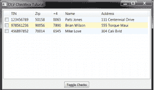
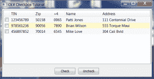

# wxPython:向 ObjectListView 添加复选框

> 原文：<https://www.blog.pythonlibrary.org/2013/02/27/wxpython-adding-checkboxes-to-objectlistview/>

本周，我花了一些时间学习如何在 wxPython 中向 ObjectListView 小部件添加复选框。如果你不知道，ObjectListView 是 wx 的第三方包装器。ListCtrl 小部件，使得使用 ListCtrl 更加容易。你可以从档案中的这篇旧文章中读到它的全部内容。我有一个需求，我需要在小部件的报告视图中的每个项目旁边有一个复选框。在 ObjectListView 网站上做了一些挖掘之后，我找到了一篇[文章](http://objectlistview.sourceforge.net/python/recipes.html?highlight=checkbox#recipe-checkbox)，它解释了如何做这件事。根据文档，我可以使用 **CreateCheckStateColumn** 方法或者注册一个列并使用 **InstallCheckStateColumn** 。在本文中，我们将重点关注 CreateCheckStateColumn 方法。

### 入门指南

首先，如果您还没有安装以下软件，您需要安装:

*   [wxPython](http://www.wxpython.org)
*   来自 [Python 包索引](https://pypi.python.org/pypi/ObjectListView)的 ObjectListView

### 如何创建和切换复选框

[](https://www.blog.pythonlibrary.org/wp-content/uploads/2013/02/olvcheckbox.png)

现在你已经完成了，我们可以开始编码了。我总是发现一个可行的例子是最好的学习方法，所以这是第一个难题:

```py

# OLVcheckboxes.py

import wx
from ObjectListView import ObjectListView, ColumnDefn

class Results(object):
    """"""

    def __init__(self, tin, zip_code, plus4, name, address):
        """Constructor"""
        self.tin = tin
        self.zip_code = zip_code
        self.plus4 = plus4
        self.name = name
        self.address = address

class ProvPanel(wx.Panel):
    """"""

    def __init__(self, parent):
        """Constructor"""
        wx.Panel.__init__(self, parent=parent)

        mainSizer = wx.BoxSizer(wx.VERTICAL)

        self.test_data = [Results("123456789", "50158", "0065", "Patti Jones",
                                  "111 Centennial Drive"),
                          Results("978561236", "90056", "7890", "Brian Wilson",
                                  "555 Torque Maui"),
                          Results("456897852", "70014", "6545", "Mike Love", 
                                  "304 Cali Bvld")
                          ]
        self.resultsOlv = ObjectListView(self, 
            style=wx.LC_REPORT|wx.SUNKEN_BORDER)

        self.setResults()

        toggleBtn = wx.Button(self, label="Toggle Checks")
        toggleBtn.Bind(wx.EVT_BUTTON, self.onToggle)

        mainSizer.Add(self.resultsOlv, 1, wx.EXPAND|wx.ALL, 5)
        mainSizer.Add(toggleBtn, 0, wx.CENTER|wx.ALL, 5)
        self.SetSizer(mainSizer)

    def onToggle(self, event):
        """
        Toggle the check boxes
        """
        objects = self.resultsOlv.GetObjects()
        for obj in objects:
            print self.resultsOlv.IsChecked(obj)
            self.resultsOlv.ToggleCheck(obj)
        self.resultsOlv.RefreshObjects(objects)

    def setResults(self):
        """"""
        self.resultsOlv.SetColumns([
            ColumnDefn("TIN", "left", 100, "tin"),
            ColumnDefn("Zip", "left", 75, "zip_code"),
            ColumnDefn("+4", "left", 50, "plus4"),
            ColumnDefn("Name", "left", 150, "name"),
            ColumnDefn("Address", "left", 200, "address")
            ])
        self.resultsOlv.CreateCheckStateColumn()
        self.resultsOlv.SetObjects(self.test_data)

class ProvFrame(wx.Frame):
    """"""

    def __init__(self):
        """Constructor"""
        title = "OLV Checkbox Tutorial"
        wx.Frame.__init__(self, parent=None, title=title, 
                          size=(1024, 768))
        panel = ProvPanel(self)

if __name__ == "__main__":
    app = wx.App(False)
    frame = ProvFrame()
    frame.Show()
    app.MainLoop()

```

让我们稍微分解一下。如你所见，我们把 wx。框架和 wx。分成单独的类。这使得将来如果需要的话更容易模块化。例如，如果面板代码有太多行，我们可以将它复制到一个新的模块中，然后导入到主代码中。总之，这里我们在 panel 类的 **__init__** 方法中创建了我们关心的各种小部件。要获得复选框，我们需要在 **setResults** 方法中的 **SetObjects** 调用之前添加 **CreateCheckStateColumn** 调用。

我们关心的另一个重要方法是**ontogle**方法，在这里我们学习如何使用 ToggleCheck 方法切换复选框。我们首先通过 **GetObjects** 抓取小部件中的所有项目对象，然后对它们进行循环。在这个例子中，我们通过使用方便的 **IsChecked** 方法打印出它们是否被检查。这对于调试非常有用，或者如果您希望根据项目的状态单独切换项目，这非常有用。最后，您需要调用 **RefreshObjects** 来刷新 ObjectListCtrl，这样您就可以看到复选框的新状态。否则，显示不会更新，并且您无法判断这些项目是否被选中。您也可以通过选择项目并按空格键来切换复选框。

### 使用 SetCheckState 切换复选框

[](https://www.blog.pythonlibrary.org/wp-content/uploads/2013/02/olvcheckbox2.png)

还有另一种方法来改变复选框的状态，那就是使用 **SetCheckState** 方法。下面是一些演示如何实现的代码:

```py

# OLVcheckboxes2.py

import wx
from ObjectListView import ObjectListView, ColumnDefn

class Results(object):
    """"""

    def __init__(self, tin, zip_code, plus4, name, address):
        """Constructor"""
        self.tin = tin
        self.zip_code = zip_code
        self.plus4 = plus4
        self.name = name
        self.address = address

class OLVCheckPanel(wx.Panel):
    """"""

    def __init__(self, parent):
        """Constructor"""
        wx.Panel.__init__(self, parent=parent)

        mainSizer = wx.BoxSizer(wx.VERTICAL)
        btnSizer = wx.BoxSizer(wx.HORIZONTAL)

        self.test_data = [Results("123456789", "50158", "0065", "Patti Jones",
                                  "111 Centennial Drive"),
                          Results("978561236", "90056", "7890", "Brian Wilson",
                                  "555 Torque Maui"),
                          Results("456897852", "70014", "6545", "Mike Love", 
                                  "304 Cali Bvld")
                          ]
        self.resultsOlv = ObjectListView(self, 
            style=wx.LC_REPORT|wx.SUNKEN_BORDER)

        self.setResults()

        checkBtn = wx.Button(self, label="Check")
        checkBtn.Bind(wx.EVT_BUTTON, self.onCheck)
        btnSizer.Add(checkBtn, 0, wx.ALL, 5)

        uncheckBtn = wx.Button(self, label="Uncheck")
        uncheckBtn.Bind(wx.EVT_BUTTON, self.onUncheck)
        btnSizer.Add(uncheckBtn, 0, wx.ALL, 5)

        mainSizer.Add(self.resultsOlv, 1, wx.EXPAND|wx.ALL, 5)
        mainSizer.Add(btnSizer, 0, wx.CENTER|wx.ALL, 5)
        self.SetSizer(mainSizer)

    def onCheck(self, event):
        """"""
        objects = self.resultsOlv.GetObjects()

        for obj in objects:
            self.resultsOlv.SetCheckState(obj, True)
        self.resultsOlv.RefreshObjects(objects)

    def onUncheck(self, event):
        """"""
        objects = self.resultsOlv.GetObjects()

        for obj in objects:
            self.resultsOlv.SetCheckState(obj, False)
        self.resultsOlv.RefreshObjects(objects)        

    def setResults(self):
        """"""
        self.resultsOlv.SetColumns([
            ColumnDefn("TIN", "left", 100, "tin"),
            ColumnDefn("Zip", "left", 75, "zip_code"),
            ColumnDefn("+4", "left", 50, "plus4"),
            ColumnDefn("Name", "left", 150, "name"),
            ColumnDefn("Address", "left", 200, "address")
            ])
        self.resultsOlv.CreateCheckStateColumn()
        self.resultsOlv.SetObjects(self.test_data)

class OLVCheckFrame(wx.Frame):
    """"""

    def __init__(self):
        """Constructor"""
        title = "OLV Checkbox Tutorial"
        wx.Frame.__init__(self, parent=None, title=title, size=(1024, 768))
        panel = OLVCheckPanel(self)

if __name__ == "__main__":
    app = wx.App(False)
    frame = OLVCheckFrame()
    frame.Show()
    app.MainLoop()

```

如你所见，在这个例子中我们有两个按钮。选中和取消选中按钮。代码基本上是一样的，但是这一次当我们遍历对象时，我们调用 **SetCheckState** 并向它传递 item 对象和一个布尔值 True 或 False。然后我们像以前一样刷新屏幕。

### 添加全选/取消全选功能

**更新(2013 年 12 月 12 日):**本周当我决定重用上面显示的实现时，我实际上注意到了复选框切换中的一个恼人的 bug。我想切换窗口小部件，使它们要么被选中，要么不被选中。不管它们已经处于什么状态，上面的代码都会切换它们。这意味着，如果您选中了 5 个项目中的 2 个，并点击了切换按钮，则选中的项目将变为未选中，未选中的项目将变为选中。为了减轻这种情况，我最终需要将事件处理程序稍微修改如下:

```py

def onToggle(self, event):
    """
    Toggle the check boxes
    """
    objects = self.resultsOlv.GetObjects()

    for obj in objects:
        if self.toggleBtn.GetValue():
            if not self.resultsOlv.IsChecked(obj):
                self.resultsOlv.ToggleCheck(obj)
        else:
            if self.resultsOlv.IsChecked(obj):
                self.resultsOlv.ToggleCheck(obj)

    self.resultsOlv.RefreshObjects(objects)

```

这段代码通过 GetValue 检查切换按钮是否被选中。如果是，那么我们做一个额外的检查，看看行项目是否没有被检查。如果不是，那么我们检查它。条件句的另一部分正好相反。还要注意，您需要将 **toggleBtn** 变量更改为一个类属性( **self.toggleBtn** )来使代码工作。

**更新(2015 年 7 月 28 日):**我的一位精明的读者(Amit Vinchhi)最近联系了我，他说我可以将上面提到的切换方法简化为下面这段代码:

```py

def onToggle(self, event):
    """
    Toggle the check boxes
    """
    objects = self.resultsOlv.GetObjects()
    check = self.toggleBtn.GetValue()

    for obj in objects:
        self.resultsOlv.SetCheckState(obj, check)
    self.resultsOlv.RefreshObjects(objects)

```

当然，这是假设你改变了原来的 **wx。按钮**到一个 **wx。切换按钮**并将按钮的绑定改为使用 **wx。EVT _ 切换按钮**。基本上你会得到这样的结果:

```py

self.toggleBtn = wx.ToggleButton(self, label="Toggle Checks")
self.toggleBtn.Bind(wx.EVT_TOGGLEBUTTON, self.onToggle)

```

那么它工作得相当好。谢谢艾米特。

### 包扎

现在，如果您正在使用 ObjectListView，您知道了如何向 wxPython 项目添加复选框。如果你需要在普通的 wx 中使用复选框。ListCtrl，您可以使用 wx 附带的 mixin。以下是您访问它的方式:

```py

from wx.lib.mixins.listctrl import CheckListCtrlMixin

```

wxPython 演示包中有一个例子，可以从 wxPython 网站下载。我想你也可以在 DVCListCtrl 中使用复选框，或者用 UltimateListCtrl 进行定制。不过我现在更喜欢使用 ObjectListView 控件。我使用 Python 2.6.6 和 Python 2.7.3 以及 wxPython 2.8.12 和 wxPython 2.9.4 classic 测试了这段代码。我也用过 ObjectListview 1.2。

### 进一步阅读

*   对象列表视图[食谱](http://objectlistview.sourceforge.net/python/recipes.html?highlight=checkbox#recipe-checkbox)
*   wxPython: [使用 ObjectListView 代替 ListCtrl](https://www.blog.pythonlibrary.org/2009/12/23/wxpython-using-objectlistview-instead-of-a-listctrl/)

### 下载

*   [OLVcheckboxes.tar](https://www.blog.pythonlibrary.org/wp-content/uploads/2013/02/OLVcheckboxes.tar)