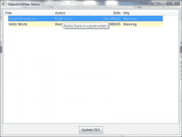

# wxPython:向 ObjectListView 添加工具提示

> 原文：<https://www.blog.pythonlibrary.org/2013/12/12/wxpython-adding-tooltips-objectlistview/>

[](https://www.blog.pythonlibrary.org/wp-content/uploads/2013/12/wxOLVTooltips.png)

最近，我试图弄清楚如何在 Windows 上的 wxPython 中为 ObjectListView 小部件中的每个项目添加工具提示。wxPython wiki 有一个使用 PyWin32 的例子，但是我不想走这条路。所以我在 wxPython 谷歌群上问了一下，得到了一个有趣的[答案](https://groups.google.com/forum/#!topic/wxpython-users/nf3bcDGdyTM)。他们实际上使用了我的一篇旧的[文章](https://www.blog.pythonlibrary.org/2009/12/23/wxpython-using-objectlistview-instead-of-a-listctrl/)来为我构建他们的解决方案。我稍微整理了一下，觉得值得与我的读者分享:

```py

import wx
from ObjectListView import ObjectListView, ColumnDefn

########################################################################
class Book(object):
    """
    Model of the Book object

    Contains the following attributes:
    'ISBN', 'Author', 'Manufacturer', 'Title'
    """
    #----------------------------------------------------------------------
    def __init__(self, title, author, isbn, mfg):
        self.isbn = isbn
        self.author = author
        self.mfg = mfg
        self.title = title

########################################################################
class MainPanel(wx.Panel):
    #----------------------------------------------------------------------
    def __init__(self, parent):
        wx.Panel.__init__(self, parent=parent, id=wx.ID_ANY)
        self.products = [Book("wxPython in Action", "Robin Dunn",
                              "1932394621", "Manning"),
                         Book("Hello World", "Warren and Carter Sande",
                              "1933988495", "Manning")
                         ]

        self.dataOlv = ObjectListView(self, wx.ID_ANY, style=wx.LC_REPORT|wx.SUNKEN_BORDER)
        self.setBooks()

        # Allow the cell values to be edited when double-clicked
        self.dataOlv.cellEditMode = ObjectListView.CELLEDIT_SINGLECLICK

        # create an update button
        updateBtn = wx.Button(self, wx.ID_ANY, "Update OLV")
        updateBtn.Bind(wx.EVT_BUTTON, self.updateControl)

        # Create some sizers
        mainSizer = wx.BoxSizer(wx.VERTICAL)        

        mainSizer.Add(self.dataOlv, 1, wx.ALL|wx.EXPAND, 5)
        mainSizer.Add(updateBtn, 0, wx.ALL|wx.CENTER, 5)
        self.SetSizer(mainSizer)

        self.dataOlv.Bind(wx.EVT_LIST_ITEM_SELECTED, self.onSetToolTip)

    #----------------------------------------------------------------------
    def updateControl(self, event):
        """
        Update the control
        """
        print "updating..."
        #product_dict = [{"title":"Core Python Programming", "author":"Wesley Chun",
                         #"isbn":"0132269937", "mfg":"Prentice Hall"},
                        #{"title":"Python Programming for the Absolute Beginner",
                         #"author":"Michael Dawson", "isbn":"1598631128",
                         #"mfg":"Course Technology"},
                        #{"title":"Learning Python", "author":"Mark Lutz",
                         #"isbn":"0596513984", "mfg":"O'Reilly"}
                        #]

        product_list = [Book("Core Python Programming", "Wesley Chun",
                             "0132269937", "Prentice Hall"),
                        Book("Python Programming for the Absolute Beginner",
                             "Michael Dawson", "1598631128", "Course Technology"),
                        Book("Learning Python", "Mark Lutz", "0596513984",
                             "O'Reilly")
                        ]

        data = self.products + product_list
        self.dataOlv.SetObjects(data)

    #----------------------------------------------------------------------
    def setBooks(self, data=None):
        """
        Sets the book data for the OLV object
        """
        self.dataOlv.SetColumns([
            ColumnDefn("Title", "left", 220, "title"),
            ColumnDefn("Author", "left", 200, "author"),
            ColumnDefn("ISBN", "right", 100, "isbn"),
            ColumnDefn("Mfg", "left", 180, "mfg")
        ])

        self.dataOlv.SetObjects(self.products)

    #----------------------------------------------------------------------
    def onSetToolTip(self, event):
        """
        Set the tool tip on the selected row
        """
        item = self.dataOlv.GetSelectedObject()
        tooltip = "%s is a good writer!" % item.author
        event.GetEventObject().SetToolTipString(tooltip)
        event.Skip()

########################################################################
class MainFrame(wx.Frame):
    #----------------------------------------------------------------------
    def __init__(self):
        wx.Frame.__init__(self, parent=None, id=wx.ID_ANY, 
                          title="ObjectListView Demo", size=(800,600))
        panel = MainPanel(self)

########################################################################
class GenApp(wx.App):

    #----------------------------------------------------------------------
    def __init__(self, redirect=False, filename=None):
        wx.App.__init__(self, redirect, filename)

    #----------------------------------------------------------------------
    def OnInit(self):
        # create frame here
        frame = MainFrame()
        frame.Show()
        return True

#----------------------------------------------------------------------
def main():
    """
    Run the demo
    """
    app = GenApp()
    app.MainLoop()

if __name__ == "__main__":
    main()

```

我需要做的就是添加一个绑定到 **wx。EVT _ 列表 _ 项目 _ 选定**。然后在我的事件处理程序中，我需要获取事件对象并设置它的工具提示字符串。我真正想做的是找到一种方法来复制这个[网格配方](http://wiki.wxpython.org/wxGrid%20ToolTips)，这样我就可以将鼠标放在项目上并改变工具提示，但是看起来 ObjectListView / ListCtrl 没有我需要的方法来将鼠标坐标转换成列/行。不管怎样，给出的解决方案确实像宣传的那样有效。多谢了，二信！

**Update:** 我的一位精明的读者注意到了我的代码中的一个错误，当我点击 Update 按钮时，它向 ObjectListView 小部件添加了一个字典。虽然您可以添加字典，但这破坏了 **onSetToolTip** 方法，因为添加的一些条目不再是 Book 实例。因此，我已经更新了代码，添加了额外的条目作为 Book 实例，并注释掉了 dictionary 示例。

**更新(2013/12/30)**

在玩了一个我找到的 [StackOverflow 答案](http://stackoverflow.com/a/6444658/393194)之后，我发现我可以动态更新工具提示，尽管它仍然不是我想要的。但是首先，下面是更新后的代码示例:

```py

import wx
from ObjectListView import ObjectListView, ColumnDefn

########################################################################
class Book(object):
    """
    Model of the Book object

    Contains the following attributes:
    'ISBN', 'Author', 'Manufacturer', 'Title'
    """
    #----------------------------------------------------------------------
    def __init__(self, title, author, isbn, mfg):
        self.isbn = isbn
        self.author = author
        self.mfg = mfg
        self.title = title

########################################################################
class MainPanel(wx.Panel):
    #----------------------------------------------------------------------
    def __init__(self, parent):
        wx.Panel.__init__(self, parent=parent, id=wx.ID_ANY)
        self.products = [Book("wxPython in Action", "Robin Dunn",
                              "1932394621", "Manning"),
                         Book("Hello World", "Warren and Carter Sande",
                              "1933988495", "Manning")
                         ]

        self.dataOlv = ObjectListView(self, wx.ID_ANY, 
                                      style=wx.LC_REPORT|wx.SUNKEN_BORDER)
        self.dataOlv.Bind(wx.EVT_MOTION, self.updateTooltip)
        self.setBooks()

        # Allow the cell values to be edited when double-clicked
        self.dataOlv.cellEditMode = ObjectListView.CELLEDIT_SINGLECLICK

        # create an update button
        updateBtn = wx.Button(self, wx.ID_ANY, "Update OLV")
        updateBtn.Bind(wx.EVT_BUTTON, self.updateControl)

        # Create some sizers
        mainSizer = wx.BoxSizer(wx.VERTICAL)        

        mainSizer.Add(self.dataOlv, 1, wx.ALL|wx.EXPAND, 5)
        mainSizer.Add(updateBtn, 0, wx.ALL|wx.CENTER, 5)
        self.SetSizer(mainSizer)

    #----------------------------------------------------------------------
    def updateControl(self, event):
        """
        Update the control
        """
        print "updating..."
        #product_dict = [{"title":"Core Python Programming", "author":"Wesley Chun",
                         #"isbn":"0132269937", "mfg":"Prentice Hall"},
                        #{"title":"Python Programming for the Absolute Beginner",
                         #"author":"Michael Dawson", "isbn":"1598631128",
                         #"mfg":"Course Technology"},
                        #{"title":"Learning Python", "author":"Mark Lutz",
                         #"isbn":"0596513984", "mfg":"O'Reilly"}
                        #]

        product_list = [Book("Core Python Programming", "Wesley Chun",
                             "0132269937", "Prentice Hall"),
                        Book("Python Programming for the Absolute Beginner",
                             "Michael Dawson", "1598631128", "Course Technology"),
                        Book("Learning Python", "Mark Lutz", "0596513984",
                             "O'Reilly")
                        ]

        data = self.products + product_list
        self.dataOlv.SetObjects(data)

    #----------------------------------------------------------------------
    def setBooks(self, data=None):
        """
        Sets the book data for the OLV object
        """
        self.dataOlv.SetColumns([
            ColumnDefn("Title", "left", 220, "title"),
            ColumnDefn("Author", "left", 200, "author"),
            ColumnDefn("ISBN", "right", 100, "isbn"),
            ColumnDefn("Mfg", "left", 180, "mfg")
        ])

        self.dataOlv.SetObjects(self.products)

    #----------------------------------------------------------------------
    def updateTooltip(self, event):
        """
        Update the tooltip!
        """
        pos = wx.GetMousePosition()
        mouse_pos = self.dataOlv.ScreenToClient(pos)
        item_index, flag = self.dataOlv.HitTest(mouse_pos)
        print flag
        if flag == wx.LIST_HITTEST_ONITEMLABEL:
            msg = "%s is a good book!" % self.dataOlv.GetItemText(item_index)
            self.dataOlv.SetToolTipString(msg)
        else:
            self.dataOlv.SetToolTipString("")

        event.Skip()

########################################################################
class MainFrame(wx.Frame):
    #----------------------------------------------------------------------
    def __init__(self):
        wx.Frame.__init__(self, parent=None, id=wx.ID_ANY, 
                          title="ObjectListView Demo", size=(800,600))
        panel = MainPanel(self)

#----------------------------------------------------------------------
def main():
    """
    Run the demo
    """
    app = wx.App(False)
    frame = MainFrame()
    frame.Show()
    app.MainLoop()

#---------------------------------------------------------------------- 
if __name__ == "__main__":
    main()

```

这里的主要变化是移除 setToolTip 方法并添加一个 updateTooltip 方法。在上述方法中，我们获取鼠标位置并使用它来更新工具提示。我对这种方法的问题是，工具提示只有在您将鼠标悬停在第一列的单元格上时才会更新。除此之外，它工作得很好。如果你碰巧发现了其他的方法，请在评论中告诉我。

**更新(2014/01/23)** :

我的一个读者今天联系我，告诉我对这段代码的另一个修正。他设法找到了添加工具提示的方法，这样无论鼠标悬停在行的哪一部分，工具提示都会出现。变化很简单。对 **updateTooltip** 方法的更改。以下是原始版本:

```py

def updateTooltip(self, event):
    """
    Update the tooltip!
    """
    pos = wx.GetMousePosition()
    mouse_pos = self.dataOlv.ScreenToClient(pos)
    item_index, flag = self.dataOlv.HitTest(mouse_pos)
    print flag
    if flag == wx.LIST_HITTEST_ONITEMLABEL:
        msg = "%s is a good book!" % self.dataOlv.GetItemText(item_index)
        self.dataOlv.SetToolTipString(msg)
    else:
        self.dataOlv.SetToolTipString("")

    event.Skip()

```

以下是修复版本:

```py

def updateTooltip(self, event):
    """
    Update the tooltip!
    """
    pos = wx.GetMousePosition()
    mouse_pos = self.dataOlv.ScreenToClient(pos)
    item_index, flag = self.dataOlv.HitTest(mouse_pos)
    print flag
    if item_index != -1:
        msg = "%s is a good book!" % self.dataOlv.GetItemText(item_index)
        self.dataOlv.SetToolTipString(msg)
    else:
        self.dataOlv.SetToolTipString("")

    event.Skip()

```

对 if 语句的修改是，我们现在看一下 **item_index** 。实际上我不知道这为什么有效，但对我来说确实有效。特别感谢迈克·斯托弗发现了这一点。