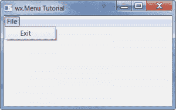
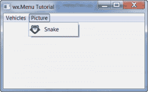
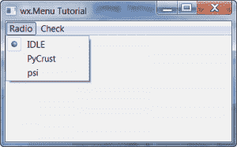

# wxPython:关于菜单的一切

> 原文：<https://www.blog.pythonlibrary.org/2012/02/14/wxpython-all-about-menus/>

菜单无处不在。几乎所有的桌面程序中都有。您可以使用它们来编辑首选项或配置您的程序。在 wxPython 中，有几个菜单选项可供选择。最熟悉的可能是 wx.Menu，但也有弹出菜单和一个纯 Python 实现，称为 FlatMenu。我们只会报道 wx。菜单和弹出菜单，因为它们是相互关联的。FlatMenu 还包括一个工具栏 API，所以您必须等待另一篇文章来单独介绍这个小部件。让我们开始这个菜单派对吧！

### 一个简单的菜单例子

[](https://www.blog.pythonlibrary.org/wp-content/uploads/2012/02/menu_one.png)

我们将从非常简单的东西开始:一个只有退出菜单项的菜单。代码如下:

```py

import wx

########################################################################
class MyForm(wx.Frame):
    """"""

    #----------------------------------------------------------------------
    def __init__(self):
        """Constructor"""
        wx.Frame.__init__(self, None, title="wx.Menu Tutorial")

        self.panel = wx.Panel(self, wx.ID_ANY)

        menuBar = wx.MenuBar()
        fileMenu = wx.Menu()
        exitMenuItem = fileMenu.Append(wx.NewId(), "Exit",
                                       "Exit the application")
        menuBar.Append(fileMenu, "&File")
        self.Bind(wx.EVT_MENU, self.onExit, exitMenuItem)
        self.SetMenuBar(menuBar)

    #----------------------------------------------------------------------
    def onExit(self, event):
        """"""
        self.Close()

#----------------------------------------------------------------------
# Run the program
if __name__ == "__main__":
    app = wx.App(False)
    frame = MyForm().Show()
    app.MainLoop()

```

让我们稍微分解一下。为了创建 menubar，我们实例化 wx.MenuBar 的一个实例。我们称为**文件菜单**的菜单。最后，为了添加“退出”项，我们向它追加了一些数据。本质上，我们附加了一个 wx。MenuItem，但是这是一种捷径，因为我们实际上并没有创建 wx。首先是 MenuItem 实例。不过，我们将在下一个示例中展示如何做到这一点。注意，当我们追加项目时，我们必须传递一个 id、一个标签字符串和一个状态字符串。假设你有一个状态栏，当你将鼠标悬停在菜单项上时，最后一个会出现在状态栏中。请注意，要将事件处理程序附加到菜单项，您需要使用 EVT _ 菜单事件并将其绑定到框架。接下来，我们将菜单本身附加到 MenuBar 对象，并传递给它一个字符串，在本例中是“File”。最后，我们调用框架的 **SetMenuBar** 方法将菜单栏附加到框架上。

### 向菜单添加图片

这就是创建菜单的全部内容！现在我们来看一个更复杂的例子！注意:按照下面的例子，你需要使用你自己的图像文件。

[](https://www.blog.pythonlibrary.org/wp-content/uploads/2012/02/menu_two.png)

```py

import wx

########################################################################
class MyForm(wx.Frame):
    """"""

    #----------------------------------------------------------------------
    def __init__(self):
        """Constructor"""
        wx.Frame.__init__(self, None, title="wx.Menu Tutorial")

        self.panel = wx.Panel(self, wx.ID_ANY)

        # create the menubar
        menuBar = wx.MenuBar()

        # create the first menu (starting on left)
        carMenu = wx.Menu()
        carMenu.Append(101, "&Ford", "An American Automaker")
        carMenu.Append(102, "&Nissan", "")
        carMenu.Append(103, "&Toyota", "Buy Japanese!")
        carMenu.Append(104, "&Close", "Close the application")

        # add a picture to a menu
        picMenu = wx.Menu()
        item = wx.MenuItem(picMenu, wx.ID_ANY, "Snake", "This menu has a picture!")
        img = wx.Image('snake32.bmp', wx.BITMAP_TYPE_ANY)
        item.SetBitmap(wx.BitmapFromImage(img))
        picMenu.AppendItem(item)

        # add menus to menubar
        menuBar.Append(carMenu, "&Vehicles")
        menuBar.Append(picMenu, "&Picture")
        self.SetMenuBar(menuBar)

    #----------------------------------------------------------------------
    def onExit(self, event):
        """"""
        self.Close()

#----------------------------------------------------------------------
# Run the program
if __name__ == "__main__":
    app = wx.App(False)
    frame = MyForm().Show()
    app.MainLoop()

```

这个例子和第一个类似。主要的区别是我们添加了多个项目到我们的**文件**菜单，我们有两个菜单。注意，这一次，我们实际上明确地指定了我们的 ID 号。通常不建议这样做，因为您可能会意外地隐藏 wx 的一个必需 id。但是，您确实会在网上不时看到这种例子，所以您应该知道这种做法。下一个大的不同直到我们到达**图片菜单**才出现。这里我们实际上创建了一个 wx。MenuItem，并通过 wx 向其添加一张图片。Image 和 MenuItem 的 **SetBitmap** 方法。其余的都差不多。

现在我们将花一些时间来看看如何添加单选和复选按钮到我们的菜单中。

### 添加单选或复选按钮

[](https://www.blog.pythonlibrary.org/wp-content/uploads/2012/02/menu_check.png)

向菜单中添加单选按钮或复选按钮实际上非常简单。让我们花点时间来看看它是如何做到的！

```py

# radiocheck.py
import wx

########################################################################
class MyForm(wx.Frame):
    """"""

    #----------------------------------------------------------------------
    def __init__(self):
        """Constructor"""
        wx.Frame.__init__(self, None, title="wx.Menu Tutorial")

        self.panel = wx.Panel(self, wx.ID_ANY)

        # Create menu bar
        menuBar = wx.MenuBar()

        # Create radio menu
        radioMenu = wx.Menu()
        idleItem = radioMenu.Append(wx.NewId(), "IDLE",
                                   "a Python shell using tcl/tk as GUI",
                                   wx.ITEM_RADIO)
        pyCrustItem = radioMenu.Append(wx.NewId(),"PyCrust", 
                                      "a Python shell using wxPython as GUI",
                                      wx.ITEM_RADIO)
        psiItem = radioMenu.Append(wx.NewId(), "psi",
                                  "a simple Python shell using wxPython as GUI",
                                  wx.ITEM_RADIO)
        menuBar.Append(radioMenu, "&Radio")

        # create check menu
        checkMenu = wx.Menu()
        wgItem = checkMenu.Append(wx.NewId(), "Wells Fargo", "", wx.ITEM_CHECK)
        citiItem = checkMenu.Append(wx.NewId(), "Citibank", "", wx.ITEM_CHECK)
        geItem = checkMenu.Append(wx.NewId(), "GE Money Bank", "", wx.ITEM_CHECK)
        menuBar.Append(checkMenu, "&Check")

        # Attach menu bar to frame
        self.SetMenuBar(menuBar)

#----------------------------------------------------------------------
# Run the program
if __name__ == "__main__":
    app = wx.App(False)
    frame = MyForm().Show()
    app.MainLoop()

```

是的，如你所见，你所要做的就是添加一个 wx。ITEM_RADIO 或 wx。ITEM_CHECK 标志为第四个参数**种类**。为什么像其他 widgets 一样叫“亲切”而不是“风格”？在 wxPython IRC 频道上讨论这个问题时，Robin Dunn(wxPython 的创建者)指出，这可能是因为这些是不同种类的菜单项。

### 子菜单

wxPython 库也支持子菜单。这里有一个非常简单的例子来告诉你怎么做。

```py

# submenu.py
import wx

########################################################################
class MyForm(wx.Frame):
    """"""

    #----------------------------------------------------------------------
    def __init__(self):
        """Constructor"""
        wx.Frame.__init__(self, None, title="wx.Menu Tutorial")

        self.panel = wx.Panel(self, wx.ID_ANY)

        menuBar = wx.MenuBar()
        fileMenu = wx.Menu()
        openMenuItem = fileMenu.Append(wx.NewId(), "Open")

        # create a submenu
        subMenu = wx.Menu()
        historyMenuItem = subMenu.Append(wx.NewId(), "Show History")
        fileMenu.AppendMenu(wx.NewId(), "History", subMenu)

        exitMenuItem = fileMenu.Append(wx.NewId(), "Exit",
                                       "Exit the application")
        menuBar.Append(fileMenu, "&File")
        self.Bind(wx.EVT_MENU, self.onExit, exitMenuItem)
        self.SetMenuBar(menuBar)

    #----------------------------------------------------------------------
    def onExit(self, event):
        """"""
        self.Close()

#----------------------------------------------------------------------
# Run the program
if __name__ == "__main__":
    app = wx.App(False)
    frame = MyForm().Show()
    app.MainLoop()

```

这里的关键是，我们不使用 filemenu 的 Append 方法，而是使用它的 AppendMenu 方法。顾名思义，它允许程序员实际添加一个菜单，而不是一个菜单项。对，就是这样！

### 弹出菜单(又名:上下文菜单)

当你在浏览器或文件的链接上点击鼠标右键时，你会看到弹出菜单。它们也被称为上下文菜单。这里有一个相当简单的例子供您研究:

```py

# submenu.py
import wx

########################################################################
class MyForm(wx.Frame):
    """"""

    #----------------------------------------------------------------------
    def __init__(self):
        """Constructor"""
        wx.Frame.__init__(self, None, title="Popup Menu Tutorial")

        panel = wx.Panel(self, wx.ID_ANY)

        lbl = wx.StaticText(panel, label="Right click anywhere!")
        self.Bind(wx.EVT_CONTEXT_MENU, self.onContext)

    #----------------------------------------------------------------------
    def onContext(self, event):
        """
        Create and show a Context Menu
        """

        # only do this part the first time so the events are only bound once 
        if not hasattr(self, "popupID1"):
            self.popupID1 = wx.NewId()
            self.itemTwoId = wx.NewId()
            self.itemThreeId = wx.NewId()
            self.Bind(wx.EVT_MENU, self.onPopup, id=self.popupID1)
            self.Bind(wx.EVT_MENU, self.onPopup, id=self.itemTwoId)
            self.Bind(wx.EVT_MENU, self.onExit, id=self.itemThreeId)

        # build the menu
        menu = wx.Menu()
        itemOne = menu.Append(self.popupID1, "ItemOne")
        itemTwo = menu.Append(self.itemTwoId, "ItemTwo")
        itemThree = menu.Append(self.itemThreeId, "Exit")

        # show the popup menu
        self.PopupMenu(menu)
        menu.Destroy()

    #----------------------------------------------------------------------
    def onExit(self, event):
        """
        Exit program
        """
        self.Close()

    #----------------------------------------------------------------------
    def onPopup(self, event):
        """
        Print the label of the menu item selected
        """
        itemId = event.GetId()
        menu = event.GetEventObject()
        menuItem = menu.FindItemById(itemId)
        print menuItem.GetLabel()

#----------------------------------------------------------------------
# Run the program
if __name__ == "__main__":
    app = wx.App(False)
    frame = MyForm().Show()
    app.MainLoop()

```

首先，我们绑定 wx。EVT _ 上下文 _ 菜单到框架。这允许我们右击任意位置并触发上下文菜单事件，这将创建并显示我们的弹出菜单。 **onContext** 方法中的代码大致基于弹出菜单的 wxPython 演示。如您所见，我们使用条件语句来检查我们是否已经绑定了菜单事件。如果有，就不要再绑定了。接下来，我们用和以前一样的方式创建菜单。最后，我们调用框架的**弹出菜单**方法，并将我们的新菜单传递给它。这将向用户显示菜单。当用户点击一个菜单项时，它将触发一个事件，菜单将被销毁。

前两个菜单项都绑定到我们的 **onPopup** 方法。这允许我们了解如何访问菜单和 MenuItem 属性。可以用事件获取菜单的 id，用事件的 GetEventObject 方法获取菜单本身。然后，您可以使用菜单的 FindItemById 方法来获取菜单项本身的句柄。最后，我们打印出菜单项的标签。

### 包扎

现在你应该知道大多数的菜单方法以及如何创建它们，绑定事件和制作不同种类的菜单项。你甚至知道如何创建弹出菜单！现在你可以让你的应用程序也有漂亮的菜单。

### 进一步阅读

*   [wxPython:使用菜单、工具栏和加速器](https://www.blog.pythonlibrary.org/2008/07/02/wxpython-working-with-menus-toolbars-and-accelerators/ "wxPython: Working with Menus, Toolbars and Accelerators")
*   使用菜单- [wxPython Wiki](http://wiki.wxpython.org/WorkingWithMenus)
*   菜单和工具栏- [Zetcode](http://zetcode.com/wxpython/menustoolbars/)

### 来源

*   [menus.zip](https://www.blog.pythonlibrary.org/wp-content/uploads/2012/02/menus.zip)
*   [menus.tar](https://www.blog.pythonlibrary.org/wp-content/uploads/2012/02/menus.tar)