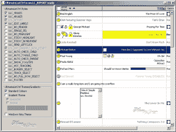
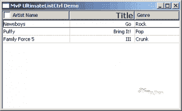

# wxPython:UltimateListCtrl 简介

> 原文：<https://www.blog.pythonlibrary.org/2011/11/02/wxpython-an-intro-to-the-ultimatelistctrl/>

[](https://www.blog.pythonlibrary.org/wp-content/uploads/2011/11/ultimateListCtrlDemo.png)

wxPython 中包含的一个新的 agw 小部件叫做 UltimateListCtrl。这是一个纯 Python 小部件，几乎可以将任何其他小部件嵌入到任何单元格中，这使得它非常灵活。它还允许熟练的程序员添加自定义渲染器，使界面与众不同。在本文中，我们将快速浏览一下这个迷人的小部件。

## 入门指南

[](https://www.blog.pythonlibrary.org/wp-content/uploads/2011/11/mvpULCDemo.png)

学习一个新的小部件最简单的方法是看一个例子。如果您想查看这个令人敬畏的小部件的几个复杂演示，可以查看 2.9 系列的 wxPython 演示，但是出于我们的目的，我们将创建一个基于其中一个演示的精简版本，即报告视图版本。这是让你享受观赏乐趣的代码:

```py

import wx
from wx.lib.agw import ultimatelistctrl as ULC

########################################################################
class TestPanel(wx.Panel):
    """"""

    #----------------------------------------------------------------------
    def __init__(self, parent):
        """Constructor"""
        wx.Panel.__init__(self, parent)

        try:
            font = wx.SystemSettings_GetFont(wx.SYS_DEFAULT_GUI_FONT)
            boldfont = wx.SystemSettings_GetFont(wx.SYS_DEFAULT_GUI_FONT)
        except AttributeError:
            # wxPython 4 / Phoenix updated SystemSettings
            font = wx.SystemSettings.GetFont(wx.SYS_DEFAULT_GUI_FONT)
            boldfont = wx.SystemSettings.GetFont(wx.SYS_DEFAULT_GUI_FONT)

        boldfont.SetWeight(wx.BOLD)
        boldfont.SetPointSize(12)

        self.ultimateList = ULC.UltimateListCtrl(self, agwStyle = wx.LC_REPORT 
                                         | wx.LC_VRULES
                                         | wx.LC_HRULES)

        info = ULC.UltimateListItem()
        info._mask = wx.LIST_MASK_TEXT | wx.LIST_MASK_IMAGE | wx.LIST_MASK_FORMAT | ULC.ULC_MASK_CHECK
        info._image = []
        info._format = 0
        info._kind = 1
        info._text = "Artist Name"
        self.ultimateList.InsertColumnInfo(0, info)

        info = ULC.UltimateListItem()
        info._format = wx.LIST_FORMAT_RIGHT
        info._mask = wx.LIST_MASK_TEXT | wx.LIST_MASK_IMAGE | wx.LIST_MASK_FORMAT | ULC.ULC_MASK_FONT
        info._image = []
        info._text = "Title"
        info._font = boldfont
        self.ultimateList.InsertColumnInfo(1, info)

        info = ULC.UltimateListItem()
        info._mask = wx.LIST_MASK_TEXT | wx.LIST_MASK_IMAGE | wx.LIST_MASK_FORMAT
        info._format = 0
        info._text = "Genre"
        info._font = font
        info._image = []
        self.ultimateList.InsertColumnInfo(2, info)

        self.ultimateList.InsertStringItem(0, "Newsboys")
        self.ultimateList.SetStringItem(0, 1, "Go")
        self.ultimateList.SetStringItem(0, 2, "Rock")

        self.ultimateList.InsertStringItem(1, "Puffy")
        self.ultimateList.SetStringItem(1, 1, "Bring It!")
        self.ultimateList.SetStringItem(1, 2, "Pop")

        self.ultimateList.InsertStringItem(2, "Family Force 5")
        self.ultimateList.SetStringItem(2, 1, "III")
        self.ultimateList.SetStringItem(2, 2, "Crunk")

        self.ultimateList.SetColumnWidth(0, 150)
        self.ultimateList.SetColumnWidth(1, 200)
        self.ultimateList.SetColumnWidth(2, 100)

        sizer = wx.BoxSizer(wx.VERTICAL)
        sizer.Add(self.ultimateList, 1, wx.EXPAND)
        self.SetSizer(sizer)

########################################################################
class TestFrame(wx.Frame):
    """"""

    #----------------------------------------------------------------------
    def __init__(self):
        """Constructor"""
        wx.Frame.__init__(self, None, title="MvP UltimateListCtrl Demo")
        panel = TestPanel(self)
        self.Show()

#----------------------------------------------------------------------
if __name__ == "__main__":
    app = wx.App(False)
    frame = TestFrame()
    app.MainLoop()

```

让我们花点时间来分解一下。首先，要导入这个小部件，我们需要做如下事情:**从 wx.lib.agw 导入 ultimatelistctrl 作为 ULC** 。然后为了实例化它，我们称**为 ULC。UltimateListCtrl()** 并给它传递几个键值。在本例中，我们传入一个父类和三个样式:wx。LC_REPORT，wx。LC_VRULES 和 wx。LC_HRULES。第一个 agwStyle 是 LC_REPORT，它将小部件置于“报告”模式，这可能是 ListCtrl 最常见的模式，也是最有用的模式之一。另外两种样式分别放入垂直线和水平线。

接下来，我们想要创建我们的列。我们用 ULC。虽然根据[文档](http://xoomer.virgilio.it/infinity77/AGW_Docs/ultimatelistctrl.UltimateListItem.html#ultimatelistctrl-ultimatelistitem)，这也可以用来创建“项目”。如您所见，UltimateListItem 有许多我们可以设置的属性。你可以添加一个图像，一个复选框(通过面具和风格:ULC。ULC _ 掩码 _ 检查)，一种(0 -正常，1 -复选框，2 -单选按钮)，一种格式(控制标签定位)，字体和文本和其他几个。一旦你设置好了这些东西，你可以调用 UltimateListItem 对象的 **InsertColumnInfo()** 方法来应用你的设置。

最后，为了向 UltimateListCtrl 添加数据，我们做了与普通 ListCtrl 相同的事情。也就是说，我们首先调用 **InsertStringItem(index，label)** 其中 index 是行号。然后要向其他列添加字符串，您需要调用 **SetStringItem(index，col，label)** 。您可以调用许多其他方法来添加其他类型的数据，但是您需要阅读演示的源代码或文档来了解这一点。现在我们完成了我们的第一个演示！

## 包扎

在官方的 wxPython 2.9 系列演示中可以找到更多的信息。事实上，有几个演示展示了这个小部件可以做的各种风格和 UI 变化。您可以在本文开头的截图中看到其中一个演示的例子。每当您需要将其他小部件插入 ListCtrl 的单元格时，或者每当您需要对小部件的表示进行大量控制时，我都会推荐这个小部件。黑客快乐！

## 进一步阅读

*   ultimetalistctrl [文档](http://xoomer.virgilio.it/infinity77/AGW_Docs/ultimatelistctrl_module.html#ultimatelistctrl)