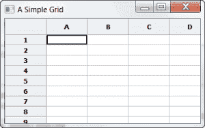
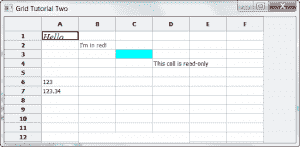

# wxPython:网格简介

> 原文：<https://www.blog.pythonlibrary.org/2010/03/18/wxpython-an-introduction-to-grids/>

wxPython 中的 grid 小部件是您将在这个工具包中使用的最复杂的 GUI 元素之一。在本文中，您将学习网格创建和使用的基础知识。网格的主要用途之一是显示表格数据。另一个用途是创建某种电子表格。如果您需要可以轻松编辑的大量单元格，那么 grid 小部件可能就是您想要的。报表模式中的 ListCtrl 在外观上类似于网格，可以根据您的需要用作网格的替代。

## 创建简单的网格

[](https://www.blog.pythonlibrary.org/wp-content/uploads/2010/03/gridTutorialOne.png)

让我们来看看如何实际创建网格:

```py

import wx
import wx.grid as gridlib

########################################################################
class MyForm(wx.Frame):
    """"""

    #----------------------------------------------------------------------
    def __init__(self):
        """Constructor"""
        wx.Frame.__init__(self, parent=None, title="A Simple Grid")
        panel = wx.Panel(self)

        myGrid = gridlib.Grid(panel)
        myGrid.CreateGrid(12, 8)

        sizer = wx.BoxSizer(wx.VERTICAL)
        sizer.Add(myGrid, 1, wx.EXPAND)
        panel.SetSizer(sizer)

if __name__ == "__main__":
    app = wx.PySimpleApp()
    frame = MyForm().Show()
    app.MainLoop()

```

这是创建网格小部件最简单的方法之一。我们在这里做的只是实例化一个网格对象，然后调用它的 CreateGrid 方法来告诉它我们想要多少行和多少列。我们将它放在 sizer 中，主要是因为这是包含小部件的正确方式，并且使添加额外的小部件更加容易。现在你应该有一个功能网格了！

## 介绍一些网格方法

前面的例子有一个问题:这个网格并没有真正做任何有用的事情！我们需要一种方法将数据放入网格，然后将数据取出。让我们来看看如何做到这一点以及更多。

[](https://www.blog.pythonlibrary.org/wp-content/uploads/2010/03/gridTutorialTwo.png)

```py

import wx
import wx.grid as gridlib

########################################################################
class MyForm(wx.Frame):
    """"""

    #----------------------------------------------------------------------
    def __init__(self):
        """Constructor"""
        wx.Frame.__init__(self, parent=None, title="Grid Tutorial Two", size=(650,320))
        panel = wx.Panel(self)

        myGrid = gridlib.Grid(panel)
        myGrid.CreateGrid(15, 6)

        myGrid.SetCellValue(0,0, "Hello")
        myGrid.SetCellFont(0, 0, wx.Font(12, wx.ROMAN, wx.ITALIC, wx.NORMAL))
        print myGrid.GetCellValue(0,0)

        myGrid.SetCellValue(1,1, "I'm in red!")
        myGrid.SetCellTextColour(1, 1, wx.RED)

        myGrid.SetCellBackgroundColour(2, 2, wx.CYAN)

        myGrid.SetCellValue(3, 3, "This cell is read-only")
        myGrid.SetReadOnly(3, 3, True)

        myGrid.SetCellEditor(5, 0, gridlib.GridCellNumberEditor(1,1000))
        myGrid.SetCellValue(5, 0, "123")
        myGrid.SetCellEditor(6, 0, gridlib.GridCellFloatEditor())
        myGrid.SetCellValue(6, 0, "123.34")
        myGrid.SetCellEditor(7, 0, gridlib.GridCellNumberEditor())

        myGrid.SetCellSize(11, 1, 3, 3)
        myGrid.SetCellAlignment(11, 1, wx.ALIGN_CENTRE, wx.ALIGN_CENTRE)
        myGrid.SetCellValue(11, 1, "This cell is set to span 3 rows and 3 columns")

        sizer = wx.BoxSizer(wx.VERTICAL)
        sizer.Add(myGrid)
        panel.SetSizer(sizer)

if __name__ == "__main__":
    app = wx.PySimpleApp()
    frame = MyForm()
    frame.Show()
    app.MainLoop()    

```

上面的代码与第一个例子中的代码非常相似。但是，您很快就会看到，这里有许多特定于网格的方法，用于设置网格小部件的各种属性。例如，我们使用 *SetCellValue(0，0，“Hello”)*将右上角单元格的值设置为字符串“Hello”。接下来，我们通过调用以下代码来设置同一单元格的字体大小和样式:

SetCellFont(0，0，wx。字体(12，wx。罗曼，wx。斜体，wx。正常))

可以创建 wx。也使用您系统上的字体的字体对象。为了设置字体颜色，我们使用 SetCellTextColour，为了设置单元格的背景颜色，我们使用 SetCellBackgroundColour。如您所见，网格的方法非常简单，名字也很直观。当然，如果你是美国人，那么你会注意到命名倾向于英式拼写(即颜色而不是颜色)，所以你需要注意这一点。

如果需要将单元格设为只读，可以执行以下操作:SetReadOnly(row，col，isReadOnly=True)。如果您需要将整个网格设为只读，则使用 EnableEditing(False)。最后，如果您需要将整行或整列设置为只读，那么您将需要使用单元格属性函数。类似这样的事情应该让你开始:

GetCellAttr(行，列)。SetReadOnly(isReadOnly)

然后使用 SetRowAttr()和 SetColAttr()将相应的行或列设置为只读。我从罗宾·邓恩的极有帮助的书《wxPython in Action》中得到了这个信息。一定要注意 SetCellAlignment，它将设置单元格内容的对齐方式。

**更新(2013-09-12):** 我试图弄清楚如何实际使用上面的信息来使整个行或列成为只读的，但是我不认为它工作或者它不再以那种方式工作。相反，您应该这样做:

```py

attr = gridlib.GridCellAttr()
attr.SetReadOnly(True)
myGrid.SetRowAttr(0, attr)

```

这段代码将使第一行(即第零行)成为只读的。

本例中最后一个重要部分是如何设置自定义单元格编辑器。这非常简单，因为您所需要做的就是调用 SetCellEditor 并传入(row，col)元组以及您选择的编辑器。在我们的示例中，我们使用 GridCellNumberEditor、GridCellFloatEditor 和 GridCellNumberEditor。其他选择见[官方文档](http://www.wxpython.org/docs/api/wx.grid-module.html)。

## 网格事件

在我们旋风网格之旅的最后一个例子中，我们将看看网格的特殊事件。下面是一些让我们开始的代码:

```py

# gridEvents.py

import wx
import wx.grid as gridlib

########################################################################
class MyGrid(gridlib.Grid):
    """"""

    #----------------------------------------------------------------------
    def __init__(self, parent):
        """Constructor"""
        gridlib.Grid.__init__(self, parent)
        self.CreateGrid(12, 8)

        # test all the events
        self.Bind(gridlib.EVT_GRID_CELL_LEFT_CLICK, self.OnCellLeftClick)
        self.Bind(gridlib.EVT_GRID_CELL_RIGHT_CLICK, self.OnCellRightClick)
        self.Bind(gridlib.EVT_GRID_CELL_LEFT_DCLICK, self.OnCellLeftDClick)
        self.Bind(gridlib.EVT_GRID_CELL_RIGHT_DCLICK, self.OnCellRightDClick)

        self.Bind(gridlib.EVT_GRID_LABEL_LEFT_CLICK, self.OnLabelLeftClick)
        self.Bind(gridlib.EVT_GRID_LABEL_RIGHT_CLICK, self.OnLabelRightClick)
        self.Bind(gridlib.EVT_GRID_LABEL_LEFT_DCLICK, self.OnLabelLeftDClick)
        self.Bind(gridlib.EVT_GRID_LABEL_RIGHT_DCLICK, self.OnLabelRightDClick)

        self.Bind(gridlib.EVT_GRID_ROW_SIZE, self.OnRowSize)
        self.Bind(gridlib.EVT_GRID_COL_SIZE, self.OnColSize)

        self.Bind(gridlib.EVT_GRID_RANGE_SELECT, self.OnRangeSelect)
        self.Bind(gridlib.EVT_GRID_CELL_CHANGE, self.OnCellChange)
        self.Bind(gridlib.EVT_GRID_SELECT_CELL, self.OnSelectCell)

        self.Bind(gridlib.EVT_GRID_EDITOR_SHOWN, self.OnEditorShown)
        self.Bind(gridlib.EVT_GRID_EDITOR_HIDDEN, self.OnEditorHidden)
        self.Bind(gridlib.EVT_GRID_EDITOR_CREATED, self.OnEditorCreated)

    def OnCellLeftClick(self, evt):
        print "OnCellLeftClick: (%d,%d) %s\n" % (evt.GetRow(),
                                                 evt.GetCol(),
                                                 evt.GetPosition())
        evt.Skip()

    def OnCellRightClick(self, evt):
        print "OnCellRightClick: (%d,%d) %s\n" % (evt.GetRow(),
                                                  evt.GetCol(),
                                                  evt.GetPosition())
        evt.Skip()

    def OnCellLeftDClick(self, evt):
        print "OnCellLeftDClick: (%d,%d) %s\n" % (evt.GetRow(),
                                                  evt.GetCol(),
                                                  evt.GetPosition())
        evt.Skip()

    def OnCellRightDClick(self, evt):
        print "OnCellRightDClick: (%d,%d) %s\n" % (evt.GetRow(),
                                                   evt.GetCol(),
                                                   evt.GetPosition())
        evt.Skip()

    def OnLabelLeftClick(self, evt):
        print "OnLabelLeftClick: (%d,%d) %s\n" % (evt.GetRow(),
                                                  evt.GetCol(),
                                                  evt.GetPosition())
        evt.Skip()

    def OnLabelRightClick(self, evt):
        print "OnLabelRightClick: (%d,%d) %s\n" % (evt.GetRow(),
                                                   evt.GetCol(),
                                                   evt.GetPosition())
        evt.Skip()

    def OnLabelLeftDClick(self, evt):
        print "OnLabelLeftDClick: (%d,%d) %s\n" % (evt.GetRow(),
                                                   evt.GetCol(),
                                                   evt.GetPosition())
        evt.Skip()

    def OnLabelRightDClick(self, evt):
        print "OnLabelRightDClick: (%d,%d) %s\n" % (evt.GetRow(),
                                                    evt.GetCol(),
                                                    evt.GetPosition())
        evt.Skip()

    def OnRowSize(self, evt):
        print "OnRowSize: row %d, %s\n" % (evt.GetRowOrCol(),
                                           evt.GetPosition())
        evt.Skip()

    def OnColSize(self, evt):
        print "OnColSize: col %d, %s\n" % (evt.GetRowOrCol(),
                                           evt.GetPosition())
        evt.Skip()

    def OnRangeSelect(self, evt):
        if evt.Selecting():
            msg = 'Selected'
        else:
            msg = 'Deselected'
        print "OnRangeSelect: %s  top-left %s, bottom-right %s\n" % (msg, evt.GetTopLeftCoords(),
                                                                     evt.GetBottomRightCoords())
        evt.Skip()

    def OnCellChange(self, evt):
        print "OnCellChange: (%d,%d) %s\n" % (evt.GetRow(), evt.GetCol(), evt.GetPosition())

        # Show how to stay in a cell that has bad data.  We can't just
        # call SetGridCursor here since we are nested inside one so it
        # won't have any effect.  Instead, set coordinates to move to in
        # idle time.
        value = self.GetCellValue(evt.GetRow(), evt.GetCol())

        if value == 'no good':
            self.moveTo = evt.GetRow(), evt.GetCol()

    def OnSelectCell(self, evt):
        if evt.Selecting():
            msg = 'Selected'
        else:
            msg = 'Deselected'
        print "OnSelectCell: %s (%d,%d) %s\n" % (msg, evt.GetRow(),
                                                 evt.GetCol(), evt.GetPosition())

        # Another way to stay in a cell that has a bad value...
        row = self.GetGridCursorRow()
        col = self.GetGridCursorCol()

        if self.IsCellEditControlEnabled():
            self.HideCellEditControl()
            self.DisableCellEditControl()

        value = self.GetCellValue(row, col)

        if value == 'no good 2':
            return  # cancels the cell selection

        evt.Skip()

    def OnEditorShown(self, evt):
        if evt.GetRow() == 6 and evt.GetCol() == 3 and \
           wx.MessageBox("Are you sure you wish to edit this cell?",
                        "Checking", wx.YES_NO) == wx.NO:
            evt.Veto()
            return

        print "OnEditorShown: (%d,%d) %s\n" % (evt.GetRow(), evt.GetCol(),
                                               evt.GetPosition())
        evt.Skip()

    def OnEditorHidden(self, evt):
        if evt.GetRow() == 6 and evt.GetCol() == 3 and \
           wx.MessageBox("Are you sure you wish to  finish editing this cell?",
                        "Checking", wx.YES_NO) == wx.NO:
            evt.Veto()
            return

        print "OnEditorHidden: (%d,%d) %s\n" % (evt.GetRow(),
                                                evt.GetCol(),
                                                evt.GetPosition())
        evt.Skip()

    def OnEditorCreated(self, evt):
        print "OnEditorCreated: (%d, %d) %s\n" % (evt.GetRow(),
                                                  evt.GetCol(),
                                                  evt.GetControl())

########################################################################
class MyForm(wx.Frame):
    """"""

    #----------------------------------------------------------------------
    def __init__(self):
        """Constructor"""
        wx.Frame.__init__(self, parent=None, title="An Eventful Grid")
        panel = wx.Panel(self)

        myGrid = MyGrid(panel)

        sizer = wx.BoxSizer(wx.VERTICAL)
        sizer.Add(myGrid, 1, wx.EXPAND)
        panel.SetSizer(sizer)

if __name__ == "__main__":
    app = wx.PySimpleApp()
    frame = MyForm().Show()
    app.MainLoop()

```

代码很多，但大部分只是事件处理程序。我们只看其中的几个。你很聪明，所以我相信你能想出其余的！请注意，本示例中的所有事件都带有“gridlib”前缀。这意味着这些事件只适用于网格实例，对任何其他小部件都没有影响。对于我们的第一个事件示例，我们将查看 LEFT _ 网格 _ 单元格 _ 左击。当您绑定到此事件时，它允许您捕获当用户在网格中的单元格上单击鼠标指针时触发的事件。据我所知，这个事件在选择事件(即 EVT 网格选择单元格)之前被触发，所以如果你愿意，你可以用它来否决单元格选择。请注意，两个鼠标按钮都有一个右键单击和相应的双击事件。

LEFT _ 网格 _ 标签 _ 左击事件允许我们知道用户何时点击网格的列或行标签。与前面的事件示例一样，您也可以捕获双击和右键单击。请注意，虽然没有中击事件。为此，您可能需要使用普通的中击鼠标事件。

当你开始编辑一个单元格时，EVT _ 网格 _ 编辑器 _ 显示被激发。您可以使用此事件来创建要显示的自定义编辑器或否决编辑。看看你是否能自己找出其他事件的作用。

现在让我们看看一些处理程序。其中很多都包含以下代码:

```py

(evt.GetRow(),
 evt.GetCol(),
 evt.GetPosition())

```

这对于故障排除来说非常方便，因为它告诉我们是否在我们期望的单元格中，并且它也给我们我们点击的像素坐标。后者对于上下文弹出菜单或工具提示定位非常方便。另一个有趣的处理程序是 *OnRangeSelect* ，它向我们展示了如何判断我们选择的范围。请注意，我们需要做的只是调用 GetTopLeftCoords 和 GetBottomRightCoords 来解决这个问题。这不是很好玩吗？

现在您已经了解了网格事件处理的基础知识。走出去，用你新发现的知识构建一些很酷的应用程序！请密切关注接下来的几个网格教程，在那里您将学习如何使用虚拟表格、更改网格和行标签、向列添加工具提示以及其他有趣的东西！

**注意:这篇文章中的代码是在以下平台上测试的:**

*   Windows XP Professional、wxPython 2.8.10.1(unicode)、Python 2.5
*   Windows 7 专业版、wxPython 2.8.10.1(unicode)、Python 2.6.4

## 进一步阅读

*   [电网手册](http://wiki.wxpython.org/wxGrid%20Manual)
*   [wx。网格维基页面](http://wiki.wxpython.org/wxGrid)
*   [官方电网文件](http://www.wxpython.org/docs/api/wx.grid-module.html)