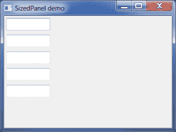
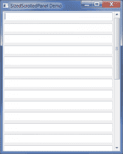
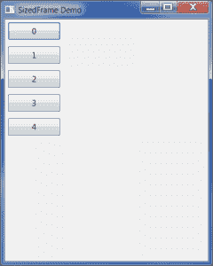
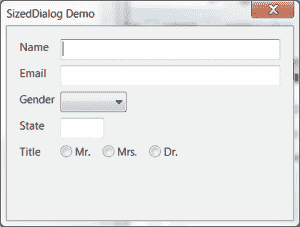

# wxPython:大小控件简介

> 原文：<https://www.blog.pythonlibrary.org/2014/01/23/wxpython-an-introduction-to-sized-controls/>

wxPython 工具包提供了一种使用 sizer 进行布局的替代方法，称为“sized_controls”。这些控件或小部件基本上是顶层小部件(如框架、面板、对话框等)，内置了尺寸逻辑。本文将涵盖所有四种类型的 sized_controls。它们如下:

*   尺寸面板
*   SizedScrolledPanel
*   尺寸框架
*   尺寸对话框

SizedScrolledPanel 小部件是 wxPython 2.8.8 的新功能，但是其他 3 种类型的控件在 wxPython 2.8.8 和更老的版本中都有(更多信息请参见 T2 的 Trac。如果您使用的是 wxPython 2.8，请记住这一点。如果你准备好了，我们可以开始了！

### 尺寸面板

[](https://www.blog.pythonlibrary.org/wp-content/uploads/2014/01/wxSizedPanelDemo.png)

SizedPanel 小部件将自动为自己创建一个 sizer。sizer 默认为垂直框 sizer。小部件还会自动将您添加到面板的任何子组件添加到 sizer 中。如果您需要更改 sizer 类型，只需调用 **SetSizerType()** 并传递它“水平”、“垂直”、“表格”(一个 2 列 flex 网格 sizer)，或“网格”。如果选择“grid”，那么还可以再传递两个参数:“cols”和“rows”。根据 wxPython 演示:*这个类在 Win、GTK 和 Mac 上也应用了符合本地平台人机界面指南(HIG)的控件边框。*

让我们看一个简单的例子:

```py

# sized_panel.py

import wx
import wx.lib.sized_controls as sc

########################################################################
class SizedPanel(sc.SizedPanel):
    """"""

    #----------------------------------------------------------------------
    def __init__(self, parent):
        """Constructor"""
        sc.SizedPanel.__init__(self, parent)        

        for item in range(5):
            txt = wx.TextCtrl(self)

########################################################################
class RegularFrame(wx.Frame):
    """"""

    #----------------------------------------------------------------------
    def __init__(self):
        """Constructor"""
        wx.Frame.__init__(self, None, title="SizedPanel demo",
                          size=(400,300))
        panel = SizedPanel(self)
        self.Show()

#----------------------------------------------------------------------
if __name__ == "__main__":
    app = wx.App(False)
    frame = RegularFrame()
    app.MainLoop()

```

当使用调整大小的控件小部件时，将小部件添加到 sizer 的代码要简单得多。如果您想尝试一个小实验，请尝试在 **SizedPanel** 类的循环之前添加以下代码行:

```py

self.SetSizerType("horizontal")

```

这将导致小部件被水平添加而不是垂直添加。为了便于比较，让我们花点时间来看看用 sizer 进行这种布局的常规方法:

```py

import wx

########################################################################
class RegularPanel(wx.Panel):
    """"""

    #----------------------------------------------------------------------
    def __init__(self, parent):
        """Constructor"""
        wx.Panel.__init__(self, parent)

        sizer = wx.BoxSizer(wx.VERTICAL)
        for item in range(5):
            txt = wx.TextCtrl(self)
            sizer.Add(txt, 0, wx.ALL, 5)

        self.SetSizer(sizer)

########################################################################
class RegularFrame(wx.Frame):
    """"""

    #----------------------------------------------------------------------
    def __init__(self):
        """Constructor"""
        wx.Frame.__init__(self, None, title="SizedPanel demo",
                          size=(400,300))
        panel = RegularPanel(self)
        self.Show()

#----------------------------------------------------------------------
if __name__ == "__main__":
    app = wx.App(False)
    frame = RegularFrame()
    app.MainLoop()

```

这两段代码之间的主要区别在于， **RegularPanel** 代码有几行额外的代码与设置 sizer、向 sizer 添加小部件以及设置 sizer 相关。

### SizedScrolledPanel 面板

[](https://www.blog.pythonlibrary.org/wp-content/uploads/2014/01/wxSizedScrolledPanelDemo.png)

SizedScrolledPanel 与 ScrolledPanel 小部件非常相似，因为如果有太多的小部件要在一个面板上显示，它会创建一个滚动条。主要的区别是，大小控制将再次为我们做所有的 sizer 的东西。这里有一个例子:

```py

# sized_scrolled_panel.py

import wx
import wx.lib.sized_controls as sc

########################################################################
class MySizedScrolledPanel(sc.SizedScrolledPanel):
    """"""

    #----------------------------------------------------------------------
    def __init__(self, parent):
        """Constructor"""
        sc.SizedScrolledPanel.__init__(self, parent)

        for item in range(25):
            txt = wx.TextCtrl(self)
            txt.SetSizerProps(expand=True)

########################################################################
class MyFrame(wx.Frame):
    """"""

    #----------------------------------------------------------------------
    def __init__(self):
        """Constructor"""
        wx.Frame.__init__(self, None, title="SizedScrolledPanel Demo",
                          size=(400, 500))
        panel = MySizedScrolledPanel(self)
        self.Show()        

#----------------------------------------------------------------------
if __name__ == "__main__":
    app = wx.App(False)
    frame = MyFrame()
    app.MainLoop()    

```

上面的代码非常类似于 SizedPanel 示例，但是我添加了一点额外的逻辑来扩展文本控件。你看到了吗？在我们创建文本控件小部件之后，看一下这个循环:

```py

txt.SetSizerProps(expand=True)

```

通过使用大小控制，它为我们的小部件添加了一个特殊的方法，称为 **SetSizerProps** 。此方法的有效值为“比例”、“hgrow”、“vgrow”、“align”、“halign”、“valign”、“border”、“minsize”和“expand”。在这个例子中，我们将**扩展**设置为布尔真。

### 尺寸框架

[](https://www.blog.pythonlibrary.org/wp-content/uploads/2014/01/wxSizedFrameDemo.png)

SizedFrame 与最后两个 sized 控件略有不同，它自动将 SizedPanel 设置为它的第一个子控件。如果您想要访问该面板，您将需要调用 **GetContentsPane()** 。让我们看一个例子:

```py

# sized_frame.py

import wx
import wx.lib.sized_controls as sc

########################################################################
class SizedFrame(sc.SizedFrame):
    """"""

    #----------------------------------------------------------------------
    def __init__(self):
        """Constructor"""
        sc.SizedFrame.__init__(self, None, title="SizedFrame Demo",
                               size=(400,500))

        panel = self.GetContentsPane()

        for item in range(5):
            btn = wx.Button(panel, label=str(item))
            btn.SetSizerProps(border=("all", 5))

        self.Show()

#----------------------------------------------------------------------
if __name__ == "__main__":
    app = wx.App()
    frame = SizedFrame()
    app.MainLoop()

```

这里我们看到我们需要提取 **SizedPanel** ，这样我们就可以向它添加按钮。那很容易！

### 尺寸对话框

[](https://www.blog.pythonlibrary.org/wp-content/uploads/2014/01/sizedDlgDemo.png)

**sized 对话框**与 **SizedFrame** 非常相似，因为它也内置了一个 SizedPanel。让我们从 wxPython 演示中派生出一个演示，这样我们就可以看到它是如何工作的:

```py

# sized_dialog.py

import wx
import wx.lib.sized_controls as sc

########################################################################
class MySizedDialog(sc.SizedDialog):
    """"""

    #----------------------------------------------------------------------
    def __init__(self):
        """Constructor"""
        sc.SizedDialog.__init__(self, None, title="SizedDialog Demo",
                                size=(400,500))

        panel = self.GetContentsPane()
        panel.SetSizerType("form")

        # row 1
        wx.StaticText(panel, -1, "Name")
        textCtrl = wx.TextCtrl(panel)
        textCtrl.SetSizerProps(expand=True)

        # row 2
        wx.StaticText(panel, -1, "Email")
        emailCtrl = wx.TextCtrl(panel)
        emailCtrl.SetSizerProps(expand=True)

        # row 3
        wx.StaticText(panel, -1, "Gender")
        wx.Choice(panel, -1, choices=["male", "female"])

        # row 4
        wx.StaticText(panel, -1, "State")
        wx.TextCtrl(panel, size=(60, -1)) # two chars for state

        # row 5
        wx.StaticText(panel, -1, "Title")

        # here's how to add a 'nested sizer' using sized_controls
        radioPane = sc.SizedPanel(panel, -1)
        radioPane.SetSizerType("horizontal")

        # make these children of the radioPane to have them use
        # the horizontal layout
        wx.RadioButton(radioPane, -1, "Mr.")
        wx.RadioButton(radioPane, -1, "Mrs.")
        wx.RadioButton(radioPane, -1, "Dr.")
        # end row 5

#----------------------------------------------------------------------
if __name__ == "__main__":
    app = wx.App(False)
    dlg = MySizedDialog()
    dlg.ShowModal()
    app.MainLoop()

```

这段代码演示了两个新概念。它展示了一个新的 sizer 类型(“form”)，并展示了如何嵌套 sizer。sizer 类型“form”基本上告诉 wxPython 将小部件放入两列，而不是垂直堆叠。因此，我们有一个 **StaticText** 和一个 **TextCtrl** 在同一层上。**单选按钮**都在自己的一行。那是怎么发生的？这就是嵌套的 sizer 部分的用武之地。我们创建一个新的**尺寸面板**，分配给**无线面板**，然后我们将其方向改为“水平”。接下来，我们通过将 radioPane 设置为它们的父级来添加 3 个单选按钮。

### 包扎

至此，您应该有足够的信息来开始使用 wxPython 的大小控件了。您刚刚学习了如何使用所有四种变体:SizedPanel、SizedScrolledPanel、SizedFrame 和 SizedDialog。您还了解了一些关于如何将不同大小的控件嵌套在一起的知识。嵌套是一个非常强大的工具，可以帮助你创建非常复杂的界面。我认为大小控件最好的一点是，它们使得使用 sizer 更加直观。

### 额外资源

*   wxPython [关于大小控制的文档](http://wxpython.org/Phoenix/docs/html/lib.sized_controls.html)
*   关于大小控制的 wxPython [wiki 条目](http://wiki.wxpython.org/SizedControls)

### 下载源代码

*   [wx_sized_controls.zip](https://www.blog.pythonlibrary.org/wp-content/uploads/2014/01/wx_sized_controls.zip)

**注意:本文中的代码是在 Windows 7 上使用 wxPython 2.9.4.0(经典)和 Python 2.7.3 测试的**