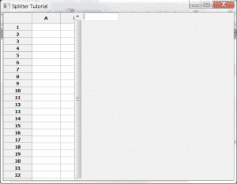
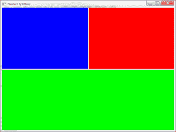
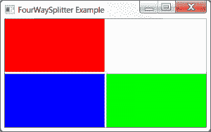
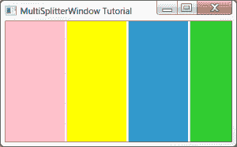

# wxPython:splitter windows 简介

> 原文：<https://www.blog.pythonlibrary.org/2013/10/18/wxpython-an-introduction-to-splitterwindows/>

wxPython GUI 工具包附带了许多小部件。我们将介绍一些让人难以理解的小部件。在这种情况下，我们将讨论拆分窗口。WxPython 包括三种类型的拆分器窗口:

*   wx。拆分窗口
*   你可以在 wx.lib.agw 中找到它
*   可以在 wx.lib.splitter 中找到的 MultiSplitterWindow

在这篇文章中，我们将讨论如何使用这些不同种类的拆分窗口。还有一个小部件的行为有点像一个拆分窗口，我们不会谈论它。它是 SplitTree 小部件，是 wx.gizmos 的一部分。

### wx。拆分窗口

[](https://www.blog.pythonlibrary.org/wp-content/uploads/2013/10/splitter_simple.png)

wx。SplitterWindow 是基于 C++的 wxWidgets 小部件的包装器，可能是您在野外看到的最常见的一个。让我们写一小段代码来学习如何使用它。

```py

import wx
import wx.grid as gridlib

########################################################################
class LeftPanel(wx.Panel):
    """"""

    #----------------------------------------------------------------------
    def __init__(self, parent):
        """Constructor"""
        wx.Panel.__init__(self, parent=parent)

        grid = gridlib.Grid(self)
        grid.CreateGrid(25,12)

        sizer = wx.BoxSizer(wx.VERTICAL)
        sizer.Add(grid, 0, wx.EXPAND)
        self.SetSizer(sizer)

########################################################################
class RightPanel(wx.Panel):
    """"""

    #----------------------------------------------------------------------
    def __init__(self, parent):
        """Constructor"""
        wx.Panel.__init__(self, parent=parent)
        txt = wx.TextCtrl(self)

########################################################################
class MyForm(wx.Frame):

    #----------------------------------------------------------------------
    def __init__(self):
        wx.Frame.__init__(self, None, title="Splitter Tutorial")

        splitter = wx.SplitterWindow(self)
        leftP = LeftPanel(splitter)
        rightP = RightPanel(splitter)

        # split the window
        splitter.SplitVertically(leftP, rightP)
        splitter.SetMinimumPaneSize(20)

        sizer = wx.BoxSizer(wx.VERTICAL)
        sizer.Add(splitter, 1, wx.EXPAND)
        self.SetSizer(sizer)

#----------------------------------------------------------------------
# Run the program
if __name__ == "__main__":
    app = wx.App(False)
    frame = MyForm()
    frame.Show()
    app.MainLoop()

```

如你所见，我们制作了 **wx。SplitterWindow** widget 框架的唯一子窗口。在大多数应用程序中，通常使用 wx。专家组唯一的孩子，但这是一个特例。接下来，我们创建两个面板，并使它们成为 wx.SplitterWindow 的子窗口。SplitterWindow 垂直拆分，并将其最小窗格大小设置为 20。您需要设置大小，以确保两个面板都可见。SplitterWindow 可以绑定到四个不同的特定于小部件的事件:

*   EVT _ 分离器 _ 窗扇 _ 位置 _ 改变
*   EVT _ 拆分器 _ 窗框 _ 位置 _ 已更改
*   EVT _ 拆分器 _ 取消拆分
*   EVT _ 拆分器 _ 点击

在这个例子中，我们不使用它们中的任何一个，但是你应该知道它们。还应注意，您可以设置窗扇位置。

另一件值得了解的事情是，你可以设置窗框的重力。当您移动存储时，重力控制窗格如何调整大小。它的默认值是 0.0，这意味着只有底部或右边的窗口会自动调整大小。您也可以将其设置为 0.5，此时两个窗口的增长相等，或者设置为 1.0，此时只有左侧/顶部的窗口增长。

### 嵌套拆分器

[](https://www.blog.pythonlibrary.org/wp-content/uploads/2013/10/nested_splitters.png)

有时，您会希望将拆分器窗口嵌套在一起，以创建复杂的布局，就像 wxPython 演示中使用的布局一样。让我们花点时间，用下面的代码看看如何做到这一点:

```py

import wx

########################################################################
class RandomPanel(wx.Panel):
    """"""

    #----------------------------------------------------------------------
    def __init__(self, parent, color):
        """Constructor"""
        wx.Panel.__init__(self, parent)
        self.SetBackgroundColour(color)

########################################################################
class MainPanel(wx.Panel):
    """"""

    #----------------------------------------------------------------------
    def __init__(self, parent):
        """Constructor"""
        wx.Panel.__init__(self, parent)

        topSplitter = wx.SplitterWindow(self)
        vSplitter = wx.SplitterWindow(topSplitter)

        panelOne = RandomPanel(vSplitter, "blue")
        panelTwo = RandomPanel(vSplitter, "red")
        vSplitter.SplitVertically(panelOne, panelTwo)
        vSplitter.SetSashGravity(0.5)

        panelThree = RandomPanel(topSplitter, "green")
        topSplitter.SplitHorizontally(vSplitter, panelThree)
        topSplitter.SetSashGravity(0.5)

        sizer = wx.BoxSizer(wx.VERTICAL)
        sizer.Add(topSplitter, 1, wx.EXPAND)
        self.SetSizer(sizer)

########################################################################
class MainFrame(wx.Frame):
    """"""

    #----------------------------------------------------------------------
    def __init__(self):
        """Constructor"""
        wx.Frame.__init__(self, None, title="Nested Splitters",
                          size=(800,600))
        panel = MainPanel(self)
        self.Show()

#----------------------------------------------------------------------
if __name__ == "__main__":
    app = wx.App(False)
    frame = MainFrame()
    app.MainLoop()

```

这里我们创建了一个顶级拆分器，它是框架的唯一子元素。然后，我们创建第二个分割器，并添加几个面板。接下来，我们垂直拆分第二个拆分器，水平拆分顶部的拆分器，得到您在本节开始时看到的应用程序。现在我们准备学习我们的下一种类型的拆分窗口！

### FourWaySplitter 小部件

[](https://www.blog.pythonlibrary.org/wp-content/uploads/2013/10/fourway_split.png)

**FourWaySplitter** 小部件是一个自定义小部件，用纯 Python 编写，是 agw 子库的一部分，可以在 wx.lib.agw 中找到。agw 代表高级通用小部件，尽管我认为它也可以代表 Andrea Gavana 小部件，该子库中所有小部件的作者。无论如何，这是一个非常方便的拆分器，因为你不需要做任何嵌套的拆分窗口来获得这个小部件默认的效果。我们将使用来自 [wxPython 文档](http://wxpython.org/Phoenix/docs/html/lib.agw.fourwaysplitter.html)的一个例子来看看我们如何使用这个小部件:

```py

import wx
import wx.lib.agw.fourwaysplitter as fws

########################################################################
class MyFrame(wx.Frame):

    #----------------------------------------------------------------------
    def __init__(self):

        wx.Frame.__init__(self, None, title="FourWaySplitter Example")

        splitter = fws.FourWaySplitter(self, agwStyle=wx.SP_LIVE_UPDATE)

        # Put in some coloured panels...
        for colour in [wx.RED, wx.WHITE, wx.BLUE, wx.GREEN]:

            panel = wx.Panel(splitter)
            panel.SetBackgroundColour(colour)

            splitter.AppendWindow(panel)

#----------------------------------------------------------------------
if __name__ == "__main__":
    app = wx.App(False)

    frame = MyFrame()
    app.SetTopWindow(frame)
    frame.Show()

    app.MainLoop()

```

在这个例子中，我们创建了一个 FourWaySplitter 的实例，然后我们遍历一个四种颜色的列表。当我们循环时，我们创建一个面板，它的父面板是 FourWaySplitter，它有自己独特的颜色。最后，我们将面板附加到拆分器上。这个小部件可以做的一件事就是嵌套一组 wx。SplitterWindows 不能一次调整所有面板的大小。如果你抓住相交处的窗扇，你可以调整任何东西的大小。这对于常规的 splitter 小部件来说是不可能的。

### 多分割窗口

[](https://www.blog.pythonlibrary.org/wp-content/uploads/2013/10/multisplitter.png)

**MultiSplitterWindow** 是 wx 的一种扩展。SplitterWindow 允许两个以上的窗户/面板和一个以上的窗框。否则，大多数样式、常量和方法的行为都是一样的。如果您查看 wxPython 演示，您会注意到它以与 FourWaySplitter 相同的方式使用了 **AppendWindow** 。让我们基于官方的 wxPython 演示创建一个简单的演示:

```py

import wx
from wx.lib.splitter import MultiSplitterWindow

########################################################################
class SamplePanel(wx.Panel):
    """"""

    #----------------------------------------------------------------------
    def __init__(self, parent, colour):
        """Constructor"""
        wx.Panel.__init__(self, parent)
        self.SetBackgroundColour(colour)

########################################################################
class MainFrame(wx.Frame):
    """"""

    #----------------------------------------------------------------------
    def __init__(self):
        """Constructor"""
        wx.Frame.__init__(self, None, title="MultiSplitterWindow Tutorial")

        splitter = MultiSplitterWindow(self, style=wx.SP_LIVE_UPDATE)

        colours = ["pink", "yellow", "sky blue", "Lime Green"]
        for colour in colours:
            panel = SamplePanel(splitter, colour)
            splitter.AppendWindow(panel)

        self.Show()

#----------------------------------------------------------------------
if __name__ == "__main__":
    app = wx.App(False)
    frame = MainFrame()
    app.MainLoop()

```

如您所见，添加“窗口”或面板所需要做的就是使用 AppendWindow 方法将它们添加到拆分器中。在这种情况下，我们只是添加了四个不同的面板，每个面板都有不同的背景颜色。

### 包扎

应该注意的是，您添加到 MultiSplitterWindow 或 FourWaySplitter 的面板可以包含其他小部件，就像第一个 SplitterWindow 示例一样。使用这些小部件(或这些小部件的组合)，你可以创建非常复杂和灵活的界面。我看到的使用这类小部件最多的应用程序之一是像 Filezilla 这样的 FTP 客户端。然而，大多数摄影软件都有可移动的窗框，可以在右边、左边或底部扩展选项。我建议尝试复制一些其他的程序来帮助你学习如何有效地使用这些小部件。

### 附加阅读

*   wx。SplitterWindow [文档](http://wxpython.org/Phoenix/docs/html/SplitterWindow.html)
*   四路分离器[文档](http://wxpython.org/Phoenix/docs/html/lib.agw.fourwaysplitter.html)
*   多分割器[文档](http://wxpython.org/Phoenix/docs/html/lib.splitter.MultiSplitterWindow.html)

### 源代码

*   [wxsplit.zip](https://www.blog.pythonlibrary.org/wp-content/uploads/2013/10/wxsplit.zip)
*   [wxsplit.tar](https://www.blog.pythonlibrary.org/wp-content/uploads/2013/10/wxsplit.tar)