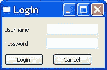

# wxPython:XRC 简介

> 原文：<https://www.blog.pythonlibrary.org/2010/05/11/wxpython-an-introduction-to-xrc/>

您是否想过是否可以使用 XML 创建一个 wxPython 程序？嗯，我也从来没有，但有一种方法，它的名字是 XRC。事实上，wxPython 附带了一个名为 XRCed 的编辑器，您可以用它来设计 GUI 并生成 XML 代码。在本文中，我们将向您快速介绍 XRC，以及如何使用它来创建几个 GUI 框架。我们将看两个只使用 XRC 控件的例子，然后第三个例子混合了一些额外的非 XRC 部件。

## 使用 XRC 创建登录屏幕

我们经常看到的一个常见对话框是登录对话框。我使用 XRCed 创建了以下 XML 代码:

 `<resource><object class="wxFrame" name="mainFrame"><object class="wxPanel" name="panel"><object class="wxBoxSizer"><orient>wxVERTICAL</orient>
<object class="sizeritem"><object class="wxStaticText" name="handle"></object></object>
<object class="sizeritem"><object class="wxFlexGridSizer"><object class="sizeritem"><object class="wxStaticText" name="userLbl">Username:</object>
<flag>wxALL</flag>
<border>5</border></object>
 <object class="sizeritem"><object class="sizeritem"><object class="wxStaticText" name="passwordLbl">Password:</object>
<flag>wxALL</flag>
<border>5</border></object>

<object class="sizeritem"><object class="wxButton" name="loginBtn">Login</object>
<flag>wxALL|wxALIGN_CENTRE</flag>
<border>5</border></object>
<object class="sizeritem"><object class="wxButton" name="cancelBtn">Cancel</object>
<flag>wxALL|wxALIGN_CENTRE</flag>
<border>5</border></object>
<cols>2</cols> <rows>3</rows>
<vgap>4</vgap>
<hgap>2</hgap></object>
<border>5</border></object></object></object></object></object></resource>`