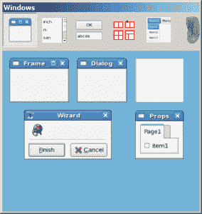

# wxPython:一个 XRCed 教程

> 原文：<https://www.blog.pythonlibrary.org/2010/10/28/wxpython-an-xrced-tutorial/>

如果您对 wxPython 不熟悉，但对 XML 不熟悉，您可能会发现本文对您有用。为什么？因为 wxPython 支持 XRC，这是一种用 XML 描述 GUI 的 XML 文件格式。事实上，wxPython 的 Documentation & Demos 包中包含了一个名为 XRCed 的编辑器，专门用于创建和操作这些文件。这篇文章将带您了解 XRCed 的特性和一般用法。

XRCed 的一个令人困惑的方面是，它曾经是一个独立于 wxPython 的项目，它的网站仍然存在[这里](http://xrced.sourceforge.net/)。有人告诉我，与演示包附带的新版本相比，该网站的旧版本在屏幕阅读器上运行得非常好。所以如果你有视力问题，你可能会发现那个版本更合适。当然，旧版本自 2007 年以来就没有更新过...所以选你的毒药吧。

## 入门指南

[](https://www.blog.pythonlibrary.org/wp-content/uploads/2010/10/xrced_main.png)

一旦安装了演示应用程序，运行名为 **XRC 资源编辑器**的工具。您应该会看到类似上面的内容。这是一个双屏界面，主屏幕在左边，小工具屏幕在右边。要开始，我们应该做一个简单的应用！

## 创建我们的第一个应用

[](https://www.blog.pythonlibrary.org/wp-content/uploads/2010/10/twoBtns_xrc.png)

让我们用 XRCed 创建一个简单的双按钮应用程序。它不会做任何事情，但是它会告诉你如何制作一个快速的 GUI。打开 XRCed，在窗口小部件(下图)中点击 wxFrame 按钮。

[](https://www.blog.pythonlibrary.org/wp-content/uploads/2010/10/xrc_widget_window.png)

您应该看到一个未命名的 wxFrame 作为一个树小部件的根出现在正确的应用程序中(参见本节开头的屏幕截图)。在本例中，我们将该框架命名为“大型机”。现在选中树中的框架，添加一个名为“MainPanel”的面板。接下来，在第二个浮动屏幕中，顶部有一排按钮。单击左边第四个，看起来像几个红色矩形的那个，然后选择 BoxSizer 的那个(不过要确保面板对象首先在另一个屏幕中高亮显示)。

现在选中框尺寸树项目，点击浮动窗口的第三个按钮，添加两个按钮到树中，命名如下。保存您的工作，您应该得到如下所示的文件:

```py

 <object class="wxFrame" name="MainFrame"><object class="wxPanel" name="MainPanel"><object class="wxBoxSizer"><object class="sizeritem"><object class="wxButton" name="okBtn">OK</object></object> 
        <object class="sizeritem"><object class="wxButton" name="cancelBtn">Cancel</object></object> 
        <orient>wxHORIZONTAL</orient></object></object></object> 

```

令人震惊的是，XRCed 实际上产生了易读的 XML 代码。现在我们只需要弄清楚如何用 wxPython 加载 XML。幸运的是，这其实很容易。看看这个:

```py

import wx
from wx import xrc

class MyApp(wx.App):
    def OnInit(self):
        self.res = xrc.XmlResource("twoBtns.xrc")

        self.frame = self.res.LoadFrame(None, 'MainFrame')

        self.frame.Show()
        return True

if __name__ == "__main__":
    app = MyApp(False)
    app.MainLoop()

```

为了加载 XML，我们需要从 wx 导入 xrc 模块。然后我们用下面一行加载 XML:**xrc。XmlResource("twoBtns.xrc")** 。注意，我们必须传入 xrc 文件的名称(或路径)。您可能需要将其更改为您所称的副本。然后为了加载框架，我们调用 xml 资源对象的 **LoadFrame** 方法，不传递任何值(即没有父值)和我们在 xrc 文件中给框架的名称。这是很容易出错的地方。您必须在 Python 代码中键入小部件的名称，就像您在 xrc 文件中那样，否则它将不起作用(或者它可能起作用，但不是以您期望的方式)。是的，名称区分大小写。无论如何，一旦完成了，你只需要做你通常在 wxPython 文件中做的事情。

## 创造更复杂的东西

[](https://www.blog.pythonlibrary.org/wp-content/uploads/2010/10/xrc_notebook.png)

上一节中的例子非常简单。让我们看看如何在 XRC 创建应用程序的一部分，在 wxPython 中创建一部分。在上面的截图中，我们有一个两页的笔记本，下面有一个 PlateButton。笔记本，框架和面板都是 XRC 制造的，而 PlateButton 只是普通的 wx。下面是 XML:

```py
<resource><object class="wxFrame" name="DemoFrame"><object class="wxPanel" name="DemoPanel"><object class="wxBoxSizer"><orient>【wzvertical】</orient><object class="sizeritem"><object class="notebookpage"><object class="notebookpage">【tabou】</object></object></object></object></object></object></resource>
```

现在让我们添加 plate 按钮:

```py

import wx
from wx import xrc
import wx.lib.platebtn as platebtn

class MyApp(wx.App):
    def OnInit(self):
        self.res = xrc.XmlResource("notebook2.xrc")

        frame = self.res.LoadFrame(None, 'DemoFrame')
        panel = xrc.XRCCTRL(frame, "DemoPanel")
        notebook = xrc.XRCCTRL(panel, "DemoNotebook")

        sizer = wx.BoxSizer(wx.VERTICAL)
        btn = platebtn.PlateButton(panel, label="Test", 
                                   style=platebtn.PB_STYLE_DEFAULT)
        btn.Bind(wx.EVT_BUTTON, self.onButton)
        sizer.Add(notebook, 1, wx.ALL|wx.EXPAND, 5)
        sizer.Add(btn)
        panel.SetSizer(sizer)

        frame.Show()
        return True

    #----------------------------------------------------------------------
    def onButton(self, event):
        """"""
        print "You pressed the button!"

if __name__ == "__main__":
    app = MyApp(False)
    app.MainLoop()

```

如您所见，这与在普通 wxPython 中创建应用程序一样简单。如果有 wx 的话。按钮在 XRC 定义，我们会做同样的事情，我们为面板创建一个句柄。一旦我们有了句柄，我们就可以像平常一样将事件绑定到按钮上。

## 使用 XRCed 生成 Python 代码

XRCed 应用程序包括一个 Python 代码生成器，我们可以为自己的代码创建子类。首先，我们将使用本文中的第一个简单示例，然后我们将扩展该示例并向您展示如何绑定事件。在 XRCed 中，加载第一个示例，然后转到文件，生成 Python。接受默认值并点击**生成模块**按钮。您现在应该有一些自动生成的代码，如下所示:

```py

# This file was automatically generated by pywxrc.
# -*- coding: UTF-8 -*-

import wx
import wx.xrc as xrc

__res = None

def get_resources():
    """ This function provides access to the XML resources in this module."""
    global __res
    if __res == None:
        __init_resources()
    return __res

class xrcMainFrame(wx.Frame):
#!XRCED:begin-block:xrcMainFrame.PreCreate
    def PreCreate(self, pre):
        """ This function is called during the class's initialization.

        Override it for custom setup before the window is created usually to
        set additional window styles using SetWindowStyle() and SetExtraStyle().
        """
        pass

#!XRCED:end-block:xrcMainFrame.PreCreate

    def __init__(self, parent):
        # Two stage creation (see http://wiki.wxpython.org/index.cgi/TwoStageCreation)
        pre = wx.PreFrame()
        self.PreCreate(pre)
        get_resources().LoadOnFrame(pre, parent, "MainFrame")
        self.PostCreate(pre)

        # Define variables for the controls, bind event handlers

# ------------------------ Resource data ----------------------

def __init_resources():
    global __res
    __res = xrc.EmptyXmlResource()

    __res.Load('twoBtns.xrc')

```

这有点难看，但是如果你能读懂正常的 wxPython，那么你应该能弄明白这一点。现在让我们创建这个代码的一个子类。我们想这样做的主要原因是，我们可以改变 XRC 文件和后续生成的代码，我们的子类基本上可以保持不变。它帮助我们将模型(XML)与视图(wxPython 代码)分开。无论如何，这里有一个简单的例子:

```py

# twoBtns_xrc_subclass.py

import twoBtns_xrc
import wx

########################################################################
class XrcFrameSubClass(twoBtns_xrc.xrcMainFrame):
    """"""

    #----------------------------------------------------------------------
    def __init__(self):
        """Constructor"""
        twoBtns_xrc.xrcMainFrame.__init__(self, parent=None)
        self.Show()

if __name__ == "__main__":
    app = wx.App(False)
    frame = XrcFrameSubClass()
    app.MainLoop()

```

注意，我们导入了模块“twoBtns_xrc”，它类似于我所说的 XRCfile。XRCed 将“_xrc”部分添加到 Python 文件名中。导入后，我们就可以访问 XRC 框架对象并对其进行子类化。这个例子有点无聊，所以让我们添加一些事件。在 XRCed 中重新打开 XRC 文件，并选择其中一个按钮。左侧的最后一个选项卡应标记为**代码**。选择该选项，并在“EVT 按钮”事件旁边打上勾号。对另一个按钮做同样的事情。保存文件，然后重新生成 Python 文件。你应该有这样的东西:

```py

# This file was automatically generated by pywxrc.
# -*- coding: UTF-8 -*-

import wx
import wx.xrc as xrc

__res = None

def get_resources():
    """ This function provides access to the XML resources in this module."""
    global __res
    if __res == None:
        __init_resources()
    return __res

class xrcMainFrame(wx.Frame):
#!XRCED:begin-block:xrcMainFrame.PreCreate
    def PreCreate(self, pre):
        """ This function is called during the class's initialization.

        Override it for custom setup before the window is created usually to
        set additional window styles using SetWindowStyle() and SetExtraStyle().
        """
        pass

#!XRCED:end-block:xrcMainFrame.PreCreate

    def __init__(self, parent):
        # Two stage creation (see http://wiki.wxpython.org/index.cgi/TwoStageCreation)
        pre = wx.PreFrame()
        self.PreCreate(pre)
        get_resources().LoadOnFrame(pre, parent, "MainFrame")
        self.PostCreate(pre)

        # Define variables for the controls, bind event handlers

        self.Bind(wx.EVT_BUTTON, self.OnButton_okBtn, id=xrc.XRCID('okBtn'))
        self.Bind(wx.EVT_BUTTON, self.OnButton_cancelBtn, id=xrc.XRCID('cancelBtn'))

#!XRCED:begin-block:xrcMainFrame.OnButton_okBtn
    def OnButton_okBtn(self, evt):
        # Replace with event handler code
        print "OnButton_okBtn()"
#!XRCED:end-block:xrcMainFrame.OnButton_okBtn        

#!XRCED:begin-block:xrcMainFrame.OnButton_cancelBtn
    def OnButton_cancelBtn(self, evt):
        # Replace with event handler code
        print "OnButton_cancelBtn()"
#!XRCED:end-block:xrcMainFrame.OnButton_cancelBtn        

# ------------------------ Resource data ----------------------

def __init_resources():
    global __res
    __res = xrc.EmptyXmlResource()

    __res.Load('twoBtns_v2.xrc')

```

现在我们有进展了。让我们稍微改变一下子类代码，以符合我们在父类中所做的更改。

```py

# twoBtns_xrc_subclass_v2.py

from twoBtns_xrc_v2 import xrcMainFrame
import wx

########################################################################
class XrcFrameSubClass(xrcMainFrame):
    """"""

    #----------------------------------------------------------------------
    def __init__(self):
        """Constructor"""
        xrcMainFrame.__init__(self, parent=None)
        self.Show()

    #----------------------------------------------------------------------
    def OnButton_okBtn(self, event):
        """"""
        print "You pressed the OK button!"

    #----------------------------------------------------------------------
    def OnButton_cancelBtn(self, event):
        """"""
        print "You pressed the Cancel button!"

if __name__ == "__main__":
    app = wx.App(False)
    frame = XrcFrameSubClass()
    app.MainLoop()

```

现在我们可以覆盖按钮事件。这意味着所有的按钮构建和事件绑定都是由 XRCed 自动完成的。我们所要做的就是生成 Python 代码的子类，并充实事件处理程序。你可能已经注意到还有一个“生成 gettext 字符串”选项。您可以使用它来生成一个函数，该函数将返回代码中的所有标签。你为什么要这么做？嗯，这让你很容易把标签翻译成其他语言。更多信息请参见 wxPython [关于国际化](http://wiki.wxpython.org/index.cgi/Internationalization )的 wiki 页面。

## 包扎

这涵盖了使用 XRCed 应用程序的基础知识。希望你现在已经足够了解如何明智地使用它，并且能够使用这些快捷方式创建一些真正令人惊叹的代码。如果你需要帮助，一定要查看下面的链接，给 wxPython 邮件列表发邮件，或者试着在 IRC 频道上骚扰 wx 的人。

## 进一步阅读

*   [XRC 教程](http://wiki.wxpython.org/XRCTutorial)
*   [XRCed wiki 页面](http://wiki.wxpython.org/XRCed)
*   [XRC 组件插件 wiki 页面](http://wiki.wxpython.org/XRCed%20Component%20Plugins)
*   [XRC 数据模型维基页面](http://wiki.wxpython.org/XRCed%20Data%20Model)
*   [XRCed 重构项目 wiki 页面](http://wiki.wxpython.org/XRCed%20Refactoring%20Project)
*   [XRCed 教程 wiki 页面](http://wiki.wxpython.org/XRCed%20Tutorial)
*   [XRCed 愿望清单维基页面](http://wiki.wxpython.org/XRCed%20Wish%20List)`