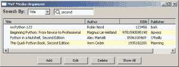
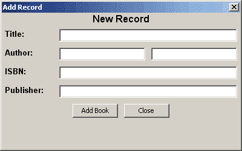

# wxPython 和 SqlAlchemy:MVC 和 CRUD 简介

> 原文：<https://www.blog.pythonlibrary.org/2011/11/10/wxpython-and-sqlalchemy-an-intro-to-mvc-and-crud/>

在本文中，我们将创建一个程序来存储我们的个人书籍，或者仅仅是你读过的书籍。它将演示如何结合 wxPython 和 SQL 对象关系映射器(ORM)SqlAlchemy。这个程序还将向您介绍模型-视图-控制器(MVC)和“创建、读取、更新和销毁”(CRUD)方法。目的是向您展示如何创建一个能够完成以下任务的应用程序:

*   创建数据库(创建)
*   向数据库添加记录(类似于创建)
*   显示记录(阅读和查看)
*   修改记录(更新)
*   删除记录(销毁)

本教程的顺序将遵循 MVC，所以我们将从模型开始。无论如何，模型是 GUI(视图)的基础，所以这是一个很好的起点。

## 先决条件

在我们进入模型部分之前，您可能需要下载一些额外的内容。这是你需要的:

*   Python 2.5 或更好，但不是 3.x
*   [wxPython](http://www.wxpython.org/)【2.8.10.1】= T2
*   [SQL 语法](http://www.sqlalchemy.org/) > = 0.5.0
*   [对象列表视图](http://pypi.python.org/pypi/ObjectListView)

一旦你安装了所有这些，你就可以进入下一部分了！

## 模型

我们的模型包含我们的 SqlAlchemy 数据库类和 ObjectListView 小部件的模型，稍后我们将使用它来显示我们的数据。SqlAlchemy 类使用的是[声明系统](http://www.sqlalchemy.org/docs/orm/extensions/declarative.html)，它结合了表创建和类创建。如果你只是看一下代码，就更容易理解了。

```py

# model.py

from sqlalchemy import Table, Column, create_engine
from sqlalchemy import Integer, ForeignKey, String, Unicode
from sqlalchemy.ext.declarative import declarative_base
from sqlalchemy.orm import backref, relation

engine = create_engine("sqlite:///devdata.db", echo=True)
DeclarativeBase = declarative_base(engine)
metadata = DeclarativeBase.metadata

########################################################################
class OlvBook(object):
    """
    Book model for ObjectListView
    """

    #----------------------------------------------------------------------
    def __init__(self, id, title, author, isbn, publisher, last_name, first_name):
        self.id = id  # unique row id from database
        self.title = title
        self.author = author
        self.isbn = isbn
        self.publisher = publisher
        self.last_name = last_name
        self.first_name = first_name

########################################################################
class Person(DeclarativeBase):
    """"""
    __tablename__ = "people"

    id = Column(Integer, primary_key=True)
    first_name = Column("first_name", String(50))
    last_name = Column("last_name", String(50))

    #----------------------------------------------------------------------
    def __repr__(self):
        """"""
        return "" % (self.first_name, self.last_name)

########################################################################
class Book(DeclarativeBase):
    """"""
    __tablename__ = "books"

    id = Column(Integer, primary_key=True)
    author_id = Column(Integer, ForeignKey("people.id"))
    title = Column("title", Unicode)
    isbn = Column("isbn", Unicode)
    publisher = Column("publisher", Unicode)
    person = relation("Person", backref="books", cascade_backrefs=False)

metadata.create_all() 
```

我们不打算花太多时间来解析这段代码，因为有几个 SqlAlchemy 教程，而且 SqlAlchemy 文档非常好。相反，我们将简单介绍一下。代码的开头导入了我们需要的所有 SqlAlchemy 内容。最重要的一点是在哪里创建引擎:

```py

engine = create_engine("sqlite:///devdata.db", echo=True)

```

这意味着我们将在模型所在的目录中创建一个 SQLite 数据库。您也可以传入一个路径，就像这样:**create _ engine(" SQLite:///c:/path/to/dev data . db ")**您可以随意命名数据库，包括扩展名。出于调试目的，打开**回声**参数。它将输出 SqlAlchemy 发出的所有 SQL，因此我们可以使用它来解决我们的查询或在创建数据库时可能突然出现的问题。

我们遇到的第一个类是 **OlvBook** ，它定义了一个 Book 类。稍后我们将使用它来帮助我们填充前面提到的 ObjectListView 小部件，我们将使用它来显示我们的记录。接下来的两类分别叫做**人**和**书**。表名是用神奇的方法定义的:__tablename__。Person 是 Book 中的外键，我们用它来指代我们的作者。最初，我认为我可以使用 Person 来添加多个作者或其他与这本书相关的人，比如艺术家。或者可能是我的一张 CD 的曲作者，但我决定保持简单。您可以稍微增强这个模型，使其更加多态，这样它就能以那种方式运行。

无论如何，如果您运行这个脚本，它将执行最后一行: **metadata.create_all()** 这将导致创建数据库文件并定义这两个表。现在我们准备向它添加数据。但首先，我们需要看看风景！

## 景色

[](https://www.blog.pythonlibrary.org/wp-content/uploads/2011/11/media_organizer.png)

视图是我们的 wxPython 接口，我们将使用它来显示记录以及过滤、添加、修改和删除它们。我们的 GUI 代码只有 150 多行。我们来看看吧！

```py

import addModRecord
import commonDlgs
import controller
import wx
from ObjectListView import ObjectListView, ColumnDefn

########################################################################
class BookPanel(wx.Panel):
    """"""

    #----------------------------------------------------------------------
    def __init__(self, parent):
        """Constructor"""
        wx.Panel.__init__(self, parent)
        try:
            self.bookResults = controller.getAllRecords()
        except:
            self.bookResults = []

        mainSizer = wx.BoxSizer(wx.VERTICAL)
        searchSizer = wx.BoxSizer(wx.HORIZONTAL)
        btnSizer = wx.BoxSizer(wx.HORIZONTAL)
        font = wx.Font(10, wx.SWISS, wx.NORMAL, wx.BOLD) 

        # create the search related widgets
        cat = ["Author", "Title", "ISBN", "Publisher"]
        searchByLbl = wx.StaticText(self, label="Search By:")
        searchByLbl.SetFont(font)
        searchSizer.Add(searchByLbl, 0, wx.ALL, 5)

        self.categories = wx.ComboBox(self, value="Author", choices=cat)
        searchSizer.Add(self.categories, 0, wx.ALL, 5)

        self.search = wx.SearchCtrl(self, style=wx.TE_PROCESS_ENTER)
        self.search.Bind(wx.EVT_TEXT_ENTER, self.onSearch)
        searchSizer.Add(self.search, 0, wx.ALL, 5)

        self.bookResultsOlv = ObjectListView(self, style=wx.LC_REPORT
                                                        |wx.SUNKEN_BORDER)
        self.bookResultsOlv.SetEmptyListMsg("No Records Found")
        self.setBooks()

        # create the button row
        addRecordBtn = wx.Button(self, label="Add")
        addRecordBtn.Bind(wx.EVT_BUTTON, self.onAddRecord)
        btnSizer.Add(addRecordBtn, 0, wx.ALL, 5)

        editRecordBtn = wx.Button(self, label="Edit")
        editRecordBtn.Bind(wx.EVT_BUTTON, self.onEditRecord)
        btnSizer.Add(editRecordBtn, 0, wx.ALL, 5)

        deleteRecordBtn = wx.Button(self, label="Delete")
        deleteRecordBtn.Bind(wx.EVT_BUTTON, self.onDelete)
        btnSizer.Add(deleteRecordBtn, 0, wx.ALL, 5)

        showAllBtn = wx.Button(self, label="Show All")
        showAllBtn.Bind(wx.EVT_BUTTON, self.onShowAllRecord)
        btnSizer.Add(showAllBtn, 0, wx.ALL, 5)

        mainSizer.Add(searchSizer)
        mainSizer.Add(self.bookResultsOlv, 1, wx.ALL|wx.EXPAND, 5)
        mainSizer.Add(btnSizer, 0, wx.CENTER)
        self.SetSizer(mainSizer)

    #----------------------------------------------------------------------
    def onAddRecord(self, event):
        """
        Add a record to the database
        """
        dlg = addModRecord.AddModRecDialog()
        dlg.ShowModal()
        dlg.Destroy()
        self.showAllRecords()

    #----------------------------------------------------------------------
    def onEditRecord(self, event):
        """
        Edit a record
        """
        selectedRow = self.bookResultsOlv.GetSelectedObject()
        if selectedRow == None:
            commonDlgs.showMessageDlg("No row selected!", "Error")
            return
        dlg = addModRecord.AddModRecDialog(selectedRow, title="Modify",
                                           addRecord=False)
        dlg.ShowModal()
        dlg.Destroy()
        self.showAllRecords()

    #----------------------------------------------------------------------
    def onDelete(self, event):
        """
        Delete a record
        """
        selectedRow = self.bookResultsOlv.GetSelectedObject()
        if selectedRow == None:
            commonDlgs.showMessageDlg("No row selected!", "Error")
            return
        controller.deleteRecord(selectedRow.id)
        self.showAllRecords()

    #----------------------------------------------------------------------
    def onSearch(self, event):
        """
        Searches database based on the user's filter choice and keyword
        """
        filterChoice = self.categories.GetValue()
        keyword = self.search.GetValue()
        print "%s %s" % (filterChoice, keyword)
        self.bookResults = controller.searchRecords(filterChoice, keyword)
        self.setBooks()

    #----------------------------------------------------------------------
    def onShowAllRecord(self, event):
        """
        Updates the record list to show all of them
        """
        self.showAllRecords()

    #----------------------------------------------------------------------
    def setBooks(self):
        self.bookResultsOlv.SetColumns([
            ColumnDefn("Title", "left", 350, "title"),
            ColumnDefn("Author", "left", 150, "author"),
            ColumnDefn("ISBN", "right", 150, "isbn"),
            ColumnDefn("Publisher", "left", 150, "publisher")
        ])
        self.bookResultsOlv.SetObjects(self.bookResults)

    #----------------------------------------------------------------------
    def showAllRecords(self):
        """
        Show all records in the object list view control
        """
        self.bookResults = controller.getAllRecords()
        self.setBooks()

########################################################################
class BookFrame(wx.Frame):
    """"""

    #----------------------------------------------------------------------
    def __init__(self):
        """Constructor"""
        wx.Frame.__init__(self, None, title="MvP Media Organizer",
                          size=(800, 600))
        panel = BookPanel(self)

        self.Show()

#----------------------------------------------------------------------
if __name__ == "__main__":
    app = wx.App(False)
    frame = BookFrame()
    app.MainLoop()

```

您会注意到我们导入了一些自定义项目，如 addModRecord、commonDlgs 和 controller。 **addModRecord** 是一个对话框，可用于添加记录和修改记录。 **commonDlgs** 模块只是用来简化创建消息对话框。如果我们给这个程序添加一些新功能，我们会在那个模块中添加其他小的对话框代码。**控制器**模块是所有 SqlAlchemy 代码执行的地方。大多数程序都有一些配置选项，所以这是存储代码的好地方。

无论如何，让我们回顾一下 GUI 的亮点。搜索栏被设置为当用户按 enter 时进行搜索。这就是风格标志 **wx。TE_PROCESS_ENTER** 的意思是。这和 ObjectListView 的 **SetEmptyListMsg** 方法可能是这里唯一真正陌生的东西。当控件中没有数据时，该方法只向用户显示一条消息。

onAddRecord 的**和 onEditRecord** 的**都调用我们的 addModRecord 模块来显示添加/修改对话框。它应该是这样的:**

[](https://www.blog.pythonlibrary.org/wp-content/uploads/2011/11/media_org_add_record.png)

方法 **onEditRecord** 设置了几个影响小部件外观的参数，并传递一些信息来填充字段。 **onDelete** 方法只是获取选中的项目并调用控制器删除它，然后更新显示。

我们的 **onSearch** 方法可以实现您的预期。它根据用户选择的过滤器和他们的关键字在我们的数据库中搜索记录。他们可以选择“作者”、“书名”、“ISBN”或“出版商”作为他们的过滤器。

**onShowAllRecord** 方法只是在显示屏上显示所有的记录。未来的增强将是限制当前显示记录的数量，这样我们就不会导致应用程序速度大幅下降。 **setBooks** 方法只是更新显示的记录。

现在我们已经到了拼图的最后一块:控制器。

## 控制器和 CRUD

控制器是将模型和视图结合在一起的粘合剂。至少，在我看来是这样。它使用该模型进行查询以及添加、更新和删除记录。它还向视图(我们的 GUI)报告数据库的更新，这样它就可以适当地更新。让我们看看我们的控制器代码:

```py

# controller.py
from model import Book, Person, OlvBook
from sqlalchemy import create_engine
from sqlalchemy.orm import sessionmaker

#----------------------------------------------------------------------
def addRecord(data):
    """
    Data should be a tuple of two dictionaries in the following format:

    ("author":{"first_name":"John", "last_name":"Doe"},
     "book":{"title":"Some book", "isbn":"1234567890", 
             "publisher":"Packt"}
    )
    """
    book = Book()
    book.title = data["book"]["title"]
    book.isbn = data["book"]["isbn"]
    book.publisher = data["book"]["publisher"]
    author = Person()
    author.first_name = data["author"]["first_name"]
    author.last_name = data["author"]["last_name"]
    book.person = author

    # connect to session and commit data to database
    session = connectToDatabase()
    session.add(book)
    session.commit()
    session.close()

#----------------------------------------------------------------------
def connectToDatabase():
    """
    Connect to our SQLite database and return a Session object
    """
    engine = create_engine("sqlite:///devdata.db", echo=True)
    Session = sessionmaker(bind=engine)
    session = Session()
    return session

#----------------------------------------------------------------------
def convertResults(results):
    """
    Convert results to OlvBook objects
    """
    print
    books = []
    for record in results:
        author = "%s %s" % (record.person.first_name, 
                            record.person.last_name)
        book = OlvBook(record.id, record.title, author,
                       record.isbn, record.publisher,
                       record.person.last_name,
                       record.person.first_name
                       )    
        books.append(book)
    return books

#----------------------------------------------------------------------
def deleteRecord(idNum):
    """
    Delete a record from the database
    """
    session = connectToDatabase()
    record = session.query(Book).filter_by(id=idNum).one()
    session.delete(record)
    session.commit()
    session.close()

#----------------------------------------------------------------------
def editRecord(idNum, row):
    """
    Edit a record
    """
    session = connectToDatabase()
    record = session.query(Book).filter_by(id=idNum).one()
    print
    record.title = row["title"]
    record.person.first_name = row["first_name"]
    record.person.last_name = row["last_name"]
    record.isbn = row["isbn"]
    record.publisher = row["publisher"]
    session.add(record)
    session.commit()
    session.close()

#----------------------------------------------------------------------
def getAllRecords():
    """
    Get all records and return them
    """
    session = connectToDatabase()
    result = session.query(Book).all()
    books = convertResults(result)
    session.close()
    return books

#----------------------------------------------------------------------
def searchRecords(filterChoice, keyword):
    """
    Searches the database based on the filter chosen and the keyword
    given by the user
    """
    session = connectToDatabase()
    if filterChoice == "Author":
        qry = session.query(Person)
        result = qry.filter(Person.first_name.contains('%s' % keyword)).all()
        records = []
        for record in result:
            for book in record.books:
                records.append(book)
        result = records
        print result
    elif filterChoice == "Title":
        qry = session.query(Book)
        result = qry.filter(Book.title.contains('%s' % keyword)).all()
    elif filterChoice == "ISBN":
        qry = session.query(Book)
        result = qry.filter(Book.isbn.contains('%s' % keyword)).all()
    else:
        qry = session.query(Book)
        result = qry.filter(Book.publisher.contains('%s' % keyword)).all()    
    books = convertResults(result)
    print
    return books

```

我们的控制器定义了 7 个功能:

*   addRecord(添加记录)
*   连接数据库
*   转换结果
*   删除记录
*   编辑记录
*   getAllRecords
*   搜索记录

这些都是不言自明的。然而，我们将花一点时间来解释 **convertResults** 做什么以及 **searchRecords** 如何工作。

**convertResults** 方法用于将我们通过查询数据库获得的 SqlAlchemy 图书结果转换为 ObjectListView 图书模型对象。这是必要的，这样我们就可以在数据库更新或显示查询结果时显示它们。如您所见，我们只是迭代结果并适当地处理数据。

在 **searchRecords** 方法中，我们传入过滤器和关键字，并通过条件“if”语句使用我们的会话对象对数据库进行查询。根据过滤器的类型，我们进行不同的查询。在很大程度上，查询是相同的，所以这可能需要一些重构。我将把这作为一项任务留给读者去解决。一旦我们转换了结果，我们就将它们返回给调用函数，在本例中，调用函数恰好是 GUI 的搜索事件处理程序。

CRUD 部分包含在我们创建、读取、更新和删除记录的其他方法中。

## 包扎

现在您应该知道使用 MVC 框架创建 wxPython 程序背后的基础知识了。这不是一个完美的例子，我也不认为它是，但是它应该给你一个如何开始制作自己的例子的想法。它还展示了如何使用 SqlAlchemy 与 SQLite 数据库进行交互。我希望这对您有所帮助，并期待听到您的评论。

## 源代码

*   您可以从[位桶](https://bitbucket.org/driscollis/mousevspython/src/default/Published/2011-11-10-wxpython-mvp-crud/)中检查代码