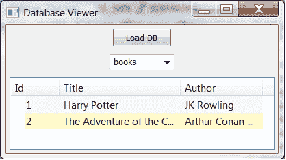

# wxPython 和 SQLAlchemy:加载随机 SQLite 数据库以供查看

> 原文：<https://www.blog.pythonlibrary.org/2012/06/04/wxpython-and-sqlalchemy-loading-random-sqlite-databases-for-viewing/>

最近有人联系我，询问是否有任何 wxPython 应用程序可以提供 SQLite 数据库。据我所知，他们希望能够自省数据库并查看表格，可能会使用 wx.grid.Grid 小部件。我发现网格小部件非常强大，但也很难使用。所以我花了一些时间编写了一个超级简单的应用程序，它使用了 [ObjectListView](http://pypi.python.org/pypi/ObjectListView) 小部件。

### 入门指南

首先，我们需要一个数据库来测试。所以我最终用 SQLAlchemy 编写了一个简单的数据库创建脚本，用几行填充几个表。这是我正在使用的脚本:

```py

from sqlalchemy import create_engine
from sqlalchemy.orm import relationship, backref, sessionmaker
from sqlalchemy.ext.declarative import declarative_base
from sqlalchemy import Column, ForeignKey, Integer, String

engine = create_engine('sqlite:///example.db', echo=True)
Base = declarative_base()

########################################################################
class Book(Base):
    """"""
    __tablename__ = "books"

    id = Column(Integer, primary_key = True)
    title = Column(String)
    author = Column(String)

    #----------------------------------------------------------------------
    def __init__(self, title, author):
        """Constructor"""
        self.title = title
        self.author = author

########################################################################
class Character(Base):
    """"""
    __tablename__ = "characters"

    id = Column(Integer, primary_key = True)
    first_name = Column(String)
    last_name = Column(String)
    book_id = Column(ForeignKey("books.id"))
    book = relationship("Book", backref=backref("characters", order_by=id))

    #----------------------------------------------------------------------
    def __init__(self, first_name, last_name):
        """Constructor"""
        self.first_name = first_name
        self.last_name = last_name

    #----------------------------------------------------------------------
    @property
    def fullname(self):
        """"""
        return "%s %s" % (self.first_name, self.last_name)

    #----------------------------------------------------------------------
    def __repr__(self):
        """"""
        return "" % self.fullname

Base.metadata.create_all(engine) 
Session = sessionmaker(bind=engine)
session = Session()
print
new_char = Character("Hermione", "Granger")
new_char.book = Book("Harry Potter", "JK Rowling")
session.add(new_char)
new_char = Character("Sherlock", "Holmes")
new_char.book = Book("The Adventure of the Creeping Man", "Arthur Conan Doyle")
session.add(new_char)
session.commit() 
```

我将假设您对 SQLAlchemy 有足够的了解，能够理解这一点。如果没有，他们有一些我用过的 Python 项目中最好的文档。

### 创建查看器

[](https://www.blog.pythonlibrary.org/wp-content/uploads/2012/06/wxDbViewer.png)

现在我们只需要创建数据库表查看器。这花了我一点时间，但我最终弄明白了。请注意，它基本上是阿尔法质量，没有任何错误检查。

```py

import os
import wx
from ObjectListView import ObjectListView, ColumnDefn
from sqlalchemy import create_engine, MetaData, Table
from sqlalchemy.orm import mapper, sessionmaker, clear_mappers

########################################################################
class GenericDBClass(object):
    """"""
    pass

########################################################################
class MainPanel(wx.Panel):
    #----------------------------------------------------------------------
    def __init__(self, parent):
        wx.Panel.__init__(self, parent=parent, id=wx.ID_ANY)
        self.db_data = []
        self.current_directory = os.getcwd()

        self.dataOlv = ObjectListView(self, wx.ID_ANY, style=wx.LC_REPORT|wx.SUNKEN_BORDER)
        self.dataOlv.Hide()

        # Allow the cell values to be edited when double-clicked
        self.dataOlv.cellEditMode = ObjectListView.CELLEDIT_SINGLECLICK

        # load DB
        loadDBBtn = wx.Button(self, label="Load DB")
        loadDBBtn.Bind(wx.EVT_BUTTON, self.loadDatabase)
        self.table_names = []
        self.tableCbo = wx.ComboBox(self, value="", choices=self.table_names)
        self.tableCbo.Bind(wx.EVT_COMBOBOX, self.loadTable)

        # Create some sizers
        mainSizer = wx.BoxSizer(wx.VERTICAL)

        mainSizer.Add(loadDBBtn, 0, wx.ALL|wx.CENTER, 5)
        mainSizer.Add(self.tableCbo, 0, wx.ALL|wx.CENTER, 5)
        mainSizer.Add(self.dataOlv, 1, wx.ALL|wx.EXPAND, 5)

        self.SetSizer(mainSizer)

    #----------------------------------------------------------------------
    def loadTable(self, event):
        """"""
        print
        current_table = self.tableCbo.GetValue()
        metadata = MetaData(self.engine)
        table = Table(current_table, metadata, autoload=True, autoload_with=self.engine)
        self.columns = table.columns.keys()

        clear_mappers() #http://docs.sqlalchemy.org/en/rel_0_6/orm/mapper_config.html#sqlalchemy.orm.clear_mappers
        mapper(GenericDBClass, table)

        Session = sessionmaker(bind=self.engine)
        session = Session()
        self.db_data = session.query(GenericDBClass).all()

        self.setData()
        self.dataOlv.Show()
        self.Layout()

    #----------------------------------------------------------------------
    def loadDatabase(self, event):
        """"""
        wildcard = "All files (*.*)|*.*"
        dlg = wx.FileDialog(
            self, message="Choose a file",
            defaultDir=self.current_directory,
            defaultFile="",
            wildcard=wildcard,
            style=wx.OPEN | wx.CHANGE_DIR
            )
        if dlg.ShowModal() == wx.ID_OK:
            db_path = dlg.GetPath()
            dlg.Destroy()
        else:
            dlg.Destroy()
            return

        self.engine = create_engine('sqlite:///%s' % db_path, echo=True)

        self.table_names = self.engine.table_names()
        self.tableCbo.SetItems(self.table_names)
        self.tableCbo.SetValue(self.table_names[0])
        self.loadTable("")

    #----------------------------------------------------------------------
    def setData(self, data=None):
        olv_columns = []
        for column in self.columns:
            olv_columns.append(ColumnDefn(column.title(), "left", 120, column.lower()))
        self.dataOlv.SetColumns(olv_columns)

        self.dataOlv.SetObjects(self.db_data)

########################################################################
class MainFrame(wx.Frame):
    #----------------------------------------------------------------------
    def __init__(self):
        wx.Frame.__init__(self, parent=None, id=wx.ID_ANY,
                          title="Database Viewer", size=(800,600))
        panel = MainPanel(self)

########################################################################
class GenApp(wx.App):

    #----------------------------------------------------------------------
    def __init__(self, redirect=False, filename=None):
        wx.App.__init__(self, redirect, filename)

    #----------------------------------------------------------------------
    def OnInit(self):
        # create frame here
        frame = MainFrame()
        frame.Show()
        return True

#----------------------------------------------------------------------
def main():
    """
    Run the demo
    """
    app = GenApp()
    app.MainLoop()

if __name__ == "__main__":
    main()

```

让我们花点时间来分析一下这是如何工作的。您会注意到，在我们创建了 ObjectListView 小部件之后，我们隐藏了它，因为我们还不知道它包含了什么。这不会发生，直到用户点击 **Load DB** 按钮。在 **loadDatabase** 处理程序中，我们弹出一个文件对话框，允许用户选择他们想要加载的 SQLite 数据库文件。对于这个测试，我建议使用我们之前创建的数据库。选择之后，我们创建一个 SQLALchemy 引擎，从中提取表名，将 combobox 下拉列表设置为表名列表，然后通过调用我们的 **loadTable** 方法加载列表中的第一个表。

在 loadTable 中，我们使用 SQLAlchemy 方便的 **autoload** 特性将数据库中的数据“反映”到一个表对象中。我们调用 **clear_mappers** 是因为我们需要确保当前没有任何东西被映射到我们的虚拟类，然后我们将新表映射到这个类。最后，我们创建一个 SQLAlchemy 会话，并执行一个简单的 **SELECT *** 查询，从数据库中提取所有记录，并将它们传递给 ObjectListView 小部件，然后我们将展示这个小部件。

### 包扎

我试着对 Mozilla 的 places 数据库运行这个脚本，但是我的小应用程序不喜欢它。请随意尝试用您的数据库来打破它。目前这只是一个概念验证。大约一年前，我自己也有过类似的想法，我可能会在未来尝试改进一下。同时，我想贴上我的初稿，看看我能得到什么样的反馈。我希望你喜欢它！

*注意:使用 Python 2.6.6 在 Windows 7、wxPython 2.8.12.1 上测试*

### 进一步阅读

*   [SQLAlchemy、反射、不同后端和表/列不区分大小写](http://stackoverflow.com/questions/9383837/sqlalchemy-reflection-different-backends-and-table-column-case-insensitivity)

### 源代码

*   [wxDbViewer.zip](https://www.blog.pythonlibrary.org/wp-content/uploads/2012/06/wxDbViewer.zip)