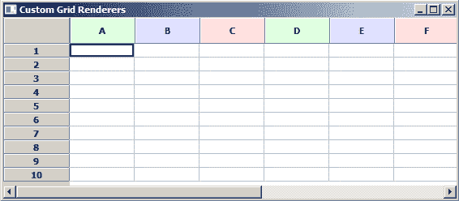

# wxPython:更改列/行的自定义渲染器

> 原文：<https://www.blog.pythonlibrary.org/2019/01/03/wxpython-changing-custom-renderers-for-columns-rows/>

wxPython GUI toolkit 有一个非常丰富和强大的网格小部件，我在之前的博客中已经提到过。它允许您创建类似于 Microsoft Excel 中的单元格表。

还有一个简洁的 mixin，允许您将定制的渲染器应用到网格的列和行的标签上。

让我们来看看它是如何工作的:

```py

import wx
import wx.grid as grid
import wx.lib.mixins.gridlabelrenderer as glr

class MyGrid(grid.Grid, glr.GridWithLabelRenderersMixin):

    def __init__(self, *args, **kw):
        grid.Grid.__init__(self, *args, **kw)
        glr.GridWithLabelRenderersMixin.__init__(self)

class MyColLabelRenderer(glr.GridLabelRenderer):

    def __init__(self, bgcolor):
        self._bgcolor = bgcolor

    def Draw(self, grid, dc, rect, col):
        dc.SetBrush(wx.Brush(self._bgcolor))
        dc.SetPen(wx.TRANSPARENT_PEN)
        dc.DrawRectangle(rect)
        hAlign, vAlign = grid.GetColLabelAlignment()
        text = grid.GetColLabelValue(col)
        self.DrawBorder(grid, dc, rect)
        self.DrawText(grid, dc, rect, text, hAlign, vAlign)

class MyPanel(wx.Panel):

    def __init__(self, parent):
        wx.Panel.__init__(self, parent)

        grid = MyGrid(self, size=(100, 100))
        grid.CreateGrid(numRows=10, numCols=10)

        for col in range(0, 10, 3):
            grid.SetColLabelRenderer(
                col+0, MyColLabelRenderer('#e0ffe0'))
            grid.SetColLabelRenderer(
                col+1, MyColLabelRenderer('#e0e0ff'))
            grid.SetColLabelRenderer(
                col+2, MyColLabelRenderer('#ffe0e0'))

        main_sizer = wx.BoxSizer(wx.VERTICAL)
        main_sizer.Add(grid, 1, wx.EXPAND)
        self.SetSizer(main_sizer)

class MyFrame(wx.Frame):

    def __init__(self):
        wx.Frame.__init__(self, None, title='Custom Grid Renderers')
        panel = MyPanel(self)
        self.Show()

if __name__ == '__main__':
    app = wx.App(False)
    frame = MyFrame()
    app.MainLoop(

```

让我们把它分解一下。您会注意到在代码的顶部，我们需要在 wxPython 中单独导入**网格**小部件。我们还需要导入一个名为**的 mixin。我们子类化 Grid 类，添加 mixin，然后初始化两者。**

接下来我们创建一个**gridlabellerenderer**的子类，它也来自 mixin。这允许我们创建一个间距**绘制**方法，这将使我们能够在网格中的标签上应用不同的颜色或字体。在这种情况下，我只是让我们可以改变标签中文本的颜色。

我们感兴趣的最后一段代码是在 **MyPanel** 类中，我们实际上实例化了网格并改变了列中标签的背景颜色。这是网格最终的样子:



Custom Grid Column Renderers

## 包扎

wxPython 工具包有几十个预构建的小部件，可以用来创建跨平台的用户界面。wxPython 演示有一个比本文更复杂的例子，您可能也会感兴趣。如果您还没有尝试过 wxPython，那么您真的应该去尝试一下。它可以从 PyPI 进行 pip 安装，并且与 Python 3 兼容。