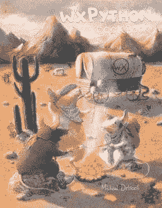

# wxPython 食谱艺术家访谈:丽莎·特雷蒂亚科娃

> 原文：<https://www.blog.pythonlibrary.org/2017/01/05/wxpython-cookbook-artist-interview-liza-tretyakova/>

我总是在书的封面上花很多心思。我的第一本书是关于 wxPython 的，我认为写一本食谱会很有趣，因为我的博客上已经有很多食谱了。所以我有了写一本食谱的想法。对于封面，我的第一个想法是有一些老鼠厨师的厨房场景。后来，我觉得这太明显了，于是决定采用西部牛仔(或牛老鼠)在火上烹饪的老创意。

我请 wxPython Cookbook 的封面艺术家 Liza Tretyakova 做了一个关于她自己的简短采访。以下是她要说的话:

你能告诉我们一些关于你自己的情况吗(爱好、教育等)

我叫 Liza Tretyakova，是一名自由职业的插图画家，目前在莫斯科工作。

教育:

*   莫斯科国立大学艺术历史学院
*   普利茅斯大学插图文学学士(荣誉)

 *我从事插画工作 10 年左右。我喜欢马，我曾经养过一匹马。另外，我对射箭很感兴趣。我喜欢阅读，并和我 7 岁的女儿 Yara 一起度过了很多时光。*

与其他职业相比，是什么促使你成为一名插画师？

当我还是个孩子的时候，我就一直在画画，只是碰巧我开始从事插图画家的工作，这就变成了一种职业。

当你创作一件新的艺术品时，你会经历什么样的过程？

每次都不一样，没有特定的“食谱”🙂

对于想成为插画师的人，你有什么建议吗？

你应该试着每天画画，越多越好。

你还有什么想说的吗？

和你一起工作很愉快！

非常感谢你接受采访并同意做我的 wxPython 食谱的插图画家。

你可以在网站上看到更多丽莎的作品。