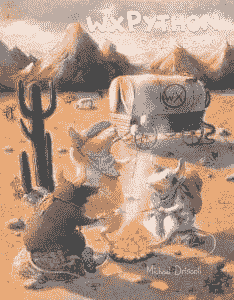

# wxPython 食谱可供预购

> 原文：<https://www.blog.pythonlibrary.org/2016/09/27/wxpython-cookbook-available-for-pre-order/>

我很高兴地宣布，wxPython 食谱现在可以预购了。你现在就可以在 Gumroad 或 T2 Leanpub 获得你的电子版。如果你想“先试后买”，你可以在 Leanpub 上得到这本书的样本。

这本书里会有 50 多个食谱。我书中的例子既适用于 wxPython 3.0.2 Classic，也适用于 wxPython Phoenix，后者是 wxPython 支持 Python 3 的前沿技术。如果我发现任何不适合凤凰城的食谱，它们会被清楚地标记出来，或者会有一个可行的替代例子。

以下是当前食谱的部分列表，排名不分先后:

*   动态添加/移除小部件
*   如何在面板上放置背景图像
*   将多个小部件绑定到同一个处理程序
*   从任何地方捕捉异常
*   wxPython 的上下文管理器
*   转换 wx。日期时间到 Python 日期时间
*   创建“关于”框
*   如何创建登录对话框
*   如何创建“黑暗模式”
*   从配置文件生成对话框
*   如何禁用向导的“下一步”按钮
*   如何使用拖放
*   如何将文件从应用程序拖放到操作系统
*   如何使用 reload()交互式编辑您的 GUI
*   如何在标题栏中嵌入图像
*   从 RichTextCtrl 中提取 XML
*   如何淡入一个框架/对话框
*   如何触发多个事件处理程序
*   使您的框架最大化或全屏
*   使用 wx。框架样式
*   获取事件名称而不是整数
*   如何从 Sizer 中获取子部件
*   如何使用剪贴板
*   捕捉按键和字符事件
*   了解 wxPython 中焦点的工作方式
*   让您的文本闪烁
*   最小化到系统托盘
*   使用 ObjectListView 而不是 ListCtrl

你可以在我的 Kickstarter 公告[文章](https://www.blog.pythonlibrary.org/2016/08/22/ann-the-wxpython-cookbook-kickstarter/)中读到更多关于这个项目的信息。请注意，Kickstarter 活动已经结束。

### 相关职位

*   wxPython 食谱[封面故事](https://www.blog.pythonlibrary.org/2016/09/08/wxpython-cookbook-cover-story/)
*   wxPython 食谱[样本章节](https://www.blog.pythonlibrary.org/2016/08/29/wxpython-cookbook-sample-chapters/)