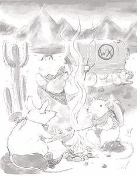
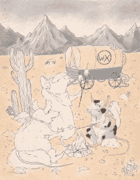
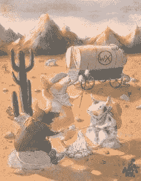

# wxPython 食谱封面故事

> 原文：<https://www.blog.pythonlibrary.org/2016/09/08/wxpython-cookbook-cover-story/>

我总是花一些时间思考我希望我的书的封面是什么样子。当我设计这本烹饪书的封面时，我主要考虑的是食物和厨师。我原本想我可能会有一些厨房场景，老鼠戴着厨师帽，一条蛇在壁炉架上。但是我想把烹饪的想法融入其中。

我想到的不是厨房，而是放牛的牛仔，以及他们通常如何带着厨师。所以我采用了这个想法，尽管我没有把成群的动物加到封面上。

为了帮助区分食谱和我以前的作品，我从我以前的作品中聘请了一位不同的艺术家，名叫丽莎·特雷蒂亚科娃。你可以在 [Behance](https://www.behance.net/LizaTretyakova) 上查看她的一些作品，或者如果你碰巧需要一位伟大的艺术家，甚至可以通过电子邮件(schimmel@inbox.ru)直接联系她。

我想，当我和这位艺术家一起把我的封面创意变成现实的时候，让你看看封面艺术是如何演变的，可能会很有趣。让我们从我从 Liza 那里得到的第一张草图开始:

这张草图给我留下了很深的印象，因为我以前的艺术家总是给我更粗糙的草图来看。下一步是给封面增添一点色彩:

在这一点上，我真的没有想太多如何让每只老鼠都有独特的颜色。莉莎提出了那个想法，我同意了。倒数第二步是给封面添加几乎全彩:

这看起来真的很好，所以我批准了，丽莎完成了封面。正如您可能已经看到的，它看起来像这样:

整个过程花了我和丽莎大约一周半的时间。我觉得结果挺好的！

如果你想支持这本书，或者你想在我以前的书上得到一笔好交易，一定要看看 Kickstarter。