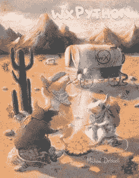

# wxPython 食谱-提供精装版

> 原文：<https://www.blog.pythonlibrary.org/2016/09/15/wxpython-cookbook-hard-cover-editions-available/>

很长一段时间以来，我一直在考虑为我的书做一个精装版，所以我想我可以用烹饪书来试试。我继续用我的按需打印机资源计算数字，发现普通的硬皮封面并不贵。因此，我为这本书的精装版增加了一个定价为 35 美元的新优惠。

但是等等！还有呢！由于这本烹饪书将有如此多的截图和代码示例，我想到提供这本书的彩色版本可能会很有趣。这样你可以看到全彩色的截图，也可以看到代码示例中的语法高亮显示！不幸的是，彩色印刷非常昂贵。但是如果你对那个选项感兴趣，它可以在 **$100** 买到。

这本书的所有版本都要签名。如果人们对黑白硬皮封面很感兴趣，我会增加这种封面的商品数量。

要得到这些版本或普通平装本，你需要在 [Kickstarter](https://www.kickstarter.com/projects/34257246/wxpython-cookbook) 上认捐。

