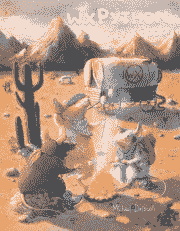

# wxPython 食谱写作更新:测试版可用

> 原文：<https://www.blog.pythonlibrary.org/2016/11/01/wxpython-cookbook-writing-update-beta-version-available/>

我很高兴地宣布，我现在已经准备好了我最新的一本书 **wxPython Cookbook** 的所有章节，随时可以阅读。我仍然认为这本书处于测试阶段，因为我需要在这个月尽可能多地阅读每一章并检查它们，但我也很有信心这本书已经完成了 90%以上。一些章节仍然需要添加一两个截图，我也计划再添加一两个章节。

喜欢原始数据的朋友，目前在书+入门和安装章节里有 **51 个食谱**。内容有 300 多页，比我之前的两本书都多！

我希望通过添加丢失的截图和写一个全新的篇章来做一些润色。我也希望在本周将一些代码示例放入 Github。我很抱歉耽搁了这件事。我这边的生活真的很疯狂。

你可以在 [Leanpub](https://leanpub.com/wxpythoncookbook/) 和 [Gumroad](http://gum.co/wxcookbook) 上提前看到这本书。如果您从这些网站中的任何一个购买了这本书，您还将收到最终产品+更新。你也可以查看最初的 [Kickstarter 活动](https://www.kickstarter.com/projects/34257246/wxpython-cookbook/description)来了解更多关于这本书的信息。

再次感谢大家的支持！

