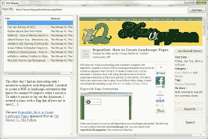

# wxPython:创建一个简单的 RSS 阅读器

> 原文：<https://www.blog.pythonlibrary.org/2014/01/09/wxpython-create-rss-reader/>

真正简单的聚合(RSS)已经伴随我们很长一段时间了，它让我们可以很容易地在我们最喜欢的网站上看到新文章。Python 在标准库中没有 RSS 阅读器模块，所以我们将使用[通用提要解析器 5.1.3](http://pythonhosted.org/feedparser/index.html) 来进行解析。如果你还没有它，你应该现在就去 [Python 包索引](https://pypi.python.org/pypi/feedparser)下载。我们将使用这个博客的 RSS 提要来简化测试。该提要的 url 是:【https://www.blog.pythonlibrary.org/feed/】的。在我的实验中，我注意到我的博客软件会将破折号更改为以下 unicode 字符:\u2013。这将导致 feedparser 抛出一个 UnicodeEncodeError，所以我也建议下载方便的 [unidecode 模块](https://pypi.python.org/pypi/Unidecode)来帮助解决这个问题。

### 入门指南

一旦你具备了上面提到的先决条件，我们就可以开始了。 **feedparser** 包实际上是一个单独的模块，非常容易使用。这里有一个简单的例子:

```py

import feedparser

rss = 'https://www.blog.pythonlibrary.org/feed/'
feed = feedparser.parse(rss)
for key in feed["entries"]: 
    print unidecode.unidecode(key["title"])

```

如果运行这段代码，它将打印出博客中 10 篇最新的文章标题。如果你很好奇，试着打印出**提要**变量。如果你这样做，你会看到一本相当难懂的粗糙的字典。最后，我做了以下事情，以便于阅读:

```py

import pprint
pp = pprint.PrettyPrinter(indent=4)
pp.pprint(feed)

```

这将为您提供类似于以下代码片段的打印输出:

```py

{   'bozo': 0,
    'encoding': u'UTF-8',
    'entries': [   {   'author': u'Mike',
                       'author_detail': {   'name': u'Mike'},
                       'authors': [{   }],
                       'comments': u'https://www.blog.pythonlibrary.org/2014/01/03/reportlab-create-landscape-pages/#comments',
                       'content': [   {   'base': u'https://www.blog.pythonlibrary.org/feed/',
                                          'language': None,
                                          'type': u'text/html',

                       'guidislink': False,
                       'id': u'https://www.blog.pythonlibrary.org/?p=3639',
                       'link': u'https://www.blog.pythonlibrary.org/2014/01/03/reportlab-create-landscape-pages/',
                       'links': [   {   'href': u'https://www.blog.pythonlibrary.org/2014/01/03/reportlab-create-landscape-pages/',
                                        'rel': u'alternate',
                                        'type': u'text/html'}],
                       'published': u'Fri, 03 Jan 2014 22:54:11 +0000',
                       'published_parsed': time.struct_time(tm_year=2014, tm_mon=1, tm_mday=3, tm_hour=22, tm_min=54, tm_sec=11, tm_wday=4, tm_yday=3, tm_isdst=0),
                       'slash_comments': u'0',
                       'summary': u'前几天，我需要用 Reportlab 完成一个有趣的任务。我需要创建一个横向的 PDF，保存时必须旋转 90 度。为了使文档的布局更容易，我创建了一个带有标志的类，它允许我保存[…]帖子 [Reportlab:如何创建风景页面](https://www.blog.pythonlibrary.org/2014/01/03/reportlab-create-landscape-pages/)最早出现在[鼠标大战 Python](https://www.blog.pythonlibrary.org) 上。',
                       'summary_detail': {   'base': u'https://www.blog.pythonlibrary.org/feed/',
                                             'language': None,
                                             'type': u'text/html',
                                             'value': u'前几天，我需要用 Reportlab 完成一个有趣的任务。我需要创建一个横向的 PDF，保存时必须旋转 90 度。为了使文档的布局更容易，我创建了一个带有标志的类，它允许我保存[…]帖子 [Reportlab:如何创建风景页面](https://www.blog.pythonlibrary.org/2014/01/03/reportlab-create-landscape-pages/)最早出现在[鼠标大战 Python](https://www.blog.pythonlibrary.org) 上。'},
                       'tags': [   {   'label': None,
                                       'scheme': None,
                                       'term': u'Cross-Platform'},
                                   {   'label': None,
                                       'scheme': None,
                                       'term': u'Python'},
                                   {   'label': None,
                                       'scheme': None,
                                       'term': u'Reportlab'}],
                       'title': u'Reportlab: How to Create Landscape Pages',
                       'title_detail': {   'base': u'https://www.blog.pythonlibrary.org/feed/',
                                           'language': None,
                                           'type': u'text/plain',
                                           'value': u'Reportlab: How to Create Landscape Pages'},
                       'wfw_commentrss': u'https://www.blog.pythonlibrary.org/2014/01/03/reportlab-create-landscape-pages/feed/'},

```

我把它缩短了很多，因为你会看到很多细节。无论如何，回到解析提要字典。如果您打印出这些键，您会看到它们如下:feed、status、updated、updated_parsed、encoding、bozo、headers、href、version、entries、namespaces。我认为可能最有用的是**条目**键。如果您访问它的值，您会发现一个字典列表，其中包含关于这十篇文章中每一篇的信息。

当然，如果我们没有显示数据的好方法，这就没什么意思了。让我们花点时间使用 wxPython 创建一个简单的用户界面！

### 创建用户界面

[](https://www.blog.pythonlibrary.org/wp-content/uploads/2014/01/wxrss.png)

我推荐在下一篇文章中使用 wxPython 2.9 或更高版本，因为 WebView 小部件是在该系列文章中添加的，这使得显示 HTML 更加简单。我将使用 wxPython 2.9.4(经典版)。我还将使用 ObjectListView，所以在尝试做这个练习之前，请确保您安装了正确的包。让我们直接进入代码！

```py

# wxRss.py

import feedparser
import os
import unidecode
import wx
import wx.html2 as webview

from ObjectListView import ObjectListView, ColumnDefn

########################################################################
class RSS(object):
    """
    RSS object
    """

    #----------------------------------------------------------------------
    def __init__(self, title, link, website, summary, all_data):
        """Constructor"""
        self.title = title
        self.link = link
        self.all_data = all_data
        self.website = website
        self.summary = summary

########################################################################
class RssPanel(wx.Panel):
    """"""

    #----------------------------------------------------------------------
    def __init__(self, parent):
        """Constructor"""
        wx.Panel.__init__(self, parent, style=wx.NO_FULL_REPAINT_ON_RESIZE)
        self.data = []

        lbl = wx.StaticText(self, label="Feed URL:")
        self.rssUrlTxt = wx.TextCtrl(self, value="https://www.blog.pythonlibrary.org/feed/")
        urlBtn = wx.Button(self, label="Get Feed")
        urlBtn.Bind(wx.EVT_BUTTON, self.get_data)

        self.rssOlv = ObjectListView(self, 
                                     style=wx.LC_REPORT|wx.SUNKEN_BORDER)
        self.rssOlv.SetEmptyListMsg("No data")
        self.rssOlv.Bind(wx.EVT_LIST_ITEM_SELECTED, self.on_select)
        self.rssOlv.Bind(wx.EVT_LIST_ITEM_ACTIVATED, self.on_double_click)
        self.summaryTxt = webview.WebView.New(self)

        self.wv = webview.WebView.New(self)

        # add sizers
        rowSizer = wx.BoxSizer(wx.HORIZONTAL)
        rowSizer.Add(lbl, 0, wx.ALL, 5)
        rowSizer.Add(self.rssUrlTxt, 1, wx.EXPAND|wx.ALL, 5)
        rowSizer.Add(urlBtn, 0, wx.ALL, 5)

        vSizer = wx.BoxSizer(wx.VERTICAL)
        vSizer.Add(self.rssOlv, 1, wx.EXPAND|wx.ALL, 5)
        vSizer.Add(self.summaryTxt, 1, wx.EXPAND|wx.ALL, 5)

        dispSizer = wx.BoxSizer(wx.HORIZONTAL)
        dispSizer.Add(vSizer, 1, wx.EXPAND|wx.ALL, 5)
        dispSizer.Add(self.wv, 2, wx.EXPAND|wx.ALL, 5)

        mainSizer = wx.BoxSizer(wx.VERTICAL)
        mainSizer.Add(rowSizer, 0, wx.EXPAND)
        mainSizer.Add(dispSizer, 1, wx.EXPAND)
        self.SetSizer(mainSizer)

        self.update_display()

    #----------------------------------------------------------------------
    def get_data(self, event):
        """
        Get RSS feed and add it to display
        """
        msg = "Processing feed..."
        busyDlg = wx.BusyInfo(msg)
        rss = self.rssUrlTxt.GetValue()
        feed = feedparser.parse(rss)

        website = feed["feed"]["title"]
        for key in feed["entries"]:
            title = unidecode.unidecode(key["title"])
            link = key["link"]
            summary = key["summary"]
            self.data.append(RSS(title, link, website, summary, key))

        busyDlg = None
        self.update_display()

    #----------------------------------------------------------------------
    def on_double_click(self, event):
        """
        Load the selected link in the browser widget
        """
        obj = self.rssOlv.GetSelectedObject()
        self.wv.LoadURL(obj.link)

    #----------------------------------------------------------------------
    def on_select(self, event):
        """
        Load the summary in the text control
        """
        base_path = os.path.dirname(os.path.abspath(__file__))        
        obj = self.rssOlv.GetSelectedObject()
        html = "%s" % obj.summary
        fname = "summary.html"
        full_path = os.path.join(base_path, fname)
        try:
            with open(full_path, "w") as fh:
                fh.write(html)
                print "file:///" + full_path
                self.summaryTxt.LoadURL("file:///" + full_path)
        except (OSError, IOError):
            print "Error writing html summary"

    #----------------------------------------------------------------------
    def update_display(self):
        """
        Update the RSS feed display
        """
        self.rssOlv.SetColumns([
            ColumnDefn("Title", "left", 200, "title"),
            ColumnDefn("Website", "left", 200, "website"),
            ])
        self.rssOlv.SetObjects(self.data)

########################################################################
class RssFrame(wx.Frame):
    """"""

    #----------------------------------------------------------------------
    def __init__(self):
        """Constructor"""
        wx.Frame.__init__(self, None, title="RSS Reader", size=(1200,800))
        panel = RssPanel(self)
        self.Show()

#----------------------------------------------------------------------
if __name__ == "__main__":
    app = wx.App(False)
    frame = RssFrame()
    app.MainLoop()

```

这段代码有点复杂，所以让我们花点时间弄清楚这里发生了什么。在应用程序的顶部，我们有一个标签，一个文本控件和一个按钮。文本控件用于添加 RSS 提要 URL。添加后，单击按钮检索 RSS 提要。这通过调用 **get_data** 事件处理程序来实现。在上述处理程序中，我们显示了一个 BusyInfo 对话框，告诉用户在我们解析提要时发生了一些事情。解析完成后，我们关闭对话框并更新显示。

如果您从左边的 ObjectListView 小部件中选择一个项目，那么您将看到下面这篇文章的摘要。左下角的小部件是 WebView 小部件的一个小例子。它基本上是一个完全成熟的网络浏览器，所以如果你点击一个链接，它会试图加载它。您会注意到，在选择事件处理程序中，我们实际上将 HTML 保存到一个文件中，然后将其加载到 WebView 小部件中。

要实际查看整篇文章，您可以双击该项目，它将在右侧加载到另一个 WebView 小部件中。

### 包扎

那不是很有趣吗？我以为是。无论如何，现在您应该知道如何用 Python 解析 RSS 提要，并实际创建一些有用的东西。以下是一些改进的想法:

*   添加一种保存提要数据的方法，这样您就不必在每次启动程序时解析它
*   创建一个保存你喜欢的文章的方法
*   隐藏你阅读的文章，但也添加一个过滤器，只显示阅读的文章或可能所有的文章

创建这样的应用程序总能激发我的想象力。我希望它对你也一样。开心快乐编码！

### 相关链接

*   Feedparser [文档](http://pythonhosted.org/feedparser/introduction.html)
*   这是一组有趣的例子，展示了使用 feedparser 的各种方法