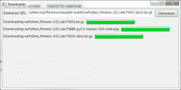

# wxPython:创建文件下载应用程序

> 原文：<https://www.blog.pythonlibrary.org/2014/01/29/wxpython-creating-a-file-downloading-app/>

我一直在考虑用 wxPython 创建一个简单的下载脚本。然后我在 stack overflow 上看到有人询问如何做这件事，我决定是时候弄清楚了。用 Python 下载文件很简单。我在[的上一篇文章](https://www.blog.pythonlibrary.org/2012/06/07/python-101-how-to-download-a-file/)中写了一些不同的方法。最大的问题是如何在下载文件时更新用户界面。这其实很简单，这篇文章将告诉你怎么做！

* * *

### 入门指南

本文中的脚本将要求您安装第三方[请求包](http://docs.python-requests.org/en/latest/)。当然，您还需要 wxPython。在本文中，我将使用 wxPython 2.9。

* * *

### 潜入水中

[](https://www.blog.pythonlibrary.org/wp-content/uploads/2014/01/wxDownloader.png)

我最后取了一些我以前的文章，一点一点地组合它们的代码，直到我得到我想要的。我总是发现钻研代码是了解如何做事的最快方法，所以让我们来看看源代码:

```py

import requests
import os
import wx
import wx.lib.scrolledpanel as scrolled

from threading import Thread
from wx.lib.pubsub import pub

########################################################################
class DownloadThread(Thread):
    """Downloading thread"""

    #----------------------------------------------------------------------
    def __init__(self, gnum, url, fsize):
        """Constructor"""
        Thread.__init__(self)
        self.fsize = fsize
        self.gnum = gnum
        self.url = url
        self.start()

    #----------------------------------------------------------------------
    def run(self):
        """
        Run the worker thread
        """
        local_fname = os.path.basename(self.url)
        count = 1
        while True:
            if os.path.exists(local_fname):
                tmp, ext = os.path.splitext(local_fname)
                cnt = "(%s)" % count
                local_fname = tmp + cnt + ext
                count += 1
            else:
                break
        req = requests.get(self.url, stream=True)
        total_size = 0
        print local_fname
        with open(local_fname, "wb") as fh:
            for byte in req.iter_content(chunk_size=1024):
                if byte:
                    fh.write(byte)
                    fh.flush()
                total_size += len(byte)
                if total_size < self.fsize:
                    wx.CallAfter(pub.sendMessage, 
                                 "update_%s" % self.gnum,
                                 msg=total_size)
        print "DONE!"
        wx.CallAfter(pub.sendMessage,
                     "update_%s" % self.gnum,
                     msg=self.fsize)

########################################################################
class MyGauge(wx.Gauge):
    """"""

    #----------------------------------------------------------------------
    def __init__(self, parent, range, num):
        """Constructor"""
        wx.Gauge.__init__(self, parent, range=range)

        pub.subscribe(self.updateProgress, "update_%s" % num)

    #----------------------------------------------------------------------
    def updateProgress(self, msg):
        """"""
        self.SetValue(msg)

########################################################################
class MyPanel(scrolled.ScrolledPanel):
    """"""

    #----------------------------------------------------------------------
    def __init__(self, parent):
        """Constructor"""
        scrolled.ScrolledPanel.__init__(self, parent)

        self.data = []
        self.download_number = 1

        # create the sizers
        self.main_sizer = wx.BoxSizer(wx.VERTICAL)
        dl_sizer = wx.BoxSizer(wx.HORIZONTAL)

        # create the widgets
        lbl = wx.StaticText(self, label="Download URL:")
        self.dl_txt = wx.TextCtrl(self)
        btn = wx.Button(self, label="Download")
        btn.Bind(wx.EVT_BUTTON, self.onDownload)

        # layout the widgets
        dl_sizer.Add(lbl, 0, wx.ALL|wx.CENTER, 5)
        dl_sizer.Add(self.dl_txt, 1, wx.EXPAND|wx.ALL, 5)
        dl_sizer.Add(btn, 0, wx.ALL, 5)
        self.main_sizer.Add(dl_sizer, 0, wx.EXPAND)

        self.SetSizer(self.main_sizer)
        self.SetAutoLayout(1)
        self.SetupScrolling()

    #----------------------------------------------------------------------
    def onDownload(self, event):
        """
        Update display with downloading gauges
        """
        url = self.dl_txt.GetValue()
        try:
            header = requests.head(url)
            fsize = int(header.headers["content-length"]) / 1024

            sizer = wx.BoxSizer(wx.HORIZONTAL)
            fname = os.path.basename(url)
            lbl = wx.StaticText(self, label="Downloading %s" % fname)
            gauge = MyGauge(self, fsize, self.download_number)

            sizer.Add(lbl, 0, wx.ALL|wx.CENTER, 5)
            sizer.Add(gauge, 0, wx.ALL|wx.EXPAND, 5)
            self.main_sizer.Add(sizer, 0, wx.EXPAND)

            self.Layout()

            # start thread
            DownloadThread(self.download_number, url, fsize)
            self.dl_txt.SetValue("")
            self.download_number += 1
        except Exception, e:
            print "Error: ", e

########################################################################
class DownloaderFrame(wx.Frame):
    """"""

    #----------------------------------------------------------------------
    def __init__(self):
        """Constructor"""
        wx.Frame.__init__(self, None, title="Downloader", size=(800, 400))
        panel = MyPanel(self)
        self.Show()

#----------------------------------------------------------------------
if __name__ == "__main__":
    app = wx.App(False)
    frame = DownloaderFrame()
    app.MainLoop()

```

让我们把这段代码分成一部分一部分，这样更容易解释。首先，我们必须子类化**线程**类，如下所示:

```py

########################################################################
class DownloadThread(Thread):
    """Downloading thread"""

    #----------------------------------------------------------------------
    def __init__(self, gnum, url, fsize):
        """Constructor"""
        Thread.__init__(self)
        self.fsize = fsize
        self.gnum = gnum
        self.url = url
        self.start()

    #----------------------------------------------------------------------
    def run(self):
        """
        Run the worker thread
        """
        local_fname = os.path.basename(self.url)
        count = 1
        while True:
            if os.path.exists(local_fname):
                tmp, ext = os.path.splitext(local_fname)
                cnt = "(%s)" % count
                local_fname = tmp + cnt + ext
                count += 1
            else:
                break
        req = requests.get(self.url, stream=True)
        total_size = 0
        print local_fname
        with open(local_fname, "wb") as fh:
            for byte in req.iter_content(chunk_size=1024):
                if byte:
                    fh.write(byte)
                    fh.flush()
                total_size += 1024
                if total_size < self.fsize:
                    wx.CallAfter(pub.sendMessage, 
                                 "update_%s" % self.gnum,
                                 msg=total_size)
        print "DONE!"
        wx.CallAfter(pub.sendMessage,
                     "update_%s" % self.gnum,
                     msg=self.fsize)

```

我们传入规格号(gnum)、下载的 url 和文件大小。我们传入量表编号的原因是每个量表实例需要能够独立于其他量表进行更新，因此我们需要跟踪我们需要更新哪个量表。在 **run** 方法中，我们检查并查看文件名是否已经存在。如果是，我们尝试给它附加一个数字，并检查该文件是否存在，等等。一旦我们发现一个不存在的文件名，我们继续并告诉**请求**以流的形式下载该文件。然后我们一次拉下一个字节，写入磁盘，并告诉显示器更新。一旦我们退出下拉文件的循环的**，我们向计量器发送最后一次更新，告诉它下载完成。**

接下来，我们必须继承 wx 的子类。仪表:

```py

########################################################################
class MyGauge(wx.Gauge):
    """"""

    #----------------------------------------------------------------------
    def __init__(self, parent, range, num):
        """Constructor"""
        wx.Gauge.__init__(self, parent, range=range)

        pub.subscribe(self.updateProgress, "update_%s" % num)

    #----------------------------------------------------------------------
    def updateProgress(self, msg):
        """"""
        self.SetValue(msg)

```

这很简单。我们只继承 wx 的子类。测量并设置一个 pubsub 订阅者，以便它只监听自己的更新。然后，我们添加一个名为 **updateProgress** 的方法，每当侦听器触发以实际更新 gauge 小部件时，我们都会调用该方法。现在我们准备好查看面板代码:

```py

########################################################################
class MyPanel(scrolled.ScrolledPanel):
    """"""

    #----------------------------------------------------------------------
    def __init__(self, parent):
        """Constructor"""
        scrolled.ScrolledPanel.__init__(self, parent)

        self.data = []
        self.download_number = 1

        # create the sizers
        self.main_sizer = wx.BoxSizer(wx.VERTICAL)
        dl_sizer = wx.BoxSizer(wx.HORIZONTAL)

        # create the widgets
        lbl = wx.StaticText(self, label="Download URL:")
        self.dl_txt = wx.TextCtrl(self)
        btn = wx.Button(self, label="Download")
        btn.Bind(wx.EVT_BUTTON, self.onDownload)

        # layout the widgets
        dl_sizer.Add(lbl, 0, wx.ALL|wx.CENTER, 5)
        dl_sizer.Add(self.dl_txt, 1, wx.EXPAND|wx.ALL, 5)
        dl_sizer.Add(btn, 0, wx.ALL, 5)
        self.main_sizer.Add(dl_sizer, 0, wx.EXPAND)

        self.SetSizer(self.main_sizer)
        self.SetAutoLayout(1)
        self.SetupScrolling()

    #----------------------------------------------------------------------
    def onDownload(self, event):
        """
        Update display with downloading gauges
        """
        url = self.dl_txt.GetValue()
        try:
            header = requests.head(url)
            fsize = int(header.headers["content-length"]) / 1024

            sizer = wx.BoxSizer(wx.HORIZONTAL)
            fname = os.path.basename(url)
            lbl = wx.StaticText(self, label="Downloading %s" % fname)
            gauge = MyGauge(self, fsize, self.download_number)

            sizer.Add(lbl, 0, wx.ALL|wx.CENTER, 5)
            sizer.Add(gauge, 0, wx.ALL|wx.EXPAND, 5)
            self.main_sizer.Add(sizer, 0, wx.EXPAND)

            self.Layout()

            # start thread
            DownloadThread(self.download_number, url, fsize)
            self.dl_txt.SetValue("")
            self.download_number += 1
        except Exception, e:
            print "Error: ", e

```

对于面板，我决定使用 **ScrolledPanel** 小部件，因为我认为我可能想要下载一堆文件，如果我下载的文件在标尺空间用完时添加一个滚动条会很好。我们像往常一样在 **__init__** 方法中设置小部件和大小设置器。 **onDownload** 方法是关键所在。这里，我们从文本控件中获取 URL，并尝试使用请求包从服务器获取文件大小。我们除以 1024 得到千字节大小。如果这是成功的，我们创建一个水平的框 sizer，并向它添加一个静态文本和一个标尺。请注意，我们告诉 gauge 它是哪个下载的，并且我们还将该数字传递给一个新线程。我们还将文本控件重置为空，以便于添加新的 URL。最后，我们增加下载次数，这样我们就可以下载新文件了。

其余的代码几乎都是样板文件。

* * *

### 包扎

如您所见，这段代码非常容易编写。不过，我可以看到很多需要改进的地方。例如，如果应用程序有办法改变下载的最终位置，那就太好了。目前，它们只是保存在与脚本相同的文件夹中。回想起来，它应该把新的下载添加到顶部，把旧的推下来，而不是反过来。如果能显示文件的实际大小以及还剩多少，那就太酷了。我们甚至可以为已经完成下载的文件添加一个标签！无论如何，我希望这能给你一些有趣的想法来改进剧本。

* * *

### 相关阅读

*   Python 101: [如何下载文件](https://www.blog.pythonlibrary.org/2012/06/07/python-101-how-to-download-a-file/)
*   [wxPython 和线程](https://www.blog.pythonlibrary.org/2010/05/22/wxpython-and-threads/)
*   wxPython [关于线程、队列等的 wiki 文章](http://wiki.wxpython.org/LongRunningTasks)
*   wxPython: [如何从线程更新进度条](https://www.blog.pythonlibrary.org/2013/09/04/wxpython-how-to-update-a-progress-bar-from-a-thread/)