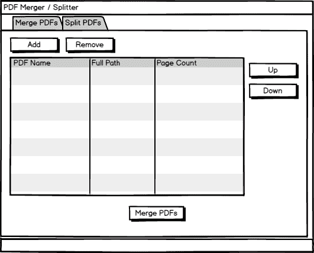
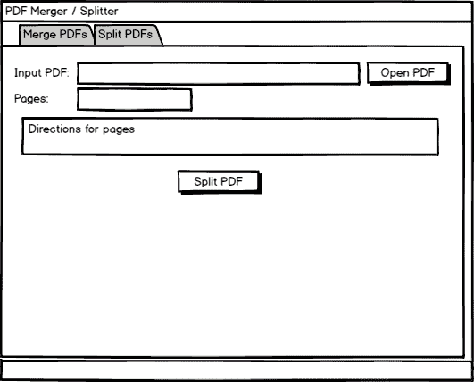
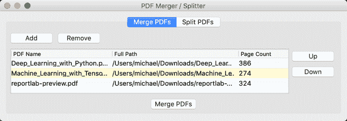
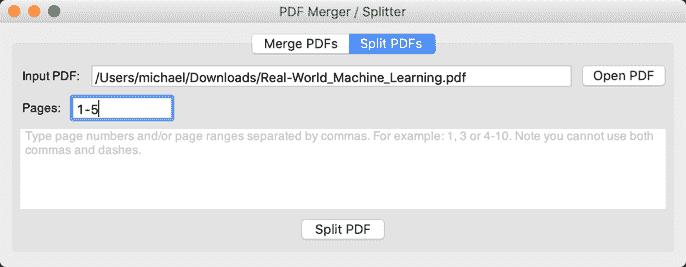

# wxPython -创建 PDF 合并/拆分实用程序

> 原文：<https://www.blog.pythonlibrary.org/2019/09/10/wxpython-creating-a-pdf-merger-splitter-utility/>

可移植文档格式(PDF)是由 Adobe 推广的一种众所周知的格式。它旨在创建一个跨平台呈现相同内容的文档。

Python 有几个库可以用来处理 pdf:

*   ReportLab -创建 pdf
*   PyPDF2 -处理预先存在的 PDF
*   pdfrw -也用于操作预先存在的 pdf，但也与 ReportLab 一起工作
*   PDFMiner -从 pdf 中提取文本

还有几个与 Python PDF 相关的包，但这四个可能是最广为人知的。使用 PDF 的一个常见任务是需要将多个 PDF 合并或连接成一个 PDF。另一个常见的任务是获取一个 PDF 并将其一个或多个页面拆分成一个新的 PDF。

您将使用 [PyPDF2](https://github.com/mstamy2/PyPDF2) 创建一个完成这两项任务的图形用户界面。

| [](https://leanpub.com/reportlab) | 本教程来自我的书《用 wxPython 创建 GUI 应用程序》。您可以在此处获得:

### 用 wxPython 创建 GUI 应用程序

**立即在 [Leanpub](https://leanpub.com/creatingapplicationswithwxpython/) 或[亚马逊](https://www.amazon.com/dp/0996062890)购买** |

本教程的完整代码可以在**第 10 章**文件夹的 [Github](https://github.com/driscollis/applications_with_wxpython) 中找到。

* * *

### 安装 PyPDF2

使用 **pip** 可以安装 **PyPDF2** 包:

```py

pip install pypdf2

```

这个包很小，所以安装应该很快。

现在已经安装了 PyPDF2，您可以设计您的 UI 了！

* * *

### 设计界面

这个应用程序基本上是包含在一个窗口中的两个程序。您需要一种显示合并应用程序和拆分应用程序的方式。有一个简单的方法在两者之间切换会很好。您可以设计自己的面板交换代码，也可以使用 wxPython 众多笔记本小部件中的一个。

为了简单起见，让我们使用 wx。此应用程序的笔记本。

这是“合并”选项卡的模型:



PDF 合并模型

您将把 PDF 文件加载到一个列表控件类型的小部件中。您还需要一种方法来重新排序 pdf。您需要一种从列表中删除项目的方法。这个模型展示了完成这些目标所需的所有部分。

接下来是拆分选项卡的模型:



PDF 分割器模型

基本上你想要的是一个工具，显示什么是输入 PDF 和什么页面是分裂出来。它的用户界面非常简单，但应该能满足您的需求。

现在让我们创建这个应用程序！

* * *

### 创建应用程序

让我们考虑一下代码的组织。每个选项卡应该在它自己的模块中。您还应该有一个主入口点来运行您的应用程序。这意味着您至少可以拥有三个 Python 文件。

以下是您将创建的内容:

*   主模块
*   合并面板模块
*   分离面板模块

先说主模块！

* * *

#### 主模块

作为你的应用程序的主要入口点， **main** 模块有很多责任。它将容纳你的其他面板，并可以作为面板之间的枢纽，如果他们需要沟通。大多数情况下，您会使用 pubsub 来完成这个任务。

让我们继续编写代码的第一个版本:

```py

# main.py

import wx

from merge_panel import MergePanel
from split_panel import SplitPanel

```

**主**模块的导入既漂亮又简短。你所需要的就是 **wx** 、**合并面板**和**分离面板**。后两个是你马上要写的。

让我们继续编写主面板代码:

```py

class MainPanel(wx.Panel):

    def __init__(self, parent):
        super().__init__(parent)

        main_sizer = wx.BoxSizer(wx.VERTICAL)
        notebook = wx.Notebook(self)
        merge_tab = MergePanel(notebook)
        notebook.AddPage(merge_tab, 'Merge PDFs')
        split_tab = SplitPanel(notebook)
        notebook.AddPage(split_tab, 'Split PDFs')
        main_sizer.Add(notebook, 1, wx.ALL | wx.EXPAND, 5)
        self.SetSizer(main_sizer)

```

主面板是所有活动的地方。这里你实例化了一个 wx。在笔记本上添加**合并面板**和**分割面板**。然后将笔记本添加到 sizer 中，就大功告成了！

下面是您需要添加的帧代码:

```py

class MainFrame(wx.Frame):

    def __init__(self):
        super().__init__(None, title='PDF Merger / Splitter',
                         size=(800, 600))
        self.panel = MainPanel(self)
        self.Show()

if __name__ == '__main__':
    app = wx.App(False)
    frame = MainFrame()
    app.MainLoop()

```

像往常一样，您构建您的框架，添加一个面板并显示给用户。您还可以设置框架的大小。您可能想要尝试初始大小，因为它对于您的设置来说可能太大或太小。

现在让我们继续学习如何合并 pdf！

* * *

#### 合并面板模块

**merge_panel** 模块包含围绕合并 PDF 文件创建用户界面所需的所有代码。用于合并的用户界面比用于拆分的要复杂一些。

我们开始吧！

```py

# merge_panel.py

import os
import glob
import wx

from ObjectListView import ObjectListView, ColumnDefn
from PyPDF2 import PdfFileReader, PdfFileWriter

wildcard = "PDFs (*.pdf)|*.pdf"

```

这里需要为一些路径相关的活动导入 Python 的 **os** 模块，为搜索任务导入 glob 模块。您还需要 **ObjectListView** 来显示 PDF 信息，还需要 PyPDF2 来合并 PDF。

这里的最后一项是通配符，它在添加要合并的文件以及保存合并的文件时使用。

为了使 UI 更加友好，您应该添加拖放支持:

```py

class DropTarget(wx.FileDropTarget):

    def __init__(self, window):
        super().__init__()
        self.window = window

    def OnDropFiles(self, x, y, filenames):
        self.window.update_on_drop(filenames)
        return True

```

您可能会从归档章节中认出这段代码。事实上，几乎没有什么变化。您仍然需要子类化 **wx。FileDropTarget** 并将您想要添加拖放支持的小部件传递给它。您还需要覆盖 **OnDropFile()** ，让它使用您传入的小部件调用一个方法。对于本例，您将传入面板对象本身。

您还需要创建一个类来保存关于 pdf 的信息。这个类将由您的 **ObjectListView** 小部件使用。

这是:

```py

class Pdf:

    def __init__(self, pdf_path):
        self.full_path = pdf_path
        self.filename = os.path.basename(pdf_path)
        try:
            with open(pdf_path, 'rb') as f:
                pdf = PdfFileReader(f)
                number_of_pages = pdf.getNumPages()
        except:
            number_of_pages = 0
        self.number_of_pages = str(number_of_pages)

```

这次的 **__init__()** 不错，很短。您设置了一个 PDF 列表来保存要合并的 PDF 对象。您还将实例化 **DropTarget** 并将其添加到面板中。然后创建 main_sizer 并调用 create_ui()，这将添加您需要的所有小部件。

说到这里，接下来我们来添加 create_ui():

```py

def create_ui(self):
    btn_sizer = wx.BoxSizer()
    add_btn = wx.Button(self, label='Add')
    add_btn.Bind(wx.EVT_BUTTON, self.on_add_file)
    btn_sizer.Add(add_btn, 0, wx.ALL, 5)
    remove_btn = wx.Button(self, label='Remove')
    remove_btn.Bind(wx.EVT_BUTTON, self.on_remove)
    btn_sizer.Add(remove_btn, 0, wx.ALL, 5)
    self.main_sizer.Add(btn_sizer)

```

create_ui()方法有点长。代码将被分解，以便更容易理解。上面的代码将添加两个按钮:

*   添加文件按钮
*   “删除文件”按钮

这些按钮位于合并面板顶部的水平方向的 sizer 中。您还可以将每个按钮绑定到它们自己的事件处理程序。

现在让我们添加用于显示要合并的 pdf 的小部件:

```py

    move_btn_sizer = wx.BoxSizer(wx.VERTICAL)
    row_sizer = wx.BoxSizer()

    self.pdf_olv = ObjectListView(
        self, style=wx.LC_REPORT | wx.SUNKEN_BORDER)
    self.pdf_olv.SetEmptyListMsg("No PDFs Loaded")
    self.update_pdfs()
    row_sizer.Add(self.pdf_olv, 1, wx.ALL | wx.EXPAND)

```

在这里，您将 ObjectListView 小部件添加到 row_sizer，并调用**update _ pdf()**来更新它，使它具有列标签。

您需要在 ObjectListView 小部件中添加对 pdf 重新排序的支持，所以接下来让我们添加:

```py

    move_up_btn = wx.Button(self, label='Up')
    move_up_btn.Bind(wx.EVT_BUTTON, self.on_move)
    move_btn_sizer.Add(move_up_btn, 0, wx.ALL, 5)
    move_down_btn = wx.Button(self, label='Down')
    move_down_btn.Bind(wx.EVT_BUTTON, self.on_move)
    move_btn_sizer.Add(move_down_btn, 0, wx.ALL, 5)
    row_sizer.Add(move_btn_sizer)
    self.main_sizer.Add(row_sizer, 1, wx.ALL | wx.EXPAND, 5)

```

这里你再加两个按钮。一个用于向上移动项目，一个用于向下移动项目。这两个按钮被添加到一个垂直方向的 sizer， **move_btn_sizer** ，它又被添加到 row_sizer。最后，row_sizer 被添加到 main_sizer 中。

下面是 **create_ui()** 方法的最后几行:

```py

    merge_pdfs = wx.Button(self, label='Merge PDFs')
    merge_pdfs.Bind(wx.EVT_BUTTON, self.on_merge)
    self.main_sizer.Add(merge_pdfs, 0, wx.ALL | wx.CENTER, 5)

    self.SetSizer(self.main_sizer)

```

这最后四行添加了 merge 按钮，并将其连接到一个事件处理程序。它还将面板的 sizer 设置为 **main_sizer** 。

现在让我们创建 add_pdf():

```py

def add_pdf(self, path):
    self.pdfs.append(Pdf(path))

```

您将使用您希望与另一个 PDF 合并的 PDF 的路径调用此方法。该方法将创建 Pdf 类的一个实例，并将其附加到 Pdf 列表中。

现在您已经准备好创建**load _ pdf()**:

```py

def load_pdfs(self, path):
    pdf_paths = glob.glob(path + '/*.pdf')
    for path in pdf_paths:
        self.add_pdf(path)
    self.update_pdfs()

```

这个方法接收一个文件夹而不是一个文件。然后，它使用 glob 查找该文件夹中的所有 pdf。您将遍历 glob 返回的文件列表，并使用 **add_pdf()** 将它们添加到 pdf 列表中。然后调用 update _ pdfs()，它将使用新添加的 PDF 文件更新 UI。

让我们看看当你按下合并按钮时会发生什么:

```py

def on_merge(self, event):
    """
    TODO - Move this into a thread
    """
    objects = self.pdf_olv.GetObjects()
    if len(objects) < 2:
        with wx.MessageDialog(
            None,
            message='You need 2 or more files to merge!',
            caption='Error',
            style= wx.ICON_INFORMATION) as dlg:
            dlg.ShowModal()
        return
    with wx.FileDialog(
        self, message="Choose a file",
        defaultDir='~',
        defaultFile="",
        wildcard=wildcard,
        style=wx.FD_SAVE | wx.FD_CHANGE_DIR
        ) as dlg:
        if dlg.ShowModal() == wx.ID_OK:
            path = dlg.GetPath()
    if path:
        _, ext = os.path.splitext(path)
        if '.pdf' not in ext.lower():
            path = f'{path}.pdf'
        self.merge(path)

```

**on_merge()** 方法是由 merge 按钮调用的事件处理程序。docstring 包含一条 TODO 消息，提醒您将合并代码移动到线程中。从技术上讲，您将要移动的代码实际上是在 **merge()** 函数中，但是只要您有某种提醒，那就没什么关系了。

总之，您使用 **GetObjects()** 来获取 ObjectListView 小部件中的所有 pdf。然后检查以确保至少有两个 PDF 文件。如果没有，你会让用户知道他们需要添加更多的 pdf！否则你会开出一个 **wx。FileDialog** 并让用户选择合并 PDF 的名称和位置。

最后，检查用户是否添加了。pdf 扩展名，如果没有，就添加它。然后你调用 **merge()** 。

**merge()** 方法是您应该创建的下一个方法:

```py

def merge(self, output_path):
    pdf_writer = PdfFileWriter()

    objects = self.pdf_olv.GetObjects()

    for obj in objects:
        pdf_reader = PdfFileReader(obj.full_path)
        for page in range(pdf_reader.getNumPages()):
            pdf_writer.addPage(pdf_reader.getPage(page))

    with open(output_path, 'wb') as fh:
        pdf_writer.write(fh)

    with wx.MessageDialog(None, message='Save completed!',
                          caption='Save Finished',
                         style= wx.ICON_INFORMATION) as dlg:
        dlg.ShowModal()

```

这里您创建了一个 **PdfFileWriter()** 对象，用于写出合并的 PDF。然后从 ObjectListView 小部件获得对象列表，而不是 pdf 列表。这是因为您可以对 UI 重新排序，因此列表可能没有按正确的顺序排列。下一步是循环遍历每个对象并获取其完整路径。您将使用 PdfFileReader 打开该路径，并遍历它的所有页面，将每个页面添加到 pdf_writer 中。

将所有 pdf 及其各自的页面添加到 pdf_writer 后，您可以将合并的 PDF 写出到磁盘。然后你开一个 wx。MessageDialog 让用户知道 pdf 已经合并。

发生这种情况时，您可能会注意到您的 UI 被冻结了。这是因为将所有这些页面读入内存，然后将它们写出来需要一段时间。这就是为什么这部分代码应该在一个线程中完成的原因。在本章的后面，你会学到重构。

现在让我们在 _add_file() 上创建**:**

```py

def on_add_file(self, event):
    paths = None
    with wx.FileDialog(
        self, message="Choose a file",
        defaultDir='~',
        defaultFile="",
        wildcard=wildcard,
        style=wx.FD_OPEN | wx.FD_MULTIPLE
        ) as dlg:
        if dlg.ShowModal() == wx.ID_OK:
            paths = dlg.GetPaths()
    if paths:
        for path in paths:
            self.add_pdf(path)
        self.update_pdfs()

```

这段代码将打开一个 wx。文件对话框，让用户选择一个或多个文件。然后它将它们作为路径列表返回。然后，您可以遍历这些路径，并使用 **add_path()** 将它们添加到 pdf 列表中。

现在让我们看看如何对 ObjectListView 小部件中的项目进行重新排序:

```py

def on_move(self, event):
    btn = event.GetEventObject()
    label = btn.GetLabel()
    current_selection = self.pdf_olv.GetSelectedObject()
    data = self.pdf_olv.GetObjects()
    if current_selection:
        index = data.index(current_selection)
        new_index = self.get_new_index(
            label.lower(), index, data)
        data.insert(new_index, data.pop(index))
        self.pdfs = data
        self.update_pdfs()
        self.pdf_olv.Select(new_index)

```

向上和向下按钮都绑定到 on_move()事件处理程序。您可以通过**事件访问哪个按钮调用了这个处理程序。GetEventObject()** ，将返回按钮对象。然后就可以得到按钮的标签了。接下来，您需要获取 current_selection 和分配给 data 的对象列表。现在您可以使用 list 对象的 index 属性来查找 current_selection 的索引。

一旦有了这些信息，就将按钮标签、索引和数据列表传递给 get_new_index()来计算这个项目应该向哪个方向移动。一旦有了 new_index，就可以使用 **pop()** 方法插入并删除旧索引。然后将 pdf 列表重置为数据列表，以便它们匹配。最后两步是更新小部件并重新选择您移动的项目。

现在让我们看看如何获得新索引:

```py

def get_new_index(self, direction, index, data):
    if direction == 'up':
        if index > 0:
            new_index = index - 1
        else:
            new_index = len(data)-1
    else:
        if index < len(data) - 1:
            new_index = index + 1
        else:
            new_index = 0
    return new_index

```

这里，您使用按钮标签“方向”来确定向哪个方向移动项目。如果是“上升”，那么你检查指数是否大于零，然后减一。如果它是零，那么你得到列表的整个长度，然后减一，这将把条目移回到列表的另一端。

如果用户点击了“向下”按钮，那么检查索引是否小于数据长度减一。在这种情况下，你加一个。否则，将 new_index 设置为零。

代码看起来有点混乱，所以可以随意添加一些打印函数，然后运行代码看看它是如何工作的。

下一个要学习的新东西是如何移除一个项目:

```py

def on_remove(self, event):
    current_selection = self.pdf_olv.GetSelectedObject()
    if current_selection:
        index = self.pdfs.index(current_selection)
        self.pdfs.pop(index)
        self.pdf_olv.RemoveObject(current_selection)

```

该方法将获取当前选择，从 pdf 列表中弹出()它，然后使用 **RemoveObject()** 方法将其从 ObjectListView 小部件中移除。

现在，让我们来看看当您将项目拖放到应用程序上时调用的代码:

```py

def update_on_drop(self, paths):
    for path in paths:
        _, ext = os.path.splitext(path)
        if os.path.isdir(path):
            self.load_pdfs(path)
        elif os.path.isfile(path) and ext.lower() == '.pdf':
            self.add_pdf(path)
            self.update_pdfs()

```

在这种情况下，循环遍历路径，检查路径是目录还是文件。他们也可能是一个链接，但你会忽略这些。如果路径是一个目录，那么你用它调用**load _ pdf()**。否则，您检查文件是否有扩展名**。如果是的话，你就用它调用 **add_pdf()** 。**

最后创建的方法是**update _ pdf()**:

```py

def update_pdfs(self):
    self.pdf_olv.SetColumns([
        ColumnDefn("PDF Name", "left", 200, "filename"),
        ColumnDefn("Full Path", "left", 250, "full_path"),
        ColumnDefn("Page Count", "left", 100, "number_of_pages")
    ])
    self.pdf_olv.SetObjects(self.pdfs)

```

此方法添加或重置列名和宽度。它还通过 **SetObjects()** 添加 PDF 列表。

以下是“合并”面板的外观:



PDF 合并标签

现在你已经准备好创建 split_panel 了！

* * *

### 分割面板模块

**split_panel** 模块比 **merge_panel** 要简单一些。你真的只需要几个文本控件，一些标签和一个按钮。

让我们看看所有这些是如何结束的:

```py

# split_panel.py

import os
import string
import wx

from PyPDF2 import PdfFileReader, PdfFileWriter

wildcard = "PDFs (*.pdf)|*.pdf"

```

这里你导入 Python 的 **os** 和 **string** 模块。您还将再次需要 PyPDF2，通配符变量对于打开和保存 PDF 非常有用。

您还需要计算器章节中的 **CharValidator** 类。

这里再次为你再现:

```py

class CharValidator(wx.Validator):
    '''
    Validates data as it is entered into the text controls.
    '''

    def __init__(self, flag):
        wx.Validator.__init__(self)
        self.flag = flag
        self.Bind(wx.EVT_CHAR, self.OnChar)

    def Clone(self):
        '''Required Validator method'''
        return CharValidator(self.flag)

    def Validate(self, win):
        return True

    def TransferToWindow(self):
        return True

    def TransferFromWindow(self):
        return True

    def OnChar(self, event):
        keycode = int(event.GetKeyCode())
        if keycode < 256:
            key = chr(keycode)
            if self.flag == 'no-alpha' and key in string.ascii_letters:
                return
            if self.flag == 'no-digit' and key in string.digits:
                return
        event.Skip()

```

**CharValidator** 类用于验证用户没有在文本控件中输入任何字母。您将使用它进行拆分选项，这将允许用户选择他们想要从输入 PDF 中拆分出哪些页面。

但是在我们开始之前，让我们创建 **SplitPanel** :

```py

class SplitPanel(wx.Panel):

    def __init__(self, parent):
        super().__init__(parent)
        font = wx.Font(12, wx.SWISS, wx.NORMAL, wx.NORMAL)
        main_sizer = wx.BoxSizer(wx.VERTICAL)

```

**__init__()** 的前几行创建了一个 **wx。字体**实例和**主尺寸**。

下面是下面几行 **__init__()** :

```py

row_sizer = wx.BoxSizer()
lbl = wx.StaticText(self, label='Input PDF:')
lbl.SetFont(font)
row_sizer.Add(lbl, 0, wx.ALL | wx.CENTER, 5)
self.pdf_path = wx.TextCtrl(self, style=wx.TE_READONLY)
row_sizer.Add(self.pdf_path, 1, wx.EXPAND | wx.ALL, 5)
pdf_btn = wx.Button(self, label='Open PDF')
pdf_btn.Bind(wx.EVT_BUTTON, self.on_choose)
row_sizer.Add(pdf_btn, 0, wx.ALL, 5)
main_sizer.Add(row_sizer, 0, wx.EXPAND)

```

这段代码添加了一行将包含在 row_sizer 中的小部件。这里有一个漂亮的标签，一个保存输入 PDF 路径的文本控件和“打开 PDF”按钮。在将其中的每一个添加到 row_sizer 之后，您将把该 sizer 添加到 main_sizer。

现在让我们添加第二行小部件:

```py

msg = 'Type page numbers and/or page ranges separated by commas.' \
    ' For example: 1, 3 or 4-10\. Note you cannot use both commas ' \
    'and dashes.'
directions_txt = wx.TextCtrl(
    self, value=msg,
    style=wx.TE_MULTILINE | wx.NO_BORDER)
directions_txt.SetFont(font)
directions_txt.Disable()
main_sizer.Add(directions_txt, 0, wx.ALL | wx.EXPAND, 5)

```

这些代码行创建了一个没有边框的多行文本控件。它包含 pdf_split_options 文本控件的使用说明，并显示在该小部件的下方。您还可以**Disable()**directions _ txt 来防止用户更改方向。

还有四行要添加到 **__init__()** 中:

```py

split_btn = wx.Button(self, label='Split PDF')
split_btn.Bind(wx.EVT_BUTTON, self.on_split)
main_sizer.Add(split_btn, 0, wx.ALL | wx.CENTER, 5)
self.SetSizer(main_sizer)

```

最后几行将添加“Split PDF”按钮，将其绑定到事件处理程序，并将按钮添加到 sizer。然后设置面板的尺寸。

现在您已经编写了 UI 本身，您需要开始编写其他方法:

```py

def on_choose(self, event):
    path = None
    with wx.FileDialog(
        self, message="Choose a file",
        defaultDir='~',
        defaultFile="",
        wildcard=wildcard,
        style=wx.FD_OPEN | wx.FD_CHANGE_DIR
        ) as dlg:
        if dlg.ShowModal() == wx.ID_OK:
            path = dlg.GetPath()
    if path:
        self.pdf_path.SetValue(path)

```

当用户按下“打开 PDF”按钮时，调用 **on_choose()** 事件处理程序。它将加载一个 **wx。FileDialog** 如果用户选择一个 PDF，它将根据用户的选择设置 pdf_path 文本控件。

现在让我们进入代码的核心部分:

```py

def on_split(self, event):
    output_path = None
    input_pdf = self.pdf_path.GetValue()
    split_options = self.pdf_split_options.GetValue()
    if not input_pdf:
        message='You must choose an input PDF!'
        self.show_message(message)
        return

```

当用户按下“分割 PDF”按钮时，on_split()被调用。您将从检查用户是否选择了 PDF 进行分割开始。如果他们没有，告诉他们使用 **show_message()** 方法这样做并返回。

接下来，您需要检查用户选择的 PDF 路径是否仍然存在:

```py

if not os.path.exists(input_pdf):
    message = f'Input PDF {input_pdf} does not exist!'
    self.show_message(message)
    return

```

如果 PDF 不存在，让用户知道错误，不要做任何事情。

现在您需要检查用户是否将任何内容放入 split_options:

```py

if not split_options:
    message = 'You need to choose what page(s) to split off'
    self.show_message(message)
    return

```

如果用户没有设置 split_options，那么你的应用程序就不知道要拆分哪些页面。所以告诉用户。

下一个检查是确保用户没有同时使用逗号和破折号:

```py

if ',' in split_options and '-' in split_options:
    message = 'You cannot have both commas and dashes in options'
    self.show_message(message)
    return

```

理论上你可以同时支持逗号和破折号，但是这会使代码更加复杂。如果你想补充，请随意。目前还不支持。

另一个要检查的项目是是否有多个破折号:

```py

if split_options.count('-') > 1:
    message = 'You can only use one dash'
    self.show_message(message)
    return

```

用户很狡猾，很容易按两次按钮，所以一定要让用户知道这是不允许的。

用户也可以输入一个负数:

```py

if '-' in split_options:
    page_begin, page_end = split_options.split('-')
    if not page_begin or not page_end:
        message = 'Need both a beginning and ending page'
        self.show_message(message)
        return

```

在这种情况下，您可以检查以确保它正确拆分，或者您可以尝试找出负数在字符串中的位置。在这种情况下，您使用 split 方法来计算它。

最后一项检查是确保用户输入了一个数字，而不仅仅是破折号或逗号:

```py

if not any(char.isdigit() for char in split_options):
    message = 'You need to enter a page number to split off'
    self.show_message(message)
    return

```

您可以使用 Python 的任何内置来实现这一点。你循环字符串中的所有字符，并询问它们是否是一个数字。如果不是，那么您向用户显示一条消息。

现在您已经准备好创建分割 PDF 文件本身了:

```py

with wx.FileDialog(
    self, message="Choose a file",
    defaultDir='~',
    defaultFile="",
    wildcard=wildcard,
    style=wx.FD_SAVE | wx.FD_CHANGE_DIR
    ) as dlg:
    if dlg.ShowModal() == wx.ID_OK:
        output_path = dlg.GetPath()

```

这段代码将打开保存版本的 **wx。FileDialog** 并让用户选择保存分割 PDF 的名称和位置。

这个函数的最后一段代码如下:

```py

if output_path:
    _, ext = os.path.splitext(output_path)
    if '.pdf' not in ext.lower():
        output_path = f'{output_path}.pdf'
    split_options = split_options.strip()
    self.split(input_pdf, output_path, split_options)

```

一旦有了 output_path，您将检查以确保用户添加了。pdf 扩展名。如果他们没有，那么你将为他们添加它。然后，您将去掉 split_options 中的任何前导或结尾空格，并调用 split()。

现在让我们创建用于实际分割 PDF 的代码:

```py

def split(self, input_pdf, output_path, split_options):
    pdf = PdfFileReader(input_pdf)
    pdf_writer = PdfFileWriter()
    if ',' in split_options:
        pages = [page for page in split_options.split(',')
                 if page]
        for page in pages:
            pdf_writer.addPage(pdf.getPage(int(page)))
    elif '-' in split_options:
        page_begin, page_end = split_options.split('-')
        page_begin = int(page_begin)
        page_end = int(page_end)
        page_begin = self.get_actual_beginning_page(page_begin)

        for page in range(page_begin, page_end):
            pdf_writer.addPage(pdf.getPage(page))
    else:
        # User only wants a single page
        page_begin = int(split_options)
        page_begin = self.get_actual_beginning_page(page_begin)
        pdf_writer.addPage(pdf.getPage(page_begin))

```

在这里，您创建了一个名为 pdf 的 PdfFileReader 对象和一个名为 pdf_writer 的 PdfFileWriter 对象。然后检查 split_options，查看用户使用的是逗号还是破折号。如果用户使用逗号分隔的列表，那么您循环遍历页面，并将它们添加到 writer 中。

如果用户使用了破折号，那么您需要获取开始页面和结束页面。然后调用**get _ actual _ beginning _ page()**方法做一点数学计算，因为使用 PyPDF 时第一页实际上是第零页。一旦确定了规范化的数字，就可以使用 Python 的 range 函数遍历页面范围，并将页面添加到 writer 对象中。

else 语句仅在用户输入想要拆分的单个页码时使用。例如，他们可能只想要 20 页文档中的第 2 页。

最后一步是将新的 PDF 写入磁盘:

```py

# Write PDF to disk
with open(output_path, 'wb') as out:
    pdf_writer.write(out)

# Let user know that PDF is split
message = f'PDF split successfully to {output_path}'
self.show_message(message, caption='Split Finished',
                          style=wx.ICON_INFORMATION)

```

这段代码将使用用户提供的路径创建一个新文件。然后，它将写出添加到 pdf_writer 的页面，并向用户显示一个对话框，让他们知道他们现在有了一个新的 pdf。

让我们快速看一下您需要添加到**get _ actual _ beginning _ page()**方法中的逻辑:

```py

def get_actual_beginning_page(self, page_begin):
    if page_begin < 0 or page_begin == 1:
        page_begin = 0
    if page_begin > 1:
        # Take off by one error into account
        page_begin -= 1
    return page_begin

```

在这里，您接收开始页面，并检查页码是零、一还是大于一。然后你做一点数学计算来避免一个接一个的错误，并返回实际的开始页码。

现在让我们创建 **show_message()** :

```py

def show_message(self, message, caption='Error', style=wx.ICON_ERROR):
    with wx.MessageDialog(None, message=message,
                          caption=caption,
                          style=style) as dlg:
        dlg.ShowModal()

```

这是一个用于包装 wx.MessageDialog 的创建和销毁的有用函数。

*   消息
*   标题
*   样式标志

然后，它使用 Python 的 with 语句创建对话框的实例，并将其显示给用户。

完成编码后，拆分面板看起来是这样的:



PDF 拆分器选项卡

现在您已经准备好学习线程和 wxPython 了！

* * *

### 在 wxPython 中使用线程

每个 GUI 工具包处理线程的方式都不同。wxPython GUI 工具包有三个线程安全的方法，如果您想使用线程，应该使用这三个方法:

*   wx.CallAfter
*   wx.calllater 后期版本
*   wx。事件后

您可以使用这些方法将信息从线程发送回 wxPython。

让我们更新 **merge_panel** 以便它使用线程！

* * *

### 使用线程增强 PDF 合并

Python 附带了几个与并发相关的模块。您将在这里使用线程模块。将原始代码复制到一个名为 **version_2_threaded** 的新文件夹中，或者参考 Github 资源库中为本章预先制作的文件夹。

让我们从更新 **merge_panel** 中的导入开始:

```py

# merge_panel.py

import os
import glob
import wx

from ObjectListView import ObjectListView, ColumnDefn
from pubsub import pub
from PyPDF2 import PdfFileReader, PdfFileWriter
from threading import Thread

wildcard = "PDFs (*.pdf)|*.pdf"

```

这里唯一的区别是这个导入行:**来自 threading 导入线程**和 pubsub 的添加。这给了我们继承 Thread 的能力。

让我们接下来这样做:

```py

class MergeThread(Thread):

    def __init__(self, objects, output_path):
        super().__init__()
        self.objects = objects
        self.output_path = output_path
        self.start()

```

**MergeThread** 类将接受 ObjectListView 小部件中的对象列表以及 output_path。在 **__init__()** 的末尾，您告诉线程 **start()** ，这实际上导致了 **run()** 方法的执行。

让我们忽略它:

```py

def run(self):
    pdf_writer = PdfFileWriter()
    page_count = 1

    for obj in self.objects:
        pdf_reader = PdfFileReader(obj.full_path)
        for page in range(pdf_reader.getNumPages()):
            pdf_writer.addPage(pdf_reader.getPage(page))
            wx.CallAfter(pub.sendMessage, 'update',
                         msg=page_count)
            page_count += 1

    # All pages are added, so write it to disk
    with open(self.output_path, 'wb') as fh:
        pdf_writer.write(fh)

    wx.CallAfter(pub.sendMessage, 'close')

```

在这里，您创建一个 PdfFileWriter 类，然后遍历各个 pdf，提取它们的页面，并像前面一样将它们添加到 Writer 对象中。添加页面后，使用 wx。CallAfter 使用 pubsub 将消息发送回 GUI 线程。在此消息中，您将发送添加页面的当前页数。这将更新一个有进度条的对话框。

文件写完之后，您通过 pubsub 发送另一条消息，告诉进度对话框关闭。

让我们创建一个进度小部件:

```py

class MergeGauge(wx.Gauge):

    def __init__(self, parent, range):
        super().__init__(parent, range=range)

        pub.subscribe(self.update_progress, "update")

    def update_progress(self, msg):
        self.SetValue(msg)

```

要创建进度小部件，可以使用 wxPython 的 wx.Gauge。每当接收到更新时，它将相应地更改仪表的值。

您需要将这个量表放到一个对话框中，所以接下来让我们创建它:

```py

class MergeProgressDialog(wx.Dialog):

    def __init__(self, objects, path):
        super().__init__(None, title='Merging Progress')
        pub.subscribe(self.close, "close")

        sizer = wx.BoxSizer(wx.VERTICAL)
        lbl = wx.StaticText(self, label='Merging PDFS')
        sizer.Add(lbl, 0, wx.ALL | wx.CENTER, 5)
        total_page_count = sum([int(obj.number_of_pages)
                                for obj in objects])
        gauge = MergeGauge(self, total_page_count)
        sizer.Add(gauge, 0, wx.ALL | wx.EXPAND, 5)

        MergeThread(objects, output_path=path)
        self.SetSizer(sizer)

    def close(self):
        self.Close()

```

**MergeProgressDialog** 向对话订阅“关闭”消息。它还向自身添加标签和仪表/进度条。然后它启动 MergeThread。当发出“close”消息时，调用 close()方法，对话框将被关闭。

您需要做的另一个更改是在 **MergePanel** 类中，特别是 merge()方法:

```py

def merge(self, output_path, objects):
    with MergeProgressDialog(objects, output_path) as dlg:
        dlg.ShowModal()

    with wx.MessageDialog(None, message='Save completed!',
                          caption='Save Finished',
                         style= wx.ICON_INFORMATION) as dlg:
        dlg.ShowModal()

```

在这里，您更新该方法以接受 objects 参数，并使用该参数和 output_path 创建 MergeProgressDialog。请注意，除了路径之外，您还需要更改 **on_merge()** 来传入对象列表，以使其工作。一旦合并完成，对话框将自动关闭并自我销毁。然后，您将创建相同的 wx。MessageDialog 并显示给用户，让他们知道合并的 PDF 已经准备好了。

如果你愿意，你可以使用这里的代码更新 **split_panel** 来使用线程。这不一定会发生，除非你认为你会分裂出几十或几百页。大多数时候，它应该足够快，以至于用户在分割 PDF 时不会注意到或太在意。

* * *

### 包扎

使用 **PyPDF2** 可以拆分和合并 PDF。如果你愿意，你也可以使用 **pdfrw** 。还有很多方法可以改进这个应用程序。

这里有几个例子:

*   把分裂变成一条线
*   添加工具栏按钮
*   添加键盘快捷键
*   添加状态栏

然而，你在这一章中学到了很多。您学习了如何合并和分割 pdf。您还了解了如何在 wxPython 中使用线程。最后，这段代码演示了向您的输入添加一些错误处理，特别是在 **split_panel** 模块中。