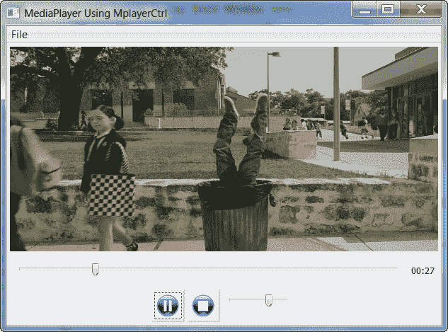

# wxPython:创建简单的媒体播放器

> 原文：<https://www.blog.pythonlibrary.org/2010/07/24/wxpython-creating-a-simple-media-player/>

几个月前，我写了一篇关于使用 wxPython 的 MediaCtrl 小部件创建一个简单的 MP3 播放器的文章。从那以后，一个家伙发布了 MplayerCtrl，这是一个 wxPython 小部件，它包装了流行的跨平台媒体播放器 mplayer。事实上，我最终切换了我的 MP3 播放器的后端来使用这个新的控制，但这是另一篇文章的故事。这篇文章将着重于创建一个真正简单的媒体播放器，你可以用它来播放电影。而且你可以用 Python 完成这一切！如果你像我一样，你会觉得这太棒了！

## 使用 Python 和 Mplayer 播放电影

[](https://www.blog.pythonlibrary.org/wp-content/uploads/2010/07/media_player.png) 
[截图来自一部短裤的预告片](http://www.imdb.com/title/tt1100119/)

首先，您需要确保具备以下条件:

*   [Python](http://www.python.org) (咄！)
*   [wxPython](http://www.wxpython.org)
*   [mplayer](http://www.mplayerhq.hu)
*   [MPlayerCtrl](http://pypi.python.org/pypi/MplayerCtrl/)

一旦你确认你有所有这些，我们可以继续。我们来看一些代码！

```py

import os
import time
import wx
import MplayerCtrl as mpc
import wx.lib.buttons as buttons

dirName = os.path.dirname(os.path.abspath(__file__))
bitmapDir = os.path.join(dirName, 'bitmaps')

class Frame(wx.Frame):

    #----------------------------------------------------------------------
    def __init__(self, parent, id, title, mplayer):
        wx.Frame.__init__(self, parent, id, title)
        self.panel = wx.Panel(self)

        sp = wx.StandardPaths.Get()
        self.currentFolder = sp.GetDocumentsDir()
        self.currentVolume = 50

        self.create_menu()

        # create sizers
        mainSizer = wx.BoxSizer(wx.VERTICAL)
        controlSizer = self.build_controls()
        sliderSizer = wx.BoxSizer(wx.HORIZONTAL)

        self.mplayer = mpc.MplayerCtrl(self.panel, -1, mplayer)
        self.playbackSlider = wx.Slider(self.panel, size=wx.DefaultSize)
        sliderSizer.Add(self.playbackSlider, 1, wx.ALL|wx.EXPAND, 5)

        # create volume control
        self.volumeCtrl = wx.Slider(self.panel)
        self.volumeCtrl.SetRange(0, 100)
        self.volumeCtrl.SetValue(self.currentVolume)
        self.volumeCtrl.Bind(wx.EVT_SLIDER, self.on_set_volume)
        controlSizer.Add(self.volumeCtrl, 0, wx.ALL, 5)

        # create track counter
        self.trackCounter = wx.StaticText(self.panel, label="00:00")
        sliderSizer.Add(self.trackCounter, 0, wx.ALL|wx.CENTER, 5)

        # set up playback timer
        self.playbackTimer = wx.Timer(self)
        self.Bind(wx.EVT_TIMER, self.on_update_playback)

        mainSizer.Add(self.mplayer, 1, wx.ALL|wx.EXPAND, 5)
        mainSizer.Add(sliderSizer, 0, wx.ALL|wx.EXPAND, 5)
        mainSizer.Add(controlSizer, 0, wx.ALL|wx.CENTER, 5)
        self.panel.SetSizer(mainSizer)

        self.Bind(mpc.EVT_MEDIA_STARTED, self.on_media_started)
        self.Bind(mpc.EVT_MEDIA_FINISHED, self.on_media_finished)
        self.Bind(mpc.EVT_PROCESS_STARTED, self.on_process_started)
        self.Bind(mpc.EVT_PROCESS_STOPPED, self.on_process_stopped)

        self.Show()
        self.panel.Layout()

    #----------------------------------------------------------------------
    def build_btn(self, btnDict, sizer):
        """"""
        bmp = btnDict['bitmap']
        handler = btnDict['handler']

        img = wx.Bitmap(os.path.join(bitmapDir, bmp))
        btn = buttons.GenBitmapButton(self.panel, bitmap=img,
                                      name=btnDict['name'])
        btn.SetInitialSize()
        btn.Bind(wx.EVT_BUTTON, handler)
        sizer.Add(btn, 0, wx.LEFT, 3)

    #----------------------------------------------------------------------
    def build_controls(self):
        """
        Builds the audio bar controls
        """
        controlSizer = wx.BoxSizer(wx.HORIZONTAL)

        btnData = [{'bitmap':'player_pause.png', 
                    'handler':self.on_pause, 'name':'pause'},
                   {'bitmap':'player_stop.png',
                    'handler':self.on_stop, 'name':'stop'}]
        for btn in btnData:
            self.build_btn(btn, controlSizer)

        return controlSizer

    #----------------------------------------------------------------------
    def create_menu(self):
        """
        Creates a menu
        """
        menubar = wx.MenuBar()
        fileMenu = wx.Menu()
        add_file_menu_item = fileMenu.Append(wx.NewId(), "&Add File", "Add Media File")
        menubar.Append(fileMenu, '&File')

        self.SetMenuBar(menubar)
        self.Bind(wx.EVT_MENU, self.on_add_file, add_file_menu_item)

    #----------------------------------------------------------------------
    def on_add_file(self, event):
        """
        Add a Movie and start playing it
        """
        wildcard = "Media Files (*.*)|*.*"
        dlg = wx.FileDialog(
            self, message="Choose a file",
            defaultDir=self.currentFolder, 
            defaultFile="",
            wildcard=wildcard,
            style=wx.OPEN | wx.CHANGE_DIR
            )
        if dlg.ShowModal() == wx.ID_OK:
            path = dlg.GetPath()
            self.currentFolder = os.path.dirname(path[0])
            trackPath = '"%s"' % path.replace("\\", "/")
            self.mplayer.Loadfile(trackPath)

            t_len = self.mplayer.GetTimeLength()
            self.playbackSlider.SetRange(0, t_len)
            self.playbackTimer.Start(100)

    #----------------------------------------------------------------------
    def on_media_started(self, event):
        print 'Media started!'

    #----------------------------------------------------------------------
    def on_media_finished(self, event):
        print 'Media finished!'
        self.playbackTimer.Stop()

    #----------------------------------------------------------------------
    def on_pause(self, event):
        """"""
        if self.playbackTimer.IsRunning():
            print "pausing..."
            self.mplayer.Pause()
            self.playbackTimer.Stop()
        else:
            print "unpausing..."
            self.mplayer.Pause()
            self.playbackTimer.Start()

    #----------------------------------------------------------------------
    def on_process_started(self, event):
        print 'Process started!'

    #----------------------------------------------------------------------
    def on_process_stopped(self, event):
        print 'Process stopped!'

    #----------------------------------------------------------------------
    def on_set_volume(self, event):
        """
        Sets the volume of the music player
        """
        self.currentVolume = self.volumeCtrl.GetValue()
        self.mplayer.SetProperty("volume", self.currentVolume)

    #----------------------------------------------------------------------
    def on_stop(self, event):
        """"""
        print "stopping..."
        self.mplayer.Stop()
        self.playbackTimer.Stop()

    #----------------------------------------------------------------------
    def on_update_playback(self, event):
        """
        Updates playback slider and track counter
        """
        try:
            offset = self.mplayer.GetTimePos()
        except:
            return
        print offset
        mod_off = str(offset)[-1]
        if mod_off == '0':
            print "mod_off"
            offset = int(offset)
            self.playbackSlider.SetValue(offset)
            secsPlayed = time.strftime('%M:%S', time.gmtime(offset))
            self.trackCounter.SetLabel(secsPlayed)  

```

我们将关注亮点，忽略样板。如果你不知道 wxPython 代码，那么就去 wxPython 网站，阅读教程。现在，为了创建 MplayerCtrl 的一个实例，我们需要调用 *mpc。MplayerCtrl(self.panel，-1，mplayer)* 并传入 mplayer 的路径。为了跟踪电影播放了多少，我们创建了一个 wx.Slider。我们还使用了一个滑块来控制音量。我们使用 wx 的一些通用按钮部件来提供一些易于使用的位图按钮。最后，我们创建一个计时器，我们将使用它来更新播放滑块的位置。为了加载电影并开始播放，我们创建了一个菜单项。

*build_btn* 、 *build_controls* 和 *create_menu* 是构建 GUI 的助手方法。你可以自己想办法。我们只看几个与 mplayer 相关的方法。在 *on_add_file* 中，我们打开一个文件对话框，让用户在他们的 PC 上找到一个电影文件。一旦他们选择了一个，我们通过用正斜杠替换反斜杠来稍微修改文件的路径，使它更适合 mplayer。然后我们调用 MPlayerCtrl 的 LoadFile 方法将电影加载到 mplayer 中并开始播放。我们还启动计时器并更新播放滑块。

您可以通过调用相应方法的两个按钮来暂停或停止播放。MplayerCtrl 还公开了许多其他方法，我们可以使用这些方法来获取电影的长度、比特率、编解码器等等。查看文档，看看你能做些什么。

## 包扎

如您所见，用 Python 创建一个简单的媒体播放器非常容易。让 MplayerCtrl 播放一些东西需要大约 5 分钟。添加滑块和功能需要 30-45 分钟(取决于您的技能)。随意添加增强功能，如播放列表，一种加快或减慢播放速度的方法，或者让帧调整电影的大小，使其纵横比保持不变。注意有时候 mplayer 并不想在你关帧的时候扼杀电影。这是控件的作者试图解决的一个问题。反正用 Python 看电影玩得开心！

*注意:这段代码在 Windows XP 和 Windows 7 上用 mplayercrl 0 . 1 . 2 和 0.2.4、wxPython 2.8.10.1、Python 2.5/2.6 进行了测试。我在测试中也使用了 mplayer rtm-svn-31170 版本。*

## 进一步的信息

*   MplayerCtrl [文件](http://packages.python.org/MplayerCtrl/)

## 下载

*   [MediaPlayer.zip](https://www.blog.pythonlibrary.org/wp-content/uploads/2010/07/MediaPlayer.zip)
*   [MediaPlayer.tar](https://www.blog.pythonlibrary.org/wp-content/uploads/2010/07/MediaPlayer.tar)