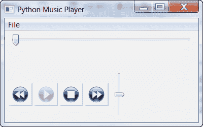

# wxPython:创建一个简单的 MP3 播放器

> 原文：<https://www.blog.pythonlibrary.org/2010/04/20/wxpython-creating-a-simple-mp3-player/>

上个月，我开始撰写关于使用 wxPython 创建简单应用程序的系列文章。前两篇文章是关于图像浏览器程序的。虽然我不会放弃这个项目，但我认为现在是我们探索新东西的时候了。在这篇文章中，我们将开始一段旅程，进入玩 MP3 的疯狂世界。我们将创建一个非常简单的界面，可以用来播放、暂停和停止一首歌曲。我们还将学习如何在音轨内搜索并改变音乐的音量。在未来的文章中，我们将添加一个显示音乐信息(如标题，艺术家，流派等)，曲目列表，随机功能，等等。我们开始吧！

## 准备旋转音乐

我们可以使用许多不同的布局，但在这个例子中，我们将使用传统的布局，在顶部有一个水平歌曲轨道滑块小部件，下面有播放器控件，右边有音量控件。如果您熟悉 wxPython 的小部件，那么您可能会认为 ShapedButtons 非常适合这个应用程序。我也这样认为，直到我发现他们依赖于 Python 图像库(PIL)。虽然这没什么大不了的，但是对于一个简单的例子来说，我认为这对本文来说很复杂，所以最终使用了一些通用的按钮。当我们以后改进这个程序时，我们可能会花时间更新按钮，给它们更多的活力。现在，我们的应用程序将如下所示:

[](https://www.blog.pythonlibrary.org/wp-content/uploads/2010/04/music_player.png)

它不是世界上最漂亮的音乐播放器，但我们可以稍后修复它。重点是学习如何用 wxPython 创建一个跨平台的应用程序。当我在 Windows XP 机器上运行这个应用程序时，它似乎使用了 ffdshow。当我在 Windows 7 上运行它时，我认为它在后端使用的是 Windows Media Player。据我理解，wx。MediaCtrl 将在 Linux 上包装 GStreamer。不管怎样，我们来看看出处:

```py

#----------------------------------------------------------------------
# player_skeleton2.py
#----------------------------------------------------------------------

import os
import wx
import wx.media
import wx.lib.buttons as buttons

dirName = os.path.dirname(os.path.abspath(__file__))
bitmapDir = os.path.join(dirName, 'bitmaps')

########################################################################
class MediaPanel(wx.Panel):
    """"""

    #----------------------------------------------------------------------
    def __init__(self, parent):
        """Constructor"""
        wx.Panel.__init__(self, parent=parent)

        self.frame = parent
        self.currentVolume = 50
        self.createMenu()
        self.layoutControls()

        sp = wx.StandardPaths.Get()
        self.currentFolder = sp.GetDocumentsDir()

        self.timer = wx.Timer(self)
        self.Bind(wx.EVT_TIMER, self.onTimer)
        self.timer.Start(100)

    #----------------------------------------------------------------------
    def layoutControls(self):
        """
        Create and layout the widgets
        """

        try:
            self.mediaPlayer = wx.media.MediaCtrl(self, style=wx.SIMPLE_BORDER)
        except NotImplementedError:
            self.Destroy()
            raise

        # create playback slider
        self.playbackSlider = wx.Slider(self, size=wx.DefaultSize)
        self.Bind(wx.EVT_SLIDER, self.onSeek, self.playbackSlider)

        self.volumeCtrl = wx.Slider(self, style=wx.SL_VERTICAL|wx.SL_INVERSE)
        self.volumeCtrl.SetRange(0, 100)
        self.volumeCtrl.SetValue(self.currentVolume)
        self.volumeCtrl.Bind(wx.EVT_SLIDER, self.onSetVolume)

        # Create sizers
        mainSizer = wx.BoxSizer(wx.VERTICAL)
        hSizer = wx.BoxSizer(wx.HORIZONTAL)
        audioSizer = self.buildAudioBar()

        # layout widgets
        mainSizer.Add(self.playbackSlider, 1, wx.ALL|wx.EXPAND, 5)
        hSizer.Add(audioSizer, 0, wx.ALL|wx.CENTER, 5)
        hSizer.Add(self.volumeCtrl, 0, wx.ALL, 5)
        mainSizer.Add(hSizer)

        self.SetSizer(mainSizer)
        self.Layout()

    #----------------------------------------------------------------------
    def buildAudioBar(self):
        """
        Builds the audio bar controls
        """
        audioBarSizer = wx.BoxSizer(wx.HORIZONTAL)

        self.buildBtn({'bitmap':'player_prev.png', 'handler':self.onPrev,
                       'name':'prev'},
                      audioBarSizer)

        # create play/pause toggle button
        img = wx.Bitmap(os.path.join(bitmapDir, "player_play.png"))
        self.playPauseBtn = buttons.GenBitmapToggleButton(self, bitmap=img, name="play")
        self.playPauseBtn.Enable(False)

        img = wx.Bitmap(os.path.join(bitmapDir, "player_pause.png"))
        self.playPauseBtn.SetBitmapSelected(img)
        self.playPauseBtn.SetInitialSize()

        self.playPauseBtn.Bind(wx.EVT_BUTTON, self.onPlay)
        audioBarSizer.Add(self.playPauseBtn, 0, wx.LEFT, 3)

        btnData = [{'bitmap':'player_stop.png',
                    'handler':self.onStop, 'name':'stop'},
                    {'bitmap':'player_next.png',
                     'handler':self.onNext, 'name':'next'}]
        for btn in btnData:
            self.buildBtn(btn, audioBarSizer)

        return audioBarSizer

    #----------------------------------------------------------------------
    def buildBtn(self, btnDict, sizer):
        """"""
        bmp = btnDict['bitmap']
        handler = btnDict['handler']

        img = wx.Bitmap(os.path.join(bitmapDir, bmp))
        btn = buttons.GenBitmapButton(self, bitmap=img, name=btnDict['name'])
        btn.SetInitialSize()
        btn.Bind(wx.EVT_BUTTON, handler)
        sizer.Add(btn, 0, wx.LEFT, 3)

    #----------------------------------------------------------------------
    def createMenu(self):
        """
        Creates a menu
        """
        menubar = wx.MenuBar()

        fileMenu = wx.Menu()
        open_file_menu_item = fileMenu.Append(wx.NewId(), "&Open", "Open a File")
        menubar.Append(fileMenu, '&File')
        self.frame.SetMenuBar(menubar)
        self.frame.Bind(wx.EVT_MENU, self.onBrowse, open_file_menu_item)

    #----------------------------------------------------------------------
    def loadMusic(self, musicFile):
        """
        Load the music into the MediaCtrl or display an error dialog
        if the user tries to load an unsupported file type
        """
        if not self.mediaPlayer.Load(musicFile):
            wx.MessageBox("Unable to load %s: Unsupported format?" % musicFile,
                          "ERROR",
                          wx.ICON_ERROR | wx.OK)
        else:
            self.mediaPlayer.SetInitialSize()
            self.GetSizer().Layout()
            self.playbackSlider.SetRange(0, self.mediaPlayer.Length())
            self.playPauseBtn.Enable(True)

    #----------------------------------------------------------------------
    def onBrowse(self, event):
        """
        Opens file dialog to browse for music
        """
        wildcard = "MP3 (*.mp3)|*.mp3|"     \
                   "WAV (*.wav)|*.wav"
        dlg = wx.FileDialog(
            self, message="Choose a file",
            defaultDir=self.currentFolder, 
            defaultFile="",
            wildcard=wildcard,
            style=wx.OPEN | wx.CHANGE_DIR
            )
        if dlg.ShowModal() == wx.ID_OK:
            path = dlg.GetPath()
            self.currentFolder = os.path.dirname(path)
            self.loadMusic(path)
        dlg.Destroy()

    #----------------------------------------------------------------------
    def onNext(self, event):
        """
        Not implemented!
        """
        pass

    #----------------------------------------------------------------------
    def onPause(self):
        """
        Pauses the music
        """
        self.mediaPlayer.Pause()

    #----------------------------------------------------------------------
    def onPlay(self, event):
        """
        Plays the music
        """
        if not event.GetIsDown():
            self.onPause()
            return

        if not self.mediaPlayer.Play():
            wx.MessageBox("Unable to Play media : Unsupported format?",
                          "ERROR",
                          wx.ICON_ERROR | wx.OK)
        else:
            self.mediaPlayer.SetInitialSize()
            self.GetSizer().Layout()
            self.playbackSlider.SetRange(0, self.mediaPlayer.Length())

        event.Skip()

    #----------------------------------------------------------------------
    def onPrev(self, event):
        """
        Not implemented!
        """
        pass

    #----------------------------------------------------------------------
    def onSeek(self, event):
        """
        Seeks the media file according to the amount the slider has
        been adjusted.
        """
        offset = self.playbackSlider.GetValue()
        self.mediaPlayer.Seek(offset)

    #----------------------------------------------------------------------
    def onSetVolume(self, event):
        """
        Sets the volume of the music player
        """
        self.currentVolume = self.volumeCtrl.GetValue()
        print "setting volume to: %s" % int(self.currentVolume)
        self.mediaPlayer.SetVolume(self.currentVolume)

    #----------------------------------------------------------------------
    def onStop(self, event):
        """
        Stops the music and resets the play button
        """
        self.mediaPlayer.Stop()
        self.playPauseBtn.SetToggle(False)

    #----------------------------------------------------------------------
    def onTimer(self, event):
        """
        Keeps the player slider updated
        """
        offset = self.mediaPlayer.Tell()
        self.playbackSlider.SetValue(offset)

########################################################################
class MediaFrame(wx.Frame):

    #----------------------------------------------------------------------
    def __init__(self):
        wx.Frame.__init__(self, None, wx.ID_ANY, "Python Music Player")
        panel = MediaPanel(self)

#----------------------------------------------------------------------
# Run the program
if __name__ == "__main__":
    app = wx.App(False)
    frame = MediaFrame()
    frame.Show()
    app.MainLoop()

```

您可能会注意到，这实际上是这个应用程序的版本#2。在本文底部的可下载源代码中，我包含了使用 Andrea Gavana 的 ShapedButton 控件来控制播放器的原始源代码。我建议你从官方的 wxPython 库获得这个小部件的 [SVN 版本](http://svn.wxwidgets.org/svn/wx/wxPython/3rdParty/AGW/agw/),因为在默认安装的 wx 版本中有一个已知的 bug。它还依赖于 wxPython 演示应用程序中包含的位图，所以您也需要将这些位图复制到适当的位置。

无论如何，让我们回顾一下上面代码中的一些内容。首先，我们设置了几个“全局”变量来保存应用程序的目录路径，这样我们就可以找到我们的 bitmaps 文件夹。接下来，我们创建应用程序。因为很多人把他们的音乐存储在他们的文档文件夹中，所以我们使用 wx。StandardPaths 以跨平台的方式找到该位置，并将 *currentFolder* 属性设置为该位置。当我们浏览要听的音乐时，我们将使用这个属性来存储最后打开的文件夹。我们还设置了一个计时器，用于在播放时更新播放器的音轨滑块。这是从 wxPython 的 MediaCtrl 演示中一字不差地复制过来的。

在 *layoutControls* 方法中，我们创建必要的小部件，并根据需要将它们添加到适当的 sizers 中。我们还在这里做小部件事件绑定。其余代码处理其他布局任务或生成的事件。它们也是不言自明的。注意， *onPrev* 和 *onNext* 方法不做任何事情。这是有意的，因为我们目前没有办法一次加载多首歌曲。我们将在程序的未来版本中添加该功能。

因此，使用该应用程序播放歌曲的基本步骤如下:

1.  转到文件并打开
2.  导航到一个 MP3 文件并打开它
3.  按下播放滑块下方的播放按钮，开始听音乐

这就是全部了。现在你有了一个功能齐全的音乐播放器。是的，它是有限的，但是它应该让您了解 wxPython 有多强大，以及扩展这个示例以满足您的需求有多容易。

## 下载

*   [Music_Player.zip](https://www.blog.pythonlibrary.org/wp-content/uploads/2010/04/Music_Player.zip)
*   [Music_Player.tar](https://www.blog.pythonlibrary.org/wp-content/uploads/2010/04/Music_Player.tar)