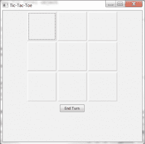
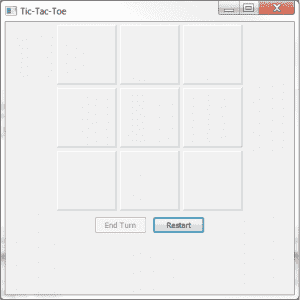

# wxPython:创建一个简单的井字游戏

> 原文：<https://www.blog.pythonlibrary.org/2013/07/30/wxpython-creating-a-simple-tic-tac-toe-game/>

我最近意识到 github 上有一个[井字游戏挑战](https://github.com/coxmediagroup/Tic-Tac-Toe)，程序员应该创造一个井字游戏，让玩家每次都赢。你必须用 Python 来编码，尽管这个挑战背后的人更喜欢你用 Django 来做。我不太了解 Django，所以我决定尝试使用 wxPython 来创建游戏。是的，wxPython 主要是为了创建跨平台的桌面用户界面，而不是游戏。但是对于这个特殊的主题，它实际上工作得很好。

### 第一步

[](https://www.blog.pythonlibrary.org/wp-content/uploads/2013/07/tictac_early.png)

第一步是尝试找出使用哪些小部件。出于某种原因，我认为我应该使用 wx。TextCtrls 在开头。然后，我意识到这将增加很多额外的工作，因为我必须添加各种验证，以防止用户输入多个字符，并限制字符的数量。呃。所以我改用切换按钮，具体来说就是 wx.lib.buttons 的 GenToggleButton，如果你想看游戏的完整历史，可以在我的 [github repo](https://github.com/driscollis/wxTicTacToe/commits/master/main.py) 上查看。无论如何，现在，我们将花一点时间来看看第一个半工作迭代。你可以在上面的截图中看到这个版本的样子。

代码如下:

```py

import wx
import wx.lib.buttons as buttons

########################################################################
class TTTPanel(wx.Panel):
    """
    Tic-Tac-Toe Panel object
    """

    #----------------------------------------------------------------------
    def __init__(self, parent):
        """
        Initialize the panel
        """
        wx.Panel.__init__(self, parent)
        self.toggled = False

        self.layoutWidgets()

    #----------------------------------------------------------------------
    def checkWin(self):
        """
        Check if the player won
        """

        for button1, button2, button3 in self.methodsToWin:
            if button1.GetLabel() == button2.GetLabel() and \
               button2.GetLabel() == button3.GetLabel() and \
               button1.GetLabel() != "":
                print "Player wins!"
                button1.SetBackgroundColour("Red")
                button2.SetBackgroundColour("Red")
                button3.SetBackgroundColour("Red")
                self.Layout()
                return True

    #----------------------------------------------------------------------
    def layoutWidgets(self):
        """
        Create and layout the widgets
        """
        mainSizer = wx.BoxSizer(wx.VERTICAL)
        self.fgSizer = wx.FlexGridSizer(rows=3, cols=3, vgap=5, hgap=5)
        font = wx.Font(22, wx.FONTFAMILY_DEFAULT, wx.FONTSTYLE_NORMAL,
                       wx.FONTWEIGHT_BOLD)

        size = (100,100)
        self.button1 = buttons.GenToggleButton(self, size=size)
        self.button2 = buttons.GenToggleButton(self, size=size)
        self.button3 = buttons.GenToggleButton(self, size=size)
        self.button4 = buttons.GenToggleButton(self, size=size)
        self.button5 = buttons.GenToggleButton(self, size=size)
        self.button6 = buttons.GenToggleButton(self, size=size)
        self.button7 = buttons.GenToggleButton(self, size=size)
        self.button8 = buttons.GenToggleButton(self, size=size)
        self.button9 = buttons.GenToggleButton(self, size=size)
        self.widgets = [self.button1, self.button2, self.button3,
                        self.button4, self.button5, self.button6, 
                        self.button7, self.button8, self.button9]

        for button in self.widgets:
            button.SetFont(font)
            button.Bind(wx.EVT_BUTTON, self.onToggle)            

        self.fgSizer.AddMany(self.widgets)
        mainSizer.Add(self.fgSizer, 0, wx.ALL|wx.CENTER, 5)

        endTurnBtn = wx.Button(self, label="End Turn")
        endTurnBtn.Bind(wx.EVT_BUTTON, self.onEndTurn)
        mainSizer.Add(endTurnBtn, 0, wx.ALL|wx.CENTER, 5)

        self.methodsToWin = [(self.button1, self.button2, self.button3),
                             (self.button4, self.button5, self.button6),
                             (self.button7, self.button8, self.button9),
                             # vertical ways to win
                             (self.button1, self.button4, self.button7),
                             (self.button2, self.button5, self.button8),
                             (self.button3, self.button6, self.button9),
                             # diagonal ways to win
                             (self.button1, self.button5, self.button9),
                             (self.button3, self.button5, self.button7)]           

        self.SetSizer(mainSizer)

    #----------------------------------------------------------------------
    def enableUnusedButtons(self):
        """
        Re-enable unused buttons
        """
        for button in self.widgets:
            if button.GetLabel() == "":
                button.Enable()
        self.Refresh()
        self.Layout()

    #----------------------------------------------------------------------
    def onEndTurn(self, event):
        """
        Let the computer play
        """
        # rest toggled flag state
        self.toggled = False

        # disable all played buttons
        for btn in self.widgets:
            if btn.GetLabel():
                btn.Disable()

        computerPlays = []

        for button1, button2, button3 in self.methodsToWin:
            if button1.GetLabel() == button2.GetLabel() and button1.GetLabel() != "":
                continue
            elif button1.GetLabel() == button3.GetLabel() and button1.GetLabel() != "":
                continue
            if button1.GetLabel() == "":
                computerPlays.append(button1)
                break
            if button2.GetLabel() == "":
                computerPlays.append(button2)
                break
            if button3.GetLabel() == "":
                computerPlays.append(button3)
                break

        computerPlays[0].SetLabel("O")
        computerPlays[0].Disable()

        self.enableUnusedButtons()

    #----------------------------------------------------------------------
    def onToggle(self, event):
        """
        On button toggle, change the label of the button pressed
        and disable the other buttons unless the user changes their mind
        """
        button = event.GetEventObject()
        button.SetLabel("X")
        button_id = button.GetId()

        self.checkWin()
        if not self.toggled:
            self.toggled = True
            for btn in self.widgets:
                if button_id != btn.GetId():
                    btn.Disable()
        else:
            self.toggled = False
            button.SetLabel("")
            self.enableUnusedButtons()

########################################################################
class TTTFrame(wx.Frame):
    """
    Tic-Tac-Toe Frame object
    """

    #----------------------------------------------------------------------
    def __init__(self):
        """Constructor"""
        title = "Tic-Tac-Toe"
        size = (500, 500)
        wx.Frame.__init__(self, parent=None, title=title, size=size)
        panel = TTTPanel(self)

        self.Show()

if __name__ == "__main__":
    app = wx.App(False)
    frame = TTTFrame()
    app.MainLoop() 

```

我不打算一一介绍这段代码。不过我会对此进行评论。如果你运行它，你会注意到计算机仍然可以赢。它试图不赢，它真的很容易被打败，但偶尔它会赢，如果你让它赢。你也可以反复点击“结束回合”按钮，直到它获胜，因为它太笨了，没有意识到它跳过了你的回合。也没有办法重启游戏。那有什么好玩的？所以我最终做了一堆工作来让电脑变得“更聪明”,我为玩家添加了一些不同的方式来重启游戏。

### 最终版本

[](https://www.blog.pythonlibrary.org/wp-content/uploads/2013/07/tictac_final.png)

这是我目前的最终版本。这段代码稍微复杂一点，但是我认为您能够理解它:

```py

import random
import wx
import wx.lib.buttons as buttons

########################################################################
class TTTPanel(wx.Panel):
    """
    Tic-Tac-Toe Panel object
    """

    #----------------------------------------------------------------------
    def __init__(self, parent):
        """
        Initialize the panel
        """
        wx.Panel.__init__(self, parent)
        self.toggled = False
        self.playerWon = False

        self.layoutWidgets()

    #----------------------------------------------------------------------
    def checkWin(self, computer=False):
        """
        Check if the player won
        """
        for button1, button2, button3 in self.methodsToWin:
            if button1.GetLabel() == button2.GetLabel() and \
               button2.GetLabel() == button3.GetLabel() and \
               button1.GetLabel() != "":
                print "Player wins!"
                self.playerWon = True
                button1.SetBackgroundColour("Yellow")
                button2.SetBackgroundColour("Yellow")
                button3.SetBackgroundColour("Yellow")
                self.Layout()

                if not computer:
                    msg = "You Won! Would you like to play again?"
                    dlg = wx.MessageDialog(None, msg, "Winner!",
                                           wx.YES_NO | wx.ICON_WARNING)
                    result = dlg.ShowModal()
                    if result == wx.ID_YES:
                        wx.CallAfter(self.restart)
                    dlg.Destroy()
                    break
                else:
                    return True

    #----------------------------------------------------------------------
    def layoutWidgets(self):
        """
        Create and layout the widgets
        """
        mainSizer = wx.BoxSizer(wx.VERTICAL)
        self.fgSizer = wx.FlexGridSizer(rows=3, cols=3, vgap=5, hgap=5)
        btnSizer = wx.BoxSizer(wx.HORIZONTAL)
        font = wx.Font(22, wx.FONTFAMILY_DEFAULT, wx.FONTSTYLE_NORMAL,
                       wx.FONTWEIGHT_BOLD)

        size = (100,100)
        self.button1 = buttons.GenToggleButton(self, size=size, name="btn1")
        self.button2 = buttons.GenToggleButton(self, size=size, name="btn2")
        self.button3 = buttons.GenToggleButton(self, size=size, name="btn3")
        self.button4 = buttons.GenToggleButton(self, size=size, name="btn4")
        self.button5 = buttons.GenToggleButton(self, size=size, name="btn5")
        self.button6 = buttons.GenToggleButton(self, size=size, name="btn6")
        self.button7 = buttons.GenToggleButton(self, size=size, name="btn7")
        self.button8 = buttons.GenToggleButton(self, size=size, name="btn8")
        self.button9 = buttons.GenToggleButton(self, size=size, name="btn9")
        self.normalBtnColour = self.button1.GetBackgroundColour()

        self.widgets = [self.button1, self.button2, self.button3,
                        self.button4, self.button5, self.button6, 
                        self.button7, self.button8, self.button9]

        # change all the main game buttons' font and bind them to an event
        for button in self.widgets:
            button.SetFont(font)
            button.Bind(wx.EVT_BUTTON, self.onToggle)            

        # add the widgets to the sizers
        self.fgSizer.AddMany(self.widgets)
        mainSizer.Add(self.fgSizer, 0, wx.ALL|wx.CENTER, 5)

        self.endTurnBtn = wx.Button(self, label="End Turn")
        self.endTurnBtn.Bind(wx.EVT_BUTTON, self.onEndTurn)
        self.endTurnBtn.Disable()
        btnSizer.Add(self.endTurnBtn, 0, wx.ALL|wx.CENTER, 5)

        startOverBtn = wx.Button(self, label="Restart")
        startOverBtn.Bind(wx.EVT_BUTTON, self.onRestart)
        btnSizer.Add(startOverBtn, 0, wx.ALL|wx.CENTER, 5)
        mainSizer.Add(btnSizer, 0, wx.CENTER)

        self.methodsToWin = [(self.button1, self.button2, self.button3),
                             (self.button4, self.button5, self.button6),
                             (self.button7, self.button8, self.button9),
                             # vertical ways to win
                             (self.button1, self.button4, self.button7),
                             (self.button2, self.button5, self.button8),
                             (self.button3, self.button6, self.button9),
                             # diagonal ways to win
                             (self.button1, self.button5, self.button9),
                             (self.button3, self.button5, self.button7)]

        self.SetSizer(mainSizer)

    #----------------------------------------------------------------------
    def enableUnusedButtons(self):
        """
        Re-enable unused buttons
        """
        for button in self.widgets:
            if button.GetLabel() == "":
                button.Enable()
        self.Refresh()
        self.Layout()

    #----------------------------------------------------------------------
    def onEndTurn(self, event):
        """
        Let the computer play
        """
        # rest toggled flag state
        self.toggled = False

        # disable all played buttons
        for btn in self.widgets:
            if btn.GetLabel():
                btn.Disable()

        computerPlays = []
        noPlays = []

        for button1, button2, button3 in self.methodsToWin:
            if button1.GetLabel() == button2.GetLabel() and button3.GetLabel() == "":
                if button1.GetLabel() == "" and button2.GetLabel() == "" and button1.GetLabel() == "":
                    pass
                else:
                    #if button1.GetLabel() == "O":
                    noPlays.append(button3)

            elif button1.GetLabel() == button3.GetLabel() and button2.GetLabel() == "":
                if button1.GetLabel() == "" and button2.GetLabel() == "" and button1.GetLabel() == "":
                    pass
                else:
                    noPlays.append(button2)

            elif button2.GetLabel() == button3.GetLabel() and button1.GetLabel() == "":
                if button1.GetLabel() == "" and button2.GetLabel() == "" and button1.GetLabel() == "":
                    pass
                else:
                    noPlays.append(button1)

            noPlays = list(set(noPlays))

            if button1.GetLabel() == "" and button1 not in noPlays:
                if not self.checkWin(computer=True):
                    computerPlays.append(button1)

            if button2.GetLabel() == "" and button2 not in noPlays:
                if not self.checkWin(computer=True):
                    computerPlays.append(button2)

            if button3.GetLabel() == "" and button3 not in noPlays:
                if not self.checkWin(computer=True):
                    computerPlays.append(button3)

        computerPlays = list(set(computerPlays))
        print noPlays
        choices = len(computerPlays)
        while 1 and computerPlays:
            btn = random.choice(computerPlays)

            if btn not in noPlays:
                print btn.GetName()
                btn.SetLabel("O")
                btn.Disable()
                break
            else:
                print "Removed => " + btn.GetName()
                computerPlays.remove(btn)
            if choices < 1:
                self.giveUp()
                break
            choices -= 1
        else:
            # Computer cannot play without winning
            self.giveUp()

        self.endTurnBtn.Disable()
        self.enableUnusedButtons()

    #----------------------------------------------------------------------
    def giveUp(self):
        """
        The computer cannot find a way to play that lets the user win,
        so it gives up.
        """
        msg = "I give up, Dave. You're too good at this game!"
        dlg = wx.MessageDialog(None, msg, "Game Over!",
                               wx.YES_NO | wx.ICON_WARNING)
        result = dlg.ShowModal()
        if result == wx.ID_YES:
            self.restart()
        else:
            wx.CallAfter(self.GetParent().Close)
        dlg.Destroy()          

    #----------------------------------------------------------------------
    def onRestart(self, event):
        """
        Calls the restart method
        """
        self.restart()

    #----------------------------------------------------------------------
    def onToggle(self, event):
        """
        On button toggle, change the label of the button pressed
        and disable the other buttons unless the user changes their mind
        """
        button = event.GetEventObject()
        button.SetLabel("X")
        button_id = button.GetId()

        self.checkWin()
        if not self.toggled:
            self.toggled = True
            self.endTurnBtn.Enable()
            for btn in self.widgets:
                if button_id != btn.GetId():
                    btn.Disable()
        else:
            self.toggled = False
            self.endTurnBtn.Disable()
            button.SetLabel("")
            self.enableUnusedButtons()

        # check if it's a "cats game" - no one's won
        if not self.playerWon:
            labels = [True if btn.GetLabel() else False for btn in self.widgets]
            if False not in labels:
                msg = "Cats Game - No one won! Would you like to play again?"
                dlg = wx.MessageDialog(None, msg, "Game Over!",
                                       wx.YES_NO | wx.ICON_WARNING)
                result = dlg.ShowModal()
                if result == wx.ID_YES:
                    self.restart()
                dlg.Destroy()

    #----------------------------------------------------------------------
    def restart(self):
        """
        Restart the game and reset everything
        """
        for button in self.widgets:
            button.SetLabel("")
            button.SetValue(False)
            button.SetBackgroundColour(self.normalBtnColour)
        self.toggled = False
        self.playerWon = False
        self.endTurnBtn.Disable()
        self.enableUnusedButtons()        

########################################################################
class TTTFrame(wx.Frame):
    """
    Tic-Tac-Toe Frame object
    """

    #----------------------------------------------------------------------
    def __init__(self):
        """Constructor"""
        title = "Tic-Tac-Toe"
        size = (500, 500)
        wx.Frame.__init__(self, parent=None, title=title, size=size)
        panel = TTTPanel(self)

        self.Show()

if __name__ == "__main__":
    app = wx.App(False)
    frame = TTTFrame()
    app.MainLoop()    

```

我刚刚注意到，即使这个版本也有一个小错误，它不再像上一个版本那样高亮显示 3 个获胜按钮。然而，现在它正确地轮流，如果用户将要输了，因为计算机可以赢或者没有人会赢，计算机就放弃并告诉玩家他们赢了。是啊，这是一种逃避，但它的工作！这里还有一些我认为会很有趣的补充:

*   音乐
*   音效
*   更加丰富多彩的界面
*   用户选择 X 或 O 的能力
*   不同难度
*   也许可以增加一个模式，让你的游戏范围比 3x3 更大。取而代之的是 6x6 或者其他更大的数字。

无论如何，我希望您会对这个应用程序感兴趣，甚至对理解 wxPython 有所帮助。