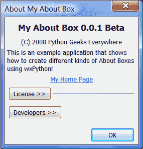
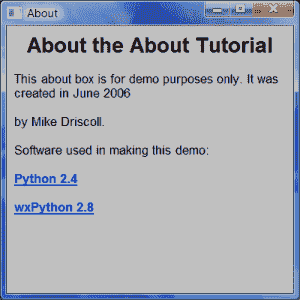

# wxPython:创建一个关于框

> 原文：<https://www.blog.pythonlibrary.org/2008/06/11/wxpython-creating-an-about-box/>

当我创建一个应用程序时，我通常希望包含一个“关于”框，让用户了解更多关于应用程序和我自己的信息，并向任何可能帮助过我创建程序的人大声疾呼。wxPython 提供的一个很酷的特性是一个自定义的 AboutBox 小部件。我觉得这看起来有点奇怪，所以我使用 HtmlWindow 小部件创建了自己的 About 框。然而，在本文中，我将展示如何做到这两种方式。

首先，我们将创建一个简单的应用程序，让您看到如何通过按钮或菜单项打开对话框。它有三个按钮，一个用来打开 wx。AboutBox，一个打开我的 Html 版本的 About box 和一个关闭按钮。

创建 AboutBox 非常简单。我使用下面的代码来创建我的:

```py

def onAboutDlg(self, event):
    info = wx.AboutDialogInfo()
    info.Name = "My About Box"
    info.Version = "0.0.1 Beta"
    info.Copyright = "(C) 2008 Python Geeks Everywhere"
    info.Description = wordwrap(
        "This is an example application that shows how to create "
        "different kinds of About Boxes using wxPython!",
        350, wx.ClientDC(self.panel))
    info.WebSite = ("http://www.pythonlibrary.org", "My Home Page")
    info.Developers = ["Mike Driscoll"]
    info.License = wordwrap("Completely and totally open source!", 500,
                            wx.ClientDC(self.panel))
    # Show the wx.AboutBox
    wx.AboutBox(info)

```

首先，实例化 wx.AboutDlgInfo 的一个实例。这为您提供了一种方式来设置您想要在 AboutBox 中显示的各种信息，例如应用程序名称、版本、版权等。当你把这些都填好后，你就创建了 wx。并把信息传递给它。请注意，这并不要求您显式地“显示”它；这是自动完成的。

完成后，您应该会看到类似下图的内容:

[](https://www.blog.pythonlibrary.org/wp-content/uploads/2008/06/wxaboutbox.png)

创建 HTML 版本稍微复杂一点。我用两节课来做。可以基于一个 wx。框架或 wx。对话框(可能还有其他小部件)。在这个例子中，我将使用一个 wx。没什么特别原因的框架。第二类只是捕捉 URL 上的鼠标点击，如果你有的话。查看以下资源:

```py

class AboutDlg(wx.Frame):

    def __init__(self, parent):

        wx.Frame.__init__(self, parent, wx.ID_ANY, title="About", size=(400,400))

        html = wxHTML(self)

        html.SetPage(
            ''

            "关于关于教程"

            "这个“关于”框仅用于演示目的。它是由 Mike Driscoll 于 2006 年 6 月创建的。"

            "**制作本演示使用的软件:**"

            ' **[ Python 2.4 ](http://www.python.org)** '

            ' **[ wxPython 2.8 ](http://www.wxpython.org)** '
            )

class wxHTML(wx.html.HtmlWindow):
     def OnLinkClicked(self, link):
         webbrowser.open(link.GetHref())

```

我非常喜欢它的原因是它允许我指定字体大小，使用 html 表格，插入照片等等，而且它完全是跨平台的。一个明显的缺点是这个小部件不支持高级 html，比如 css 或 javascript。总之，当你完成后，它应该会变成类似于下面的截图:

[](https://www.blog.pythonlibrary.org/wp-content/uploads/2008/06/htmlaboutbox.png)

以下是我用来激活两个“关于”框的演示程序的完整源代码:

```py

import wx
import wx.html
from wx.lib.wordwrap import wordwrap

class MyForm(wx.Frame):

    def __init__(self):
        wx.Frame.__init__(self, None, wx.ID_ANY, title='My Form')

        # Add a panel so it looks correct on all platforms
        self.panel = wx.Panel(self, wx.ID_ANY)

        # Create buttons
        aboutBtn = wx.Button(self.panel, wx.ID_ANY, "Open wx.AboutBox")
        self.Bind(wx.EVT_BUTTON, self.onAboutDlg, aboutBtn)
        aboutHtmlBtn = wx.Button(self.panel, wx.ID_ANY, "Open HtmlAboutBox")
        self.Bind(wx.EVT_BUTTON, self.onAboutHtmlDlg, aboutHtmlBtn)

        closeBtn = wx.Button(self.panel, wx.ID_ANY, "Close")
        self.Bind(wx.EVT_BUTTON, self.onClose, closeBtn)        

        # Create Sizers
        topSizer = wx.BoxSizer(wx.VERTICAL)

        # Add widgets to sizers
        topSizer.Add(aboutBtn, 0, wx.ALL|wx.CENTER, 5)
        topSizer.Add(aboutHtmlBtn, 0, wx.ALL|wx.CENTER, 5)
        topSizer.Add(closeBtn, 0, wx.ALL|wx.CENTER, 5)

        # Create the menu
        self.createMenu()
        self.statusBar = self.CreateStatusBar()

        self.panel.SetSizer(topSizer)
        self.SetSizeHints(250,300,500,400)
        self.Fit()
        self.Refresh()

    def createMenu(self):
        """ Create the application's menu """
        menubar = wx.MenuBar()

        # Create the file menu
        fileMenu = wx.Menu()

        # Append the close item
        # Append takes an id, the text label, and a string
        # to display in the statusbar when the item is selected
        close_menu_item = fileMenu.Append(wx.NewId(), 
                                          "&Close",
                                          "Closes the application")
        # Bind an event to the menu item
        self.Bind(wx.EVT_MENU, self.onClose, close_menu_item)
        # Add the fileMenu to the menu bar
        menubar.Append(fileMenu, "&File")

        # Create the help menu
        helpMenu = wx.Menu()
        about_menu_item = helpMenu.Append(wx.NewId(),
                                          "&About",
                                          "Opens the About Box")
        self.Bind(wx.EVT_MENU, self.onAboutDlg, about_menu_item)
        menubar.Append(helpMenu, "&Help")

        # Add the menu bar to the frame
        self.SetMenuBar(menubar)

    def onAboutHtmlDlg(self, event):
        aboutDlg = AboutDlg(None)
        aboutDlg.Show()

    def onAboutDlg(self, event):
        info = wx.AboutDialogInfo()
        info.Name = "My About Box"
        info.Version = "0.0.1 Beta"
        info.Copyright = "(C) 2008 Python Geeks Everywhere"
        info.Description = wordwrap(
            "This is an example application that shows how to create "
            "different kinds of About Boxes using wxPython!",
            350, wx.ClientDC(self.panel))
        info.WebSite = ("http://www.pythonlibrary.org", "My Home Page")
        info.Developers = ["Mike Driscoll"]
        info.License = wordwrap("Completely and totally open source!", 500,
                                wx.ClientDC(self.panel))
        # Show the wx.AboutBox
        wx.AboutBox(info)

    def onClose(self, event):
        self.Close()

class AboutDlg(wx.Frame):

    def __init__(self, parent):

        wx.Frame.__init__(self, parent, wx.ID_ANY, title="About", size=(400,400))

        html = wxHTML(self)

        html.SetPage(
            ''

            "关于关于教程"

            "这个“关于”框仅用于演示目的。它是由 Mike Driscoll 于 2006 年 6 月创建的。"

            "**制作本演示使用的软件:**"

            ' **[ Python 2.4 ](http://www.python.org)** '

            ' **[ wxPython 2.8 ](http://www.wxpython.org)** '
            )

class wxHTML(wx.html.HtmlWindow):
     def OnLinkClicked(self, link):
         webbrowser.open(link.GetHref())

# Run the program
if __name__ == '__main__':
    app = wx.PySimpleApp()
    frame = MyForm().Show()
    app.MainLoop()

```

这里要注意的主要事情是我如何处理菜单栏和相关菜单栏事件的设置。如果你不熟悉如何把它们连接起来，那么你可能会发现这很有帮助。我将在以后的文章中更详细地介绍这个过程，但我只想说您需要创建一个 wx。MenuBar 对象和一些 wx。菜单对象。wx。菜单对象用于菜单的标题(即“文件”、“关于”)。等等)。

wx。然后将菜单对象追加到菜单栏。最后你做一个自己。SetMenuBar()命令将菜单栏附加到应用程序的 wx.Frame。

我希望这篇教程对你有所帮助。欢迎[联系我](mailto:mike@pythonlibrary.org)或者在 wxPython 用户组上提问。

**补充阅读:**

1.  [使用 wxPython 演示代码](http://wiki.wxpython.org/Using%20wxPython%20Demo%20Code)
2.  [wxPython 对话框](http://zetcode.com/wxpython/dialogs/)
3.  [wx . html . html 窗口手册页](http://www.wxpython.org/docs/api/wx.html.HtmlWindow-class.html)

**来源**
[AboutBox 教程代码](https://www.blog.pythonlibrary.org/wp-content/uploads/2008/06/aboutbox_tutorial.txt)