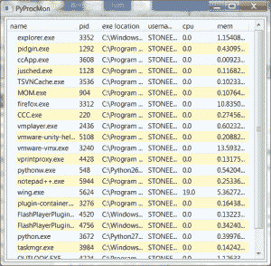
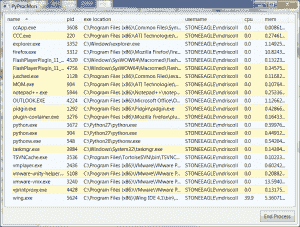
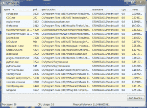

# wxPython:使用 psutil 创建自己的跨平台进程监视器

> 原文：<https://www.blog.pythonlibrary.org/2012/07/13/wxpython-creating-your-own-cross-platform-process-monitor-with-psutil/>

本周，我在 Google Code 上偶然发现了一个名为 [psutil](http://code.google.com/p/psutil/) 的有趣的 Python 项目。据说它可以在 Linux、Windows、OSX 和 FreeBSD 上运行。它所做的是抓取所有正在运行的进程，给你关于它们的信息，也给你终止它们的能力。所以我认为在它上面放一个 GUI，并用 wxPython 创建我自己的任务管理器/进程监视器应用程序会很有趣。如果你有时间的话，你可以和我一起经历我的代码的 4 次迭代。

### 第一个原型

[](https://www.blog.pythonlibrary.org/wp-content/uploads/2012/07/pyprocmon_beta.png)

我的第一个版本只显示了应用程序运行时当前运行的内容，并使用了 wx。每 5 秒更新一次的计时器。我使用了 [ObjectListView 小部件](http://pypi.python.org/pypi/ObjectListView)来显示数据，这实际上并不包含在 wxPython 中，所以如果您想运行代码，您需要获取它。

```py

import psutil
import wx
from ObjectListView import ObjectListView, ColumnDefn

########################################################################
class Process(object):
    """ """

    #----------------------------------------------------------------------
    def __init__(self, name, pid, exe, user, cpu, mem, desc=None):
        """Constructor"""
        self.name = name
        self.pid = pid
        self.exe = exe
        self.user = user
        self.cpu = cpu
        self.mem = mem
        #self.desc = desc

########################################################################
class MainPanel(wx.Panel):
    """"""

    #----------------------------------------------------------------------
    def __init__(self, parent):
        """Constructor"""
        wx.Panel.__init__(self, parent=parent)
        self.procs = []

        self.procmonOlv = ObjectListView(self, style=wx.LC_REPORT|wx.SUNKEN_BORDER)
        self.setProcs()

        mainSizer = wx.BoxSizer(wx.VERTICAL)
        mainSizer.Add(self.procmonOlv, 1, wx.EXPAND|wx.ALL, 5)
        self.SetSizer(mainSizer)
        self.updateDisplay()

        # check for updates every 5 seconds
        self.timer = wx.Timer(self)
        self.Bind(wx.EVT_TIMER, self.update, self.timer)
        self.timer.Start(5000)

    #----------------------------------------------------------------------
    def setProcs(self):
        """"""
        cols = [
            ColumnDefn("name", "left", 150, "name"),
            ColumnDefn("pid", "left", 50, "pid"),
            ColumnDefn("exe location", "left", 100, "exe"),
            ColumnDefn("username", "left", 75, "user"),
            ColumnDefn("cpu", "left", 75, "cpu"),
            ColumnDefn("mem", "left", 75, "mem"),
            #ColumnDefn("description", "left", 200, "desc")
            ]
        self.procmonOlv.SetColumns(cols)
        self.procmonOlv.SetObjects(self.procs)

    #----------------------------------------------------------------------
    def update(self, event):
        """"""
        self.updateDisplay()

    #----------------------------------------------------------------------
    def updateDisplay(self):
        """"""
        pids = psutil.get_pid_list()
        for pid in pids:

            try:
                p = psutil.Process(pid)
                new_proc = Process(p.name,
                                   str(p.pid),
                                   p.exe,
                                   p.username,
                                   str(p.get_cpu_percent()),
                                   str(p.get_memory_percent())
                                   )
                self.procs.append(new_proc)
            except:
                pass

        self.setProcs()

########################################################################
class MainFrame(wx.Frame):
    """"""

    #----------------------------------------------------------------------
    def __init__(self):
        """Constructor"""
        wx.Frame.__init__(self, None, title="PyProcMon")
        panel = MainPanel(self)
        self.Show()

if __name__ == "__main__":
    app = wx.App(False)
    frame = MainFrame()
    app.MainLoop()

```

这个实现有一个相当明显的问题。你能说出这是什么吗？获取进程信息的过程有点慢，所以 GUI 每 5 秒暂停一次。真讨厌！因此，让我们添加线程来解决这个问题。

### 为 Alpha 2 的应用程序添加线程

在第二个版本中，我们添加了线程和 pubsub，使得从线程向 GUI 传递信息更加容易。注意，我们还需要使用 wx。将 pubsub 作为 pubsub 调用的 CallAfter 不是线程安全的。

```py

import psutil # http://code.google.com/p/psutil/
import wx

from ObjectListView import ObjectListView, ColumnDefn
from threading import Thread
from wx.lib.pubsub import Publisher

########################################################################
class ProcThread(Thread):
    """
    Gets all the process information we need as psutil isn't very fast
    """

    #----------------------------------------------------------------------
    def __init__(self):
        """Constructor"""
        Thread.__init__(self)
        self.start() 

    #----------------------------------------------------------------------
    def run(self):
        """"""
        pids = psutil.get_pid_list()
        procs = []
        for pid in pids:
            try:
                p = psutil.Process(pid)
                new_proc = Process(p.name,
                                   str(p.pid),
                                   p.exe,
                                   p.username,
                                   str(p.get_cpu_percent()),
                                   str(p.get_memory_percent())
                                   )
                procs.append(new_proc)
            except:
                print "Error getting pid #%s information" % pid

        # send pids to GUI
        wx.CallAfter(Publisher().sendMessage, "update", procs)

########################################################################
class Process(object):
    """
    Definition of Process model for ObjectListView
    """

    #----------------------------------------------------------------------
    def __init__(self, name, pid, exe, user, cpu, mem, desc=None):
        """Constructor"""
        self.name = name
        self.pid = pid
        self.exe = exe
        self.user = user
        self.cpu = cpu
        self.mem = mem
        #self.desc = desc

########################################################################
class MainPanel(wx.Panel):
    """"""

    #----------------------------------------------------------------------
    def __init__(self, parent):
        """Constructor"""
        wx.Panel.__init__(self, parent=parent)
        self.procs = []

        self.procmonOlv = ObjectListView(self, style=wx.LC_REPORT|wx.SUNKEN_BORDER)
        self.setProcs()

        mainSizer = wx.BoxSizer(wx.VERTICAL)
        mainSizer.Add(self.procmonOlv, 1, wx.EXPAND|wx.ALL, 5)
        self.SetSizer(mainSizer)

        # check for updates every 5 seconds
        self.timer = wx.Timer(self)
        self.Bind(wx.EVT_TIMER, self.update, self.timer)
        self.timer.Start(15000)
        self.setProcs()

        # create a pubsub receiver
        Publisher().subscribe(self.updateDisplay, "update")

    #----------------------------------------------------------------------
    def setProcs(self):
        """"""
        cols = [
            ColumnDefn("name", "left", 150, "name"),
            ColumnDefn("pid", "left", 50, "pid"),
            ColumnDefn("exe location", "left", 100, "exe"),
            ColumnDefn("username", "left", 75, "user"),
            ColumnDefn("cpu", "left", 75, "cpu"),
            ColumnDefn("mem", "left", 75, "mem"),
            #ColumnDefn("description", "left", 200, "desc")
            ]
        self.procmonOlv.SetColumns(cols)
        self.procmonOlv.SetObjects(self.procs)
        self.procmonOlv.sortAscending = True

    #----------------------------------------------------------------------
    def update(self, event):
        """
        Start a thread to get the pid information
        """
        self.timer.Stop()
        ProcThread()

    #----------------------------------------------------------------------
    def updateDisplay(self, msg):
        """"""
        self.procs = msg.data
        self.setProcs()
        if not self.timer.IsRunning():
            self.timer.Start(15000)

########################################################################
class MainFrame(wx.Frame):
    """"""

    #----------------------------------------------------------------------
    def __init__(self):
        """Constructor"""
        wx.Frame.__init__(self, None, title="PyProcMon")
        panel = MainPanel(self)
        self.Show()

if __name__ == "__main__":
    app = wx.App(False)
    frame = MainFrame()
    app.MainLoop()

```

我们还将更新间隔的秒数增加到了 15 秒。我这样做主要是因为它更新太快了，我不能在它再次更新之前好好看看我的列表。在这一点上，我注意到我不能改变列的大小，除非它们在每次更新时都重置。我还希望应用程序能够跟踪我对哪一列进行了排序，以及我最后的选择是什么。最后，我需要一种终止进程的方法。

### 第三步:添加基本功能

[](https://www.blog.pythonlibrary.org/wp-content/uploads/2012/07/pyprocmon_beta2.png)

所以在第三次迭代中，我们添加了所有这些。看看这个:

```py

import psutil # http://code.google.com/p/psutil/
import wx

from ObjectListView import ObjectListView, ColumnDefn
from threading import Thread
from wx.lib.pubsub import Publisher

########################################################################
class ProcThread(Thread):
    """
    Gets all the process information we need as psutil isn't very fast
    """

    #----------------------------------------------------------------------
    def __init__(self):
        """Constructor"""
        Thread.__init__(self)
        self.start() 

    #----------------------------------------------------------------------
    def run(self):
        """"""
        pids = psutil.get_pid_list()
        procs = []
        for pid in pids:
            try:
                p = psutil.Process(pid)
                new_proc = Process(p.name,
                                   str(p.pid),
                                   p.exe,
                                   p.username,
                                   str(p.get_cpu_percent()),
                                   str(p.get_memory_percent())
                                   )
                procs.append(new_proc)
            except:
                pass

        # send pids to GUI
        wx.CallAfter(Publisher().sendMessage, "update", procs)

########################################################################
class Process(object):
    """
    Definition of Process model for ObjectListView
    """

    #----------------------------------------------------------------------
    def __init__(self, name, pid, exe, user, cpu, mem, desc=None):
        """Constructor"""
        self.name = name
        self.pid = pid
        self.exe = exe
        self.user = user
        self.cpu = cpu
        self.mem = mem
        #self.desc = desc

########################################################################
class MainPanel(wx.Panel):
    """"""

    #----------------------------------------------------------------------
    def __init__(self, parent):
        """Constructor"""
        wx.Panel.__init__(self, parent=parent)
        self.currentSelection = None
        self.gui_shown = False
        self.procs = []
        self.sort_col = 0

        self.col_w = {"name":175,
                      "pid":50,
                      "exe":300,
                      "user":175,
                      "cpu":60,
                      "mem":75}

        self.procmonOlv = ObjectListView(self, style=wx.LC_REPORT|wx.SUNKEN_BORDER)
        self.procmonOlv.Bind(wx.EVT_LIST_COL_CLICK, self.onColClick)
        self.procmonOlv.Bind(wx.EVT_LIST_ITEM_SELECTED, self.onSelect)
        #self.procmonOlv.Select
        self.setProcs()

        endProcBtn = wx.Button(self, label="End Process")
        endProcBtn.Bind(wx.EVT_BUTTON, self.onKillProc)

        mainSizer = wx.BoxSizer(wx.VERTICAL)
        mainSizer.Add(self.procmonOlv, 1, wx.EXPAND|wx.ALL, 5)
        mainSizer.Add(endProcBtn, 0, wx.ALIGN_RIGHT|wx.ALL, 5)
        self.SetSizer(mainSizer)

        # check for updates every 15 seconds
        self.timer = wx.Timer(self)
        self.Bind(wx.EVT_TIMER, self.update, self.timer)
        self.update("")
        self.setProcs()

        # create a pubsub receiver
        Publisher().subscribe(self.updateDisplay, "update")

    #----------------------------------------------------------------------
    def onColClick(self, event):
        """
        Remember which column to sort by, currently only does ascending
        """
        self.sort_col = event.GetColumn()

    #----------------------------------------------------------------------
    def onKillProc(self, event):
        """
        Kill the selected process by pid
        """
        obj = self.procmonOlv.GetSelectedObject()
        print
        pid = int(obj.pid)
        try:
            p = psutil.Process(pid)
            p.terminate()
            self.update("")
        except Exception, e:
            print "Error: " + e

    #----------------------------------------------------------------------
    def onSelect(self, event):
        """"""
        item = event.GetItem()
        itemId = item.GetId()
        self.currentSelection = itemId
        print

    #----------------------------------------------------------------------
    def setProcs(self):
        """"""
        cw = self.col_w
        # change column widths as necessary
        if self.gui_shown:
            cw["name"] = self.procmonOlv.GetColumnWidth(0)
            cw["pid"] = self.procmonOlv.GetColumnWidth(1)
            cw["exe"] = self.procmonOlv.GetColumnWidth(2)
            cw["user"] = self.procmonOlv.GetColumnWidth(3)
            cw["cpu"] = self.procmonOlv.GetColumnWidth(4)
            cw["mem"] = self.procmonOlv.GetColumnWidth(5)

        cols = [
            ColumnDefn("name", "left", cw["name"], "name"),
            ColumnDefn("pid", "left", cw["pid"], "pid"),
            ColumnDefn("exe location", "left", cw["exe"], "exe"),
            ColumnDefn("username", "left", cw["user"], "user"),
            ColumnDefn("cpu", "left", cw["cpu"], "cpu"),
            ColumnDefn("mem", "left", cw["mem"], "mem"),
            #ColumnDefn("description", "left", 200, "desc")
            ]
        self.procmonOlv.SetColumns(cols)
        self.procmonOlv.SetObjects(self.procs)
        self.procmonOlv.SortBy(self.sort_col)
        if self.currentSelection:
            self.procmonOlv.Select(self.currentSelection)
            self.procmonOlv.SetFocus()
        self.gui_shown = True

    #----------------------------------------------------------------------
    def update(self, event):
        """
        Start a thread to get the pid information
        """
        print "update thread started!"
        self.timer.Stop()
        ProcThread()

    #----------------------------------------------------------------------
    def updateDisplay(self, msg):
        """"""
        print "thread done, updating display!"
        self.procs = msg.data
        self.setProcs()
        if not self.timer.IsRunning():
            self.timer.Start(15000)

########################################################################
class MainFrame(wx.Frame):
    """"""

    #----------------------------------------------------------------------
    def __init__(self):
        """Constructor"""
        wx.Frame.__init__(self, None, title="PyProcMon", size=(1024, 768))
        panel = MainPanel(self)
        self.Show()

#----------------------------------------------------------------------
if __name__ == "__main__":
    app = wx.App(False)
    frame = MainFrame()
    app.MainLoop()

```

您会注意到，我们必须捕获几个事件来跟踪列排序和当前选择是什么。我不知道如何判断排序的方向，也不知道如何改变，所以这仍然在我的待办事项列表中。然而，我还想添加一个特性:一个状态栏，显示进程数量、CPU 使用和内存的信息。

### 最终产品:PyProcMon

[](https://www.blog.pythonlibrary.org/wp-content/uploads/2012/07/pyprocmon.png)

对于最终版本(至少现在是这样)，我们添加了一个由 3 部分组成的 statusbar 和另一个 pubsub 接收者/发布者。我们还将一些代码拆分到它们自己的模块中。线程代码放在 controller.py 中，流程类放在 model.py 中，其余的留在原处。我们将从控制器开始:

```py

# controller.py
########################################################################
import psutil
import wx

from model import Process
from threading import Thread
from wx.lib.pubsub import Publisher

########################################################################
class ProcThread(Thread):
    """
    Gets all the process information we need as psutil isn't very fast
    """

    #----------------------------------------------------------------------
    def __init__(self):
        """Constructor"""
        Thread.__init__(self)
        self.start() 

    #----------------------------------------------------------------------
    def run(self):
        """"""
        pids = psutil.get_pid_list()
        procs = []
        cpu_percent = 0
        mem_percent = 0
        for pid in pids:
            try:
                p = psutil.Process(pid)
                cpu = p.get_cpu_percent()
                mem = p.get_memory_percent()
                new_proc = Process(p.name,
                                   str(p.pid),
                                   p.exe,
                                   p.username,
                                   str(cpu),
                                   str(mem)
                                   )
                procs.append(new_proc)
                cpu_percent += cpu
                mem_percent += mem
            except:
                pass

        # send pids to GUI
        wx.CallAfter(Publisher().sendMessage, "update", procs)

        number_of_procs = len(procs)
        wx.CallAfter(Publisher().sendMessage, "update_status",
                     (number_of_procs, cpu_percent, mem_percent))

```

您已经看到了这一点，所以让我们继续看模型:

```py

# model.py
########################################################################
class Process(object):
    """
    Definition of Process model for ObjectListView
    """

    #----------------------------------------------------------------------
    def __init__(self, name, pid, exe, user, cpu, mem, desc=None):
        """Constructor"""
        self.name = name
        self.pid = pid
        self.exe = exe
        self.user = user
        self.cpu = cpu
        self.mem = mem

```

那超级简单！请注意，我们甚至不需要向其中导入任何内容。现在让我们来看看项目的核心部分是如何完成的:

```py

# pyProcMon.py
import controller
import psutil # http://code.google.com/p/psutil/
import wx

from ObjectListView import ObjectListView, ColumnDefn
from wx.lib.pubsub import Publisher

########################################################################
class MainPanel(wx.Panel):
    """"""

    #----------------------------------------------------------------------
    def __init__(self, parent):
        """Constructor"""
        wx.Panel.__init__(self, parent=parent)
        self.currentSelection = None
        self.gui_shown = False
        self.procs = []
        self.sort_col = 0

        self.col_w = {"name":175,
                      "pid":50,
                      "exe":300,
                      "user":175,
                      "cpu":60,
                      "mem":75}

        self.procmonOlv = ObjectListView(self, style=wx.LC_REPORT|wx.SUNKEN_BORDER)
        self.procmonOlv.Bind(wx.EVT_LIST_COL_CLICK, self.onColClick)
        self.procmonOlv.Bind(wx.EVT_LIST_ITEM_SELECTED, self.onSelect)
        #self.procmonOlv.Select
        self.setProcs()

        endProcBtn = wx.Button(self, label="End Process")
        endProcBtn.Bind(wx.EVT_BUTTON, self.onKillProc)

        mainSizer = wx.BoxSizer(wx.VERTICAL)
        mainSizer.Add(self.procmonOlv, 1, wx.EXPAND|wx.ALL, 5)
        mainSizer.Add(endProcBtn, 0, wx.ALIGN_RIGHT|wx.ALL, 5)
        self.SetSizer(mainSizer)

        # check for updates every 15 seconds
        self.timer = wx.Timer(self)
        self.Bind(wx.EVT_TIMER, self.update, self.timer)
        self.update("")
        self.setProcs()

        # create a pubsub receiver
        Publisher().subscribe(self.updateDisplay, "update")

    #----------------------------------------------------------------------
    def onColClick(self, event):
        """
        Remember which column to sort by, currently only does ascending
        """
        self.sort_col = event.GetColumn()

    #----------------------------------------------------------------------
    def onKillProc(self, event):
        """
        Kill the selected process by pid
        """
        obj = self.procmonOlv.GetSelectedObject()
        print
        pid = int(obj.pid)
        try:
            p = psutil.Process(pid)
            p.terminate()
            self.update("")
        except Exception, e:
            print "Error: " + e

    #----------------------------------------------------------------------
    def onSelect(self, event):
        """
        Gets called when an item is selected and helps keep track of 
        what item is selected
        """
        item = event.GetItem()
        itemId = item.GetId()
        self.currentSelection = itemId

    #----------------------------------------------------------------------
    def setProcs(self):
        """
        Updates the ObjectListView widget display
        """
        cw = self.col_w
        # change column widths as necessary
        if self.gui_shown:
            cw["name"] = self.procmonOlv.GetColumnWidth(0)
            cw["pid"] = self.procmonOlv.GetColumnWidth(1)
            cw["exe"] = self.procmonOlv.GetColumnWidth(2)
            cw["user"] = self.procmonOlv.GetColumnWidth(3)
            cw["cpu"] = self.procmonOlv.GetColumnWidth(4)
            cw["mem"] = self.procmonOlv.GetColumnWidth(5)

        cols = [
            ColumnDefn("name", "left", cw["name"], "name"),
            ColumnDefn("pid", "left", cw["pid"], "pid"),
            ColumnDefn("exe location", "left", cw["exe"], "exe"),
            ColumnDefn("username", "left", cw["user"], "user"),
            ColumnDefn("cpu", "left", cw["cpu"], "cpu"),
            ColumnDefn("mem", "left", cw["mem"], "mem"),
            #ColumnDefn("description", "left", 200, "desc")
            ]
        self.procmonOlv.SetColumns(cols)
        self.procmonOlv.SetObjects(self.procs)
        self.procmonOlv.SortBy(self.sort_col)
        if self.currentSelection:
            self.procmonOlv.Select(self.currentSelection)
            self.procmonOlv.SetFocus()
        self.gui_shown = True

    #----------------------------------------------------------------------
    def update(self, event):
        """
        Start a thread to get the pid information
        """
        print "update thread started!"
        self.timer.Stop()
        controller.ProcThread()

    #----------------------------------------------------------------------
    def updateDisplay(self, msg):
        """
        Catches the pubsub message from the thread and updates the display
        """
        print "thread done, updating display!"
        self.procs = msg.data
        self.setProcs()
        if not self.timer.IsRunning():
            self.timer.Start(15000)

########################################################################
class MainFrame(wx.Frame):
    """"""

    #----------------------------------------------------------------------
    def __init__(self):
        """Constructor"""
        wx.Frame.__init__(self, None, title="PyProcMon", size=(1024, 768))
        panel = MainPanel(self)

        # set up the statusbar
        self.CreateStatusBar()
        self.StatusBar.SetFieldsCount(3)
        self.StatusBar.SetStatusWidths([200, 200, 200])

        # create a pubsub receiver
        Publisher().subscribe(self.updateStatusbar, "update_status")

        self.Show()

    #----------------------------------------------------------------------
    def updateStatusbar(self, msg):
        """"""
        procs, cpu, mem = msg.data
        self.SetStatusText("Processes: %s" % procs, 0)
        self.SetStatusText("CPU Usage: %s" % cpu, 1)
        self.SetStatusText("Physical Memory: %s" % mem, 2)

#----------------------------------------------------------------------
if __name__ == "__main__":
    app = wx.App(False)
    frame = MainFrame()
    app.MainLoop()

```

这里主要的是增加的状态栏和它的更新机制。它花了一点时间来调整它，但现在它会随着显示一起更新。

### 包扎

您可能想知道为什么 pid 信息收集过程在 try/except 子句中。一些 PID 不想放弃他们的信息，或者在我抓取列表和我试图提取信息之间设法停止存在，所以我必须跳过这些。实际上有很多这样的 PID。我还在一次尝试中包装了杀死进程/除了我期望的一些进程不能被杀死。除此之外，这已经很好了。这里只是我想添加的几个功能:右键单击杀死/上下文菜单，一个确认对话框，一个带有一些选项的菜单栏(关闭，启动一个新程序，关于)。

我希望你喜欢和我一起学习，并在这个过程中得到一些很酷的东西。黑客快乐！

### 源代码

*   [psutil_gui.zip](https://www.blog.pythonlibrary.org/wp-content/uploads/2012/07/psutil_gui.zip)