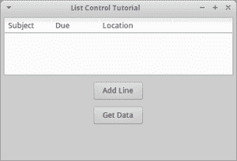
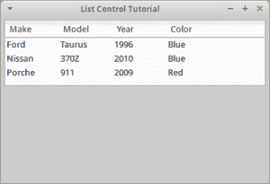

# wxPython -从 ListCtrl 中的所有列获取数据

> 原文：<https://www.blog.pythonlibrary.org/2017/06/28/wxpython-getting-data-from-all-columns-in-a-listctrl/>

有时，我会看到有人问如何在报表模式下获取 ListCtrl 的一行中每一项的文本。例如，ListCtrl 并没有明确说明如何在第一行第三列中获取文本。在这篇文章中，我们将看看如何完成这项任务。

* * *

### 从任何列获取数据



让我们首先创建一个简单的 ListCtrl 并使用一个按钮来填充它。然后我们将添加第二个按钮来提取 ListCtrl: 的内容

```py

import wx

class MyForm(wx.Frame):

    def __init__(self):
        wx.Frame.__init__(self, None, wx.ID_ANY, "List Control Tutorial")

        # Add a panel so it looks the correct on all platforms
        panel = wx.Panel(self, wx.ID_ANY)
        self.index = 0

        self.list_ctrl = wx.ListCtrl(panel, size=(-1,100),
                         style=wx.LC_REPORT
                         |wx.BORDER_SUNKEN
                         )
        self.list_ctrl.InsertColumn(0, 'Subject')
        self.list_ctrl.InsertColumn(1, 'Due')
        self.list_ctrl.InsertColumn(2, 'Location', width=125)

        btn = wx.Button(panel, label="Add Line")
        btn2 = wx.Button(panel, label="Get Data")
        btn.Bind(wx.EVT_BUTTON, self.add_line)
        btn2.Bind(wx.EVT_BUTTON, self.get_data)

        sizer = wx.BoxSizer(wx.VERTICAL)
        sizer.Add(self.list_ctrl, 0, wx.ALL|wx.EXPAND, 5)
        sizer.Add(btn, 0, wx.ALL|wx.CENTER, 5)
        sizer.Add(btn2, 0, wx.ALL|wx.CENTER, 5)
        panel.SetSizer(sizer)

    def add_line(self, event):
        line = "Line %s" % self.index
        self.list_ctrl.InsertStringItem(self.index, line)
        self.list_ctrl.SetStringItem(self.index, 1, "01/19/2010")
        self.list_ctrl.SetStringItem(self.index, 2, "USA")
        self.index += 1

    def get_data(self, event):
        count = self.list_ctrl.GetItemCount()
        cols = self.list_ctrl.GetColumnCount()
        for row in range(count):
            for col in range(cols):
                item = self.list_ctrl.GetItem(itemId=row, col=col)
                print(item.GetText())

# Run the program
if __name__ == "__main__":
    app = wx.App(False)
    frame = MyForm()
    frame.Show()
    app.MainLoop()

```

让我们花点时间来分解一下这段代码。第一个按钮的事件处理程序是第一段有趣的代码。它演示了如何将数据插入 ListCtrl。如你所见，这非常简单，因为我们需要做的就是调用 **InsertStringItem** 来添加一行，然后使用 **SetStringItem** 来设置每一列的文本。除了字符串项之外，我们还可以向 ListCtrl 中插入其他类型的项，但这超出了本文的范围。

接下来我们应该看看 **get_data** 事件处理程序。它使用 ListCtrl 的 **GetItemCount** 方法获取行数。我们还通过 **GetColumnCount** 获得 ListCtrl 中的列数。最后，我们遍历这些行并提取每个单元格，用 ListCtrl 的说法就是“item”。我们使用这个任务的 ListCtrl 的 **GetItem** 方法。现在我们已经有了该项，我们可以调用该项的 **GetText** 方法来提取文本并将其打印到 stdout。

* * *

### 将对象与行相关联



更简单的方法是将一个对象与每一行相关联。让我们花点时间来看看这是如何实现的:

```py

import wx

class Car(object):
    """"""

    def __init__(self, make, model, year, color="Blue"):
        """Constructor"""
        self.make = make
        self.model = model
        self.year = year
        self.color = color

class MyPanel(wx.Panel):
    """"""

    def __init__(self, parent):
        """Constructor"""
        wx.Panel.__init__(self, parent)

        rows = [Car("Ford", "Taurus", "1996"),
                Car("Nissan", "370Z", "2010"),
                Car("Porche", "911", "2009", "Red")
                ]

        self.list_ctrl = wx.ListCtrl(self, size=(-1,100),
                                style=wx.LC_REPORT
                                |wx.BORDER_SUNKEN
                                )
        self.list_ctrl.Bind(wx.EVT_LIST_ITEM_SELECTED, self.onItemSelected)
        self.list_ctrl.InsertColumn(0, "Make")
        self.list_ctrl.InsertColumn(1, "Model")
        self.list_ctrl.InsertColumn(2, "Year")
        self.list_ctrl.InsertColumn(3, "Color")

        index = 0
        self.myRowDict = {}
        for row in rows:
            self.list_ctrl.InsertStringItem(index, row.make)
            self.list_ctrl.SetStringItem(index, 1, row.model)
            self.list_ctrl.SetStringItem(index, 2, row.year)
            self.list_ctrl.SetStringItem(index, 3, row.color)
            self.myRowDict[index] = row
            index += 1

        sizer = wx.BoxSizer(wx.VERTICAL)
        sizer.Add(self.list_ctrl, 0, wx.ALL|wx.EXPAND, 5)
        self.SetSizer(sizer)

    def onItemSelected(self, event):
        """"""
        currentItem = event.m_itemIndex
        car = self.myRowDict[currentItem]
        print(car.make)
        print(car.model)
        print(car.color)
        print(car.year)

class MyFrame(wx.Frame):
    """"""

    def __init__(self):
        """Constructor"""
        wx.Frame.__init__(self, None, wx.ID_ANY, "List Control Tutorial")
        panel = MyPanel(self)
        self.Show()

if __name__ == "__main__":
    app = wx.App(False)
    frame = MyFrame()
    app.MainLoop()

```

在这个例子中，我们有一个 **Car** 类，我们将使用它来创建 Car 对象。这些汽车对象将与 ListCtrl 中的一行相关联。看一下 **MyPanel** 的 **__init__** 方法，您会看到我们创建了一个 row 对象列表，然后循环遍历 row 对象，并使用文本值的对象属性将它们插入 ListCtrl。您还会注意到，我们已经创建了一个类属性字典，用于将行的索引与插入到行中的 Car 对象相关联。

我们还将 ListCtrl 绑定到**EVT _ 列表 _ 项目 _ 选择的**，这样当一个项目被选择时，它将调用 **onItemSelected** 方法并打印出该行的数据。您会注意到，我们通过使用 **event.m_itemIndex** 来获取行的索引。代码的其余部分应该是不言自明的。

* * *

### 包扎

现在，您已经知道了从 ListCtrl 中提取所有数据的几种不同方法。就我个人而言，我非常喜欢使用 ObjectListView 小部件。我觉得它优于 ListCtrl，因为它内置了这些特性。但是它不包含在 wxPython 中，所以需要额外安装。

* * *

### 附加阅读

*   ListCtrl: [提示和技巧](https://www.blog.pythonlibrary.org/2011/01/04/wxpython-wx-listctrl-tips-and-tricks/)
*   wxPython: [使用 ObjectListView 代替 ListCtrl](https://www.blog.pythonlibrary.org/2009/12/23/wxpython-using-objectlistview-instead-of-a-listctrl/)