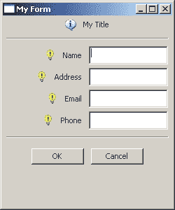
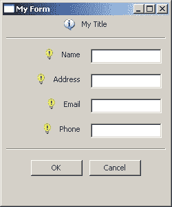

# wxPython: GridSizers 和胖文本控件

> 原文：<https://www.blog.pythonlibrary.org/2008/05/21/wxpython-gridsizers-and-fat-textctrls/>

在我的上一篇文章中，我写了如何使用 GridSizer 创建通用表单。不幸的是，wx。TextCtrls 最后看起来都很胖。好像通过一个 wx。当添加 TextCtrl 时，将扩展标志添加到 GridSizer，使其扩展以填充单元格，并在调整窗口本身大小时调整大小。

解决这个问题的一个方法是改变将 TextCtrl 添加到 sizer 的方式。最初的一行看起来像这样:

```py

gridSizer.Add(inputTxtOne, 0, wx.EXPAND)

```

现在添加位标志 wx。全部，并将边框宽度设置为 5 像素:

```py

gridSizer.Add(inputTxtOne, 0, wx.EXPAND|wx.ALL, 5)

```

请看下面的前后截图，看看效果。这两个程序都运行在 Windows XP 机器上:

**之前**
[](https://www.blog.pythonlibrary.org/wp-content/uploads/2008/05/fat.jpg)

[](https://www.blog.pythonlibrary.org/wp-content/uploads/2008/05/skinny.jpg) 后

 **需要注意的一点是:如果向这些单元格中的任何一个添加一个胖部件，比如多行 TextCtrl，除了 StaticCtrls 之外，所有其他控件都会明显变宽。Robin Dunn 的书《wxPython in Action》指出,“一个网格尺寸调整器最适合于孩子自然都一样大的布局...一个尺寸差异很大的网格尺寸器看起来有点奇怪。它继续说，如果你想在一个网格中使用不同大小的部件，那么你需要使用 flex 网格尺寸器或网格袋尺寸器。

敬请期待！**