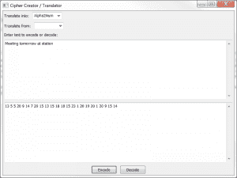

# wxPython -用愚蠢的密码取乐

> 原文：<https://www.blog.pythonlibrary.org/2013/04/26/wxpython-having-fun-with-silly-ciphers/>

当我还是个孩子的时候，我对秘密代码和密码很感兴趣。我觉得它们很有趣。我妈妈认为在特殊场合，比如生日，用一些我非常喜欢的密码来寻宝会很有趣。她会拿一个类似密码转盘的东西，用它来创造代码，我和我哥哥必须用我们自己的转盘来解码，以找到一个礼物或另一个线索。我们用数字来代表字母(a=1，b=2，c=3 ),或者我们用滑动标度来移动字母表，A=B，C=D，D=E，等等。有时我们会创建一个代码棒，在那里你得到一长串纸，用铅笔把它包起来，然后写下纸的信息。当它被拆开的时候几乎是不可能阅读的。

无论如何，我决定用 wxPython 创建一个愚蠢的密码程序，在那里我可以输入一个字符串，并让它转换成其他东西。我也希望我的程序能解码它。现在你真的不能做一个可以使用密码轮或代码棒的程序，但是对于数字代码或滑动秤来说，那是非常容易的。

### 创建编码 GUI

[](https://www.blog.pythonlibrary.org/wp-content/uploads/2013/04/cipher_trans.png)

创建实际的 GUI 是小菜一碟。编写后端代码需要更多的工作，在后端，您必须实际解析字符串并将其更改为其他内容。对于这个练习，我创建了 4 个编码器和 3 个解码器。这 5 个编码器将字符串编码成数字、ASCII(这是一组不同的数字)、L33t(只是为了好玩)和 Hex。对于解码器，我解码除了 L33t 的一切。让我们花点时间研究一下 GUI 的代码:

```py

import controller
import wx

########################################################################
class CipherPanel(wx.Panel):
    """"""

    #----------------------------------------------------------------------
    def __init__(self, parent):
        """Constructor"""
        wx.Panel.__init__(self, parent=parent)
        choices = ["", "Alpha2Num", "ASCII", "L33t", "Hex"]
        decode_choices = ["", "ASCII", "Hex", "Num2Alpha"]
        self.mainSizer = wx.BoxSizer(wx.VERTICAL)

        toLbl = wx.StaticText(self, label="Translate into:")
        self.toCbo = wx.ComboBox(self, value=choices[1], choices=choices)
        self.add2HSizer([toLbl, self.toCbo])

        fromLbl = wx.StaticText(self, label="Translate from:")
        self.fromCbo = wx.ComboBox(self, value="", choices=decode_choices)
        self.add2HSizer([fromLbl, self.fromCbo])

        txtLbl = wx.StaticText(self, label="Enter text to encode or decode:")
        self.originalTxt = wx.TextCtrl(self, style=wx.TE_MULTILINE)

        self.translatedTxt = wx.TextCtrl(self, style=wx.TE_MULTILINE)

        encodeBtn = wx.Button(self, label="Encode")
        encodeBtn.Bind(wx.EVT_BUTTON, self.onEncode)
        decodeBtn = wx.Button(self, label="Decode")
        decodeBtn.Bind(wx.EVT_BUTTON, self.onDecode)

        # layout widgets
        self.mainSizer.Add(txtLbl, 0, wx.ALL, 5)
        self.mainSizer.Add(self.originalTxt, 1, wx.EXPAND|wx.ALL, 5)
        self.mainSizer.Add(self.translatedTxt, 1, wx.EXPAND|wx.ALL, 5)
        self.add2HSizer([encodeBtn, decodeBtn])

        self.SetSizer(self.mainSizer)

    #----------------------------------------------------------------------
    def add2HSizer(self, widgets):
        """
        Add widgets to a horizontal sizer
        """
        sizer = wx.BoxSizer(wx.HORIZONTAL)
        for widget in widgets:
            sizer.Add(widget, 0, wx.ALL|wx.CENTER, 5)

        if isinstance(widgets[0], wx.Button):
            self.mainSizer.Add(sizer, 0, wx.CENTER)
        else:
            self.mainSizer.Add(sizer)

    #----------------------------------------------------------------------
    def onDecode(self, event):
        """
        Decodes what's in the original text box to the encoding 
        specified and puts the result in the bottom text box
        """
        from_value = self.fromCbo.GetValue()
        value_to_decode = self.originalTxt.GetValue()
        if from_value == "Hex":
            new_value = value_to_decode.decode("hex")
        elif from_value == "ASCII":
            value_to_decode = [int(i) for i in value_to_decode.split()]
            new_value = controller.convertFromASCII(value_to_decode)
        elif from_value == "Num2Alpha":
            value_to_decode = value_to_decode.split()
            new_value = controller.convertFromNumbers(value_to_decode)
        else:
            return

        self.translatedTxt.SetValue(new_value)

    #----------------------------------------------------------------------
    def onEncode(self, event):
        """
        Encodes what's in the original text box to the encoding 
        specified and puts the result in the bottom text box
        """
        to_value = self.toCbo.GetValue()
        value_to_encode = self.originalTxt.GetValue()
        if to_value == "Hex":
            new_value = value_to_encode.encode("hex")
        elif to_value == "ASCII":
            new_value = controller.convertToASCII(value_to_encode)
        elif to_value == "L33t":
            new_value = controller.convertToLeet(value_to_encode)
        elif to_value == "Alpha2Num":
            new_value = controller.convertToNumbers(value_to_encode)

        self.translatedTxt.SetValue(new_value)

########################################################################
class CipherFrame(wx.Frame):
    """"""

    #----------------------------------------------------------------------
    def __init__(self):
        """Constructor"""
        title = "Cipher Creator / Translator"
        size = (800,600)
        wx.Frame.__init__(self, None, title=title, size=size)
        panel = CipherPanel(self)
        self.Show()

#----------------------------------------------------------------------
if __name__ == "__main__":
    app = wx.App(False)
    frame = CipherFrame()
    app.MainLoop()

```

我们应该花点时间来分析一下。正如你可能在前面的截图中注意到的，这个 GUI 有几个组合框，几个多行文本控件和两个按钮。组合框控制我们编码或解码的内容。我们导入了一个神秘的模块，叫做“控制器”,它包含了所有编码的代码。我们一会儿再看。首先，我们需要看看这篇文章中的几个函数。在**one code**方法中，我们应该如何获取我们将要编码的值，并将其传递给适当的控制器函数。对于 **onDecode** 方法，我们有时必须在将数据传递给控制器之前做一些预处理。你可以在条件的 ASCII 部分看到一个例子，我们需要创建一个整数列表，或者在 Num2Alpha 部分，我们需要创建一个数字列表。一旦你理解了这里发生的事情，就可以继续下面的代码了。

```py

#----------------------------------------------------------------------
def convertToASCII(string):
    """"""
    output = []
    for letter in string:
        output.append( ord(letter) )

    return " ".join([str(i) for i in output])

#----------------------------------------------------------------------
def convertToCaesar(string):
    """
    http://www.wikihow.com/Create-Secret-Codes-and-Ciphers
    Shifts the alphabet 3 places such that A becomes X,
    B becomes Y, etc
    """
    caesar_dict = {"a": "x", 
                   "b": "y",
                   "c": "z",
                   "d": "a",
                   "e": "b",
                   "f": "c",
                   "g": "d",
                   "h": "e",
                   "i": "f",
                   "j": "g",
                   "k": "h",
                   "l": "i",
                   "m": "j",
                   "n": "k",
                   "o": "l",
                   "p": "m",
                   "q": "n",
                   "r": "o",
                   "s": "p",
                   "t": "q",
                   "u": "r",
                   "v": "s",
                   "w": "t",
                   "x": "u",
                   "y": "v",
                   "z": "w"}
    new_string = ""
    for char in string:
        if char == ' ':
            new_string += ' '
        else:
            new_string += caesar_dict[char.lower()]
    return new_string

#----------------------------------------------------------------------
def convertToLeet(string):
    """"""
    leet_dict = {"a":"4", "b":"8", "e":"3", "l":"1",
                 "o":"0", "s":"5", "t":"7"}
    new_string = ""
    for letter in string:
        if letter.lower() in leet_dict:
            letter = leet_dict[letter.lower()]
        new_string += letter
    return new_string

#----------------------------------------------------------------------
def convertToNumbers(string):
    """
    Convert a string to numbers where a=1, b=2, c=3, etc
    """
    keys = "abcdefghijklmnopqrstuvwxyz"
    values = ['1', '2', '3', '4', '5', '6', '7', '8', '9', '10', '11',
              '12', '13', '14', '15', '16', '17', '18', '19', '20', 
              '21', '22', '23', '24', '25', '26']
    num_dict = dict(zip(keys,values))
    new_string = ""
    for letter in string:
        if letter.lower() in num_dict:
            new_string += num_dict[letter.lower()] + " "
    return new_string

#----------------------------------------------------------------------
def convertFromASCII(data):
    """
    Convert from ASCII
    """
    s = ""
    if isinstance(data, str):
        for item in data.split():
            s += chr(int(item))
    else:
        # can also convert a list of integers
        for item in data:
            s += chr(item)
    return s

#----------------------------------------------------------------------
def convertFromCaesar(string):
    """
    Converts string from Caesar to normal
    """
    uncaesar_dict = {"x": "a",
                     "y": "b",
                     "z": "c",
                     "a": "d",
                     "b": "e",
                     "c": "f",
                     "d": "g",
                     "e": "h",
                     "f": "i",
                     "g": "j",
                     "h": "k",
                     "i": "l",
                     "j": "m",
                     "k": "n",
                     "l": "o",
                     "m": "p",
                     "n": "q",
                     "o": "r",
                     "p": "s",
                     "q": "t",
                     "r": "u",
                     "s": "v",
                     "t": "w",
                     "u": "x",
                     "v": "y",
                     "w": "z"}
    new_string = ""
    for char in string:
        if char == ' ':
            new_string += ' '
        else:
            new_string += uncaesar_dict[char.lower()]
    return new_string

#----------------------------------------------------------------------
def convertFromNumbers(data):
    """
    Convert a list of numbers to letters where 1=a, 2=b, 3=c, etc
    """
    keys = ['1', '2', '3', '4', '5', '6', '7', '8', '9', '10', '11',
            '12', '13', '14', '15', '16', '17', '18', '19', '20', 
            '21', '22', '23', '24', '25', '26']
    values = "abcdefghijklmnopqrstuvwxyz"
    num_dict = dict(zip(keys,values))

    new_string = ""
    for char in data:
        val = num_dict[char]
        new_string += val
    return new_string

#----------------------------------------------------------------------
if __name__ == "__main__":
    x = convertToASCII("I love you")
    y = convertToLeet("I love you")
    print x
    new_x = [int(i) for i in x.split()]
    print convertFromASCII(new_x)
    print convertFromASCII(x)

    x = convertToCaesar("Meeting tomorrow at station")
    print "Meeting tomorrow at station =>", x
    print "%s =>" % x, convertFromCaesar(x)

    t = convertToNumbers("Python rules")
    print "Python rules => " + t
    print "%s => " % t, convertFromNumbers(t.split())

```

您可能会注意到，我在控制器中包含了其他一些目前没有挂接到 GUI 中的例子。例如，我有一个转换函数，将字符串转换为 Caesar，这是一种流行的密码，其中字母表在一个方向或另一个方向上移动了 3 个位置。无论如何，这段代码最好的一点是我们不需要导入任何东西。它可以和普通的 Python 一起工作！为了转换成 ASCII，我们使用 Python 的内置 **ord** 。对于大多数其他的，我们使用字典来映射值。在脚本的底部，我们有一些测试用例要检查，并确保它按照我们的预期转换字符串。这些可能应该成为真正的单元测试，但是对于一个快速和肮脏的检查，这些工作很棒！

### 包扎

有几个其他的代码，我想添加到这一点上，如莫尔斯电码。我也喜欢信息隐藏在文本中的代码，比如一首诗中的每个第一个字母(或最后一个)拼写我们的某物，或者句子开头的每个字母拼写某物。那些总是很有趣。我在本文的末尾提供了一些链接，这样你就可以阅读其他有趣的代码和密码。祝编码愉快！

### 附加阅读

*   [幼兽和童子军的秘密代码](https://sites.google.com/site/codesforscouts/)
*   [儿童密码学](http://www.cerias.purdue.edu/education/k-12/teaching_resources/lessons_presentations/cryptology.html)
*   猪圈[密码](http://en.wikipedia.org/wiki/Pigpen_cipher)——这个很好玩！
*   WikiHow - [如何创建密码和密码](http://www.wikihow.com/Create-Secret-Codes-and-Ciphers#Caesar_Cipher)

### 下载源码！

*   [cipherGUI.zip](https://www.blog.pythonlibrary.org/wp-content/uploads/2013/04/cipherGUI.zip)
*   [cihergui . tar](https://www.blog.pythonlibrary.org/wp-content/uploads/2013/04/cipherGUI.tar)