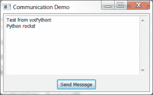

# wxPython:如何通过套接字与 GUI 通信

> 原文：<https://www.blog.pythonlibrary.org/2013/06/27/wxpython-how-to-communicate-with-your-gui-via-sockets/>

我有时会遇到这样的情况，让我的一个 Python 脚本与我的另一个 Python 脚本进行通信会很好。例如，我可能想从在后台运行的命令行脚本向运行在同一台机器上的 wxPython GUI 发送一条消息。几年前我听说过一个涉及 Python 的 socket 模块的解决方案，但是直到今天我的一个朋友问我这是怎么做到的，我才开始研究它。原来 Cody Precord 在他的 [wxPython 食谱](http://www.amazon.com/gp/product/1849511780/ref=as_li_ss_tl?ie=UTF8&camp=1789&creative=390957&creativeASIN=1849511780&linkCode=as2&tag=thmovsthpy-20)中有一个食谱很好地涵盖了这个话题。在这篇文章中，我采用了他的例子，并用它做了自己的事情。

### wxPython，螺纹和插座，天啊！

是的，我们将在这篇文章中深入讨论线程。它们可能非常令人困惑，但在这种情况下，它真的非常简单。与每个 GUI 库一样，我们需要知道如何从线程与 wxPython 通信。为什么？因为如果使用不安全的 wxPython 方法，结果是未定义的。有时候有用，有时候没用。您将会遇到难以追踪的奇怪问题，因此我们需要确保以线程安全的方式与 wxPython 进行通信。为此，我们可以使用以下三种方法之一:

*   wx。CallAfter(我的最爱)
*   wx。CallLater(上述产品的衍生产品)
*   wx。PostEvent(我几乎从不使用的东西)

现在您已经了解了如何从一个线程与 wxPython 对话。让我们实际上写一些代码！我们将从线程代码本身开始:

**更新 2014/02/21:** *在 wxPython 2.9+中，你将需要使用这篇[文章](https://www.blog.pythonlibrary.org/2013/09/05/wxpython-2-9-and-the-newer-pubsub-api-a-simple-tutorial/)* 中详细介绍的新的 pubsub API

```py

# wx_ipc.py

import select
import socket
import wx

from threading import Thread
from wx.lib.pubsub import Publisher

########################################################################
class IPCThread(Thread):
    """"""

    #----------------------------------------------------------------------
    def __init__(self):
        """Initialize"""
        Thread.__init__(self)

        self.socket = socket.socket(socket.AF_INET,
                                    socket.SOCK_STREAM)
        # Setup TCP socket
        self.socket.bind(('127.0.0.1', 8080))
        self.socket.listen(5)
        self.setDaemon(True)
        self.start()

    #----------------------------------------------------------------------
    def run(self):
        """
        Run the socket "server"
        """
        while True:
            try:
                client, addr = self.socket.accept()

                ready = select.select([client,],[], [],2)
                if ready[0]:
                    recieved = client.recv(4096)
                    print recieved
                    wx.CallAfter(Publisher().sendMessage,
                                 "update", recieved)

            except socket.error, msg:
                print "Socket error! %s" % msg
                break

        # shutdown the socket
        try:
            self.socket.shutdown(socket.SHUT_RDWR)
        except:
            pass

        self.socket.close()

```

我继续为这个类复制了 Cody 的名字，尽管我最终简化了我的版本。IPC 代表进程间通信，因为这就是我们在这里所做的，所以我想我应该保留这个名字。在这个调用中，我们设置了一个绑定到 127.0.0.1(也称为本地主机)的套接字，并监听端口 8080。如果您知道该端口已经被使用，请确保将该端口号更改为未被使用的端口号。接下来，我们将线程后台化，让它在后台无限期运行，然后我们启动它。现在它基本上是在无限循环中运行，等待有人给它发消息。多读几遍代码，直到你明白它是如何工作的。当您准备好了，您可以继续下面的 wxPython 代码。

**注意，上面的线程代码和下面的 wxPython 代码放在一个文件中。**

```py

# wx_ipc.py

########################################################################
class MyPanel(wx.Panel):
    """"""

    #----------------------------------------------------------------------
    def __init__(self, parent):
        """Constructor"""
        wx.Panel.__init__(self, parent)

        btn = wx.Button(self, label="Send Message")
        btn.Bind(wx.EVT_BUTTON, self.onSendMsg)

        self.textDisplay = wx.TextCtrl(self, value="", style=wx.TE_MULTILINE)

        mainSizer = wx.BoxSizer(wx.VERTICAL)
        mainSizer.Add(self.textDisplay, 1, wx.EXPAND|wx.ALL, 5)
        mainSizer.Add(btn, 0, wx.CENTER|wx.ALL, 5)
        self.SetSizer(mainSizer)

        Publisher().subscribe(self.updateDisplay, "update")

    #----------------------------------------------------------------------
    def onSendMsg(self, event):
        """
        Send a message from within wxPython
        """
        message = "Test from wxPython!"
        try:
            client = socket.socket(socket.AF_INET,
                                   socket.SOCK_STREAM)
            client.connect(('127.0.0.1', 8080))
            client.send(message)
            client.shutdown(socket.SHUT_RDWR)
            client.close()
        except Exception, msg:
            print msg

    #----------------------------------------------------------------------
    def updateDisplay(self, msg):
        """
        Display what was sent via the socket server
        """
        self.textDisplay.AppendText( str(msg.data) + "\n" )

########################################################################
class MyFrame(wx.Frame):
    """"""

    #----------------------------------------------------------------------
    def __init__(self):
        """Constructor"""
        wx.Frame.__init__(self, parent=None, title="Communication Demo")
        panel = MyPanel(self)

        # start the IPC server
        self.ipc = IPCThread()

        self.Show()

if __name__ == "__main__":
    app = wx.App(False)
    frame = MyFrame()
    app.MainLoop()

```

这里，我们使用一个简单的框架和一个带有两个小部件的面板来设置我们的用户界面:一个用于显示 GUI 从套接字接收的消息的文本控件和一个按钮。我们使用按钮来测试套接字服务器线程。当您按下按钮时，它将向套接字监听器发送一条消息，然后监听器将一条消息发送回 GUI 以更新显示。有点傻，但这是一个很好的演示，说明一切都按照您期望的方式工作。您会注意到我们使用 pubsub 来帮助将消息从线程发送到 UI。现在我们需要看看我们是否可以从一个单独的脚本与套接字服务器通信。

因此，在打开新的编辑器并编写如下代码时，请确保您的 GUI 处于运行状态:

```py

# sendMessage.py
import socket

#----------------------------------------------------------------------
def sendSocketMessage(message):
    """
    Send a message to a socket
    """
    try:
        client = socket.socket(socket.AF_INET,
                               socket.SOCK_STREAM)
        client.connect(('127.0.0.1', 8080))
        client.send(message)
        client.shutdown(socket.SHUT_RDWR)
        client.close()
    except Exception, msg:
        print msg

if __name__ == "__main__":
    sendSocketMessage("Python rocks!")

```

现在，如果您在第二个终端中执行第二个脚本，您应该会看到字符串“Python rocks！”出现在 GUI 的文本控件中。如果您在运行上面的脚本之前按了一次按钮，它应该看起来像下面这样:

[](https://www.blog.pythonlibrary.org/wp-content/uploads/2013/06/wxipc.png)

### 包扎

这种事情也可以在非 GUI 脚本中工作。理论上，您可以让一个主脚本与一个监听器线程一起运行。当侦听器收到消息时，它告诉主脚本继续处理。您也可以使用完全不同的编程语言向您的 GUI 发送套接字消息。只要发挥你的想象力，你会发现你可以用 Python 做各种很酷的事情！

### 附加阅读

*   套接字库的[正式文档](http://docs.python.org/2/library/socket.html)
*   选择图书馆的[正式文件](http://docs.python.org/2/library/select.html)
*   [wxPython 和线程](https://www.blog.pythonlibrary.org/2010/05/22/wxpython-and-threads/)
*   wxPython 关于线程的 [wiki 条目](http://wiki.wxpython.org/LongRunningTasks)
*   wxPython 和 PubSub:一个简单的教程

### 下载源代码

*注意:这段代码是使用 Python 2.6.6、wxPython 2.8.12.1 在 Windows 7 上测试的*

*   [wxipc.zip](https://www.blog.pythonlibrary.org/wp-content/uploads/2013/06/wxipc.zip)