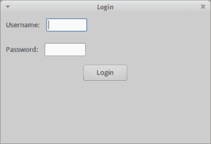

# wxPython:如何创建登录对话框

> 原文：<https://www.blog.pythonlibrary.org/2014/07/11/wxpython-how-to-create-a-login-dialog/>

我使用 wxPython 已经有一段时间了，我发现某些问题经常出现。其中一个流行的问题是如何在加载应用程序的其余部分之前要求用户提供凭证。有几种方法可以解决这个问题，但是我将集中讨论一个简单的解决方案，因为我相信这个解决方案可以作为更复杂的解决方案的基础。

基本上，我们想让用户看到一个登录对话框，他们必须输入他们的用户名和密码。如果他们输入正确，那么程序将继续加载，他们将看到主界面。你在网站上经常看到这种情况，常见的使用案例是网络电子邮件客户端。桌面应用程序通常不包括这一功能，尽管你会在 Stamps.com 的应用程序和执法软件中看到这一功能。我们将创建一个如下所示的对话框:

[](https://www.blog.pythonlibrary.org/wp-content/uploads/2014/07/wxLogin.png)

让我们来看看一些代码:

```py

import wx

if "2.8" in wx.version():
    import wx.lib.pubsub.setupkwargs
    from wx.lib.pubsub import pub
else:
    from wx.lib.pubsub import pub

########################################################################
class LoginDialog(wx.Dialog):
    """
    Class to define login dialog
    """

    #----------------------------------------------------------------------
    def __init__(self):
        """Constructor"""
        wx.Dialog.__init__(self, None, title="Login")

        # user info
        user_sizer = wx.BoxSizer(wx.HORIZONTAL)

        user_lbl = wx.StaticText(self, label="Username:")
        user_sizer.Add(user_lbl, 0, wx.ALL|wx.CENTER, 5)
        self.user = wx.TextCtrl(self)
        user_sizer.Add(self.user, 0, wx.ALL, 5)

        # pass info
        p_sizer = wx.BoxSizer(wx.HORIZONTAL)

        p_lbl = wx.StaticText(self, label="Password:")
        p_sizer.Add(p_lbl, 0, wx.ALL|wx.CENTER, 5)
        self.password = wx.TextCtrl(self, style=wx.TE_PASSWORD|wx.TE_PROCESS_ENTER)
        p_sizer.Add(self.password, 0, wx.ALL, 5)

        main_sizer = wx.BoxSizer(wx.VERTICAL)
        main_sizer.Add(user_sizer, 0, wx.ALL, 5)
        main_sizer.Add(p_sizer, 0, wx.ALL, 5)

        btn = wx.Button(self, label="Login")
        btn.Bind(wx.EVT_BUTTON, self.onLogin)
        main_sizer.Add(btn, 0, wx.ALL|wx.CENTER, 5)

        self.SetSizer(main_sizer)

    #----------------------------------------------------------------------
    def onLogin(self, event):
        """
        Check credentials and login
        """
        stupid_password = "pa$$w0rd!"
        user_password = self.password.GetValue()
        if user_password == stupid_password:
            print "You are now logged in!"
            pub.sendMessage("frameListener", message="show")
            self.Destroy()
        else:
            print "Username or password is incorrect!"

########################################################################
class MyPanel(wx.Panel):
    """"""

    #----------------------------------------------------------------------
    def __init__(self, parent):
        """Constructor"""
        wx.Panel.__init__(self, parent)

########################################################################
class MainFrame(wx.Frame):
    """"""

    #----------------------------------------------------------------------
    def __init__(self):
        """Constructor"""
        wx.Frame.__init__(self, None, title="Main App")
        panel = MyPanel(self)
        pub.subscribe(self.myListener, "frameListener")

        # Ask user to login
        dlg = LoginDialog()
        dlg.ShowModal()

    #----------------------------------------------------------------------
    def myListener(self, message, arg2=None):
        """
        Show the frame
        """
        self.Show()

if __name__ == "__main__":
    app = wx.App(False)
    frame = MainFrame()
    app.MainLoop()

```

这段代码的大部分被 **wx 的子类所占据。我们称之为**的对话框**登录对话框**。您会注意到，我们已经将密码文本控件设置为使用 **wx。TE_PASSWORD** 样式，它将隐藏用户在控件中输入的字符。事件处理程序是真正的动作所在。这里我们定义了一个愚蠢的密码，用来与用户输入的密码进行比较。在现实世界中，您可能会将输入的密码散列，与存储在数据库中的密码进行比较。或者，您可以将凭证发送到您的身份验证服务器，让它告诉您用户的凭证是否合法。出于演示目的，我们选择简单的方法，只需检查密码。您会注意到我们完全忽略了用户输入的用户名。这是不现实的，但同样，这只是一个例子。

无论如何，如果用户输入正确的密码，事件处理程序通过 pubsub 向我们的主机对象发送一条消息，告诉它完成加载，然后对话框被销毁。还有其他方法告诉主框架继续，比如在对话框类中使用一个我们可以检查的标志。下面是演示后一种方法的实现:

```py

import wx

########################################################################
class LoginDialog(wx.Dialog):
    """
    Class to define login dialog
    """

    #----------------------------------------------------------------------
    def __init__(self):
        """Constructor"""
        wx.Dialog.__init__(self, None, title="Login")
        self.logged_in = False

        # user info
        user_sizer = wx.BoxSizer(wx.HORIZONTAL)

        user_lbl = wx.StaticText(self, label="Username:")
        user_sizer.Add(user_lbl, 0, wx.ALL|wx.CENTER, 5)
        self.user = wx.TextCtrl(self)
        user_sizer.Add(self.user, 0, wx.ALL, 5)

        # pass info
        p_sizer = wx.BoxSizer(wx.HORIZONTAL)

        p_lbl = wx.StaticText(self, label="Password:")
        p_sizer.Add(p_lbl, 0, wx.ALL|wx.CENTER, 5)
        self.password = wx.TextCtrl(self, style=wx.TE_PASSWORD|wx.TE_PROCESS_ENTER)
        self.password.Bind(wx.EVT_TEXT_ENTER, self.onLogin)
        p_sizer.Add(self.password, 0, wx.ALL, 5)

        main_sizer = wx.BoxSizer(wx.VERTICAL)
        main_sizer.Add(user_sizer, 0, wx.ALL, 5)
        main_sizer.Add(p_sizer, 0, wx.ALL, 5)

        btn = wx.Button(self, label="Login")
        btn.Bind(wx.EVT_BUTTON, self.onLogin)
        main_sizer.Add(btn, 0, wx.ALL|wx.CENTER, 5)

        self.SetSizer(main_sizer)

    #----------------------------------------------------------------------
    def onLogin(self, event):
        """
        Check credentials and login
        """
        stupid_password = "pa$$w0rd!"
        user_password = self.password.GetValue()
        if user_password == stupid_password:
            print "You are now logged in!"
            self.logged_in = True
            self.Close()
        else:
            print "Username or password is incorrect!"

########################################################################
class MyPanel(wx.Panel):
    """"""

    #----------------------------------------------------------------------
    def __init__(self, parent):
        """Constructor"""
        wx.Panel.__init__(self, parent)

########################################################################
class MainFrame(wx.Frame):
    """"""

    #----------------------------------------------------------------------
    def __init__(self):
        """Constructor"""
        wx.Frame.__init__(self, None, title="Main App")
        panel = MyPanel(self)

        # Ask user to login
        dlg = LoginDialog()
        dlg.ShowModal()
        authenticated = dlg.logged_in
        if not authenticated:
            self.Close()

        self.Show()

if __name__ == "__main__":
    app = wx.App(False)
    frame = MainFrame()
    app.MainLoop()

```

在这个例子中，我们在对话框子类中添加了一个标记，我们称之为 **self.logged_in** 。如果用户输入正确的密码，我们告诉对话框关闭。这导致 wxPython 将控制权返回给 MainFrame 类，在那里我们检查该变量以查看用户是否登录。如果不是，我们关闭应用程序。否则我们加载应用程序。

* * *

### 包扎

我们可以添加一些增强功能，比如将焦点设置到第一个文本控件或者添加一个取消按钮。我相信你自己也能想出几个其他的。总的来说，这应该让你开始。