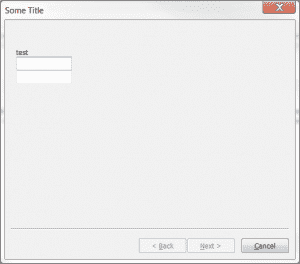

# wxPython:如何禁用向导的“下一步”按钮

> 原文：<https://www.blog.pythonlibrary.org/2014/03/06/wxpython-how-to-disable-a-wizards-next-button/>

前几天有人在 StackOverflow 上问了很多关于如何在 wxPython 中使用向导的问题。可以在这里看两个原问题[，在这里](http://stackoverflow.com/q/21763512/393194)看[。这个例子中我们要看的代码是我用来回答 Stack 上的问题的。主要问题是如何在 wxPython 向导中禁用下一个 T4。](http://stackoverflow.com/q/21766289/393194)

* * *

### 如何禁用向导的“下一步”按钮？

[](https://www.blog.pythonlibrary.org/wp-content/uploads/2014/03/wxwizard.png)

最初的人在发布问题时的想法是，他们希望用户在能够继续之前填写两个文本控件。这意味着我们需要禁用 Next 按钮，直到两个文本小部件都有内容。我想到了一个使用 wx 的方法。计时器每秒检查一次文本控件，看它们是否有数据。如果是，那么计时器的事件处理程序将启用“下一步”按钮。让我们来看看:

```py

import wx
import wx.wizard

########################################################################
class WizardPage(wx.wizard.PyWizardPage):
    #----------------------------------------------------------------------
    def __init__(self, parent, title):
        wx.wizard.PyWizardPage.__init__(self, parent)
        self.next = None
        self.prev = None
        self.initializeUI(title)

    #----------------------------------------------------------------------
    def initializeUI(self, title):      
        # create grid layout manager    
        self.sizer = wx.GridBagSizer()
        self.SetSizerAndFit(self.sizer)

    #----------------------------------------------------------------------
    def addWidget(self, widget, pos, span): 
        self.sizer.Add(widget, pos, span, wx.EXPAND)

    #----------------------------------------------------------------------
    # getters and setters 
    def SetPrev(self, prev):
        self.prev = prev

    #----------------------------------------------------------------------
    def SetNext(self, next):
        self.next = next

    #----------------------------------------------------------------------
    def GetPrev(self):
        return self.prev

    #----------------------------------------------------------------------
    def GetNext(self):
        return self.next

########################################################################
class MyWizard(wx.wizard.Wizard):
    """"""

    #----------------------------------------------------------------------
    def __init__(self):
        """Constructor"""
        wx.wizard.Wizard.__init__(self, None, -1, "Some Title")
        self.SetPageSize((500, 350))

        mypage1 = self.create_page1()

        forward_btn = self.FindWindowById(wx.ID_FORWARD) 
        forward_btn.Disable()

        self.timer = wx.Timer(self)
        self.Bind(wx.EVT_TIMER, self.onUpdate, self.timer)
        self.timer.Start(1)

        self.RunWizard(mypage1)

    #----------------------------------------------------------------------
    def create_page1(self):
        page1 = WizardPage(self, "Page 1")
        d = wx.StaticText(page1, label="test")
        page1.addWidget(d, (2, 1), (1,5))

        self.text1 = wx.TextCtrl(page1)
        page1.addWidget(self.text1, (3,1), (1,5))

        self.text2 = wx.TextCtrl(page1)
        page1.addWidget(self.text2, (4,1), (1,5))

        page2 = WizardPage(self, "Page 2")
        page2.SetName("page2")
        self.text3 = wx.TextCtrl(page2)
        self.Bind(wx.wizard.EVT_WIZARD_PAGE_CHANGED, self.onPageChanged)
        page3 = WizardPage(self, "Page 3")

        # Set links
        page2.SetPrev(page1)
        page1.SetNext(page2)
        page3.SetPrev(page2)
        page2.SetNext(page3)

        return page1

    #----------------------------------------------------------------------
    def onPageChanged(self, event):
        """"""
        page = event.GetPage()

        if page.GetName() == "page2":
            self.text3.SetValue(self.text2.GetValue())

    #----------------------------------------------------------------------
    def onUpdate(self, event):
        """
        Enables the Next button if both text controls have values
        """
        value_one = self.text1.GetValue()
        value_two = self.text2.GetValue()
        if value_one and value_two:
            forward_btn = self.FindWindowById(wx.ID_FORWARD) 
            forward_btn.Enable()
            self.timer.Stop()

#----------------------------------------------------------------------
def main():
    """"""
    wizard = MyWizard()

#----------------------------------------------------------------------
if __name__ == "__main__":
    app = wx.App(False)
    main()
    app.MainLoop()

```

让我们把它分解一下。我们要看的第一个类是 **MyWizard** ，它是所有动作发生的地方。MyWizard 是 wxPython 的 Wizard 类的子类。在 **__init__** 中，我们创建了一个页面并找到了 Next 按钮，这样我们就可以禁用它了。然后我们创建并启动计时器对象，同时将它绑定到 **onUpdate** 方法。最后，我们运行向导。当我们创建向导页面时，我们实例化了 **WizardPage** 类。这个类实际上是不言自明的。无论如何，我们最终创建了几个放置在向导页面上的小部件。另一个有趣的地方是在 **onUpdate** 方法中。这里我们检查用户是否在两个文本控件中输入了数据。

如果有，那么我们找到下一个按钮，启用它并停止计时器。这里有一个潜在的错误。如果用户在填写完内容后删除了一些内容，会发生什么呢？“下一步”按钮不会再次自行禁用。这里有一个更新版本的 **onUpdate** 方法可以解决这个问题:

```py

#----------------------------------------------------------------------
def onUpdate(self, event):
    """
    Enables the Next button if both text controls have values
    """
    value_one = self.text1.GetValue()
    value_two = self.text2.GetValue()
    forward_btn = self.FindWindowById(wx.ID_FORWARD) 
    if value_one and value_two:
        forward_btn.Enable()
    else:
        if forward_btn.IsEnabled():
            forward_btn.Disable()

```

在这里，我们从不停止计时器。相反，计时器会不断检查文本控件的值，如果发现其中一个控件没有数据，并且“下一步”按钮被启用，处理程序会禁用该按钮。

* * *

### 包扎

在 wxPython 向导中禁用 Next 按钮并不特别难，只是有点复杂。如果向导小部件的 API 允许对它创建的标准小部件进行更多的访问，那就太好了。然而，现在你知道如何与他们合作，改变他们的状态。明智地使用这些知识！

* * *

### 相关阅读

*   wxPython: [一个向导教程](https://www.blog.pythonlibrary.org/2011/01/27/wxpython-a-wizard-tutorial/)
*   wxPython: [如何创建一个通用向导](https://www.blog.pythonlibrary.org/2012/07/12/wxpython-how-to-create-a-generic-wizard/)