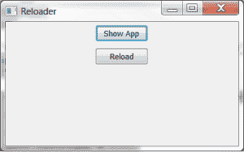

# wxPython:如何使用 reload()交互式编辑您的 GUI

> 原文：<https://www.blog.pythonlibrary.org/2013/08/01/wxpython-how-to-edit-your-gui-interactively-using-reload/>

今天，我在 StackOverflow 上遇到了一个有趣的问题，作者问我如何动态地编写 wxPython 程序。换句话说，他希望能够编辑代码并基本上刷新应用程序，而无需关闭并重新运行他的代码。最简单的方法是使用 Python 内置的[重载功能](http://docs.python.org/2/library/functions.html#reload)。如果我们走这条路，那么我们将需要构建一个小前端来导入我们想要交互更改的代码。

### 创建重装应用程序

[](https://www.blog.pythonlibrary.org/wp-content/uploads/2013/08/wxreloader.png)

创建重载应用程序非常简单。让我们来看看代码！

```py

import testApp
import wx

########################################################################
class ReloaderPanel(wx.Panel):
    """"""

    #----------------------------------------------------------------------
    def __init__(self, parent):
        """Constructor"""
        wx.Panel.__init__(self, parent)
        self.testFrame = None

        showAppBtn = wx.Button(self, label="Show App")
        showAppBtn.Bind(wx.EVT_BUTTON, self.onShowApp)

        reloadBtn = wx.Button(self, label="Reload")
        reloadBtn.Bind(wx.EVT_BUTTON, self.onReload)

        mainSizer = wx.BoxSizer(wx.VERTICAL)
        mainSizer.Add(showAppBtn, 0, wx.ALL|wx.CENTER, 5)
        mainSizer.Add(reloadBtn, 0, wx.ALL|wx.CENTER, 5)
        self.SetSizer(mainSizer)

    #----------------------------------------------------------------------
    def onReload(self, event):
        """
        Reload the code!
        """
        if self.testFrame:
            self.testFrame.Close()
            reload(testApp)
            self.showApp()
        else:
            self.testFrame = None

    #----------------------------------------------------------------------
    def onShowApp(self, event):
        """
        Call the showApp() method
        """
        self.showApp()

    #----------------------------------------------------------------------
    def showApp(self):
        """
        Show the application we want to edit dynamically
        """
        self.testFrame = testApp.TestFrame()

########################################################################
class ReloaderFrame(wx.Frame):
    """"""

    #----------------------------------------------------------------------
    def __init__(self):
        """Constructor"""
        wx.Frame.__init__(self, None, title="Reloader")
        panel = ReloaderPanel(self)
        self.Show()

if __name__ == "__main__":
    app = wx.App(False)
    frame = ReloaderFrame()
    app.MainLoop()

```

在这里，我们导入我们计划在脚本运行时编辑的模块。在这种情况下，该模块被称为 **testApp** (文件为 testApp.py)。接下来，我们添加几个按钮；一个用于显示 testApp 的框架，另一个用于重新加载 testApp 代码，并重新显示所做的任何更改。是的，我们可能应该在这里添加一些异常处理，以防我们在代码中犯了一个错别字，然后试图重新加载它，但我将把它留给读者作为练习。现在我们需要创建 **testApp.py** 文件。这里有一个简单的脚本，您可以使用它:

```py

import wx

########################################################################
class TestPanel(wx.Panel):
    """"""

    #----------------------------------------------------------------------
    def __init__(self, parent):
        """Constructor"""
        wx.Panel.__init__(self, parent)

########################################################################
class TestFrame(wx.Frame):
    """"""

    #----------------------------------------------------------------------
    def __init__(self):
        """Constructor"""
        wx.Frame.__init__(self, None, title="Test program")
        panel = TestPanel(self)
        self.Show()

if __name__ == "__main__":
    app = wx.App(False)
    frame = TestFrame()
    app.MainLoop()

```

现在，您所要做的就是编辑第二个文件，并用第一个文件重新加载它，以查看更改。我建议在 TestPanel 类中添加一个按钮，保存它，然后在另一个脚本中点击 Reload 按钮来查看更改。

是的，就这么简单。玩得开心！