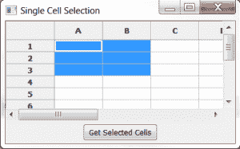

# wxPython:如何获取网格中选定的单元格

> 原文：<https://www.blog.pythonlibrary.org/2013/10/31/wxpython-how-to-get-selected-cells-in-a-grid/>

[](https://www.blog.pythonlibrary.org/wp-content/uploads/2013/10/wxgridselect.png)

今天我们将看看如何从 wxPython 网格对象中获取选定的单元格。大多数情况下，获取节很容易，但是当用户选择多个单元格时，获取选择就变得复杂了。我们将需要创建一些示例代码来显示所有这些是如何组合在一起的。我们开始吧！

### 网格单元选择

网上有一篇关于这个话题的有趣文章。这里可以看[。然而，这篇文章有几个问题，我们也将看到。下面是我们要看的代码:](http://ginstrom.com/scribbles/2008/09/07/getting-the-selected-cells-from-a-wxpython-grid/)

```py

import wx
import wx.grid as gridlib

########################################################################
class MyPanel(wx.Panel):
    """"""

    #----------------------------------------------------------------------
    def __init__(self, parent):
        """Constructor"""
        wx.Panel.__init__(self, parent)
        self.currentlySelectedCell = (0, 0)

        self.myGrid = gridlib.Grid(self)
        self.myGrid.CreateGrid(12, 8)
        self.myGrid.Bind(gridlib.EVT_GRID_SELECT_CELL, self.onSingleSelect)
        self.myGrid.Bind(gridlib.EVT_GRID_RANGE_SELECT, self.onDragSelection)

        selectBtn = wx.Button(self, label="Get Selected Cells")
        selectBtn.Bind(wx.EVT_BUTTON, self.onGetSelection)

        sizer = wx.BoxSizer(wx.VERTICAL)
        sizer.Add(self.myGrid, 1, wx.EXPAND)
        sizer.Add(selectBtn, 0, wx.ALL|wx.CENTER, 5)
        self.SetSizer(sizer)

    #----------------------------------------------------------------------
    def onDragSelection(self, event):
        """
        Gets the cells that are selected by holding the left
        mouse button down and dragging
        """
        if self.myGrid.GetSelectionBlockTopLeft():
            top_left = self.myGrid.GetSelectionBlockTopLeft()[0]
            bottom_right = self.myGrid.GetSelectionBlockBottomRight()[0]
            self.printSelectedCells(top_left, bottom_right)

    #----------------------------------------------------------------------
    def onGetSelection(self, event):
        """
        Get whatever cells are currently selected
        """
        cells = self.myGrid.GetSelectedCells()
        if not cells:
            if self.myGrid.GetSelectionBlockTopLeft():
                top_left = self.myGrid.GetSelectionBlockTopLeft()[0]
                bottom_right = self.myGrid.GetSelectionBlockBottomRight()[0]
                self.printSelectedCells(top_left, bottom_right)
            else:
                print self.currentlySelectedCell
        else:
            print cells

    #----------------------------------------------------------------------
    def onSingleSelect(self, event):
        """
        Get the selection of a single cell by clicking or 
        moving the selection with the arrow keys
        """
        print "You selected Row %s, Col %s" % (event.GetRow(),
                                               event.GetCol())
        self.currentlySelectedCell = (event.GetRow(),
                                      event.GetCol())
        event.Skip()

    #----------------------------------------------------------------------
    def printSelectedCells(self, top_left, bottom_right):
        """
        Based on code from http://ginstrom.com/scribbles/2008/09/07/getting-the-selected-cells-from-a-wxpython-grid/
        """
        cells = []

        rows_start = top_left[0]
        rows_end = bottom_right[0]

        cols_start = top_left[1]
        cols_end = bottom_right[1]

        rows = range(rows_start, rows_end+1)
        cols = range(cols_start, cols_end+1)

        cells.extend([(row, col)
            for row in rows
            for col in cols])

        print "You selected the following cells: ", cells

        for cell in cells:
            row, col = cell
            print self.myGrid.GetCellValue(row, col)

########################################################################
class MyFrame(wx.Frame):
    """"""

    #----------------------------------------------------------------------
    def __init__(self):
        """Constructor"""
        wx.Frame.__init__(self, parent=None, title="Single Cell Selection")
        panel = MyPanel(self)
        self.Show()

#----------------------------------------------------------------------
if __name__ == "__main__":
    app = wx.App(False)
    frame = MyFrame()
    app.MainLoop()

```

让我们花点时间来分析一下。首先，我们创建一个网格对象，我们称之为 **self.myGrid** 。我们绑定到两个特定于网格的事件，EVT 网格选择单元格和 EVT 网格范围选择。这是为了演示的目的，因为你通常不需要绑定到 EVT 网格选择单元。对于单个单元格选择事件，我们调用 **onSingleSelect** 处理程序。在其中，我们使用事件对象来获取正确的行和列。如果你看上面链接的文章，你会注意到他们正在使用 GetGridCursorRow 和 GetGridCursorCol。我发现这些只返回**之前**选中的单元格，而不是当前选中的单元格。这就是我们使用事件对象的方法的原因。另请注意，我们正在更新**self . currently selected cell**的值，使其等于当前选择的单元格。

另一个网格事件被绑定到 **onDragSelection** 。在这个事件处理程序中，我们调用网格的 **GetSelectionBlockTopLeft** ()方法，并检查以确保它返回一些东西。如果没有，那么我们什么也不做。但是如果它确实返回了一些东西，那么我们获取它的内容以及从 GetSelectionBlockBottomRight()返回的内容。然后我们将这些传递给我们的 **printSelectedCells** 方法。这段代码基于前面提到的文章，尽管它已经被简化了一点，因为我发现原来的 for 循环抛出了一个错误。基本上，这个方法所做的就是使用 Python 的 range 函数创建两个值列表。然后，它使用嵌套列表理解来扩展列表。最后，它打印出选择到 stdout 的单元格。

最后要看的方法是按钮事件处理程序: **onGetSelection** 。这个方法调用网格的 **GetSelectedCells** ()方法。这将返回单击的选定单元格。如果用户拖动选择一些单元格，它也可以工作。如果用户只选择了一个单元格，那么我们将打印**self . currently selected cell**，因为它总是等于当前选择的值。

### 包扎

正如您所看到的，从 grid 对象中获取选定的一个或多个单元格可能有点棘手。但是通过一些努力，我们能够克服。希望您会发现这在您当前或未来的项目中很有用。

### 相关阅读

*   wxPython: [网格简介](https://www.blog.pythonlibrary.org/2010/03/18/wxpython-an-introduction-to-grids/)
*   wxPython: [网格提示和技巧](https://www.blog.pythonlibrary.org/2010/04/04/wxpython-grid-tips-and-tricks/)
*   [从 wxPython 网格中获取选定的单元格](http://ginstrom.com/scribbles/2008/09/07/getting-the-selected-cells-from-a-wxpython-grid/)