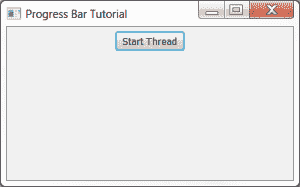
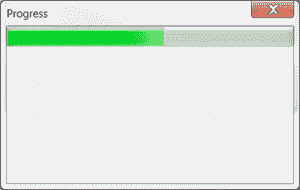

# wxPython:如何从线程更新进度条

> 原文：<https://www.blog.pythonlibrary.org/2013/09/04/wxpython-how-to-update-a-progress-bar-from-a-thread/>

不时地，我看到有人想知道如何创建一个进度条并更新它。所以我决定编写一个更新进度条的示例应用程序(技术上是一个 wx。仪表部件)。在本教程中，我们将创建一个带有按钮的框架。当按钮被按下时，它将启动一个包含进度条的对话框，并启动一个线程。该线程是一个伪线程，因为它除了在 20 秒内每秒向对话框发送一次更新之外，不做任何特别的事情。然后对话被破坏。我们来看看吧！

```py

import time
import wx

from threading import Thread

from wx.lib.pubsub import Publisher

########################################################################
class TestThread(Thread):
    """Test Worker Thread Class."""

    #----------------------------------------------------------------------
    def __init__(self):
        """Init Worker Thread Class."""
        Thread.__init__(self)
        self.start()    # start the thread

    #----------------------------------------------------------------------
    def run(self):
        """Run Worker Thread."""
        # This is the code executing in the new thread.
        for i in range(20):
            time.sleep(1)
            wx.CallAfter(Publisher().sendMessage, "update", "")

########################################################################
class MyProgressDialog(wx.Dialog):
    """"""

    #----------------------------------------------------------------------
    def __init__(self):
        """Constructor"""
        wx.Dialog.__init__(self, None, title="Progress")
        self.count = 0

        self.progress = wx.Gauge(self, range=20)

        sizer = wx.BoxSizer(wx.VERTICAL)
        sizer.Add(self.progress, 0, wx.EXPAND)
        self.SetSizer(sizer)

        # create a pubsub listener
        Publisher().subscribe(self.updateProgress, "update")

    #----------------------------------------------------------------------
    def updateProgress(self, msg):
        """
        Update the progress bar
        """
        self.count += 1

        if self.count >= 20:
            self.Destroy()

        self.progress.SetValue(self.count)

########################################################################
class MyFrame(wx.Frame):

    #----------------------------------------------------------------------
    def __init__(self):
        wx.Frame.__init__(self, None, title="Progress Bar Tutorial")

        # Add a panel so it looks the correct on all platforms
        panel = wx.Panel(self, wx.ID_ANY)
        self.btn = btn = wx.Button(panel, label="Start Thread")
        btn.Bind(wx.EVT_BUTTON, self.onButton)

        sizer = wx.BoxSizer(wx.VERTICAL)
        sizer.Add(btn, 0, wx.ALL|wx.CENTER, 5)
        panel.SetSizer(sizer)

    #----------------------------------------------------------------------
    def onButton(self, event):
        """
        Runs the thread
        """
        btn = event.GetEventObject()
        btn.Disable()

        TestThread()
        dlg = MyProgressDialog()
        dlg.ShowModal()

        btn.Enable()

#----------------------------------------------------------------------
# Run the program
if __name__ == "__main__":
    app = wx.App(False)
    frame = MyFrame()
    frame.Show()
    app.MainLoop()

```

让我们花几分钟来分析一下。我们从底层开始。首先运行的是 MyFrame 类。当您运行这个脚本时，您应该会看到类似这样的内容:

[](https://www.blog.pythonlibrary.org/wp-content/uploads/2013/09/progressBarFrame.png)

如您所见，这些代码只是创建了一个简单的框架，上面有一个按钮。如果您按下按钮，将创建以下对话框，并启动一个新线程:

[](https://www.blog.pythonlibrary.org/wp-content/uploads/2013/09/progressBarDlg.png)

让我们来看看构成对话框的那部分代码:

```py

########################################################################
class MyProgressDialog(wx.Dialog):
    """"""

    #----------------------------------------------------------------------
    def __init__(self):
        """Constructor"""
        wx.Dialog.__init__(self, None, title="Progress")
        self.count = 0

        self.progress = wx.Gauge(self, range=20)

        sizer = wx.BoxSizer(wx.VERTICAL)
        sizer.Add(self.progress, 0, wx.EXPAND)
        self.SetSizer(sizer)

        # create a pubsub listener
        Publisher().subscribe(self.updateProgress, "update")

    #----------------------------------------------------------------------
    def updateProgress(self, msg):
        """
        Update the progress bar
        """
        self.count += 1

        if self.count >= 20:
            self.Destroy()

        self.progress.SetValue(self.count)

```

这段代码创建了一个带有 wx 的对话框。仪表小部件。标尺是进度条后面的实际小部件。无论如何，我们在对话框的 __init__ 的最后创建了一个 pubsub 监听器。这个侦听器接受将触发 **updateProgress** 方法的消息。我们将看到消息在线程类中被发送。在 updateProgress 方法中，我们递增计数器并更新 wx。通过设置其值来测量。我们还检查计数是否大于或等于 20，这是仪表的范围。如果是的话，我们就毁掉这个对话。

现在，我们可以开始查看线程代码了:

```py

########################################################################
class TestThread(Thread):
    """Test Worker Thread Class."""

    #----------------------------------------------------------------------
    def __init__(self):
        """Init Worker Thread Class."""
        Thread.__init__(self)
        self.start()    # start the thread

    #----------------------------------------------------------------------
    def run(self):
        """Run Worker Thread."""
        # This is the code executing in the new thread.
        for i in range(20):
            time.sleep(1)
            wx.CallAfter(Publisher().sendMessage, "update", "")

```

这里我们创建一个线程并立即启动它。该线程在 20 的范围内循环，并在每次迭代中使用时间模块休眠一秒钟。每次睡眠后，它向对话框发送一条消息，告诉它更新进度条。

### 更新 wxPython 2.9 的代码

上一节中的代码是使用 pubsub 的旧 API 编写的，随着 wxPython 2.9 的出现，它已经被抛弃了。所以如果你试图在 2.9 中运行上面的代码，你可能会遇到问题。因此，为了完整起见，下面是使用新的 pubsub API 的代码版本:

```py

import time
import wx

from threading import Thread

from wx.lib.pubsub import pub

########################################################################
class TestThread(Thread):
    """Test Worker Thread Class."""

    #----------------------------------------------------------------------
    def __init__(self):
        """Init Worker Thread Class."""
        Thread.__init__(self)
        self.start()    # start the thread

    #----------------------------------------------------------------------
    def run(self):
        """Run Worker Thread."""
        # This is the code executing in the new thread.
        for i in range(20):
            time.sleep(1)
            wx.CallAfter(pub.sendMessage, "update", msg="")

########################################################################
class MyProgressDialog(wx.Dialog):
    """"""

    #----------------------------------------------------------------------
    def __init__(self):
        """Constructor"""
        wx.Dialog.__init__(self, None, title="Progress")
        self.count = 0

        self.progress = wx.Gauge(self, range=20)

        sizer = wx.BoxSizer(wx.VERTICAL)
        sizer.Add(self.progress, 0, wx.EXPAND)
        self.SetSizer(sizer)

        # create a pubsub receiver
        pub.subscribe(self.updateProgress, "update")

    #----------------------------------------------------------------------
    def updateProgress(self, msg):
        """"""
        self.count += 1

        if self.count >= 20:
            self.Destroy()

        self.progress.SetValue(self.count)

########################################################################
class MyForm(wx.Frame):

    #----------------------------------------------------------------------
    def __init__(self):
        wx.Frame.__init__(self, None, wx.ID_ANY, "Tutorial")

        # Add a panel so it looks the correct on all platforms
        panel = wx.Panel(self, wx.ID_ANY)
        self.btn = btn = wx.Button(panel, label="Start Thread")
        btn.Bind(wx.EVT_BUTTON, self.onButton)

        sizer = wx.BoxSizer(wx.VERTICAL)
        sizer.Add(btn, 0, wx.ALL|wx.CENTER, 5)
        panel.SetSizer(sizer)

    #----------------------------------------------------------------------
    def onButton(self, event):
        """
        Runs the thread
        """
        btn = event.GetEventObject()
        btn.Disable()

        TestThread()
        dlg = MyProgressDialog()
        dlg.ShowModal()

        btn.Enable()

#----------------------------------------------------------------------
# Run the program
if __name__ == "__main__":
    app = wx.App(False)
    frame = MyForm().Show()
    app.MainLoop()

```

注意，现在您导入的是 **pub** 模块，而不是 Publisher 模块。还要注意，你必须使用关键字参数。更多信息参见[公共订阅文档](http://pubsub.sourceforge.net/)。

### 包扎

此时，您应该知道如何创建自己的进度对话框，并从线程中更新它。您可以使用此代码的变体来创建文件下载程序。如果你这样做了，你将需要检查你正在下载的文件的大小，然后分块下载，这样你就可以创建 wx 了。使用适当的范围进行测量，并在下载每个块时更新它。我希望这能给你一些如何在你自己的项目中使用这个小部件的想法。

### 附加阅读

*   [wxPython 和线程](https://www.blog.pythonlibrary.org/2010/05/22/wxpython-and-threads/)
*   wxPython wiki: [长时间运行的任务](http://wiki.wxpython.org/LongRunningTasks)