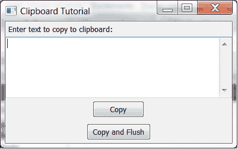

# wxPython:如何使用剪贴板

> 原文：<https://www.blog.pythonlibrary.org/2012/05/25/wxpython-how-to-use-the-clipboard/>

经常使用电脑的人都知道电脑可以复制粘贴文字。他们可能不知道的是，当你拷贝一些东西时，它会进入一个叫做“剪贴板”的位置。大多数程序都提供对某种剪贴板的访问，无论是在程序内部还是对系统剪贴板的访问，剪贴板允许将项目复制到其他应用程序。wxPython GUI toolkit 还提供了剪贴板访问，您可以使用它在程序中来回复制文本，甚至复制到系统剪贴板。您也可以将图像复制到剪贴板。在本教程中，我们将看看如何在自己的代码中做到这一点。

[](https://www.blog.pythonlibrary.org/wp-content/uploads/2012/05/clipboard_tutorial.png)

我们将从一个非常简单的示例代码片段开始。下面包含两个按钮，一个复制任何添加到文本控件的文本，然后你可以粘贴到其他地方，如文本框，搜索引擎或其他地方。另一个按钮也复制到剪贴板，然后在刷新数据后关闭应用程序。这应该使数据在系统剪贴板中可用，即使在应用程序关闭之后。两者在 Windows 上都能很好地工作，但是 wxGTK(即 Linux 版本)在后一种情况下不能工作。更多信息见 [bug 单](http://trac.wxwidgets.org/ticket/10515)。

不管怎样，我们来看看代码吧！

```py

import wx

########################################################################
class ClipboardPanel(wx.Panel):
    """"""

    #----------------------------------------------------------------------
    def __init__(self, parent):
        """Constructor"""
        wx.Panel.__init__(self, parent)

        lbl = wx.StaticText(self, label="Enter text to copy to clipboard:")
        self.text = wx.TextCtrl(self, style=wx.TE_MULTILINE)
        copyBtn = wx.Button(self, label="Copy")
        copyBtn.Bind(wx.EVT_BUTTON, self.onCopy)
        copyFlushBtn = wx.Button(self, label="Copy and Flush")
        copyFlushBtn.Bind(wx.EVT_BUTTON, self.onCopyAndFlush)

        sizer = wx.BoxSizer(wx.VERTICAL)
        sizer.Add(lbl, 0, wx.ALL, 5)
        sizer.Add(self.text, 1, wx.EXPAND)
        sizer.Add(copyBtn, 0, wx.ALL|wx.CENTER, 5)
        sizer.Add(copyFlushBtn, 0, wx.ALL|wx.CENTER, 5)
        self.SetSizer(sizer)

    #----------------------------------------------------------------------
    def onCopy(self, event):
        """"""
        self.dataObj = wx.TextDataObject()
        self.dataObj.SetText(self.text.GetValue())
        if wx.TheClipboard.Open():
            wx.TheClipboard.SetData(self.dataObj)
            wx.TheClipboard.Close()
        else:
            wx.MessageBox("Unable to open the clipboard", "Error")

    #----------------------------------------------------------------------
    def onCopyAndFlush(self, event):
        """"""
        self.dataObj = wx.TextDataObject()
        self.dataObj.SetText(self.text.GetValue())
        if wx.TheClipboard.Open():
            wx.TheClipboard.SetData(self.dataObj)
            wx.TheClipboard.Flush()
        else:
            wx.MessageBox("Unable to open the clipboard", "Error")

        self.GetParent().Close()

########################################################################
class ClipboardFrame(wx.Frame):
    """"""

    #----------------------------------------------------------------------
    def __init__(self):
        """Constructor"""
        wx.Frame.__init__(self, None, title="Clipboard Tutorial")
        panel = ClipboardPanel(self)
        self.Show()

if __name__ == "__main__":
    app = wx.App(False)
    frame = ClipboardFrame()
    app.MainLoop()

```

正如您可能已经猜到的，这个脚本的核心在按钮事件处理程序中。主位是 **wx。TextDataObject** 将存储来自文本控件的数据。接下来，我们尝试打开剪贴板。如果成功，我们将文本添加到剪贴板，然后关闭它。数据现在可以粘贴了。第二个事件处理程序做同样的事情，但是它刷新到剪贴板，而不仅仅是关闭它。如果你想复制一个位图，那么你应该使用一个 **wx。BitmapDataObject** 并传递给它一个 **wx。位图**对象。否则，其余都一样。

### 包扎

现在你知道如何使用 wxPython 的剪贴板了！走出去，开始创造一些让你的朋友和陌生人都感到惊讶的东西吧！

### 额外资源

*   wx。剪贴板[文档](http://wxpython.org/docs/api/wx.Clipboard-class.html)
*   剪贴板上的 wxPython [wiki 页面](http://wiki.wxpython.org/ClipBoard)